# Конспект по созданию сайта с использованием фреймворка Django.
## [Документация.](https://www.djangoproject.com/)
## **I. Установка Django и создание проекта.**
### **1. Создание нового проекта.**
1) Открываем консоль, проверяем работоспособность интерпретатора Python командой:
```bash
python3 --version или python3 -V
```
2) Далее переходим в нужную папку, где у нас будет храниться проект, создаём там виртуальное окружение командой:
```bash
python3 -m venv <название_виртуального_окружения>
```
3) Далее запускаем виртуальное окружение командой:
```bash
source <папка_проекта>/bin/activate
```
В результате должна появиться надпись (venv - или название нашего виртуального окружения, если название отлично от стандартного), означающая, что мы находимся в виртуальном окружении с именем djvenv. Если теперь выполнить команду:
```bash
pip3 list
```
то увидим всего два пакета: сам pip и setuptools. То есть, это чистое виртуальное окружение, в котором два пакета и интерпретатор языка Python.

Сразу отмечу, чтобы выйти из виртуального окружения достаточно выполнить команду:
```bash
deactivate
```
и мы возвращаемся в глобальное окружение.
4) Все дальнейшие действия будут проходить в PyCharm. Открываем папку нашего проекта. Указываем интерпретатор из установленного окружения. 
5) Далее, находясь в корневой папке проекта, мы должны выполнить непосредственно установку Django с помощью очевидной команды:
```bash
pip3 install django==4.2.1
```
Следом мы можем проверить установку Django, выполнив команду:
```bash
pip3 list
```
Мы ожидаем увидеть указанную версию Django и несколько пакетов, необходимых для его работы. 
6) Но это лишь ядро фреймворка с общим функционалом. Используя это ядро, мы можем создавать множество разных сайтов под управлением Django в рамках текущего виртуального окружения. Чтобы посмотреть список команд ядра, достаточно в терминале записать:
```bash
django-admin
```
7) Для создания сайта потребуется команда startproject, которая записывается так:
```bash
django-admin startproject <имя_проекта>
```
Здесь имя проекта обычно является доменным именем.
8) В итоге фреймворк создал папку с именем проекта (у меня sitewomen) в рабочей папке проекта. Внутри этой папки имеется одноимённая вложенная папка пакета, который определяет конфигурацию сайта. Поэтому его часто так и называют - пакетом конфигурации. Также есть ещё один отдельный файл manage.py, через который и производится управление данным сайтом. Например, мы будем создавать приложение, выполнять миграции БД, запускать тестовый веб-сервер и так далее. В действительности это всего лишь своеобразная утилита, посредник, который передаёт наши команды django-admin и выполняет их "от лица" нашего сайта.
9) Запустим тестовый веб-сервер и убедимся, что созданный сайт работает. Переходим в папку sitewomen:
```bash
cd sitewomen
```
и выполним файл manage.py с командой runserver:
```bash
python3 manage.py runserver
```
Чтобы остановить работу сервера, требуется нажать комбинацию клавиш control+C.

Также запуск сервера можно менять под нужные параметры:
```bash
python3 manage.py runserver <порт>
```
или
```bash
python3 manage.py runserver <IP_адресс>:<порт>
```
### **2. Модель MTV. Добавление первого приложения.**
#### **Модель MTV.**
Вначале, когда запрос приходит на фреймворк, он пропускается через блок маршрутизации:

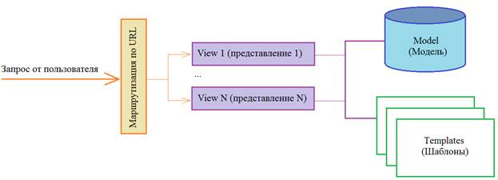

Здесь фиксируется тип URL-адреса и в списке шаблонов предопределённых адресов ищется первое совпадение. Например, пользователь вводит запрос:
```http request
http://127.0.0.1:8000/
```
Это есть не что иное, как главная страница сайта, фактически пустой запрос без параметров.

Следующий запрос:
```http request
http://127.0.0.1:8000/category/1/
```
Соответствует шаблону:
```http request
category/<число>
```
Это уже другой маршрут. 

Или такой запрос:
```http request
http://127.0.0.1:8000/women/madonna/
```
с шаблоном:
```http request
women/<слаг (строчка)>
```
И так далее. У нас может быть прописано множество типов URL-адресов и каждый шаблон связан со своим обработчиком - представлением (иногда его ещё называют контроллером). Если текущий запрос от пользователя не совпал ни с одним предопределённым URL, то возвращается код ошибки 404 - страница не найдена. 

Предположим, что маршрутизатор нашёл совпадение. Далее активизируется представление, связанное с найденным типом URL-адреса. Представление - это функция или класс, который отвечает за формирование ответа на соответствующий запрос. Как правило, ответом является HTML-страница. Эта страница затем возвращается клиенту, и он видит её в браузере. Так вот, чтобы представление могло сформировать страницу, в общем случае, требуются данные (информация) плюс шаблоны, в которые эти данные упаковываются. Например, приходит запрос на вывод с страницы о Мадонне:
```http request
http://127.0.0.1:8000/women/madonna/
```
срабатывает соответствующее представление, которое берёт шаблон информационной страницы и наполняет её данными об этой певице, хранящимися в БД:

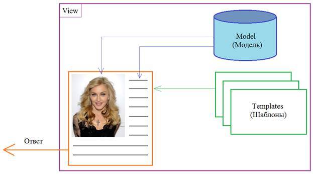

На выходе получаем сформированную HTML-страницу, которая и возвращается пользователю. Вот такое разделение на данные (model), шаблоны (templates) и представления (views) представляет собой общеизвестный паттерн MTV, то есть, разделение данных и HTML-шаблонов. Техника довольно эффективна и удобна, так как позволяет независимо наполнять БД информацией и параллельно разрабатывать или изменять функционал сайта. Кроме того здесь легче находить ошибки, в отличие от подхода, когда в одном скрипте присутствует и подключение к БД и оперирование шаблонами. Методика «разделяй и властвуй» очень хорошо себя зарекомендовала в мире программирования и довольно часто используется в том или ином виде.
#### **Добавление первого приложения.**
Согласно философии Django мы должны создать новое приложение в рамках нашего сайта. Что это за приложение и зачем оно вообще нужно? Разработчики фреймворка решили, что каждая самостоятельная часть сайта должна представляться в виде своего отдельного приложения. Например, создавая информационный сайт, мы должны будем определить приложение для отображения страниц этого сайта по определенным запросам. Далее, к нам приходит руководитель проекта и сообщает, что еще нужно реализовать форум на сайте. И так как это функционально независимая часть сайта, то мы создаем еще одно приложение для форума. Затем руководитель вспомнил, что еще нужно сделать раздел с опросом пользователей по разным тематикам. И на сайте появляется еще одно приложение – для опроса. И так далее. Каждая логически и функционально независимая часть сайта предполагает его реализацию в виде отдельного приложения:

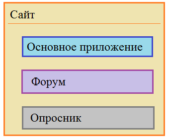

Приложения в Django следует реализовывать максимально независимыми, в идеале – полностью независимыми, чтобы в дальнейшем мы могли их просто скопировать в другой сайт и там оно сразу же начинало бы работать. Это не всегда удается, но к этому нужно стремиться.

Итак, давайте создадим в нашем сайте первое приложение, которое возьмет на себя базовый функционал, то есть, оно и будет являться ядром нашего сайта. 
1) Для этого открыв терминал и находясь в каталоге django/sitewomen, выполним команду:
```bash
python3 manage.py startapp women
```
Здесь startapp – команда для создания нового приложения; women – название приложения. Название может быть любым (мы его придумываем сами), но так, чтобы оно отражало суть своего функционала. В данном случае приложение women (женщины) будет формировать станицы сайта об известных женщинах из разных областей жизни: кино, спорт, музыка, политика.

После выполнения команды у нас в проекте появилась еще одна папка – women, которая уже содержит несколько файлов, в том числе, и файл __init__.py. Следовательно, приложение в Django реализуется как пакет языка Python. Также здесь присутствует одна вложенная папка migrations для хранения миграций БД нашего приложения. Подробнее о ней мы поговорим позже. 

Остальные файлы имеют следующее назначение:
- admin.py – для настройки админ-панели сайта (админ-панель поставляется совместно с Django и каждый сайт может сразу ее использовать);
- apps.py – для настройки (конфигурирования) текущего приложения;
- models.py – для хранения ORM-моделей для представления данных из базы данных;
- tests.py – модуль с тестирующими процедурами;
- views.py – для хранения представлений (контроллеров) текущего приложения.

2) После создания приложения его необходимо зарегистрировать в проекте нашего сайта, чтобы фреймворк Django «знал» о его существовании и корректно с ним работал. Для этого нужно перейти в пакет конфигурации сайта (sitewomen), открыть файл settings.py и в списке INSTALLED_APPS прописать новое приложение. В нем уже прописаны несколько стандартных приложений самого фреймворка и к ним мы просто добавим свое:
```python
# sitewomen/settings.py
INSTALLED_APPS = [
    ...
    'women',
]
```
По идее этого вполне достаточно и все будет работать, но в действительности Django обращаясь к этому пакету находит файл apps.py, откуда и берет настройки приложения из класса WomenConfig. Чтобы в дальнейшем каждый раз не конкретизировать этот путь, следует прописать его сразу в списке приложений:
```python
# sitewomen/settings.py
INSTALLED_APPS = [
    ...
    'women.apps.WomenConfig',
]
```
На этом первое (основное) приложение сайта создано.
### **3. Маршрутизация и функции представления.**
Теперь следует написать функции представления и добавить путь к этим функциям. Начнём с функции представления для стартовой страницы:
```python
# women/views.py
def index(request):
    return HttpResponse('Страница приложения women.')
```
Здесь указывается первый обязательный параметр request - это ссылка на экземпляр класса HttpRequest, который содержит информацию о запросе, сессии, куках и так далее. То есть через переменную request нам доступна вся возможная информация в рамках текущего запроса. На выходе эта функция возвращает экземпляр объекта HttpResponse, который будет автоматически формировать нужный заголовок ответа, а содержимое будет представлено простой строкой. 

Теперь нам требуется связать представления с соответствующим URL-адресом. Для этого в пакете конфигурации **_sitewomen_** откроем файл **_urls.py_** и в список адресов urlpatterns добавим новый путь с помощью специальной функции path:
```python
# sitewomen/urls.py
urlpatterns = [
    path('admin/', admin.site.urls),
    path('women/', index),
]
```
Здесь первый параметр - это суффикс URL-адреса, то есть часть URL-адреса, которая добавляется после доменного имени (при этом в конце принято указывать слэш). Например, если сайт располагается по адресу:
```http request
http://127.0.01:8000
```
то первый аргумента 'women/' добавляется в конце этого пути:
```http request
http://127.0.01:8000/women/
```
Именно такой адрес мы сейчас и определяем. Второй аргумент - это ссылка на функцию представления, которая будет автоматически вызываться при срабатывании указанного URL-адреса и возвращать ответ на клиентский запрос. В нашем примере ответ формируется в виде экземпляра класса HttpResponse.

Далее следует импортировать функцию index, чтобы она была доступна в пакете конфигурации:
```python
# sitewomen/urls.py
from women.views import index
```
Если IDE здесь указывает ошибку, то это потому, что рабочим каталогом следует указать проект sitewomen. 

Проверим работоспособность нового приложения и маршрута. Запустим тестовый веб-сервер:
```bash
python3 manage.py runserver
```
И откроем страницу:
```http request
http://127.0.0.1:8000/women/
```
В рамках этого приложения мы можем определять сколько угодно таких функций, связанных с разными URL-адресами. Например, пропишем ещё одну функцию для отображения списка статей по рубрикам:
```python
# women/views.py
def categories(request):
    return HttpResponse('<h1>Статьи по категориям</h1>')
```
Мы здесь используем тег h1, чтобы браузер отобразил эту строку как заголовок первого уровня. Затем добавляем ещё один путь в список urlpatterns:
```python
# sitewomen/urls.py
urlpatterns = [
    path('admin/', admin.site.urls),
    path('women/', views.index),
    path('cats/', views.categories),
]
```
и делаем импорт всех нудных приложений:
```python
# sitewomen/urls.py
from women import views
```
Теперь имеем новый адрес:
```http request
http://127.0.0.1:8000/cats/
```
по которому отображается заголовок первого уровня. По аналогии мы можем добавлять самые разные URL в наш сайт. 

Однако такой подход, когда маршруты приложения прописываются в пакете конфигурации, нарушает принцип независимости приложений. Для решения данной проблемы Django позволяет вторым аргументом передать вместо функции представления список адресов и связанные с ними функции. Для этого импортируем специальную функцию include:
```python
# sitewomen/urls.py
from django.urls import path, include
```
А затем в списке маршрутов с её помощью подключим список URL уже из нашего приложения women:
```python
# sitewomen/urls.py
urlpatterns = [
    path('admin/', admin.site.urls),
    path('women/', include('women.urls')),
]
```
Мы здесь в качестве параметра указываем строку, в которой сначала записываем имя приложения и через точку файл urls, где будут прописаны маршруты приложения women. Далее всё просто: добавляем в приложение **_women_** новый файл **_urls.py_** и в нём формируем новый список urlpatterns:
```python
# women/urls.py
from django.urls import path
from . import views
 
urlpatterns = [
    path('', views.index),
]
```
Здесь мы. во-первых, импортируем функцию path, которая и связывает URL с функциями представления, и, во-вторых, импортируем модуль views текущего пакета. Далее в списке urlpatterns вызываем функцию path, первым аргументом указываем пустую строку, а вторым аргументом функцию index. Т.к. в основном пакете конфигурации у нас указано, что к адресам 'women.urls' следует добавлять суффикс women/, то функция представления index будет соответствовать адресу:
```http request
http://127.0.0.1:8000/women/
```
Если же добавить адрес cats/:
```python
# women/urls.py
from django.urls import path
from . import views
 
urlpatterns = [
    path('', views.index),
    path('cats/', views.categories),
]
```
То функция представления categories будет соответствовать адресу:
```http request
http://127.0.0.1:8000/women/cats/
```
Таким образом, достаточно просто мы получили относительную независимость нашего приложения women от основного проекта сайта.
### **4. Отладка проекта Django в PyCharm.**
Мы уже умеем создавать простейшее приложение на Django и наблюдать его работу с использованием тестового веб-сервера. Но, прежде чем идти дальше, было бы еще хорошо научиться отлаживать непосредственно и программный код, т.е. запускать программу в режиме отладки. Если в PyCharm мы сделаем это стандартными средствами, поставим точку останова и запустим программу в режиме отладки, то получим ошибку, так как проект Django следует исполнять командой:
```bash
python3 manage.py runserver
```
И эта команда по умолчанию не запускает наши скрипты в debug-режиме. Чтобы это поправить, необходимо создать свой файл конфигурации. Для этого необходимо кликнуть в PyCharm на кнопку «Add Configurations…» или «Edit Configurations…»:

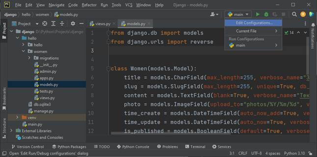

В появившемся окне нажмите «+», выберите Python и затем, заполните следующие поля:
- name: sitewomen
- Working directory: D:\Python\Projects\django\sitewomen (увидим версию интерпретатора языка Python)
- Script path: D:\Python\Projects\django\sitewomen\manage.py
- Parameters: runserver

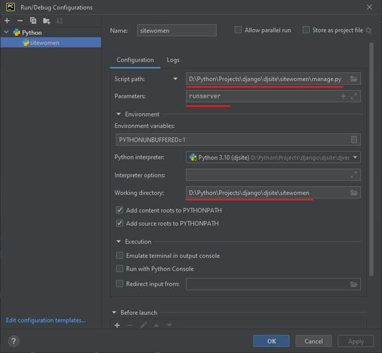

После этого запускаем через Debug проект Django и, как видим, имеем возможность останавливаться в выставленных точках отладки.

Обратите внимание, что перед запуском новой конфигурации отладочный веб-сервер должен быть остановлен. Дело в том, что один порт может быть занят только одной программой, поэтому если сервер ранее уже был запущен стандартным способом, то pycharm в режиме отладки не будет останавливаться в точках останова.
### **5. Динамические URL. Пользовательские конвертеры.**
Сейчас в нашем проекте маршруты приложения women подключаются с помощью функции include:
```python
# sitewomen/urls.py
urlpatterns = [
    path('admin/', admin.site.urls),
    path('', include('women.urls')),
]
```
Соответственно, за главную страницу отвечает функция представления index, а за вывод разделов - функция categories. Но у нас может быть множество категорий и хотелось бы, например, их отображать с помощью таких URL:
```http request
http://127.0.0.1:8000/cats/1/

http://127.0.0.1:8000/cats/2/

http://127.0.0.1:8000/cats/3/

...
```
Для того, чтобы прописать такой шаблон в Django, в списке адресов приложения следует указать числовой параметр:
```python
# women/urls.py
urlpatterns = [
    path('', views.index),
    path('cats/<int:cat_id>/', views.categories),
]
```
В угловых скобках записан параметр cat_id, который имеет тип int - целочисленный. Этот тип в маршрутах называется конвертером. И указанный путь будет соответствовать любым комбинациям URL с фрагментом "cats/число/". Далее в функции представления categories мы уже можем использовать этот параметр:
```python
# women/views.py
def categories(request, cat_id):
    return HttpResponse(f"<h1>Статьи по категориям</h1><p >id:{cat_id}</p>")
```
Помимо конвертера int в Django можно использовать и другие. Вот список всех [стандартных конвертеров](https://docs.djangoproject.com/en/4.2/topics/http/urls/):
- str – любая не пустая строка, исключая символ ‘/’;
- int – любое положительное целое число, включая 0;
- slug – слаг, то есть, латиница ASCII таблицы, цифры, символы дефиса и подчеркивания;
- uuid – цифры, малые латинские символы ASCII, дефис;
- path – любая не пустая строка, включая символ ‘/’.

Добавим ещё один маршрут для доступа к категориям через слаг:
```python
# women/urls.py
urlpatterns = [
    ...
    path('cats/slug:cat_slug/', views.categories_by_slug),
```
Добавим функцию представления:
```python
# women/views.py
def categories_by_slug(request, cat_slug):
    return HttpResponse(f"<h1>Статьи по категориям</h1><p >slug:{ cat_slug }</p>")
```
И теперь в качестве категории можно указывать не только числа, но и строки в виде слага:
```http request
http://127.0.0.1:8000/cats/3/

http://127.0.0.1:8000/cats/sport/

http://127.0.0.1:8000/cats/music/

http://127.0.0.1:8000/cats/sport-4-me/

...
```
Слаги понятнее для пользователя и поисковых систем. Сайты с такими URL, в среднем, лучше индексируются и занимают более высокие позиции в поисковой выдаче. Причем, когда передается число, то отрабатывает первый маршрут из URL с числовым конвертером, если же числовой шаблон не подходит, то проверяется следующий со слагом. И здесь очень важен порядок. Если поменять и записать сначала конвертер со слагом, а затем, с числом:
```python
# women/urls.py
urlpatterns = [
    path('', views.index),
    path('cats/<slug:cat_slug>/', views.categories_by_slug),
    path('cats/<int:cat_id>/', views.categories),
]
```
то всегда будет отрабатывать слаг, т.к. число - это частный случай слага. На это следует обращать особое внимание: сначала следует прописывать частные конвертеры, а затем более общие.

Если по каким-то причинам представленных типов URL недостаточно, то в Django имеется функция re_path, которая делает всё то же самое, но с использованием регулярных выражений. Например, определим URL, в котором можно указывать год в виде четырёх чисел:
```python
# women/urls.py
urlpatterns = [
    ...
    re_path(r'^archive/(?P<year>[0-9]{4})/', views.archive),
]
```
Здесь year - это имя переменной, которая будет содержать введённый год. 

Добавим функцию представления archive:
```python
# women/views.py
def archive(request, year):
    return HttpResponse(f"<h1>Архив по годам</h1><p >{year}</p>")
```
И теперь мы можем обращаться к этому URL, указывая ровно 4 цифры:
```http request
http://127.0.0.1:8000/arcgive/2020/
```
Если же указать меньше или больше чисел, то шаблон URL не совпадёт и возникнет исключение 404 - страница не найдена.
#### **Создание собственных конвертеров.**
Фреймворк Django позволяет создавать свои собственные конвертеры, используемые при анализе URL-адресов. Например, вместо того, чтобы использовать функцию re_path с регулярным выражением, [мы можем создать конвертер](https://docs.djangoproject.com/en/4.2/topics/http/urls/), который бы выделял и проверял год в URL-адресе.

В частности, в разделе «Registering custom path converters» приведён пример класса FourDigitYearConverter с регулярным выражением для выделения 4 цифр:
```python
# women/converters.py
class FourDigitYearConverter:
    regex = "[0-9]{4}"
 
    def to_python(self, value):
        return int(value)
 
    def to_url(self, value):
        return "%04d" % value
```
В классе есть 2 метода:
- to_python - для преобразования фрагмента URL в требуемый тип данных;
- to_url - для преобразования параметра в формат, требуемый для представлений в URL.

Далее в файле urls.py приложения women зарегистрируем этот конвертер с именем year4 для использования в URL-шаблонах:
```python
# women/urls.py
register_converter(converters.FourDigitYearConverter, "year4")
```
Далее в коллекции urlpatterns этого же файла вместо функции re_path следует прописать:
```python
# women/urls.py
urlpatterns = [
    ...
    path('archive/<year4:year>/', views.archive),
]
```
При этом параметр year будет автоматически преобразован в целое число благодаря методу to_python класса FourDigitYearConverter. В этом легко убедиться, поставив точку останова в функции представления archive и запустив Django в режиме отладки.
### **6. GET- и POST-запросы. Обработчики исключений запросов.**
Структура URL-адреса может содержать дополнительные параметры в GET-запросах. Например, вот так:
```http request
http://127.0.0.1:8000/?name=Gagarina&cat=music

или

http://127.0.0.1:8000/cats/music/?name=Gagarina&type=pop
```
И так далее. Здесь у нас идет специальный стартовый символ – знак вопроса, после которого через амперсанд перечисляются различные параметры в виде пар ключ-значение. Так, через адресную строку можно передавать произвольные данные на сервер в виде таких GET-запросов.

Следующий вопрос, как можно выделять эти значения и обрабатывать их на стороне сервера в функциях представления? Для этого, как раз и существует параметр request – ссылка на объект HttpRequest. Через него мы можем обратиться к специальному словарю:
```python
request.GET
```
где и хранятся все эти данные.

Поправим функцию представления categories_by_slug для отображения словаря GET в консоль:
```python
# women/views.py
def categories_by_slug(request, cat_slug):
    print(request.GET)
    return HttpResponse(f"<h1>Статьи по категориям</h1><p >slug: {cat_slug}</p>")
```
И выполним, например, такой запрос:
```http request
http://127.0.0.1:8000/cats/music/?name=Gagarina&type=pop
```
В консоли увидим значения:
```bash
<QueryDict: {'name': ['Gagarina'], 'type': ['pop']}>
```
Или, можем сначала проверить: есть ли в словаре какие-либо данные и только потом выводить их в консоль:
```python
# women/views.py
def categories_by_slug(request, cat_slug):
    if request.GET:
        print(request.GET)
 
    return HttpResponse(f"<h1>Статьи по категориям</h1><p >slug: {cat_slug}</p>")
```
Помимо GET-запросов в веб-программировании часто используются и POST-запросы. Они, обычно, связаны с передачей данных из форм и позже мы их тоже будем использовать. Здесь же я просто отмечу, что в этом случае вместо коллекции GET используется коллекция POST, а все остальное остается без изменений:
```python
# women/views.py
def categories_by_slug(request, cat_slug):
    if request.POST:
        print(request.POST)
 
    return HttpResponse(f"<h1>Статьи по категориям</h1>slug: {cat_slug}</p>")
```
#### **Обработка исключений при запросах к серверу.**
Следующий важный аспект – это обработка исключений при запросах к серверу. Самым распространенным из них является обращение к несуществующей странице, когда сервер возвращает страницу с кодом 404. Например, если для нашего сайта указать путь:
```http request
http://127.0.0.1:8000/aaa
```
то мы увидим исключение 404 – страница не найдена. Такую информацию мы видим исключительно в процессе отладки нашего сайта, когда глобальная константа DEBUG в пакете конфигурации (файл settings.py) установлена в True.

Давайте посмотрим, что произойдет, если временно перевести ее в значение False. Перейдем в пакет конфигурации, откроем файл settings.py, найдем константу DEBUG и присвоим ей значение False. При запуске тестового сервера у нас возникнет ошибка, что мы должны указать разрешенные хосты. Так как мы сейчас используем хост 127.0.0.1, то его в виде строки и укажем:
```python
# sitewomen/settings.py
DEBUG = False

ALLOWED_HOSTS = ['127.0.0.1']
```
Теперь сервер успешно запустился и при обновлении страницы мы уже видим более дружественную страницу без лишней отладочной информации. Но как нам ее поправить, чтобы отобразить более понятную информацию? Для этого в файле urls.py пакета конфигурации можно переопределить обработчик исключения 404. Для этого ему достаточно присвоить ссылку на функцию, которая и будет формировать ответ для отсутствующих страниц, например, так:
```python
# sitewomen/urls.py
handler404 = page_not_found
```
Мы здесь передаем ссылку на функцию page_not_found, а саму функцию определим в приложении women:
```python
# women/views.py
def page_not_found(request, exception):
    return HttpResponseNotFound('<h1>Страница не найдена</h1>')
```
Обратите внимание, функция принимает два аргумента и возвращает ответ в виде экземпляра класса HttpResponseNotFound, которому передается HTML-страница, отображаемая при неверных запросах. Если теперь мы обновим страницу, то увидим заголовок «Страница не найдена».

В дальнейшем мы увидим, как вместо строки можно возвращать шаблон страницы 404. Сейчас главное понять принцип работы механизма обработки исключений.

Итак, мы предполагаем, что функция page_not_found будет вызываться всякий раз при возникновении исключения 404. И это важный момент. Смотрите, если в какой-либо другой функции представления сгенерировать это исключение, то будет автоматическое перенаправление на функцию page_not_found и пользователь увидит все ту же страницу 404. Например, в функции archive мы сделаем проверку:
```python
# women/views.py
def archive(request, year):
    if year > 2023:
        raise Http404()
 
    return HttpResponse(f"<h1>Архив по годам</h1><p >{year}</p>")
```
Если год больше 2023-го, то генерируется исключение 404 как экземпляр класса Http404 и выполняется перенаправление на функцию page_not_found. Это нам позволяет описывать логику отображения неверных запросов в одном месте программы – в функции page_not_found.

Аналогичным образом можно переопределять [обработчики других исключений](https://docs.djangoproject.com/en/4.2/ref/urls/), например:
- handler500 – ошибка сервера;
- handler403 – доступ запрещен;
- handler400 – невозможно обработать запрос.

Но все они работают в боевом режиме при DEBUG = False. При отладке мы увидим расширенную служебную информацию, помогающую исправлять ошибки при разработке сайта.
### **7. Перенаправления (redirect). Функция reverse.**
Мы продолжаем тему маршрутизации. Очень часто при развитии сайта некоторые его страницы переносятся на другой URL-адрес. И чтобы не потерять позиции этих страниц в поисковой выдаче, поисковым системам нужно явно указать, что страница перемещена либо временно, либо постоянно на новый URL. Это делается с помощью перенаправлений с кодами:
- 301 – страница перемещена на другой постоянный URL-адрес;
- 302 – страница перемещена временно на другой URL-адрес.

#### **Функция redirect.**
В Django подобные редиректы достаточно просто выполняются с помощью функции:
```python
django.shortcuts.redirect
```
Давайте для примера сделаем перенаправление со страницы архива, если год больше 2023:
```python
# women/views.py
def archive(request, year):
    if year > 2023:
        return redirect('/')
 
    return HttpResponse(f"<h1>Архив по годам</h1><p >{year}</p>")
```
Здесь в качестве первого параметра указывается страница, на которую происходит перенаправление, в данном случае – это главная страница сайта. Также в файле settings.py вернем прежнее значение параметра DEBUG:
```python
# sitewomen/settings.py
DEBUG = True
```
Если теперь выполнить запрос:
```http request
http://127.0.0.1:8000/archive/2024/
```
то мы попадем на главную страницу с кодом перенаправления 302 (см. консоль). Если же нам нужно указать постоянный редирект с кодом 301, то записывается дополнительный параметр:
```python
# women/views.py
def archive(request, year):
    ...
    return redirect('/', permanent=True)
    ...
```
Вообще в качестве первого аргумента функции redirect() можно передавать не только конкретный URL, но и представление. В частности, вместо '/' можно передать ссылку на функцию index следующим образом:
```python
# women/views.py
def archive(request, year):
    ...
    return redirect(index, permanent=True)
    ...
```
#### **Классы HttpResponseRedirect и HttpResponsePermanentRedirect.**
Фреймворк Django дополнительно поддерживает классы для выполнения перенаправлений. В частности имеются два класса:
- HttpResponseRedirect – для редиректа с кодом 302;
- HttpResponsePermanentRedirect – для редиректа с кодом 301.

которые можно использовать вместо функции redirect() следующим образом:
```python
# women/views.py
def archive(request, year):
    if year > 2023:
        return HttpResponseRedirect('/')
 
    return HttpResponse(f"<h1>Архив по годам</h1><p >{year}</p>")
```
На самом деле функция redirect() использует в своей работе эти классы, но, вместе с тем, она несколько более гибкая. Поэтому какой вариант выбирать решает сам программист, исходя из логики построения кода.
#### **Параметр name функции path.**
Однако указывать в функции redirect, да и вообще где бы то ни было в приложении конкретный URL-адрес (кроме их списка в коллекции urlpatterns) – это порочная практика, или, как еще говорят – хардкодинг. Вместо этого каждому шаблону пути можно присвоить свое уникальное имя и использовать его в рамках всего проекта.

Давайте определим имена для наших URL-запросов. Для этого перейдем в файл women/urls.py и в каждой функции path пропишем параметр name с уникальными именами:
```python
# women/urls.py
urlpatterns = [
    path('', index, name='home'),
    path('cats/<int:cat_id>/', categories, name='cats_id'), 
    path('cats/<slug:cat_slug>/', categories_by_slug, name='cats'),
    path('archive/<year4:year>/', archive, name='archive'),
]
```
Конечно, эти имена вы можете выбрать и другие – это лишь пример. И далее, в функции redirect мы можем выполнить перенаправление на главную страницу, указав имя home:
```python
# women/views.py
def archive(request, year):
    ...
    return redirect('home', permanent=True)
    ...
```
Как видите, это гораздо понятнее и безопаснее использования конкретных URL-адресов. Если в дальнейшем маршрут изменится, то автоматически изменится и адрес перенаправления для home.
#### **Функция reverse.**
Если же маршрут помимо имени содержит еще параметры, как например, маршрут ‘cats’ с параметром slug, то для корректного перенаправления необходимо в функции redirect() вторым и последующими аргументами передать требуемые параметры. В нашем случае это можно сделать так:
```python
# women/views.py
def archive(request, year):
    ...
    return redirect('cats', 'music')
    ...
```
В результате, функция redirect() вычислит следующий URL:
```http request
http://127.0.0.1:8000/cats/music/
```
и сделает на него перенаправление.

Но мы можем разделить операции вычисления URL и непосредственно перенаправление. Для этого в Django имеется функция:
```python
django.urls.reverse
```
которая возвращает строку URL-адреса, вычисленный на основе переданного имени и набора аргументов. Например, для вычисления адреса маршрута cats с параметром ‘music’ функцию reverse() можно вызвать следующим образом:
```python
# women/views.py
def archive(request, year):
    ...
    url_redirect = reverse('cats', args=('music', ))
    return redirect(url_redirect)  # Или можно вернуть соответствующим классом: HttpResponsePermanentRedirect(url_redirect)
    ...
```
### **8. Шаблоны, начало. Функции render() и render_to_string().**
Если мы откроем наш проект и запустим тестовый веб-сервер, то на главной странице увидим отображение одной короткой строчки. Как вы понимаете, полноценная HTML-страница содержит гораздо больше информации, в том числе, заголовок и подключаемые статические файлы. Конечно, если решать эту задачу «в лоб», то можно было бы написать в функции представления что-то вроде:
```python
# women/views.py
def index(request):
    return HttpResponse('''<!DOCTYPE html>
<html>
<head>
         <title></title>
</head>
<body>
 
</body>
</html>''')
```
Но во что тогда превратится программа! Ее будет сложно читать, исправлять и, кроме того, изменение HTML-страницы повлечет изменение и самого приложения. Это полное безумие! Поэтому неудивительно, что все это выносится за пределы приложения и организуется в виде шаблонов HTML-страниц.

Итак, предположим, что в качестве главной страницы мы бы хотели отобразить некоторый шаблон с именем index.html. Для этого, вначале нам нужно импортировать функции, через которые запускается встроенный в Django шаблонизатор. В самом простом варианте можно использовать функцию:
```python
from django.template.loader import render_to_string
```
которая загружает шаблон из файла, обрабатывает его и выдает результат в виде строки. Например, это можно сделать так:
```python
# women/views.py
def index(request):
    t = render_to_string('путь к шаблону index.html')
    return HttpResponse(t)
```
И здесь мы подошли ко второму важному вопросу: где должны располагаться шаблоны текущего приложения Women? По умолчанию, Django ищет шаблоны в подкаталоге templates нашего приложения. Создадим его. По идее, мы можем располагать здесь наши файлы шаблонов и все должно работать. Но есть один важный нюанс. В каком-либо другом приложении также может оказаться файл с именем index.html. Тогда фреймворк Django будет использовать тот, что встретится первым. Чтобы этого не происходило, в templates приложения принято создавать еще один подкаталог с именем приложения. В нашем случае – women. И уже в него помещать файлы шаблонов. Тогда все наши файлы шаблонов будут отделяться от других дополнительным подкаталогом и это позволит избежать коллизий имен файлов.

Итак, создадим в подкаталоге templates/women файл index.html с содержимым:
```html
<!-- index.html -->
<!DOCTYPE html>
<head>
    <meta charset="UTF-8">
    <title>Главная страница</title>
</head>
<body>
<h1>Главная страница</h1>
</body>
</html>
```
Это будет наш первый простейший шаблон, представляющий главную страницу сайта. И, далее, в функции render укажем путь к этому шаблону:
```python
# women/views.py
def index(request):
    t = render_to_string('women/index.html')
    return HttpResponse(t)
```
Все, при обновлении главной страницы в браузере, мы увидим этот шаблон. Как видите все достаточно просто и удобно. Но можно сделать еще лучше и воспользоваться функцией:
```python
from django.shortcuts import render
```
которая объединяет в себе рендер шаблона и формирование ответа сервера. В результате функция представления index() может быть записана так:
```python
# women/views.py
def index(request):
    return render(request, 'women/index.html')
```
Обратите внимание, для корректного отображения кириллицы все шаблоны рекомендуется сохранять в кодировке utf-8. Тем более что сам Python, начиная с версии 3, по умолчанию использует юникод.

Давайте для примера добавим еще одну страницу и один шаблон на наш сайт – страницу «О сайте». Пропишем следующие пути (в women/urls.py):
```python
# women/urls.py
urlpatterns = [
    path('', index, name='home'),
    path('about/', about, name='about'),
    ...
]
```
И функцию about в файле women/views.py:
```python
# women/views.py
def about(request):
    return render(request, 'women/about.html')
```
Добавим шаблон about.html:
```html
<!-- about.html -->
<!DOCTYPE html>
<head>
    <meta charset="UTF-8">
    <title>О сайте</title>
</head>
<body>
<h1>О сайте</h1>
</body>
</html>
```
И при переходе по адресу:
```http request
http://127.0.0.1:8000/about/
```
этот шаблон будет отображён.
#### **Настройки шаблонизатора.**
При работе функций render_to_string() и render() фреймворк Django использует шаблонизатор, указанный в параметре TEMPLATES файла settings.py пакета конфигурации. В частности мы там видим строчку 'BACKEND': 'django.template.backends.django.DjangoTemplates', означающую, что используется встроенный шаблонизатор Django. Кроме того здесь есть параметры DIRS и APP_DIRS. Параметр DIRS позволяет прописывать нестандартные пути к файлам шаблонов, а APP_DIRS со значением True указывает шаблонизатору Django искать шаблоны также и внутри приложений. Причем, шаблоны сначала ищутся по коллекции DIRS, а затем уже в приложениях. В частности, благодаря этому параметру успешно обнаруживаются наши шаблоны index.html и about.html внутри приложения women.

Вот сама коллекция:
```python
# sitewomen/settings.py
TEMPLATES = [
    {
        'BACKEND': 'django.template.backends.django.DjangoTemplates',  # Стандартный шаблонизатор Django.
        'DIRS': [],  # Этот параметр позволяет описывать нестандартные пути к файлам-шаблонам.
        'APP_DIRS': True,  # Параметр говорит о том, что внутри приложения надо искать подкаталоги стандартном каталоге templates.
        'OPTIONS': {
            'context_processors': [
                'django.template.context_processors.debug',
                'django.template.context_processors.request',
                'django.contrib.auth.context_processors.auth',
                'django.contrib.messages.context_processors.messages',
            ],
        },
    },
]
```
Важно заметить: если установить параметр APP_DIRS в значение False, то при запуске проекта и перехода на главную страницу:
```http request
http://127.0.0.1:8000
```
появится ошибка:
```http request
TemplateDoesNotExist at /
```
говорящая, что шаблон не был найден. Возвращая значение параметра APP_DIRS в True ошибка пропадает.

Обратите внимание, чтобы шаблоны нашего приложения успешно обнаруживались фреймворком Django, приложение должно быть прописано в коллекции INSTALLED_APPS. Если мы его оттуда уберем, то снова возникнет прежняя ошибка. Кстати, ради интереса мы можем ее исправить, добавив абсолютный путь в коллекцию DIRS параметра TEMPLATES. Сделать это можно следующим образом:
```python
# sitewomen/settings.py
TEMPLATES = [
    {
        'BACKEND': 'django.template.backends.django.DjangoTemplates',
        'DIRS': [
            BASE_DIR / 'women' / 'templates'
        ],
        'APP_DIRS': True,
    ...
    },
]
```
Мы здесь воспользовались переменной BASE_DIR, которая хранит абсолютный путь к нашему проекту, и добавили подкаталоги women и templates к файлам шаблонов нашего приложения. Теперь, фреймворк Django без проблем найдет нужные файлы и отобразит на главной странице.

Однако для стандартных приложений так делать не стоит. Достаточно зарегистрировать приложение в коллекции INSTALLED_APPS и создать подкаталог templates для размещения файлов шаблонов. Это правильный стандартный подход.
### **9. Передача данных (переменных) в шаблоны.**
Если посмотреть на файлы index.html или about.html, то это просто текст, который загружается и отдается браузеру по соответствующему запросу. Все так, но в этих же файлах можно прописывать конструкции для отображения информации, например, из переменных или БД. Давайте для начала сделаем так, чтобы на каждой странице был свой заголовок, переданный ей через параметр title. Это можно сделать следующим образом. В файлах index.html и about.html укажем переменную title:
```html
<!-- index.html и about.html -->
<!DOCTYPE html>
<html>
<head>
    <title>{{ title }}</title>
</head>
<body>
<h1>{{ title }}</h1>
</body>
</html>
```
А в функциях представлений передать параметр title соответствующему шаблону. Делается это с помощью словарей. В нашем случае необходимо определить словарь с ключом title и значением, которое будет подставляться вместо этого ключа. Например, так:
```python
# women/views.py
def index(request):
    data = {'title': 'Главная страница'}
    return render(request, 'women/index.html', data)
```
При обновлении страницы увидим, что вместо {{title}} в шаблоне было подставлено значение ключа title словаря data. То есть, внутри шаблонов Django можно прописывать двойные фигурные скобки и указывать параметр (ключ), значение которого здесь будет подставлено.

Или, можно использовать более короткую форму:
```python
# women/views.py
def about(request):
    return render(request, 'women/about.html', {'title': 'О сайте'})
```
Тогда при переходе к странице:
```http request
http://127.0.0.1:8000/about/
```
увидим вместо {{title}} строку «О сайте». Вот в этом и есть роль шаблонов: они описывают структуру страницы, а ее наполнение происходит динамически в самой программе.

Конечно, можно выполнять передачу самых разных типов данных: чисел, строк, списков, кортежей, словарей, объектов классов и так далее. Давайте опишем главное меню сайта с помощью списка:
```python
# women/views.py
import ...
menu = ["О сайте", "Добавить статью", "Обратная связь", "Войти"]
...
```
А, затем, в функциях представления, мы можем передать его как параметр:
```python
# women/views.py
def index(request):
    data = {
        'title': 'Главная страница',
        'menu': menu,
    }
    return render(request, 'women/index.html', context=data)
```
Обратите внимание, я здесь передаю словарь data через именованный аргумент context. Это то же самое, что и просто третьим аргументом прописать data. Иногда в программах можно встретить и такую запись.

В самом простом варианте в шаблоне index.html отобразить такой список можно следующим образом:
```html
<!-- index.html -->
<!DOCTYPE html>
<html>
<head>
    <title>{{ title }}</title>
</head>
<body>
<p>{{ menu }}</p>
<h1>{{ title }}</h1>
</body>
</html>
```
Обновляем главную страницу и видим список из строк. Однако если мы попытаемся в шаблоне обратиться к элементу по индексу:
```html
...
<p>{{ menu[0] }}</p>
...
```
то получим ошибку:
```http request
TemplateSyntaxError at /
```
так как шаблонизатор Django не поддерживает такую операцию.

Давайте в шаблоне about.html также пропишем вывод параметра menu:
```html
<!-- about.html -->
...
<p>{{ menu }}</p>
...
```
Если теперь перейти по адресу:
```http request
http://127.0.0.1:8000/about/
```
то этого списка мы не увидим. Дело в том, что в функции представления about() передается только словарь с ключом title. Ключ menu отсутствует. Поэтому шаблонизатор не находит параметр menu и просто его игнорирует. Обратите внимание, именно игнорирует. Никаких ошибок при этом не возникает.

Давайте для примера передадим в шаблон index.html другие распространенные типы данных:
```python
# women/views.py
class MyClass:
    def __init__(self, a, b):
        self.a = a
        self.b = b
 
 
def index(request):
    data = {
        'title': 'Главная страница',
        'menu': menu,
        'float': 28.56,
        'lst': [1, 2, 'abc', True],
        'set': {1, 1, 2, 3, 2, 5},
        'dict': {'key_1': 'value_1', 'key_2': 'value_2'},
        'obj': MyClass(10, 20),
    }
   
 
    return render(request, 'women/index.html', context=data)
```
И выведем их в шаблоне index.html следующим образом:
```html
<!-- index.html -->
<!DOCTYPE html>
<html>
<head>
         <title>{{ title }}</title>
</head>
<body>
<p>{{ menu }}</p>
<p>{{ float }}</p>
<p>{{ lst }}</p>
<p>{{ set }}</p>
<p>{{ dict }}</p>
<p>{{ obj }}</p>
 
<h1>{{ title }}</h1>
</body>
</html>
```
При обновлении главной страницы увидим все переданные данные. Причем, к ключам словаря и к атрибутам класса можно обращаться через точку следующим образом:
```html
<!-- index.html -->
...
<p>{{ dict.key_1 }}</p>
<p>{{ obj.a }}</p>
...
```
Обратите внимание, что здесь используется оператор «точка» в том числе и у словарей. Прописывать квадратные скобки с указанием ключа недопустимо:
```html
<p>{{ dict['key_1'] }}</p>
```
получим ошибку.

Также следует иметь в виду, что каждый отображаемый параметр должен быть записан в отдельных двойных фигурных скобках. Прописывать несколько параметров нельзя. Например, следующая строчка приведет к ошибке:
```html
<p>{{ obj.a obj.b }}</p>
```
Правильно записывать так:
```html
<p>{{ obj.a }} {{ obj.b }}</p>
```
### **10. Стандартные шаблонные фильтры.**
Данные в шаблонах можно преобразовывать, используя так называемые [фильтры](https://docs.djangoproject.com/en/4.2/ref/templates/builtins/).

Это довольно распространенный и полезный инструмент при построении шаблонов. Давайте рассмотрим основные стандартные фильтры и посмотрим на их работу.

Воспользуемся сразу первым фильтром add из документации. Он позволяет прибавлять некоторое целочисленное значение к числовому параметру, например, так (в шаблоне index.html):
```html
<p>{{ float|add:"50" }}</p>
```
В результате вещественное значение float равное 28.56 будет преобразовано в целое число (с отбрасыванием дробной части) с прибавлением значения 50. Итоговое число 78 будет подставлено в шаблон.

То есть, для применения фильтра к тому или иному параметру, прописывается вертикальная черта, затем, имя фильтра и при необходимости, через двоеточие аргумент фильтра. Чаще всего аргумент записывается в кавычках. Это рекомендуемая практика, так как строка позволяет описывать как числа, так и более сложные данные.

Конечно, все фильтры мы рассматривать не будем, я затрону лишь некоторые. Остальные применяются очевидным образом. Конечно же, советую со всеми ними ознакомиться, чтобы не изобретать велосипед при проектировании шаблонов.

Итак, следующий фильтр capfirst преобразует первый символ строки в заглавную букву. Он записывается без аргументов следующим образом:
```html
<h1>{{ title|capfirst }}</h1>
```
Соответственно, строку в title мы запишем с малой буквы. После обновления главной страницы увидим заголовок 1-го уровня с заглавной буквы. Это, как раз результат применения фильтра.

Существуют похожие фильтры, переводящие все буквы в заглавные или, наоборот, в малые. Они следующие:
```html
<h1>{{ title|upper }}</h1>
<h1>{{ title|lower }}</h1>
```
Далее, фильтр cut позволяет удалять указанный строковый фрагмент из переменной в шаблоне. Например:
```html
<h1>{{ title|cut:" " }}</h1>
```
Удаляет все пробелы из строки title. Если требуется убрать разные символы, то фильтр cut можно повторить, записав его еще раз:
```html
<h1>{{ title|cut:" "|cut:"?" }}</h1>
```
Теперь, если из строки title удаляются и пробелы и символы вопросов. Это пример того, как можно по цепочке вызывать фильтры в шаблонах.

Следующий довольно распространенный фильтр default позволяет для ложных выражений подставлять значение по умолчанию. Например:
```html
<title>{{ main_title|default:"Без заголовка" }}</title>
```
Мы увидим строку «Без заголовка», так как параметр main_title отсутствует. То же самое будет, если переданная строка окажется пустой:
```python
data = {
        'title': 'главная страница',
        'main_title': '',
        ...
    }
```
Но, при наличии в ней хотя бы одного символа, увидим значение параметра main_title:
```python
data = {
        'title': 'главная страница',
        'main_title': 'title',
        ...
    }
```
Следующий фильтр divisibleby позволяет проверять на делимость одного числа на другое. Он возвращает значение True или False в зависимости от результата. В частности с его помощью можно выбирать числа кратные 2, 3 и так далее. Довольно полезная операция. Например:
```html
<p>{{ float|divisibleby:"2" }}</p>
```
Выдаст True, так как целое число 28 кратно 2. А вот если вместо 2 прописать 3, то получим значение False.

Следующая пара фильтров first и last позволяют выделять первый и последний элементы списка или кортежа. Например:
```html
<p>{{ menu|first }}</p>
<p>{{ menu|last }}</p>
```
Следующий довольно полезный фильтр join работает по аналогии с известным строковым методом join() следующим образом:
```html
<p>{{ menu|join:" | " }}</p>
```
Увидим в браузере строку:
```http request
О сайте | Добавить статью | Обратная связь | Войти
```
Фильтр length возвращает длину коллекции. Это аналог функции len():
```html
<p>{{ lst|length }}</p>
```
Есть довольно интересный фильтр slugify, который конвертирует строку в так называемый слаг – последовательность символов из малых латинских букв, цифр и дефиса. Слаги часто используют для формирования дружественных URL-адресов и об этом мы еще будем говорить. А здесь приведу лишь пример его использования:
```html
<p>{{ "The Main Page"|slugify }}</p>
```
Это были все самые основные фильтры.
#### **Использование фильтров в программе.**
Все эти фильтры можно использовать не только в шаблонах, но и непосредственно в программе на языке Python. Они расположены в модуле:
```python
django.template.defaultfilters
```
И, например, последним фильтром slugify можно было бы воспользоваться следующим образом:
```python
from django.template.defaultfilters import slugify
```
Затем, в словаре data вызвать эту функцию:
```python
data = {
    'title': 'главная страница',
    'main_title': 'title',
    'url': slugify("The main page"),
    ...
}
```
А в шаблоне index.html вывести параметр url:
```html
<p>{{ url }}</p>
```
Получим тот же самый эффект. То есть, у нас есть самый разный инструментарий и уже сам программист решает, как им воспользоваться, чтобы создать грамотный код разрабатываемого сайта.
### **11. Теги шаблонов. Теги if и for.**
Помимо фильтров, о которых мы говорили на прошлом занятии, в шаблонах фреймворка Django можно прописывать еще и [специальные теги](https://docs.djangoproject.com/en/4.2/ref/templates/builtins/):
```html

```
И чтобы было понятно, что из себя представляют шаблонные теги и для чего они нужны, рассмотрим на этом занятии два очень распространенных тега if и for. Начнем с тега for.

Давайте предположим, что у нас имеется список из данных по известным женщинам, например, такой:
```python
# women/views.py
import ...
data_db = [
    {'id': 1, 'title': 'Анджелина Джоли', 'content': 'Биография Анджелины Джоли', 'is_published': True},
    {'id': 2, 'title': 'Марго Робби', 'content': 'Биография Марго Робби', 'is_published': False},
    {'id': 3, 'title': 'Джулия Робертс', 'content': 'Биография Джулия Робертс', 'is_published': True},
]
...
```
Здесь каждый элемент представляет собой словарь из четырех ключей: id, title, content и is_published. Их назначение вполне очевидно. Последний ключ is_published означает опубликована статья или нет (True – опубликована; False – не опубликована).

В функции представления index сформируем общие данные и передадим их в шаблон index.html:
```python
# women/views.py
def index(request):
    data = {
        'title': 'Главная страница',
        'menu': menu,
        'posts': data_db,
    }
 
    return render(request, 'women/index.html', context=data)
```
Как видите, в шаблоне будет доступна коллекция posts из набора публикуемых статей. Наша задача отобразить этот список. В самом простом варианте это можно сделать следующим образом (в шаблоне index.html):
```html
<!-- index.html -->
<!DOCTYPE html>
<html>
<head>
    <title>{{ title }}</title>
</head>
<body>
<p >{{ menu|join:" | " }}</p>
<h1>{{ title }}</h1>
 
<ul>
    
        <li>
            <h2>{{ p.title }}</h2>
            <p >{{ p.content }}</p>
            <hr>
        </li>
    
</ul>
</body>
</html>
```
Внутри HTML-тега ul записан тег for шаблонизатора Django. Не путайте эти две вещи: есть теги разметки HTML-документа, а есть теги шаблонизатора. Теги шаблонизатора отрабатывают на стороне сервера и служат для формирования общего вида HTML-документа, который, затем, возвращается пользователю. А в браузере клиента обрабатываются уже HTML-теги, в частности, для форматирования выводимой информации на экране устройства. Так вот, тег for – это тег шаблонизатора Django, который работает по аналогии с оператором цикла for языка Python и в нашем примере перебирает переданную коллекцию posts. Конец тега-цикла for обязательно должно быть отмечено тегом endfor. Все, что попадает между этими тегами, образует тело цикла и повторяется на каждой итерации. То есть, на каждой итерации в HTML-документ будет добавляться тег li с соответствующим содержимым: заголовком h2, абзацем p с текстом статьи и разделительной линией (тег hr).

После запуска тестового веб-сервера и перехода на главную страницу увидим такую HTML-страницу:

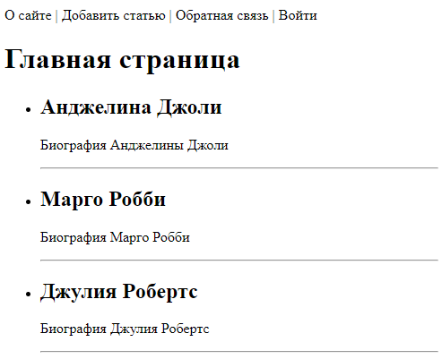

Но у нас здесь, во-первых, выводится информация по Марго Робби, хотя для нее ключ is_published установлен в False и, во-вторых, последняя горизонтальная черта явно лишняя. Давайте поправим эти моменты. Вначале уберем последнюю горизонтальную черту. Для этого воспользуемся еще одним шаблонным тегом if, который позволяет проверять условия и работает подобно оператору if языка Python. Тег hr заключим в этот условный тег со следующей проверкой условия:
```html
<!-- index.html -->
...
<ul>
    
        <li>
            <h2>{{p.title}}</h2>
            <p >{{p.content}}</p>
            
                <hr>
            
        </li>
    
</ul>
...
```
Внутри тега for можем использовать специальную переменную forloop, которая содержит некоторую [вспомогательную информацию](https://docs.djangoproject.com/en/4.2/ref/templates/builtins/#for).

В частности, переменную last, которая принимает значение True на последней итерации цикла. Поэтому условие not forloop.last истинно, пока мы не дошли до последней итерации. Соответственно, тег hr добавляется во все пункты li, кроме последнего. Обратите внимание, что в конце тега if обязательно нужно прописать тег endif. Все, что попадает в промежуток между if и endif образуют фрагмент HTML-документа, который включается или не включается в зависимости от истинности условия.

После обновления главной страницы увидим, что последняя горизонтальная черта пропала, как мы этого и хотели. Давайте теперь по аналогии будем отображать только те статьи, для которых значение поля is_published равно True. Сделать это можно следующим образом:
```html
<!-- index.html -->
<ul>
    
        
            <li>
                <h2>{{p.title}}</h2>
                <p >{{p.content}}</p>
                
                    <hr>
                
            </li>
        
    
</ul>
```
Так как между шаблонными тегами if и endif заключен фрагмент с HTML-тегом li, то при ложном is_published соответствующая статья добавлена в HTML-документ не будет. И мы это увидим при обновлении главной страницы. На ней останется только две статьи.

Как видите, шаблонные теги for и if применять достаточно просто, и работают они аналогично операторам for и if языка Python. Например, в условиях также можно прописывать составные условия с применением операторов not, and и or. Добавлять блоки elif и else при необходимости. И, я думаю, с этим ни у кого из вас не возникнет никаких проблем, все достаточно очевидно.
### **12. Шаблонный тег url.**
Следующий важный шаг при разработке шаблонов – научиться правильно прописывать URL-адреса для ссылок. Я напомню, что ссылки в HTML-документе формируются с помощью тега <a> по следующему правилу:
```html
<a href="URL-адрес страницы">Название ссылки</a>
```
Например, мы можем в шаблоне index.html добавить ссылки для чтения поста следующим образом:
```html
<!-- index.html -->
...
<ul>
    
        
            <li>
            <h2>{{p.title}}</h2>
            <p>{{p.content}}</p>
            <p><a href="post/{{p.id}}/">Читать пост</a></p>
            
                <hr>
            
            </li>
        
    
</ul>
...
```
Здесь p.id – это уникальный идентификатор статьи (мы его прописывали в коллекции data_db). При переходе на главную страницу под каждой статьей увидим ссылку:

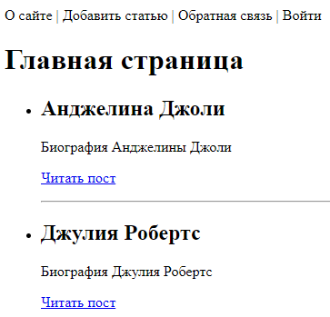

Однако такой прямолинейный подход к описанию ссылок непосредственно в шаблоне – не лучший ход, сродни с хардкодингом. Например, если в будущем изменится шаблон URL-адреса для отображения статей, то изменения придется вносить во все шаблоны, где этот адрес прописан. А это, как вы понимаете, неэффективно и коряво. Было бы гораздо лучше динамически формировать URL-адреса, используя названия URL-шаблонов, которые мы прописывали в файле urls.py приложения women:
```python
# women/urls.py
urlpatterns = [
    path('', index, name='home'),
    path('about/', about, name='about'),
    path('cats/<int:cat_id>/', categories, name='cats_id'),
    path('cats/<slug:cat_slug>/', categories_by_slug, name='cats'),
    path('archive/<year4:year>/', archive, name='archive'),
]
```
Давайте здесь опишем три следующих маршрута:
```python
# women/urls.py
urlpatterns = [
    path('', index, name='home'),
    path('about/', about, name='about'),
    path('post/<int:post_id>/', show_post, name='post'),
]
```
Каждый маршрут имеет свое имя, которым мы в дальнейшем и будем пользоваться. Конечно, предполагается, что имена остаются неизменными на протяжении разработки всего проекта.

Добавим функцию представления show_post в модуль views.py приложения women, а другие не нужные функции удалим:
```python
# women/views.py
def show_post(request, post_id):
    return HttpResponse(f"Отображение статьи с id = {post_id}")
```
После этого перейдем в шаблон index.html и в нем сформируем URL-адреса для каждой статьи с помощью специального [шаблонного тега url](https://docs.djangoproject.com/en/4.2/ref/templates/builtins/):
```html
<!-- index.html -->
...
<p><a href="">Читать пост</a></p>
...
```
То есть, после тега url указывается имя маршрута ‘post’, а затем, через пробел аргумент p.id для формирования этого маршрута. Почему именно так? На самом деле тег url работает аналогично известной нам функции reverse. Если мы ее запишем в виде:
```python
reverse('post', args=(11, ))  # '/post/11/'
```
то получим маршрут '/post/11/'. И тот же эффект получаем от применения тега url:
```html

```
Как видите, это гораздо более удобное решение для формирования URL-адресов. Если в будущем маршруты в файле urls.py изменятся, то изменения автоматически произойдут и в шаблоне. Ничего дополнительно редактировать не придется. В этом основное удобство использования шаблонного тега url.

Давайте в заключение добавим ссылки для главного меню сайта и отобразим его в HTML-документе. Вначале в файле urls.py мы пропишем следующие маршруты:
```python
# women/urls.py
urlpatterns = [
    path('', views.index, name='home'),
    path('about/', views.about, name='about'),
    path('addpage/', views.addpage, name='add_page'),
    path('contact/', views.contact, name='contact'),
    path('login/', views.login, name='login'),
    path('post/<int:post_id>/', views.show_post, name='post'),
]
```
А коллекцию menu изменим, добавив в нее информацию об именах маршрутов (в файле views.py). Также здесь сразу пропишем функции-заглушки для каждого пункта меню:
```python
# women/views.py
menu = [{'title': "О сайте", 'url_name': 'about'},
        {'title': "Добавить статью", 'url_name': 'add_page'},
        {'title': "Обратная связь", 'url_name': 'contact'},
        {'title': "Войти", 'url_name': 'login'}
]
...
def addpage(request):
    return HttpResponse("Добавление статьи")
 
def contact(request):
    return HttpResponse("Обратная связь")
 
def login(request):
    return HttpResponse("Авторизация")
```
Осталось в файле index.html выполнить отображение меню. Я сделаю это следующим образом:
```html
<!-- index.html -->
<ul>
    <li><a href="">Главная</a></li>
    
        <li><li class="last">
        <a href="">{{m.title}}</a>
        </li>
    
</ul>
```
После обновления главной страницы увидим список из ссылок пунктов главного меню сайта.
### **13. Наследование шаблонов (extends). Тег include.**
Отредактируем еще один about.html с выводом информации о сайте. В самом простом варианте его можно представить следующим образом:
```html
<!-- about.html -->
<!DOCTYPE html>
<html>
<head>
    <title>{{title}}</title>
</head>
<body>
 
<ul>
    <li><a href="">Главная</a></li>
    
    <li><li class="last">
        <a href="">{{m.title}}</a>
    </li>
    
</ul>
 
<h1>{{title}}</h1>
</body>
</html>
```
То есть, я просто скопировал начало шаблона из index.html и вставил в файл about.html.

Отредактируем функцию about в файле views.py, добавив передачу списка пунктов menu:
```python
# women/views.py
def about(request):
    return render(request, 'women/about.html', {'title': 'О сайте', 'menu': menu})
```
После запуска тестового веб-сервера и перехода по URL-адресу:
```http request
http://127.0.0.1:8000/about/
```
увидим страницу «О сайте» с выводом главного меню.

Однако, как вы уже догадались, дублирование информации в разных шаблонах нарушает известный принцип DRY – don’t repeat yourself (не повторяйся).

Для устранения этого недостатка, обычно создается базовый (общий) шаблон, содержащий общие элементы типовых страниц сайта, а уже потом он расширяется (дополняется деталями) шаблонами отдельных страниц. Такое расширение называется наследованием шаблонов. И сейчас мы на конкретном примере посмотрим, как это можно сделать.

Если перейти в документацию по фильтрам и тегам шаблонов фреймворка Django, то среди тегов можно встретить следующие:
```html
 … 

```
Итак, вначале мы с вами определим базовый шаблон. Его, как правило, создают на уровне всего проекта. Поэтому создадим каталог templates в папке sitewomen, а в нем файл с именем base.html. Однако если мы сейчас попробуем обратиться к этому шаблону, например, в функции представления about:
```python
# women/views.py
def about(request):
    return render(request, 'base.html', {'title': 'О сайте', 'menu': menu})
```
то увидим ошибку, что шаблон не был найден. Это связано с тем, что маршрут templates/base.html не стандартный и его нужно явно прописать для шаблонизатора. Для этого нужно перейти в файл settings.py пакета конфигурации, найти параметр TEMPLATES и в коллекции DIRS прописать путь к каталогу templates следующим образом:
```python
# sitewomen/settings.py
TEMPLATES = [
    {
        'BACKEND': 'django.template.backends.django.DjangoTemplates',
        'DIRS': [
            BASE_DIR / 'templates',
        ],
        'APP_DIRS': True,
        ...
    },
]
```
Все, теперь при обновлении страницы «О сайте» мы увидим отображение базового шаблона.

Вернем прежний шаблон в функции about:
```python
# women/views.py
def about(request):
    return render(request, 'women/about.html', {'title': 'О сайте', 'menu': menu})
```
Давайте теперь общие элементы страниц сайта вынесем в базовый шаблон base.html. Для этого я скопирую все из файла about.html и посмотрим, что здесь у нас общее. Очевидно, все начало, включая отображение главного меню. А вот заголовок h1 и остальную часть страницы внутри тега body будем считать изменяемой. Поэтому вместо тега h1 мы пропишем специальный шаблонный тег block следующим образом:
```html
<!-- base.html. После копирования кода из about.html добавляем блок. -->
 
```
Здесь content – это название блока, вместо которого будет подставляться содержимое из наследуемых шаблонов.

Все, на этом базовый шаблон у нас с вами завершен. Осталось лишь расширить его для шаблонов index.html и about.html. Сначала перейдем в файл index.html и самой первой строчкой пропишем еще один шаблонный тег extends:
```html
<!-- index.html -->

...
```
А ниже все уберем, кроме отображения заголовка 1-го уровня и списка статей. Эта информация должна быть размещена в блоке content базового шаблона. Поэтому здесь, в дочернем нам следует переопределить этот блок content следующим образом:
```html
<!-- index.html -->

    <h1>{{title}}</h1>
    
    <ul>
        
            
            <li>
                <h2>{{p.title}}</h2>
                <p >{{p.content}}</p>
                <p ><a href="">Читать пост</a></p>
                
                    <hr>
                
            </li>
            
        
    </ul>

```
То есть, мы просто заключили в этот тег то, что должно быть помещено в блок content базового шаблона.

Давайте посмотрим, как это будет работать. Перейдем на главную страницу сайта и видим полное содержимое HTML-документа, который мы с вами определили в базовом шаблоне base.html и в дочернем index.html.

По аналогии опишем расширение в шаблоне about.html:
```html
<!-- about.html -->

 

<h1>{{title}}</h1>

```
Переходим по ссылке на страницу «О сайте» и видим полноценную HTML-страницу с заголовком 1-го уровня. В результате мы с вами ушли от дублирования в отдельных шаблонах и можем достаточно просто определять страницы сайта, просто расширяя базовый шаблон base.html.
#### **Тег include.**
Помимо расширения шаблонов можно еще делать включение одного шаблона в другой. О чем здесь речь и для чего это нужно? Давайте представим, что мы бы хотели на главной странице нашего сайта (в шаблоне index.html) дополнительно отображать рубрики по известным женщинам в виде следующей навигационной панели из ссылок:
```html
<nav>
    <a href="#">Актрисы</a>
    <a href="#">Певицы</a> 
    <a href="#">Спортсменки</a>
</nav>
```
Причем делать это и сверху перед списком, и внизу после списка. В результате у нас получается дублирование фрагмента. Как раз чтобы этого избежать, применяется тег include, который позволяет добавлять в шаблон данные из другого шаблона. Давайте это сделаем.

Вначале мы создадим подкаталог includes в папке templates/women нашего проекта для лучшей организации структуры файлов шаблонов. Внутри каталога includes разместим файл nav.html и скопируем в него тег nav. А в шаблоне index.html подключим этот файл с помощью тега include следующим образом:
```html
<!-- index.html -->

 

    
    
    <h1>{{title}}</h1>
    
    <ul>
        
            
            <li>
                <h2>{{p.title}}</h2>
                <p >{{p.content}}</p>
                <p ><a href="">Читать пост</a></p>
                
                    <hr>
                
            </li>
            
        
    </ul>
    
    

```
Причем сделали это в двух местах. При обновлении главной страницы увидим тот же результат, что и раньше, но при этом устранили дублирование фрагментов в шаблоне index.html.

Следует отметить, что при включении, шаблон nav.html имеет доступ ко всем параметрам, которые передаются в шаблон index.html. Например, в нем можно вывести заголовок:
```html
<!-- nav.html -->
<p>{{title}}</p>
```
Если же нам нужно запретить передачу переменных, то после пути к шаблону в теге include следует дополнительно прописать ключевое слово only:
```html
<!-- index.html -->

```
А если нужно при этом передать отдельные параметры, то это можно сделать с помощью ключевого слова with следующим образом:
```html
<!-- index.html -->

```
В итоге получаем довольно гибкий инструмент включения фрагментов в наши шаблоны.
### **14. Подключение статических файлов.**
Следующий важный шаг – научиться подключать к шаблонам статические файлы, например, оформление CSS, JavaScript, изображения и так далее. Здесь есть свои тонкости. Как мы помним, наш проект может работать в двух режимах: отладки – на тестовом веб-сервере; эксплуатации – на реальном веб-сервере. Так вот, в режиме отладки статические файлы Django ищет во всех подкаталогах static приложений, которые прописаны в коллекции INSTALLED_APPS. То есть, статические файлы при отладке совершенно спокойно можно размещать в подкаталоге static нашего приложения. Но, в режиме эксплуатации реальный веб-сервер будет брать все статические файлы из папки static, расположенной, как правило, в каталоге всего проекта. И здесь возникает вопрос, как перенести все файлы из разных папок static приложений в единый каталог static всего проекта? Для этого, при подготовке сайта к эксплуатации, выполняется специальная команда фреймворка Django:
```bash
python3 manage.py collectstatic
```
которая собирает все статические файлы из разных приложений и модулей и помещает в одну общую папку проекта.

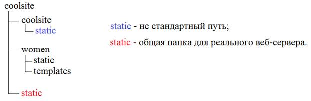

Так вот, чтобы корректно работал весь этот механизм, в пакете конфигурации необходимо определить три константы:
- STATIC_URL – префикс URL-адреса для статических файлов; 
- STATIC_ROOT – путь к общей статической папке, формируемой при запуске команды collectstatic (для сбора всей статики в единый каталог при размещении сайта на реальном веб-сервере); 
- STATICFILES_DIRS – список дополнительных (нестандартных) путей к статическим файлам, используемых для сбора и для режима отладки.

По умолчанию, при создании проекта, Django автоматически формирует только одну переменную STATIC_URL. Две другие пока добавлять не будем. Кроме того, в списке INSTALLED_APPS обязательно должна присутствовать строчка:
```python
# sitewomen/settings.py
INSTALLED_APPS = [
    ...
    'django.contrib.staticfiles',  
    ...
]
```
Если ее по каким-то причинам нет, то следует добавить, иначе статические файлы в шаблонах подключаться не будут.

Давайте теперь создадим папку static в нашем приложении women и, также как и для шаблонов, укажем в ней вложенный каталог women, чтобы не было конфликтов имен между статическими файлами разных приложений. (В действительности, Django просто найдет первый подходящий файл и на этом остановится. Чтобы этот файл был тем, что нам нужен, как раз и используется дополнительный каталог, который играет роль некоторого пространства имен.)

В этом последнем подкаталоге уже будем размещать файлы css – для файлов CSS; js – для файлов JavaScript; images – для общих файлов изображений и так далее. Я создам подкаталог css для файла стилей нашего сайта. И в нем размещу файл styles.css, который заготовил заранее, чтобы не отвлекаться на CSS-оформление сайта, а сосредоточится на изучении фреймворка Django. Вы сможете скачать весь этот проект с github и, при необходимости, внимательно его изучить. Также создам подкаталог images и скопирую в него все необходимые изображения для базового оформления сайта.

Все, подготовительная часть завершена. Теперь мы можем использовать эти внешние файлы в шаблонах нашего приложения. Для этого используется специальный тег static, который сначала подключается в шаблоне (base.html):
```html
<!-- base.html -->

...
```
А, затем, для формирования URL к тому или иному статическому файлу, используется конструкция:
```html

```
Например, для подключения css-файла в базовом шаблоне base.html, следует прописать:
```html
<!-- base.html -->
...
<link type="text/css" href="" rel="stylesheet" />
```
При просмотре страницы увидим следующий URL-адрес:
```html
<link type="text/css" href="/static/women/css/styles.css" rel="stylesheet" />
```
Часто для оформления сайтов используют онлайн-сервисы. Наиболее известный из них [Bootstrap](https://getbootstrap.com/).

Итак, на нашем сайте выводится пока только заголовок и краткий контент статей. Я его увеличу для первой статьи следующим образом:
```python
# women/views.py
data_db = [
    {'id': 1, 'title': 'Анджелина Джоли', 'content': '''<h1>Анджелина Джоли</h1> (англ. Angelina Jolie[7], при рождении Войт (англ. Voight), ранее Джоли Питт (англ. Jolie Pitt); род. 4 июня 1975, Лос-Анджелес, Калифорния, США) — американская актриса кино, телевидения и озвучивания, кинорежиссёр, сценаристка, продюсер, фотомодель, посол доброй воли ООН. Обладательница премии «Оскар», трёх премий «Золотой глобус» (первая актриса в истории, три года подряд выигравшая премию) и двух «Премий Гильдии киноактёров США».''', 'is_published': True},
    {'id': 2, 'title': 'Марго Робби', 'content': 'Биография Марго Робби', 'is_published': False},
    {'id': 3, 'title': 'Джулия Робертс', 'content': 'Биография Джулия Робертс', 'is_published': True},
]
```
И поставим задачу выводить не более 50 слов. Это можно сделать с помощью следующего фильтра:
```html
<!-- index.html -->
{{ p.content|truncatewords:50 }}
```
Содержимое выглядит уже лучше. Далее, мы сделаем так, чтобы каждая строка описания выводилась с новой строки в окне браузера. Для этого добавим еще один фильтр:
```html
<!-- index.html -->
{{ p.content|linebreaks|truncatewords:50 }}
```
Наконец, сделаем так, чтобы теги внутри описания не экранировались, а применялись браузером для разметки текста. Для этого заключим содержимое контента в тег autoescape с параметром off:
```html
<!-- index.html -->

    {{ p.content|linebreaks|truncatewords:50 }}

```
После того, как мы настроили наше оформление сайта, давайте вернемся к параметрам STATIC_URL и STATICFILES_DIRS. Предположим, что мы размещаем статические файлы не в приложении, а в проекте. Для этого перенесем нашу папку static на уровень проекта. Если теперь перезапустить тестовый веб-сервер и обновить страницу в браузере комбинациями клавиш Ctrl+F5, то оформление пропадет. Это связано с тем, что фреймворк Django не находит каталог static, который теперь имеет нестандартное размещение. Но это легко поправить с помощью коллекции STATICFILES_DIRS:
```python
# sitewomen/settings.py
STATICFILES_DIRS = [BASE_DIR / 'static']
```
Она позволяет для режима отладки задавать дополнительные нестандартные пути для поиска статических файлов. Теперь, при обновлении страницы мы снова увидим прежнее оформление.

Я верну папку static снова в приложение women и удалю список STATICFILES_DIRS, так как все пути у нас стандартные.
#### **Замечания по запуску веб-сервера в режиме DEBUG=False.**
Если мы сейчас попробуем запустить веб-сервер не в режиме отладки с параметром:
```python
# sitewomen/settings.py
DEBUG = False
```
то при обновлении главной страницы сайта все оформление пропадет. Но это лишь особенность работы тестового веб-сервера. В этом случае его нужно запустить с параметром --insecure следующей командой:
```shell
python3 manage.py runserver --insecure
```
Теперь, все снова работает, как и прежде. То есть, если вам понадобится на локальном компьютере протестировать работу сайта без отладки и с возможностью загрузки статических файлов, то применяйте параметр --insecure.

В дальнейшем, на реальном веб-сервере, все статические файлы собираются в единый каталог, как правило, с именем static с помощью команды:
```shell
python3 manage.py collectstatic
```
и, затем, берутся из этой папки.
### **15. Пользовательские теги шаблонов. Декораторы simple_tag и inclusion_tag.**
Увидим, как можно создавать свои собственные шаблонные теги и использовать их при формировании HTML-страниц. Для этого Django позволяет использовать два вида [пользовательских тегов](https://docs.djangoproject.com/en/4.2/howto/custom-template-tags/):
- simple tags – простые теги;
- inclusion tags – включающие теги.

#### **Simple Tags.**
Вначале мы создадим простой тег, который будет возвращать список категорий и использоваться непосредственно в шаблоне. Согласно документации теги должны располагаться в подкаталоге templatetags каталога приложения women и являться пакетом, то есть, содержать файл __init__.py. Сделаем это. Далее, нам нужно добавить в эту папку еще один python-файл, в котором будем прописывать логику нового тега. Файл назовем каким-нибудь понятным именем, например, women_tags. Импортируем сюда модуль template для работы с шаблонами и модуль views:
```python
# women/women_tags.py
from django import template
from ..views import *
```
Следующим шагом нам нужно создать экземпляр класса Library, через который происходит регистрация собственных шаблонных тегов:
```python
# women/women_tags.py
register = template.Library()
```
И, далее, определим функцию, которая будет выполняться при вызове нашего тега из шаблона. Так как нам нужны будут списки категорий, то функция будет достаточно простой:
```python
# women/women_tags.py
def get_categories():
    return cats_db
```
Название функции get_categories мы придумываем сами. Соответственно, в файле women/views.py мы пропишем коллекцию cats_db следующим образом:
```python
# women/views.py
cats_db = [
    {'id': 1, 'name': 'Актрисы'},
    {'id': 2, 'name': 'Певицы'},
    {'id': 3, 'name': 'Спортсменки'},
]
```
Теперь, чтобы связать функцию get_categories с тегом, или, превратить эту функцию в тег, используется специальный декоратор, доступный через переменную register:
```python
# women/women_tags.py
@register.simple_tag()
def get_categories():
    return cats_db
```
Все, мы только что создали свой простой пользовательский тег для использования его в шаблонах.

Давайте им воспользуемся. Перейдем в базовый шаблон base.html и вначале выполним загрузку тегов, определенных в файле women_tags:
```html
<!-- base.html -->

```
После этого в шаблоне (и во всех его дочерних шаблонах) доступен тег по имени get_categories. Однако если сейчас обновить главную страницу, то получим ошибку, что women_tags не зарегистрирован. Это связано с тем, что после добавления нового пакета templatetags и файла women_tags.py необходимо перезапустить тестовый веб-сервер, чтобы он подхватил изменения в проекте сайта. После перезагрузки никаких ошибок не появляется.

Далее, в месте вывода рубрик давайте просто запишем наш новый сформированный тег:
```html
<!-- base.html -->
...

...
```
и при обновлении главной страницы увидим отображение списка. Это говорит о том, что все работает, тег возвращает нужные данные. Но как нам теперь перебрать элементы этого объекта? Подставить в цикл тег get_categories мы не можем, т.к. это не переменная, а тег шаблона. Для этого в Django в тегах можно использовать специальное ключевое слово as, которое сформирует ссылку на данные тега. В нашем случае это можно записать так:
```html
<!-- base.html -->
...

...
```
Сформируется переменная categories, которую уже можно использовать в теге цикла for. Кстати, при обновлении страницы, тег get_categories уже не будет отображаться на странице, т.к. изменилось его поведение – данные передаются в переменную (точнее ссылку).

Теперь мы можем перебрать список categories и отобразить категории в шаблоне:
```html
<!-- base.html -->

 
<ul id="leftchapters">
    <li class="selected">Все категории</li>
    
        
            <li><a href="#">{{ cat.name }}</a></li>
        
        
        <li class="share">
        <p >Наш канал</p>
        <a class="share-yt" href="..." target="_blank" rel="nofollow"></a>
    </li>
</ul>
```
Давайте добавим URL-адреса для категорий. Для этого в файле urls.py пропишем следующий маршрут с именем category:
```python
# women/urls.py
urlpatterns = [
    path('', index, name='home'),
    ...
    path('category/<int:cat_id>/', show_category, name='category'),
]
```
И добавим функцию представления show_category для этого маршрута в файле views.py:
```python
# women/views.py
def show_category(request, cat_id):
    """Функция-заглушка"""
    return index(request)
```
Пока она у нас ничего делать не будет. После всех этих действий в шаблоне base.html URL-адреса для категорий можно сформировать с помощью тега url следующим образом:
```html
<!-- base.html -->

    <li><a href="">{{ cat.name }}</a></li>

```
Все, с помощью простого пользовательского тега мы получаем список категорий и отображаем их в HTML-документе. Также, если нам нужно определить другое имя тега get_categories, то для этого в декораторе register.simple_tag достаточно указать параметр name с другим именем, например, так:
```python
# women/women_tags.py
@register.simple_tag(name='getcats')
def get_categories():
    return cats_db
```
И, далее, в шаблоне base.html следует использовать имя 'getcats':
```html
<!-- base.html -->

```
#### **Inclusion Tags.**
Второй тип пользовательских тегов – включающий тег, позволяет дополнительно формировать свой собственный шаблон на основе некоторых данных и возвращать фрагмент HTML-страницы. Давайте посмотрим, как с ним можно работать.

Сначала в файле women_tags.py добавим функцию для реализации этого второго тега и, так как она будет возвращать полноценный шаблон, то назовем ее show_categories:
```python
# women/women_tags.py
@register.inclusion_tag('women/list_categories.html')
def show_categories():
    cats = cats_db
    return {"cats": cats}
```
Здесь в функции происходит формирование и возврат словаря с необходимыми данными для шаблона list_categories.html. То есть, в шаблоне list_categories.html будет доступна переменная cats со списком всех рубрик. Именно этот сформированный шаблон и будет возвращаться данным тегом.

Осталось прописать сам шаблон. Разместим его среди всех остальных шаблонов (хотя, при необходимости, можно создать отдельный подкаталог и размещать шаблоны тегов в нем). И скопируем в него следующий фрагмент шаблона из base.html:
```html
<!-- list_categories.html -->

    <li><a href="">{{ cat.name }}</a></li>

```
Здесь переменную categories заменим на cats, так как именно ее мы передаем как параметр этому шаблону, и наш тег готов. Осталось вызвать его в базовом шаблоне base.html и вместо вывода рубрик, записать тег:
```html
<!-- base.html -->

```
Обновляем главную страницу сайта и видим, что все работает – рубрики выводятся с помощью нашего включающего тега. (При необходимости перезапустите тестовый веб-сервер).
#### **Передача параметров пользовательским тегам.**
Все наши теги могут принимать некоторые параметры, которые расширяют их функциональность. Давайте этим воспользуемся и дополнительно будем передавать параметр с номером выбранной рубрики. Для этого в функции тега show_categories пропишем параметр cat_selected:
```python
# women/women_tags.py
@register.inclusion_tag('women/list_categories.html')
def show_categories(cat_selected=0):
    cats = cats_db
    return {"cats": cats, "cat_selected": cat_selected}
```
И изменим шаблон list_categories.html следующим образом:
```html
<!-- list_categories.html -->

    
        <li class="selected">{{cat.name}}</li>
    
        <li><a href="">{{cat.name}}</a></li>
    

```
Теперь наш тег show_categories может принимать один параметр. В шаблоне base.html пропишем его вызов следующим образом:
```html
<!-- base.html -->
 

    или


```
Соответственно параметр cat_selected необходимо передать в шаблон base.html. Для этого откорректируем функцию представления index:
```python
# women/views.py
def index(request):
    data = {
        'title': 'Главная страница',
        'menu': menu,
        'posts': data_db,
        'cat_selected': 0,  # не обязательная строчка
    }
 
    return render(request, 'women/index.html', context=data)
```
И функцию представления show_category:
```python
# women/views.py
def show_category(request, cat_id):
    data = {
        'title': 'Отображение по рубрикам',
        'menu': menu,
        'posts': data_db,
        'cat_selected': cat_id,
    }
 
    return render(request, 'women/index.html', context=data)
```
Если теперь запустить веб-сервер и щелкать по рубрикам, то они будут подсвечиваться выделенным синим цветом. Однако первая рубрика всегда остается выделенной. Давайте это тоже поправим и в шаблоне base.html пропишем следующее условие:
```html
<!-- base.html -->
<ul id="leftchapters">
    
        <li class="selected">Все категории</li>
    
        <li><a href="">Все категории</a></li>
    
    ...
</ul>
```
### **16. Что такое БД, SQL и ORM. Создание первой модели.**
На этом занятии мы с вами коснемся следующего аспекта паттерна MTV, по которому построен фреймворк Django, – модели. Как я уже ранее говорил, модель отвечает за хранение и оперирование данными сайта. [Django поддерживает следующие стандартные СУБД](https://docs.djangoproject.com/en/4.2/ref/databases/): PostgreSQL, MariaDB, MySQL, Oracle и SQLite.

Все эти БД относятся к реляционным, то есть, позволяют хранить данные в виде связанных таблиц. Причем, для каждой таблицы программист сам определяет число и тип столбцов. Эти столбцы называются полями таблицы и определяют ее структуру. А набор конкретных данных полей – записями таблицы.

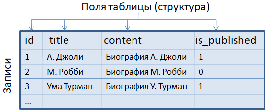

Для создания таблиц, описания их структуры и наполнения данными используется специальный язык, который сокращенно называется SQL. Это аббревиатура от фразы: SQL (Structured Query Language), которая переводится как язык структурированных запросов. Именно на нем пишутся запросы к БД.

Чистый SQL здесь, как правило, не используется. Лишь в редких случаях требуется опускаться на этот нижний уровень взаимодействия с таблицами БД. Но если через SQL выполняется доступ к данным, то, спрашивается, как можно обойтись без него? На самом деле SQL используется всегда и, мало того, для каждого типа СУБД имеет свои характерные особенности. Но, чтобы программист мог создавать универсальный программный код, не привязанный к конкретному типу БД, в Django встроен механизм взаимодействия с таблицами через объекты классов языка Python посредством технологии ORM (Object-Relational Mapping). Причем этот интерфейс универсален и на уровне WSGI-приложения не привязан к конкретной СУБД. (Если вы работали с SQLAlchemy, то уже хорошо понимаете о чем идет речь. Объектная модель ORM в Django очень похожа по функциональности на SQLAlchemy).

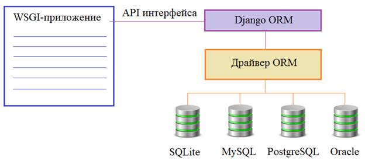

При работе с Django разработчику не нужно беспокоиться о подключении к БД и ее закрытию, когда пользователь покидает сайт. Фреймворк такие действия берет на себя и делает это весьма эффективно. Все что нам остается, это через модель взаимодействия выполнять команды API интерфейса, записывать, считывать и обновлять данные.

По умолчанию Django сконфигурирован для работы с БД SQLite и в рамках учебного проекта мы пока оставим именно ее, чтобы не перегружать материал. Текущую настройку БД можно посмотреть в файле settings.py пакета конфигурации:
```python
# sitewomen/settings.py
DATABASES = {
    'default': {
        'ENGINE': 'django.db.backends.sqlite3',
        'NAME': BASE_DIR / 'db.sqlite3',
    }
}
```
Здесь словарь DATABASES по умолчанию определяет СУБД SQLite3 и путь к файлу БД db.sqlite3.

Подключение к другим СУБД происходит относительно просто в этом же словаре DATABASES, главное, иметь драйвер взаимодействия с ними. Для SQLite ничего дополнительно устанавливать не нужно. Но для работы с таблицами этой БД я дополнительно буду использовать приложение [DBSQLiteStudio](https://sqlitestudio.pl/).

Если мы откроем БД нашего сайта в этой программе, то увидим, что она пока не содержит ни одной таблицы. Давайте добавим первую модель, первый класс, который будет описывать таблицу women для хранения информации об известных женщинах. Структура этой таблицы будет такой:

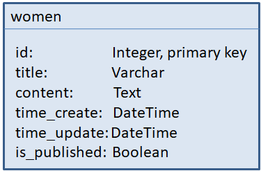

Здесь первое поле id – это первичный ключ, принимающий уникальные числовые значения. Фактически, это идентификатор записи. Далее, идет поле title (заголовок статьи) в виде строки из определенного числа символов. Затем, поле content, представляющее собой текст статьи. Два следующих поля – это время создания статьи и время ее последнего изменения. Наконец, последнее поле is_published – это флаг публикации поста (True – опубликована; False – не опубликована).

Теперь, смотрите, чтобы мы могли работать с такой таблицей, нам нужно объявить класс с этими полями. Этот класс в ORM называется моделью. Для его определения перейдем в файл women/models.py, в котором описываются модели текущего приложения, и здесь вначале уже импортирован пакет models, содержащий базовый класс Model, на базе которого и строятся модели:
```python
# women/models.py
class Women(models.Model):
    title = models.CharField(max_length=255)
    content = models.TextField(blank=True)
    time_create = models.DateTimeField(auto_now_add=True)
    time_update = models.DateTimeField(auto_now=True)
    is_published = models.BooleanField(default=True)
```
По умолчанию имя таблицы будет совпадать с именем класса, а ее структура определяться атрибутами, которые мы здесь определили. Давайте внимательнее посмотрим, что здесь написано. Во-первых, нигде нет поля id. Но ошибки нет, такое поле создается автоматически у каждой таблицы. В действительности, оно уже прописано в базовом классе Model по всем правилам. Далее, атрибут title будет определять одноименное поле как текстовую строку с максимальным числом символов 255. Но откуда мне было известно, что для этого следовало использовать класс CharField с параметром max_length? Как вы уже догадались, все это приведено в [документации](https://docs.djangoproject.com/en/4.2/ref/models/fields/) по фреймворку Django на следующей странице раздела ORM.

Здесь внушительный список самых разных классов, описывающих поля модели, и если щелкнуть по CharFiled, то увидим его описание и тот самый обязательный параметр max_length, что был использован для указания максимального числа символов в строке. И так по всем полям. Я рекомендую вам ознакомиться с этой информацией, чтобы в целом знать основные поля и их параметры.

Итак, первые два поля (id и title) определены. Следующее поле content задано как текстовое с параметром blank=True. Данный параметр означает, что это поле может быть пустым, то есть, не содержать текста. Я привел его, скорее, для ознакомления. В реальной статье вряд ли следует ожидать пустое содержимое. Следующие два атрибута определены классом DateTimeField, предназначенный специально для работы со временем. У него есть два параметра:
- auto_now_add – позволяет фиксировать текущее время только в момент первого добавления записи в таблицу БД;
- auto_now – фиксирует текущее время всякий раз при изменении или добавлении записи в таблицу БД.

Эти параметры нам как раз подходят для формирования времени атрибутов time_create и time_update.

Последний атрибут is_published определен через класс BooleanField с параметром default=True. Это означает, что по умолчанию значение поля в БД будет установлено в значение True и статья будет считаться опубликованной.

Это лишь пример того, как можно описывать модель таблиц в БД. Причем, последовательность полей в таблице, по умолчанию, будет такой же как и в представленной модели.

Однако если сейчас запустить веб-сервер, то в нашей БД таблица создана не будет. Таблицы создаются отдельными командами, используя технику миграций.
### **17. Создание и запуск файлов миграций.**
Теперь нам нужно создать таблицу уже непосредственно в БД на основе этого описания. Для этого в Django (да и не только в нем) существует механизм, известный как создание и выполнение миграций. Что это такое? Фактически, каждая миграция представляет собой отдельный файл (модуль) с текстом программы на языке Python, где описаны наборы команд на уровне ORM интерфейса, для создания таблиц определенных структур. При выполнении файла миграции в БД автоматически создаются новые или изменяются прежние таблицы, а также связи между ними. Каждый новый файл миграции помещается в папку migrations текущего приложения и описывает лишь изменения, которые произошли в структурах таблиц с прошлого раза. Их можно воспринимать как контролеры версий: всегда можно откатиться к предыдущей структуре и продолжить работу с прежней версией структур и связей между таблицами. Конечно, при разработке сайтов структуру таблиц и их связей лучше продумывать как можно точнее. Но учесть все заранее очень сложно, поэтому миграции так полезны при разработке проектов.

Итак, у нас пока нет ни одной миграции. Давайте ее создадим. Для этого переходим в терминал и из корневого каталога проекта обращаемся к модулю manage.py, выполняя команду:
```shell
python3 manage.py makemigrations
```
Видим, что в каталоге migrations приложения women был успешно создан файл миграции с именем 0001_initial.py. Если открыть этот файл, то увидим команду CreateModel, которая создает таблицу women с указанным набором полей, включая поле id.

**_Команду makemigrations следует выполнять каждый раз, когда у нас меняется хотя бы одна модель, иначе изменения не отразятся в файлах миграций и, как следствие, в самой БД_**. Сам веб-сервер этого не делает. Мы должны самостоятельно заранее подготовить (создать) нужные таблицы, а потом они просто используются для наполнения данными.

Чтобы посмотреть SQL-запрос, который будет выполнен при использовании данной миграции, можно записать следующую команду sqlmigrate:
```shell
python3 manage.py sqlmigrate women 0001
```
После этой команды мы указываем название приложения и порядковый номер миграции (только номер без _initial.py). Выполняя ее, в консоли увидим соответствующий SQL-запрос. Конечно, этот запрос может меняться в зависимости от выбранного типа БД.

Но пока мы лишь создали файл миграции. В БД по-прежнему нет никаких изменений. Чтобы изменения вступили в силу, необходимо выполнить файлы миграций. На самом деле их будет несколько, так как есть стандартные модели и для них также создаются файлы миграций, например, связанные с админ-панелью, авторизацией, сессиями и так далее, то есть с модулями, которые подключены по умолчанию к нашему проекту. Итак, для выполнения миграций запишем команду:
```shell
python3 manage.py migrate
```
Все выполнилось успешно и если открыть файл БД в SQLiteStudio, то увидим в ней множество таблиц, в том числе и нашу таблицу women_women. Ее имя было определено по имени приложения Women и имени модели, которое также Women. Если дважды щелкнуть на таблицу, то увидим ее структуру, именно ту, что определили в нашей модели.
### **18. Понятие CRUD. Добавление записей в таблицу БД. Модуль django-extensions.**
На предыдущем занятии мы с вами описали модель Women и создали на ее основе таблицу в БД, используя механизм миграций. Теперь пришло время научиться работать с этой таблицей, добавлять, выбирать, менять и удалять записи. По-английски все эти операции сокращенно определяются аббревиатурой CRUD по первым буквам английских слов:
- Create – создание;
- Read – чтение;
- Read – чтение;
- Delete – удаление.

Используя ORM фреймворка Django, мы увидим, как выполняются данные команды в базовом исполнении. Почти все проекты, построенные на Django используют его встроенную ORM, не переходя на уровень SQL-запросов. В этом часто просто нет необходимости, так как ORM предоставляет богатейшие возможности по работе с БД. Кроме того, это обеспечивает независимость программного кода от конкретной используемой СУБД и если в будущем потребуется изменить тип БД, то сделать это будет предельно просто. Наконец, ORM в Django хорошо оптимизирует запросы по скорости выполнения и частоте обращения к таблицам БД, а также обеспечивает защиту от SQL-инъекций. Благодаря этому, даже начинающий веб-программист сможет создавать грамотный код по работе с БД.

На этом занятии мы рассмотрим базовые операции с таблицами посредством ORM Django. Позже мы еще углубимся в эту тему, а пока важно лишь понять общий принцип работы с моделями, знать как добавлять, выбирать, изменять и удалять записи.

Итак, первое, что нужно хорошо себе представлять, это то, что каждый экземпляр модели Women представляет собой одну отдельную запись таблицы women_women (далее просто women).

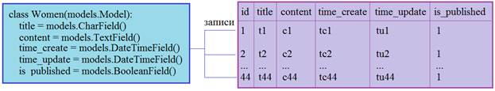

То есть, когда мы выбираем записи, или создаем новые записи, то происходит работа именно с объектами класса Women. Сам же класс, как мы уже говорили, описывает структуру (набор и тип полей) таблицы.

Для демонстрации работы с ORM перейдем в консоль Django и в терминале выполним команду:
```shell
python3 manage.py shell
```
чтобы войти в консоль фреймворка. Первым делом выполним импорт модели:
```shell
from women.models import Women
```
Теперь, чтобы добавить новую запись в таблицу, нам достаточно создать экземпляр класса Women и передать в его конструктор значения именованных параметров, характеризующие поля таблицы:
```shell
Women(title='Анджелина Джоли', content='Биография Анджелины Джоли')
```
Мы видим, что объект был создан, но при этом были указаны только два аргумента. Дело в том, что атрибуты time_create и time_update у нас в модели инициализируются автоматически и определять их конкретными значениями нет необходимости. Поле is_published по умолчанию также принимает значение True. По идее, content тоже можно было бы не определять (из-за параметра blank=True), но я захотел, чтобы оно содержало короткую строку.

Если сейчас перейти в SQLiteStudio и посмотреть содержимое таблицы women_women, то никаких записей не увидим. Почему так произошло? Дело в том, что модели в Django по умолчанию являются «ленивыми», создание экземпляра класса еще не означает добавление записи в таблицу. Как вы понимаете, это сделано специально. Мы можем в разных местах программы создавать объекты моделей и только в последний момент запускать их на исполнение, то есть, заносить информацию в БД. Благодаря этому Django имеет возможность оптимизировать SQL-запросы и излишне не нагружать СУБД.

Хорошо, давайте все же укажем фреймворку сохранить созданную запись в таблице. Для этого нам понадобится какая-либо переменная, ссылающаяся на созданный объект, например, такая:
```shell
w1 = _
```
Здесь символ ‘_’ – это специальная ссылка, в которой сохраняется результат последней операции. Если вывести переменную w1, то увидим строку:
```shell
<Women: Women object (None)>
```
Здесь None – это номер id, который принимает определенное, уникальное числовое значение в момент помещения записи в таблицу. Это делается с помощью метода save():
```shell
w1.save()
```
и, выводя опять же эту переменную в консоль, получаем строку:
```shell
<Women: Women object (1)>
```
Видим, вместо None уже стоит значение 1, то есть, запись была добавлена непосредственно в таблицу и ей был присвоен идентификатор с номером 1. Перейдем в программу SQLiteStudio и убедимся, что данные в таблице действительно появились. Да, это так, причем остальные поля также были проинициализированы нужными значениями.

Непосредственно в программе, то есть, в консоли Django мы можем оперировать всеми этими данными через ссылку w1:
```shell
w1.id # идентификатор
w1.title # заголовок
w1.time_create # время добавления записи
```
и так по всем полям (атрибутам класса). Помимо этих стандартных атрибутов объекты моделей содержат еще один часто используемый атрибут:
```shell
w1.pk # значение primary key
```
который совпадает с атрибутом id. Зачем было сделано такое дублирование? Дело в том, что поле id в таблицах имеет важное значение: часто именно по нему устанавливаются связи между таблицами. Поэтому по соглашению в Django решили определить атрибут со строго определенным именем pk, который будет всегда доступен и содержать номер текущей записи, либо значение None, если оно не определено. Позже мы не раз будем обращаться к этому свойству, как к идентификатору записи.

Конечно, непосредственное добавление записи в таблицу выполнялось с помощью SQL-запроса к БД. Чтобы его увидеть, нам нужно сначала импортировать модуль connection:
```shell
from django.db import connection
```
и обратиться к коллекции queries:
```shell
connection.queries
```
В консоли появится список словарей из выполненных запросов. У этого словаря имеются два ключа: sql – текст SQL-запроса; time – время выполнения этого запроса.

Давайте для примера создадим еще одну запись:
```shell
w2 = Women(title='Энн Хэтэуэй', content='Биография Энн Хэтэуэй')
```
Список queries  остался прежним, так как запись еще не была добавлена в таблицу. Выполним команду:
```shell
w2.save()
```
Теперь в списке queries два запроса, а в таблице две записи. Эти два последних примера показывают, что объект класса Women можно наполнять информацией как угодно до момента непосредственной записи. Например, можно вначале создать экземпляр класса без аргументов:
```shell
w3 = Women()
```
а, затем, его локальным атрибутам присвоить требуемые значения:
```shell
w3.title = 'Джулия Робертс'
w3.content = 'Биография Джулии Робертс'
```
После вызова метода save, запись будет добавлена в таблицу:
```shell
w3.save()
```
#### **Установка улучшенной консоли ipython.**
Обратите внимание, что консоль фреймворка Django не очень удобна в работе, она даже не подсказывает нам возможные варианты команд, модулей и тому подобное. Но ее достаточно легко можно улучшить, установив специальный пакет ipython. Для этого в PyCharm перейдем в меню. И в появившемся окне выберем Project:sitewomen->Python Interpreter. Нажмем на «плюс» и в строке поиска наберем ipython. Нажмем на кнопку «Install Package». Пакет будет установлен для текущего выбранного интерпретатора.

Запустим снова консоль фреймворка Django командой:
```shell
python3 manage.py shell
```
и увидим несколько другое оформление. Но что изменилось в функциональности? Смотрите, если теперь начать вводить какую либо команду, например:
```shell
fr
```
и нажать на кнопку Tab, то увидим возможные варианты. Последующие нажатия на Tab будут подставлять соответствующие команды. Наберем:
```shell
from women.models import Women
```
Видите, как это стало проще и удобнее? Выйдем из консоли с помощью команды exit.

#### **Установка улучшенной пакета django-extensions.**
В заключение этого занятия давайте установим еще один пакет, который может упростить отработку ORM-команд в консоли. Он называется django-extensions и [устанавливается](https://github.com/django-extensions/django-extensions) аналогично предыдущему пакету.

После установки согласно документации мы должны его прописать в коллекции INSTALLED_APPS файла конфигурации settings.py. Сделаем это:
```python
# sitewomen/settings.py
INSTALLED_APPS = [
    ...
    'django_extensions',
    'women.apps.WomenConfig',
]
```
После этого, нам становится доступна новая команда shell_plus, которую выполним с ключом --print-sql:
```shell
python3 manage.py shell_plus --print-sql
```
Запустится новая оболочка с поддержкой ранее установленного ipython и с автоматической распечаткой        выполняемых SQL-запросов. Давайте в этом убедимся. Создадим объект класса Women (в оболочке shell_plus модели импортируются автоматически):
```shell
a = Women(title="Екатерина Гусева", content="Биография Екатерины Гусевой")
```
и вызовем метод save():
```shell
a.save()
```
В результате нам автоматически выводится SQL-запрос, который добавил эту запись в БД. И это гораздо удобнее, чем каждый раз смотреть его в коллекции queries модуля connection.
### **19. Методы выбора записей из таблиц. Fields lookups.**
Продолжаем знакомиться с базовыми возможностями ORM Django. Перейдем в консоль shell_plus:
```shell
python3 manage.py shell_plus --print-sql
```
(в оболочке shell_plus модели импортируются автоматически).

Каждый класс модели содержит специальный статический объект objects, который наследуется от базового класса Model и представляет собой ссылку на специальный класс Manager. В этом легко убедиться, если выполнить строчку:
```shell
Women.objects
```
В консоли увидим:
```shell
<django.db.models.manager.Manager object at 0x0399CA00>
```
Этот объект objects еще называют менеджером записей и у него есть несколько весьма полезных методов. Начнем с метода create() создания новой записи в таблице:
```shell
w = Women.objects.create(title='Ума Турман', content='Биография Ума Турман')
```
Если теперь обратиться к свойству:
```shell
w.pk
```
то увидим значение 5, то есть, запись была автоматически добавлена в БД. Нам здесь не нужно отдельно вызывать метод save(), все происходит «на лету», что бывает весьма полезно. Давайте добавим еще одну запись, не присваивая результат какой-либо переменной:
```shell
Women.objects.create(title='Кира Найтли', content='Биография Киры Найтли')
```
В таблице появилась еще одна запись с идентификатором 6. Вот так довольно просто можно добавлять новые записи в таблицы, используя ORM Django.
#### **Выборка записей из таблицы методом all().**
Как теперь можно прочитать данные из таблицы women? Для этого воспользуемся встроенным менеджером записей – объектом objects и выполним метод all():
```shell
Women.objects.all()
```
На выходе получаем список QuerySet:
```shell
<QuerySet [<Women: Women object (1)>, <Women: Women object (2)>, <Women: Women object (3)>, <Women: Women object (4)>, <Women: Women object (5)>, <Women: Women object (6)>]>
```
Но такая информация, когда показываются записи только с идентификаторами, не очень информативна. Давайте вместо идентификаторов будем выводить заголовок – поле title. Для этого в модели достаточно переопределить магический метод __str__:
```python
# women/models.py
class Women(models.Model):
...
    def __str__(self):
        return self.title
```
Чтобы изменения вступили в силу, выйдем из консоли Django (команда exit) и снова зайти в shell_plus. Импортируем модель:
```shell
from women.models import Women
```
И выполняем команду выбора всех записей:
```shell
Women.objects.all()
```
Теперь в консоли отображаются заголовки записей, а не их id:
```shell
<QuerySet [<Women: Анджелина Джоли>, <Women: Энн Хэтэуэй>, <Women: Джулия Робертс>, <Women: Екатерина Гусева>, <Women: Ума Турман>, <Women: Кира Найтли>]>
```
Как из полученного списка получить отдельную запись? Это можно сделать либо по индексу, например:
```shell
w = Women.objects.all()[0]
```
Причем, w – это ссылка на объект класса Women, у которого имеются указанные нами атрибуты. Эти атрибуты содержат информацию о текущей записи:
```shell
w.title
w.content
```
Или же можно указать срез, например:
```shell
w = Women.objects.all()[:3]
```
Обратите внимание, на данный момент ORM не делает обращения к БД, т.к. мы не обращаемся к записям в консоли. Но если отобразить переменную w:
```shell
w
```
то увидим SQL-запрос и отображение коллекции QuerySet для первых трех записей.

Также список записей можно получить и затем перебрать циклом for, например, так:
```shell
ws = Women.objects.all()
for w in ws:
     print(w)
```
#### **Выборка записей по фильтру (критерию).**
Как вы понимаете, если таблица будет состоять из тысяч, а то и миллиона записей, то все они будут возвращаться методом all(). (Хотя в консоли стоит ограничение на 21 запись.) Это не очень хорошо с точки зрения расхода памяти и ресурсов процессора. И обычно в программе нам требуется всего несколько записей, выбранных по какому-либо критерию (условию). Для этого вместо метода all() следует использовать метод filter(), например, так:
```shell
Women.objects.filter(title='Энн Хэтэуэй')
```
На выходе получим одну запись, у которой id равен 2. Сам же SQL-запрос, выглядит следующим образом:

```sql
SELECT "women_women"."id", "women_women"."title", "women_women"."content", "women_women"."photo", "women_women"."time_create", "women_women"."time_update", "women_women"."is_published" FROM "women_women" WHERE "women_women"."title" = \'Энн Хэтэуэй\' LIMIT 21
```
То есть, метод filter добавляет ключевое слово WHERE для формирования выборки по условию. Причем, если условию не будет удовлетворять ни одна запись, то получим пустой список:
```shell
Women.objects.filter(title='Энн')
```
Этот пример также показывает, что ищется строка целиком, а не ее часть.

Далее, если мы хотим сделать выборку по записям, у которых id больше или равен 2, то прописать условие в виде:
```shell
Women.objects.filter(pk > 2)
```
нельзя, так как pk – это именованный параметр и ему нужно явно присваивать определенное значение. Поэтому в Django атрибутам, определенным в модели, можно дополнительно прописывать следующие [lookup’ы](https://docs.djangoproject.com/en/4.2/ref/models/querysets/#field-lookups):
- <имя атрибута>__gte – сравнение больше или равно (>=);
- <имя атрибута>__gt – сравнение больше (>);
- <имя атрибута>__lte – сравнение меньше или равно (<=);
- <имя атрибута>__lt – сравнение меньше (<).

В результате, искомый фильтр можно записать следующим образом:
```shell
Women.objects.filter(pk__gte=2)
```
Рассмотрим еще несколько интересных примеров lookups. Если мы запишем команду в виде:
```shell
Women.objects.filter(title='ли')
```
то будут выбираться все записи, у которых заголовок точно соответствует строке «ли». Если же нам нужно выбрать те, у которых в заголовке присутствует этот фрагмент, то следует воспользоваться фильтром contains. Он позволяет находить строки по их фрагменту, учитывая регистр букв. Например, команда:
```shell
Women.objects.filter(title__contains='ли')
```
выдаст список всех женщин, в заголовке у которых присутствует фрагмент «ли». Опять же, на уровне SQL-запроса это делается с помощью фрагмента:
```sql
WHERE title LIKE '%ли%'
```
Похожий фильтр icontains осуществляет поиск без учета регистра символов. Однако, если мы запишем вот такую команду:
```shell
Women.objects.filter(title__icontains='ЛИ')
```
то получим пустой список. Почему? Дело в том, что СУБД SQLite не поддерживает регистронезависимый поиск для русских символов (вообще, для всех не ASCII-символов), поэтому получаем пустой список. Другие СУБД, как правило, отрабатывают все это корректно. В случае с латинскими символами в SQLite поиск всегда проходит как регистронезависимый.

Следующий полезный фильтр in позволяет указывать через список выбираемые записи по значениям. Например, выберем записи с id равными 2, 5, 11, 12:
```shell
Women.objects.filter(pk__in=[2,5,11,12])
```
Если по условию нужно отработать сразу несколько фильтров, то они указываются через запятую:
```shell
Women.objects.filter(pk__in=[2,5,11,12], is_published=1)
```
обратите внимание, указывая два критерия через запятую, на уровне SQL-запросов формируется связка через AND (логическое И):
```sql
WHERE ("women_women"."is_published" AND "women_women"."id" IN (2, 5, 11, 12))
```
то есть, запись выбирается, если оба критерия срабатывают одновременно. Чтобы определять условия через OR  (логическое ИЛИ) используется специальный класс Q. Речь о нем пойдет дальше. По аналогии используются и все остальные фильтры фреймворка Django.

Противоположный по действию является метод exclude(). Он выбирает записи не удовлетворяющие указанному условию. Например:
```shell
Women.objects.exclude(pk=2)
```
Будут выбраны все записи, кроме записи с id равным 2.

Итак, методы filter и exclude позволяют выбирать совокупность записей по определенному условию. Но что если нам нужно выбрать только одну, строго определенную запись обычно, используя, ее идентификационный номер id. Конечно, здесь мы также можем использовать метод filter, например, так:
```shell
Women.objects.filter(pk=2)
```
Получим список из одной записи с id равным 2. Но в ORM для этих целей есть другой метод get(). Например:
```shell
Women.objects.get(pk=2)
```
Получим саму запись (без списка). В чем разница между этими двумя методами? Смотрите, если по условию записей будет несколько:
```shell
Women.objects.get(pk__gte=2)
```
или они не будут существовать:
```shell
Women.objects.get(pk=20)
```
то метод get() генерирует исключения. А метод filter() вернет несколько записей или пустой список. То есть, используя метод get() мы уверены, что была получена только одна запись и в таблице по указанному условию других записей нет. Часто это бывает очень важно, например, при авторизации пользователя мы должны найти одну уникальную запись, связанную именно с ним и никакую другую. В этом случае метод get() незаменим.
### **20. Сортировка, изменение и удаление записей.**
Продолжаем знакомиться с базовыми возможностями ORM Django. Снова перейдем в консоль shell_plus:
```shell
python3 manage.py shell_plus --print-sql
```
На данный момент мы с вами научились создавать, добавлять новые записи в таблицу БД, а также выбирать одну или несколько записей по определенному критерию. Однако довольно часто бывает необходимость, при выборке дополнительно выполнять сортировки записей по указанному полю. Для этого используется метод order_by(), например, следующим образом:
```shell
Women.objects.all().order_by('title')
```
Получаем SQL-запрос, в котором появляется новое ключевое слово ORDER BY с флагом ASC (сортировка по возрастанию). На выходе получим список:
```shell
<QuerySet [<Women: Анджелина Джоли>, <Women: Джулия Робертс>, <Women: Екатерина Гусева>, <Women: Кира Найтли>, <Women: Ума Турман>, <Women: Энн Хэтэуэй>]>
```
Или, ту же самую команду можно записать в виде:
```shell
Women.objects.order_by('title')
```
Результат будет абсолютно тем же самым.

Вообще, метод order_by() можно применять к любой коллекции QuerySet. Например, с помощью фильтра отобрать несколько записей, а затем, выполнить их фильтрацию:
```shell
Women.objects.filter(pk__lte=4).order_by('title')
```
Здесь отбираются все записи, у которых id меньше или равен 4 и сортируются по полю title в порядке возрастания (используется лексикографическое сравнение строк). Этот пример показывает, как методы можно цепочкой выполнять друг за другом: сначала выбрали записи по условию, а затем их отсортировали. Точно также по цепочке можно выполнять многие другие методы ORM.

Если нам нужно изменить порядок сортировки на противоположный, то перед именем поля достаточно поставить знак минус:
```shell
Women.objects.order_by('-time_update')
```
В этом случае в SQL-запросе после ключевого слова ORDER BY появляется флаг DESC, означающий сортировку по убыванию.
#### **Вложенный класс Meta.**
При необходимости, в любой модели мы можем определить некоторые глобальные настройки. Например, по умолчанию выполнять сортировку статей по убыванию времени их создания. Для этого внутри класса модели следует прописать еще один класс Meta и в нем определить атрибут ordering следующим образом:
```python
# women/views.py
class Women(models.Model):
    ...
    class Meta:
        ordering = ['-time_create']
        indexes = [
            models.Index(fields=['-time_create']),
        ]
    ...
```
И дополнительно здесь сразу указано, что это поле должно быть индексируемым, чтобы сортировка выполнялась быстрее. Вообще [у этого класса множество разных атрибутов](https://docs.djangoproject.com/en/4.2/ref/models/options/).

Если теперь снова зайти в консоль shell_plus:      
```shell
python manage.py shell_plus --print-sql
```
то при извлечении всех записей:
```shell
Women.objects.all()
```
они будут следовать в обратном порядке согласно атрибуту ordering класса Meta.
#### **Изменение записей.**
Следующим шагом посмотрим, как можно с помощью команд ORM Django менять данные в уже существующих записях таблицы БД. В самом простом случае, для изменения какой-либо записи, ее можно сначала прочитать из БД, например, с помощью метода get():
```shell
wu = Women.objects.get(pk=2)
```
Затем, присвоить атрибутам объекта Women другие значения, например:
```shell
wu.title = 'Марго Робби'
wu.content = 'Биография Марго Робби'
```
Сохраняем новые данные:
```shell
wu.save()
```
и в таблице видим, что вторая запись содержит новую, измененную информацию. При этом последний SQL-запрос имеет следующий вид:
```sql
'UPDATE "women_women" SET "title" = \'Марго Робби\', "content" = \'Биография Марго Робби\', "photo" = \'\', "time_create" = \'2021-01-03 09:27:56.511898\', "time_update" = \'2021-01-03 11:57:06.800768\', "is_published" = 1 WHERE "women_women"."id" = 2'
```
Это первый подход к изменению записей, когда у нас уже имеется объект, который нужно изменить. Но что если нам нужно, например, у всех записей поле is_published установить в ноль? Как это сделать? В этом случае нам поможет специальный метод update(), который можно использовать следующим образом:
```shell
Women.objects.update(is_published=0)
```
В итоге, поле is_published для всех записей будет установлено в ноль. Или, можно поменять это же значение только для первых четырех записей, допустим, установить в единицу. Если попробовать это сделать через срезы:
```shell
Women.objects.all()[:4].update(is_published=1)
```
то получим ошибку. Метод update() нельзя комбинировать со срезами. Но после метода filter() его можно вызывать. Поэтому следующая команда даст нужный нам результат:
```shell
Women.objects.filter(pk__lte=4).update(is_published=1)
```
Также получим ошибку, если метод update() вызвать для объекта класса Women, например, так:
```shell
Women.objects.get(pk=5).update(is_published=1)
```
И это понятно, так как для изменения записей в SQL-запросах на первом месте должно стоять ключевое слово UPDATE, а при формировании выборки – ключевое слово SELECT. То есть, это два разных типа запросов и комбинировать их нельзя. Отсюда и получаем ошибку их выполнения.
#### **Удаление записей.**
Наконец, последняя базовая операция – удаление записей, выполняется аналогично изменению. То есть, сначала нужно выбрать те записи, что мы собираемся удалить, например, вот так:
```shell
wd = Women.objects.filter(pk__gte=5)
```
А, затем, выполняем для них метод delete():
```shell
wd.delete()
```
Все, записи с id равным 5 и 6 были удалены из таблицы women.

На этом занятии мы лишь в целом рассмотрели некоторые возможности ORM Django. Более детальную информацию можно почитать на странице [документации](https://docs.djangoproject.com/en/4.2/topics/db/queries/).
