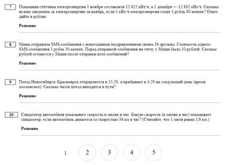

# Конспект по созданию сайта с использованием фреймворка Django.
## [Документация.](https://www.djangoproject.com/)
## **I. Установка Django и создание проекта.**
### **1. Создание нового проекта.**
1) Открываем консоль, проверяем работоспособность интерпретатора Python командой:
```bash
python3 --version или python3 -V
```
2) Далее переходим в нужную папку, где у нас будет храниться проект, создаём там виртуальное окружение командой:
```bash
python3 -m venv <название_виртуального_окружения>
```
3) Далее запускаем виртуальное окружение командой:
```bash
source <папка_проекта>/bin/activate
```
В результате должна появиться надпись (venv - или название нашего виртуального окружения, если название отлично от стандартного), означающая, что мы находимся в виртуальном окружении с именем djvenv. Если теперь выполнить команду:
```bash
pip3 list
```
то увидим всего два пакета: сам pip и setuptools. То есть, это чистое виртуальное окружение, в котором два пакета и интерпретатор языка Python.

Сразу отмечу, чтобы выйти из виртуального окружения достаточно выполнить команду:
```bash
deactivate
```
и мы возвращаемся в глобальное окружение.
4) Все дальнейшие действия будут проходить в PyCharm. Открываем папку нашего проекта. Указываем интерпретатор из установленного окружения. 
5) Далее, находясь в корневой папке проекта, мы должны выполнить непосредственно установку Django с помощью очевидной команды:
```bash
pip3 install django==4.2.1
```
Следом мы можем проверить установку Django, выполнив команду:
```bash
pip3 list
```
Мы ожидаем увидеть указанную версию Django и несколько пакетов, необходимых для его работы. 
6) Но это лишь ядро фреймворка с общим функционалом. Используя это ядро, мы можем создавать множество разных сайтов под управлением Django в рамках текущего виртуального окружения. Чтобы посмотреть список команд ядра, достаточно в терминале записать:
```bash
django-admin
```
7) Для создания сайта потребуется команда startproject, которая записывается так:
```bash
django-admin startproject <имя_проекта>
```
Здесь имя проекта обычно является доменным именем.
8) В итоге фреймворк создал папку с именем проекта (у меня sitewomen) в рабочей папке проекта. Внутри этой папки имеется одноимённая вложенная папка пакета, который определяет конфигурацию сайта. Поэтому его часто так и называют - пакетом конфигурации. Также есть ещё один отдельный файл manage.py, через который и производится управление данным сайтом. Например, мы будем создавать приложение, выполнять миграции БД, запускать тестовый веб-сервер и так далее. В действительности это всего лишь своеобразная утилита, посредник, который передаёт наши команды django-admin и выполняет их "от лица" нашего сайта.
9) Запустим тестовый веб-сервер и убедимся, что созданный сайт работает. Переходим в папку sitewomen:
```bash
cd sitewomen
```
и выполним файл manage.py с командой runserver:
```bash
python3 manage.py runserver
```
Чтобы остановить работу сервера, требуется нажать комбинацию клавиш control+C.

Также запуск сервера можно менять под нужные параметры:
```bash
python3 manage.py runserver <порт>
```
или
```bash
python3 manage.py runserver <IP_адресс>:<порт>
```
### **2. Модель MTV. Добавление первого приложения.**
#### **Модель MTV.**
Вначале, когда запрос приходит на фреймворк, он пропускается через блок маршрутизации:


Здесь фиксируется тип URL-адреса и в списке шаблонов предопределённых адресов ищется первое совпадение. Например, пользователь вводит запрос:
```http request
http://127.0.0.1:8000/
```
Это есть не что иное, как главная страница сайта, фактически пустой запрос без параметров.

Следующий запрос:
```http request
http://127.0.0.1:8000/category/1/
```
Соответствует шаблону:
```http request
category/<число>
```
Это уже другой маршрут. 

Или такой запрос:
```http request
http://127.0.0.1:8000/women/madonna/
```
с шаблоном:
```http request
women/<слаг (строчка)>
```
И так далее. У нас может быть прописано множество типов URL-адресов и каждый шаблон связан со своим обработчиком - представлением (иногда его ещё называют контроллером). Если текущий запрос от пользователя не совпал ни с одним предопределённым URL, то возвращается код ошибки 404 - страница не найдена. 

Предположим, что маршрутизатор нашёл совпадение. Далее активизируется представление, связанное с найденным типом URL-адреса. Представление - это функция или класс, который отвечает за формирование ответа на соответствующий запрос. Как правило, ответом является HTML-страница. Эта страница затем возвращается клиенту, и он видит её в браузере. Так вот, чтобы представление могло сформировать страницу, в общем случае, требуются данные (информация) плюс шаблоны, в которые эти данные упаковываются. Например, приходит запрос на вывод с страницы о Мадонне:
```http request
http://127.0.0.1:8000/women/madonna/
```
срабатывает соответствующее представление, которое берёт шаблон информационной страницы и наполняет её данными об этой певице, хранящимися в БД:


На выходе получаем сформированную HTML-страницу, которая и возвращается пользователю. Вот такое разделение на данные (model), шаблоны (templates) и представления (views) представляет собой общеизвестный паттерн MTV, то есть, разделение данных и HTML-шаблонов. Техника довольно эффективна и удобна, так как позволяет независимо наполнять БД информацией и параллельно разрабатывать или изменять функционал сайта. Кроме того здесь легче находить ошибки, в отличие от подхода, когда в одном скрипте присутствует и подключение к БД и оперирование шаблонами. Методика «разделяй и властвуй» очень хорошо себя зарекомендовала в мире программирования и довольно часто используется в том или ином виде.
#### **Добавление первого приложения.**
Согласно философии Django мы должны создать новое приложение в рамках нашего сайта. Что это за приложение и зачем оно вообще нужно? Разработчики фреймворка решили, что каждая самостоятельная часть сайта должна представляться в виде своего отдельного приложения. Например, создавая информационный сайт, мы должны будем определить приложение для отображения страниц этого сайта по определенным запросам. Далее, к нам приходит руководитель проекта и сообщает, что еще нужно реализовать форум на сайте. И так как это функционально независимая часть сайта, то мы создаем еще одно приложение для форума. Затем руководитель вспомнил, что еще нужно сделать раздел с опросом пользователей по разным тематикам. И на сайте появляется еще одно приложение – для опроса. И так далее. Каждая логически и функционально независимая часть сайта предполагает его реализацию в виде отдельного приложения:


Приложения в Django следует реализовывать максимально независимыми, в идеале – полностью независимыми, чтобы в дальнейшем мы могли их просто скопировать в другой сайт и там оно сразу же начинало бы работать. Это не всегда удается, но к этому нужно стремиться.

Итак, давайте создадим в нашем сайте первое приложение, которое возьмет на себя базовый функционал, то есть, оно и будет являться ядром нашего сайта. 
1) Для этого открыв терминал и находясь в каталоге django/sitewomen, выполним команду:
```bash
python3 manage.py startapp women
```
Здесь startapp – команда для создания нового приложения; women – название приложения. Название может быть любым (мы его придумываем сами), но так, чтобы оно отражало суть своего функционала. В данном случае приложение women (женщины) будет формировать станицы сайта об известных женщинах из разных областей жизни: кино, спорт, музыка, политика.

После выполнения команды у нас в проекте появилась еще одна папка – women, которая уже содержит несколько файлов, в том числе, и файл __init__.py. Следовательно, приложение в Django реализуется как пакет языка Python. Также здесь присутствует одна вложенная папка migrations для хранения миграций БД нашего приложения. Подробнее о ней мы поговорим позже. 

Остальные файлы имеют следующее назначение:
- admin.py – для настройки админ-панели сайта (админ-панель поставляется совместно с Django и каждый сайт может сразу ее использовать);
- apps.py – для настройки (конфигурирования) текущего приложения;
- models.py – для хранения ORM-моделей для представления данных из базы данных;
- tests.py – модуль с тестирующими процедурами;
- views.py – для хранения представлений (контроллеров) текущего приложения.

2) После создания приложения его необходимо зарегистрировать в проекте нашего сайта, чтобы фреймворк Django «знал» о его существовании и корректно с ним работал. Для этого нужно перейти в пакет конфигурации сайта (sitewomen), открыть файл settings.py и в списке INSTALLED_APPS прописать новое приложение. В нем уже прописаны несколько стандартных приложений самого фреймворка и к ним мы просто добавим свое:
```python
# sitewomen/settings.py
INSTALLED_APPS = [
    ...
    'women',
]
```
По идее этого вполне достаточно и все будет работать, но в действительности Django обращаясь к этому пакету находит файл apps.py, откуда и берет настройки приложения из класса WomenConfig. Чтобы в дальнейшем каждый раз не конкретизировать этот путь, следует прописать его сразу в списке приложений:
```python
# sitewomen/settings.py
INSTALLED_APPS = [
    ...
    'women.apps.WomenConfig',
]
```
На этом первое (основное) приложение сайта создано.
### **3. Маршрутизация и функции представления.**
Теперь следует написать функции представления и добавить путь к этим функциям. Начнём с функции представления для стартовой страницы:
```python
# women/views.py
def index(request):
    return HttpResponse('Страница приложения women.')
```
Здесь указывается первый обязательный параметр request - это ссылка на экземпляр класса HttpRequest, который содержит информацию о запросе, сессии, куках и так далее. То есть через переменную request нам доступна вся возможная информация в рамках текущего запроса. На выходе эта функция возвращает экземпляр объекта HttpResponse, который будет автоматически формировать нужный заголовок ответа, а содержимое будет представлено простой строкой. 

Теперь нам требуется связать представления с соответствующим URL-адресом. Для этого в пакете конфигурации **_sitewomen_** откроем файл **_urls.py_** и в список адресов urlpatterns добавим новый путь с помощью специальной функции path:
```python
# sitewomen/urls.py
urlpatterns = [
    path('admin/', admin.site.urls),
    path('women/', index),
]
```
Здесь первый параметр - это суффикс URL-адреса, то есть часть URL-адреса, которая добавляется после доменного имени (при этом в конце принято указывать слэш). Например, если сайт располагается по адресу:
```http request
http://127.0.01:8000
```
то первый аргумента 'women/' добавляется в конце этого пути:
```http request
http://127.0.01:8000/women/
```
Именно такой адрес мы сейчас и определяем. Второй аргумент - это ссылка на функцию представления, которая будет автоматически вызываться при срабатывании указанного URL-адреса и возвращать ответ на клиентский запрос. В нашем примере ответ формируется в виде экземпляра класса HttpResponse.

Далее следует импортировать функцию index, чтобы она была доступна в пакете конфигурации:
```python
# sitewomen/urls.py
from women.views import index
```
Если IDE здесь указывает ошибку, то это потому, что рабочим каталогом следует указать проект sitewomen. 

Проверим работоспособность нового приложения и маршрута. Запустим тестовый веб-сервер:
```bash
python3 manage.py runserver
```
И откроем страницу:
```http request
http://127.0.0.1:8000/women/
```
В рамках этого приложения мы можем определять сколько угодно таких функций, связанных с разными URL-адресами. Например, пропишем ещё одну функцию для отображения списка статей по рубрикам:
```python
# women/views.py
def categories(request):
    return HttpResponse('<h1>Статьи по категориям</h1>')
```
Мы здесь используем тег h1, чтобы браузер отобразил эту строку как заголовок первого уровня. Затем добавляем ещё один путь в список urlpatterns:
```python
# sitewomen/urls.py
urlpatterns = [
    path('admin/', admin.site.urls),
    path('women/', views.index),
    path('cats/', views.categories),
]
```
и делаем импорт всех нудных приложений:
```python
# sitewomen/urls.py
from women import views
```
Теперь имеем новый адрес:
```http request
http://127.0.0.1:8000/cats/
```
по которому отображается заголовок первого уровня. По аналогии мы можем добавлять самые разные URL в наш сайт. 

Однако такой подход, когда маршруты приложения прописываются в пакете конфигурации, нарушает принцип независимости приложений. Для решения данной проблемы Django позволяет вторым аргументом передать вместо функции представления список адресов и связанные с ними функции. Для этого импортируем специальную функцию include:
```python
# sitewomen/urls.py
from django.urls import path, include
```
А затем в списке маршрутов с её помощью подключим список URL уже из нашего приложения women:
```python
# sitewomen/urls.py
urlpatterns = [
    path('admin/', admin.site.urls),
    path('women/', include('women.urls')),
]
```
Мы здесь в качестве параметра указываем строку, в которой сначала записываем имя приложения и через точку файл urls, где будут прописаны маршруты приложения women. Далее всё просто: добавляем в приложение **_women_** новый файл **_urls.py_** и в нём формируем новый список urlpatterns:
```python
# women/urls.py
from django.urls import path
from . import views
 
urlpatterns = [
    path('', views.index),
]
```
Здесь мы. во-первых, импортируем функцию path, которая и связывает URL с функциями представления, и, во-вторых, импортируем модуль views текущего пакета. Далее в списке urlpatterns вызываем функцию path, первым аргументом указываем пустую строку, а вторым аргументом функцию index. Т.к. в основном пакете конфигурации у нас указано, что к адресам 'women.urls' следует добавлять суффикс women/, то функция представления index будет соответствовать адресу:
```http request
http://127.0.0.1:8000/women/
```
Если же добавить адрес cats/:
```python
# women/urls.py
from django.urls import path
from . import views
 
urlpatterns = [
    path('', views.index),
    path('cats/', views.categories),
]
```
То функция представления categories будет соответствовать адресу:
```http request
http://127.0.0.1:8000/women/cats/
```
Таким образом, достаточно просто мы получили относительную независимость нашего приложения women от основного проекта сайта.
### **4. Отладка проекта Django в PyCharm.**
Мы уже умеем создавать простейшее приложение на Django и наблюдать его работу с использованием тестового веб-сервера. Но, прежде чем идти дальше, было бы еще хорошо научиться отлаживать непосредственно и программный код, т.е. запускать программу в режиме отладки. Если в PyCharm мы сделаем это стандартными средствами, поставим точку останова и запустим программу в режиме отладки, то получим ошибку, так как проект Django следует исполнять командой:
```bash
python3 manage.py runserver
```
И эта команда по умолчанию не запускает наши скрипты в debug-режиме. Чтобы это поправить, необходимо создать свой файл конфигурации. Для этого необходимо кликнуть в PyCharm на кнопку «Add Configurations…» или «Edit Configurations…»:


В появившемся окне нажмите «+», выберите Python и затем, заполните следующие поля:
- name: sitewomen
- Working directory: D:\Python\Projects\django\sitewomen (увидим версию интерпретатора языка Python)
- Script path: D:\Python\Projects\django\sitewomen\manage.py
- Parameters: runserver


После этого запускаем через Debug проект Django и, как видим, имеем возможность останавливаться в выставленных точках отладки.

Обратите внимание, что перед запуском новой конфигурации отладочный веб-сервер должен быть остановлен. Дело в том, что один порт может быть занят только одной программой, поэтому если сервер ранее уже был запущен стандартным способом, то pycharm в режиме отладки не будет останавливаться в точках останова.
### **5. Динамические URL. Пользовательские конвертеры.**
Сейчас в нашем проекте маршруты приложения women подключаются с помощью функции include:
```python
# sitewomen/urls.py
urlpatterns = [
    path('admin/', admin.site.urls),
    path('', include('women.urls')),
]
```
Соответственно, за главную страницу отвечает функция представления index, а за вывод разделов - функция categories. Но у нас может быть множество категорий и хотелось бы, например, их отображать с помощью таких URL:
```http request
http://127.0.0.1:8000/cats/1/

http://127.0.0.1:8000/cats/2/

http://127.0.0.1:8000/cats/3/

...
```
Для того, чтобы прописать такой шаблон в Django, в списке адресов приложения следует указать числовой параметр:
```python
# women/urls.py
urlpatterns = [
    path('', views.index),
    path('cats/<int:cat_id>/', views.categories),
]
```
В угловых скобках записан параметр cat_id, который имеет тип int - целочисленный. Этот тип в маршрутах называется конвертером. И указанный путь будет соответствовать любым комбинациям URL с фрагментом "cats/число/". Далее в функции представления categories мы уже можем использовать этот параметр:
```python
# women/views.py
def categories(request, cat_id):
    return HttpResponse(f"<h1>Статьи по категориям</h1><p >id:{cat_id}</p>")
```
Помимо конвертера int в Django можно использовать и другие. Вот список всех [стандартных конвертеров](https://docs.djangoproject.com/en/4.2/topics/http/urls/):
- str – любая не пустая строка, исключая символ ‘/’;
- int – любое положительное целое число, включая 0;
- slug – слаг, то есть, латиница ASCII таблицы, цифры, символы дефиса и подчеркивания;
- uuid – цифры, малые латинские символы ASCII, дефис;
- path – любая не пустая строка, включая символ ‘/’.

Добавим ещё один маршрут для доступа к категориям через слаг:
```python
# women/urls.py
urlpatterns = [
    ...
    path('cats/slug:cat_slug/', views.categories_by_slug),
```
Добавим функцию представления:
```python
# women/views.py
def categories_by_slug(request, cat_slug):
    return HttpResponse(f"<h1>Статьи по категориям</h1><p >slug:{ cat_slug }</p>")
```
И теперь в качестве категории можно указывать не только числа, но и строки в виде слага:
```http request
http://127.0.0.1:8000/cats/3/

http://127.0.0.1:8000/cats/sport/

http://127.0.0.1:8000/cats/music/

http://127.0.0.1:8000/cats/sport-4-me/

...
```
Слаги понятнее для пользователя и поисковых систем. Сайты с такими URL, в среднем, лучше индексируются и занимают более высокие позиции в поисковой выдаче. Причем, когда передается число, то отрабатывает первый маршрут из URL с числовым конвертером, если же числовой шаблон не подходит, то проверяется следующий со слагом. И здесь очень важен порядок. Если поменять и записать сначала конвертер со слагом, а затем, с числом:
```python
# women/urls.py
urlpatterns = [
    path('', views.index),
    path('cats/<slug:cat_slug>/', views.categories_by_slug),
    path('cats/<int:cat_id>/', views.categories),
]
```
то всегда будет отрабатывать слаг, т.к. число - это частный случай слага. На это следует обращать особое внимание: сначала следует прописывать частные конвертеры, а затем более общие.

Если по каким-то причинам представленных типов URL недостаточно, то в Django имеется функция re_path, которая делает всё то же самое, но с использованием регулярных выражений. Например, определим URL, в котором можно указывать год в виде четырёх чисел:
```python
# women/urls.py
urlpatterns = [
    ...
    re_path(r'^archive/(?P<year>[0-9]{4})/', views.archive),
]
```
Здесь year - это имя переменной, которая будет содержать введённый год. 

Добавим функцию представления archive:
```python
# women/views.py
def archive(request, year):
    return HttpResponse(f"<h1>Архив по годам</h1><p >{year}</p>")
```
И теперь мы можем обращаться к этому URL, указывая ровно 4 цифры:
```http request
http://127.0.0.1:8000/arcgive/2020/
```
Если же указать меньше или больше чисел, то шаблон URL не совпадёт и возникнет исключение 404 - страница не найдена.
#### **Создание собственных конвертеров.**
Фреймворк Django позволяет создавать свои собственные конвертеры, используемые при анализе URL-адресов. Например, вместо того, чтобы использовать функцию re_path с регулярным выражением, [мы можем создать конвертер](https://docs.djangoproject.com/en/4.2/topics/http/urls/), который бы выделял и проверял год в URL-адресе.

В частности, в разделе «Registering custom path converters» приведён пример класса FourDigitYearConverter с регулярным выражением для выделения 4 цифр:
```python
# women/converters.py
class FourDigitYearConverter:
    regex = "[0-9]{4}"
 
    def to_python(self, value):
        return int(value)
 
    def to_url(self, value):
        return "%04d" % value
```
В классе есть 2 метода:
- to_python - для преобразования фрагмента URL в требуемый тип данных;
- to_url - для преобразования параметра в формат, требуемый для представлений в URL.

Далее в файле urls.py приложения women зарегистрируем этот конвертер с именем year4 для использования в URL-шаблонах:
```python
# women/urls.py
register_converter(converters.FourDigitYearConverter, "year4")
```
Далее в коллекции urlpatterns этого же файла вместо функции re_path следует прописать:
```python
# women/urls.py
urlpatterns = [
    ...
    path('archive/<year4:year>/', views.archive),
]
```
При этом параметр year будет автоматически преобразован в целое число благодаря методу to_python класса FourDigitYearConverter. В этом легко убедиться, поставив точку останова в функции представления archive и запустив Django в режиме отладки.
### **6. GET- и POST-запросы. Обработчики исключений запросов.**
Структура URL-адреса может содержать дополнительные параметры в GET-запросах. Например, вот так:
```http request
http://127.0.0.1:8000/?name=Gagarina&cat=music

или

http://127.0.0.1:8000/cats/music/?name=Gagarina&type=pop
```
И так далее. Здесь у нас идет специальный стартовый символ – знак вопроса, после которого через амперсанд перечисляются различные параметры в виде пар ключ-значение. Так, через адресную строку можно передавать произвольные данные на сервер в виде таких GET-запросов.

Следующий вопрос, как можно выделять эти значения и обрабатывать их на стороне сервера в функциях представления? Для этого, как раз и существует параметр request – ссылка на объект HttpRequest. Через него мы можем обратиться к специальному словарю:
```python
request.GET
```
где и хранятся все эти данные.

Поправим функцию представления categories_by_slug для отображения словаря GET в консоль:
```python
# women/views.py
def categories_by_slug(request, cat_slug):
    print(request.GET)
    return HttpResponse(f"<h1>Статьи по категориям</h1><p >slug: {cat_slug}</p>")
```
И выполним, например, такой запрос:
```http request
http://127.0.0.1:8000/cats/music/?name=Gagarina&type=pop
```
В консоли увидим значения:
```bash
<QueryDict: {'name': ['Gagarina'], 'type': ['pop']}>
```
Или, можем сначала проверить: есть ли в словаре какие-либо данные и только потом выводить их в консоль:
```python
# women/views.py
def categories_by_slug(request, cat_slug):
    if request.GET:
        print(request.GET)
 
    return HttpResponse(f"<h1>Статьи по категориям</h1><p >slug: {cat_slug}</p>")
```
Помимо GET-запросов в веб-программировании часто используются и POST-запросы. Они, обычно, связаны с передачей данных из форм и позже мы их тоже будем использовать. Здесь же я просто отмечу, что в этом случае вместо коллекции GET используется коллекция POST, а все остальное остается без изменений:
```python
# women/views.py
def categories_by_slug(request, cat_slug):
    if request.POST:
        print(request.POST)
 
    return HttpResponse(f"<h1>Статьи по категориям</h1>slug: {cat_slug}</p>")
```
#### **Обработка исключений при запросах к серверу.**
Следующий важный аспект – это обработка исключений при запросах к серверу. Самым распространенным из них является обращение к несуществующей странице, когда сервер возвращает страницу с кодом 404. Например, если для нашего сайта указать путь:
```http request
http://127.0.0.1:8000/aaa
```
то мы увидим исключение 404 – страница не найдена. Такую информацию мы видим исключительно в процессе отладки нашего сайта, когда глобальная константа DEBUG в пакете конфигурации (файл settings.py) установлена в True.

Давайте посмотрим, что произойдет, если временно перевести ее в значение False. Перейдем в пакет конфигурации, откроем файл settings.py, найдем константу DEBUG и присвоим ей значение False. При запуске тестового сервера у нас возникнет ошибка, что мы должны указать разрешенные хосты. Так как мы сейчас используем хост 127.0.0.1, то его в виде строки и укажем:
```python
# sitewomen/settings.py
DEBUG = False

ALLOWED_HOSTS = ['127.0.0.1']
```
Теперь сервер успешно запустился и при обновлении страницы мы уже видим более дружественную страницу без лишней отладочной информации. Но как нам ее поправить, чтобы отобразить более понятную информацию? Для этого в файле urls.py пакета конфигурации можно переопределить обработчик исключения 404. Для этого ему достаточно присвоить ссылку на функцию, которая и будет формировать ответ для отсутствующих страниц, например, так:
```python
# sitewomen/urls.py
handler404 = page_not_found
```
Мы здесь передаем ссылку на функцию page_not_found, а саму функцию определим в приложении women:
```python
# women/views.py
def page_not_found(request, exception):
    return HttpResponseNotFound('<h1>Страница не найдена</h1>')
```
Обратите внимание, функция принимает два аргумента и возвращает ответ в виде экземпляра класса HttpResponseNotFound, которому передается HTML-страница, отображаемая при неверных запросах. Если теперь мы обновим страницу, то увидим заголовок «Страница не найдена».

В дальнейшем мы увидим, как вместо строки можно возвращать шаблон страницы 404. Сейчас главное понять принцип работы механизма обработки исключений.

Итак, мы предполагаем, что функция page_not_found будет вызываться всякий раз при возникновении исключения 404. И это важный момент. Смотрите, если в какой-либо другой функции представления сгенерировать это исключение, то будет автоматическое перенаправление на функцию page_not_found и пользователь увидит все ту же страницу 404. Например, в функции archive мы сделаем проверку:
```python
# women/views.py
def archive(request, year):
    if year > 2023:
        raise Http404()
 
    return HttpResponse(f"<h1>Архив по годам</h1><p >{year}</p>")
```
Если год больше 2023-го, то генерируется исключение 404 как экземпляр класса Http404 и выполняется перенаправление на функцию page_not_found. Это нам позволяет описывать логику отображения неверных запросов в одном месте программы – в функции page_not_found.

Аналогичным образом можно переопределять [обработчики других исключений](https://docs.djangoproject.com/en/4.2/ref/urls/), например:
- handler500 – ошибка сервера;
- handler403 – доступ запрещен;
- handler400 – невозможно обработать запрос.

Но все они работают в боевом режиме при DEBUG = False. При отладке мы увидим расширенную служебную информацию, помогающую исправлять ошибки при разработке сайта.
### **7. Перенаправления (redirect). Функция reverse.**
Мы продолжаем тему маршрутизации. Очень часто при развитии сайта некоторые его страницы переносятся на другой URL-адрес. И чтобы не потерять позиции этих страниц в поисковой выдаче, поисковым системам нужно явно указать, что страница перемещена либо временно, либо постоянно на новый URL. Это делается с помощью перенаправлений с кодами:
- 301 – страница перемещена на другой постоянный URL-адрес;
- 302 – страница перемещена временно на другой URL-адрес.

#### **Функция redirect.**
В Django подобные редиректы достаточно просто выполняются с помощью функции:
```python
django.shortcuts.redirect
```
Давайте для примера сделаем перенаправление со страницы архива, если год больше 2023:
```python
# women/views.py
def archive(request, year):
    if year > 2023:
        return redirect('/')
 
    return HttpResponse(f"<h1>Архив по годам</h1><p >{year}</p>")
```
Здесь в качестве первого параметра указывается страница, на которую происходит перенаправление, в данном случае – это главная страница сайта. Также в файле settings.py вернем прежнее значение параметра DEBUG:
```python
# sitewomen/settings.py
DEBUG = True
```
Если теперь выполнить запрос:
```http request
http://127.0.0.1:8000/archive/2024/
```
то мы попадем на главную страницу с кодом перенаправления 302 (см. консоль). Если же нам нужно указать постоянный редирект с кодом 301, то записывается дополнительный параметр:
```python
# women/views.py
def archive(request, year):
    ...
    return redirect('/', permanent=True)
    ...
```
Вообще в качестве первого аргумента функции redirect() можно передавать не только конкретный URL, но и представление. В частности, вместо '/' можно передать ссылку на функцию index следующим образом:
```python
# women/views.py
def archive(request, year):
    ...
    return redirect(index, permanent=True)
    ...
```
#### **Классы HttpResponseRedirect и HttpResponsePermanentRedirect.**
Фреймворк Django дополнительно поддерживает классы для выполнения перенаправлений. В частности имеются два класса:
- HttpResponseRedirect – для редиректа с кодом 302;
- HttpResponsePermanentRedirect – для редиректа с кодом 301.

которые можно использовать вместо функции redirect() следующим образом:
```python
# women/views.py
def archive(request, year):
    if year > 2023:
        return HttpResponseRedirect('/')
 
    return HttpResponse(f"<h1>Архив по годам</h1><p >{year}</p>")
```
На самом деле функция redirect() использует в своей работе эти классы, но, вместе с тем, она несколько более гибкая. Поэтому какой вариант выбирать решает сам программист, исходя из логики построения кода.
#### **Параметр name функции path.**
Однако указывать в функции redirect, да и вообще где бы то ни было в приложении конкретный URL-адрес (кроме их списка в коллекции urlpatterns) – это порочная практика, или, как еще говорят – хардкодинг. Вместо этого каждому шаблону пути можно присвоить свое уникальное имя и использовать его в рамках всего проекта.

Давайте определим имена для наших URL-запросов. Для этого перейдем в файл women/urls.py и в каждой функции path пропишем параметр name с уникальными именами:
```python
# women/urls.py
urlpatterns = [
    path('', index, name='home'),
    path('cats/<int:cat_id>/', categories, name='cats_id'), 
    path('cats/<slug:cat_slug>/', categories_by_slug, name='cats'),
    path('archive/<year4:year>/', archive, name='archive'),
]
```
Конечно, эти имена вы можете выбрать и другие – это лишь пример. И далее, в функции redirect мы можем выполнить перенаправление на главную страницу, указав имя home:
```python
# women/views.py
def archive(request, year):
    ...
    return redirect('home', permanent=True)
    ...
```
Как видите, это гораздо понятнее и безопаснее использования конкретных URL-адресов. Если в дальнейшем маршрут изменится, то автоматически изменится и адрес перенаправления для home.
#### **Функция reverse.**
Если же маршрут помимо имени содержит еще параметры, как например, маршрут ‘cats’ с параметром slug, то для корректного перенаправления необходимо в функции redirect() вторым и последующими аргументами передать требуемые параметры. В нашем случае это можно сделать так:
```python
# women/views.py
def archive(request, year):
    ...
    return redirect('cats', 'music')
    ...
```
В результате, функция redirect() вычислит следующий URL:
```http request
http://127.0.0.1:8000/cats/music/
```
и сделает на него перенаправление.

Но мы можем разделить операции вычисления URL и непосредственно перенаправление. Для этого в Django имеется функция:
```python
django.urls.reverse
```
которая возвращает строку URL-адреса, вычисленный на основе переданного имени и набора аргументов. Например, для вычисления адреса маршрута cats с параметром ‘music’ функцию reverse() можно вызвать следующим образом:
```python
# women/views.py
def archive(request, year):
    ...
    url_redirect = reverse('cats', args=('music', ))
    return redirect(url_redirect)  # Или можно вернуть соответствующим классом: HttpResponsePermanentRedirect(url_redirect)
    ...
```
## II. Шаблоны.
### **8. Шаблоны, начало. Функции render() и render_to_string().**
Если мы откроем наш проект и запустим тестовый веб-сервер, то на главной странице увидим отображение одной короткой строчки. Как вы понимаете, полноценная HTML-страница содержит гораздо больше информации, в том числе, заголовок и подключаемые статические файлы. Конечно, если решать эту задачу «в лоб», то можно было бы написать в функции представления что-то вроде:
```python
# women/views.py
def index(request):
    return HttpResponse('''<!DOCTYPE html>
<html>
<head>
         <title></title>
</head>
<body>
 
</body>
</html>''')
```
Но во что тогда превратится программа! Ее будет сложно читать, исправлять и, кроме того, изменение HTML-страницы повлечет изменение и самого приложения. Это полное безумие! Поэтому неудивительно, что все это выносится за пределы приложения и организуется в виде шаблонов HTML-страниц.

Итак, предположим, что в качестве главной страницы мы бы хотели отобразить некоторый шаблон с именем index.html. Для этого, вначале нам нужно импортировать функции, через которые запускается встроенный в Django шаблонизатор. В самом простом варианте можно использовать функцию:
```python
from django.template.loader import render_to_string
```
которая загружает шаблон из файла, обрабатывает его и выдает результат в виде строки. Например, это можно сделать так:
```python
# women/views.py
def index(request):
    t = render_to_string('путь к шаблону index.html')
    return HttpResponse(t)
```
И здесь мы подошли ко второму важному вопросу: где должны располагаться шаблоны текущего приложения Women? По умолчанию, Django ищет шаблоны в подкаталоге templates нашего приложения. Создадим его. По идее, мы можем располагать здесь наши файлы шаблонов и все должно работать. Но есть один важный нюанс. В каком-либо другом приложении также может оказаться файл с именем index.html. Тогда фреймворк Django будет использовать тот, что встретится первым. Чтобы этого не происходило, в templates приложения принято создавать еще один подкаталог с именем приложения. В нашем случае – women. И уже в него помещать файлы шаблонов. Тогда все наши файлы шаблонов будут отделяться от других дополнительным подкаталогом и это позволит избежать коллизий имен файлов.

Итак, создадим в подкаталоге templates/women файл index.html с содержимым:
```html
<!-- index.html -->
<!DOCTYPE html>
<head>
    <meta charset="UTF-8">
    <title>Главная страница</title>
</head>
<body>
<h1>Главная страница</h1>
</body>
</html>
```
Это будет наш первый простейший шаблон, представляющий главную страницу сайта. И, далее, в функции render укажем путь к этому шаблону:
```python
# women/views.py
def index(request):
    t = render_to_string('women/index.html')
    return HttpResponse(t)
```
Все, при обновлении главной страницы в браузере, мы увидим этот шаблон. Как видите все достаточно просто и удобно. Но можно сделать еще лучше и воспользоваться функцией:
```python
from django.shortcuts import render
```
которая объединяет в себе рендер шаблона и формирование ответа сервера. В результате функция представления index() может быть записана так:
```python
# women/views.py
def index(request):
    return render(request, 'women/index.html')
```
Обратите внимание, для корректного отображения кириллицы все шаблоны рекомендуется сохранять в кодировке utf-8. Тем более что сам Python, начиная с версии 3, по умолчанию использует юникод.

Давайте для примера добавим еще одну страницу и один шаблон на наш сайт – страницу «О сайте». Пропишем следующие пути (в women/urls.py):
```python
# women/urls.py
urlpatterns = [
    path('', index, name='home'),
    path('about/', about, name='about'),
    ...
]
```
И функцию about в файле women/views.py:
```python
# women/views.py
def about(request):
    return render(request, 'women/about.html')
```
Добавим шаблон about.html:
```html
<!-- about.html -->
<!DOCTYPE html>
<head>
    <meta charset="UTF-8">
    <title>О сайте</title>
</head>
<body>
<h1>О сайте</h1>
</body>
</html>
```
И при переходе по адресу:
```http request
http://127.0.0.1:8000/about/
```
этот шаблон будет отображён.
#### **Настройки шаблонизатора.**
При работе функций render_to_string() и render() фреймворк Django использует шаблонизатор, указанный в параметре TEMPLATES файла settings.py пакета конфигурации. В частности мы там видим строчку 'BACKEND': 'django.template.backends.django.DjangoTemplates', означающую, что используется встроенный шаблонизатор Django. Кроме того здесь есть параметры DIRS и APP_DIRS. Параметр DIRS позволяет прописывать нестандартные пути к файлам шаблонов, а APP_DIRS со значением True указывает шаблонизатору Django искать шаблоны также и внутри приложений. Причем, шаблоны сначала ищутся по коллекции DIRS, а затем уже в приложениях. В частности, благодаря этому параметру успешно обнаруживаются наши шаблоны index.html и about.html внутри приложения women.

Вот сама коллекция:
```python
# sitewomen/settings.py
TEMPLATES = [
    {
        'BACKEND': 'django.template.backends.django.DjangoTemplates',  # Стандартный шаблонизатор Django.
        'DIRS': [],  # Этот параметр позволяет описывать нестандартные пути к файлам-шаблонам.
        'APP_DIRS': True,  # Параметр говорит о том, что внутри приложения надо искать подкаталоги стандартном каталоге templates.
        'OPTIONS': {
            'context_processors': [
                'django.template.context_processors.debug',
                'django.template.context_processors.request',
                'django.contrib.auth.context_processors.auth',
                'django.contrib.messages.context_processors.messages',
            ],
        },
    },
]
```
Важно заметить: если установить параметр APP_DIRS в значение False, то при запуске проекта и перехода на главную страницу:
```http request
http://127.0.0.1:8000
```
появится ошибка:
```http request
TemplateDoesNotExist at /
```
говорящая, что шаблон не был найден. Возвращая значение параметра APP_DIRS в True ошибка пропадает.

Обратите внимание, чтобы шаблоны нашего приложения успешно обнаруживались фреймворком Django, приложение должно быть прописано в коллекции INSTALLED_APPS. Если мы его оттуда уберем, то снова возникнет прежняя ошибка. Кстати, ради интереса мы можем ее исправить, добавив абсолютный путь в коллекцию DIRS параметра TEMPLATES. Сделать это можно следующим образом:
```python
# sitewomen/settings.py
TEMPLATES = [
    {
        'BACKEND': 'django.template.backends.django.DjangoTemplates',
        'DIRS': [
            BASE_DIR / 'women' / 'templates'
        ],
        'APP_DIRS': True,
    ...
    },
]
```
Мы здесь воспользовались переменной BASE_DIR, которая хранит абсолютный путь к нашему проекту, и добавили подкаталоги women и templates к файлам шаблонов нашего приложения. Теперь, фреймворк Django без проблем найдет нужные файлы и отобразит на главной странице.

Однако для стандартных приложений так делать не стоит. Достаточно зарегистрировать приложение в коллекции INSTALLED_APPS и создать подкаталог templates для размещения файлов шаблонов. Это правильный стандартный подход.
### **9. Передача данных (переменных) в шаблоны.**
Если посмотреть на файлы index.html или about.html, то это просто текст, который загружается и отдается браузеру по соответствующему запросу. Все так, но в этих же файлах можно прописывать конструкции для отображения информации, например, из переменных или БД. Давайте для начала сделаем так, чтобы на каждой странице был свой заголовок, переданный ей через параметр title. Это можно сделать следующим образом. В файлах index.html и about.html укажем переменную title:
```html
<!-- index.html и about.html -->
<!DOCTYPE html>
<html>
<head>
    <title>{{ title }}</title>
</head>
<body>
<h1>{{ title }}</h1>
</body>
</html>
```
А в функциях представлений передать параметр title соответствующему шаблону. Делается это с помощью словарей. В нашем случае необходимо определить словарь с ключом title и значением, которое будет подставляться вместо этого ключа. Например, так:
```python
# women/views.py
def index(request):
    data = {'title': 'Главная страница'}
    return render(request, 'women/index.html', data)
```
При обновлении страницы увидим, что вместо {{title}} в шаблоне было подставлено значение ключа title словаря data. То есть, внутри шаблонов Django можно прописывать двойные фигурные скобки и указывать параметр (ключ), значение которого здесь будет подставлено.

Или, можно использовать более короткую форму:
```python
# women/views.py
def about(request):
    return render(request, 'women/about.html', {'title': 'О сайте'})
```
Тогда при переходе к странице:
```http request
http://127.0.0.1:8000/about/
```
увидим вместо {{title}} строку «О сайте». Вот в этом и есть роль шаблонов: они описывают структуру страницы, а ее наполнение происходит динамически в самой программе.

Конечно, можно выполнять передачу самых разных типов данных: чисел, строк, списков, кортежей, словарей, объектов классов и так далее. Давайте опишем главное меню сайта с помощью списка:
```python
# women/views.py
import ...
menu = ["О сайте", "Добавить статью", "Обратная связь", "Войти"]
...
```
А, затем, в функциях представления, мы можем передать его как параметр:
```python
# women/views.py
def index(request):
    data = {
        'title': 'Главная страница',
        'menu': menu,
    }
    return render(request, 'women/index.html', context=data)
```
Обратите внимание, я здесь передаю словарь data через именованный аргумент context. Это то же самое, что и просто третьим аргументом прописать data. Иногда в программах можно встретить и такую запись.

В самом простом варианте в шаблоне index.html отобразить такой список можно следующим образом:
```html
<!-- index.html -->
<!DOCTYPE html>
<html>
<head>
    <title>{{ title }}</title>
</head>
<body>
<p>{{ menu }}</p>
<h1>{{ title }}</h1>
</body>
</html>
```
Обновляем главную страницу и видим список из строк. Однако если мы попытаемся в шаблоне обратиться к элементу по индексу:
```html
...
<p>{{ menu[0] }}</p>
...
```
то получим ошибку:
```http request
TemplateSyntaxError at /
```
так как шаблонизатор Django не поддерживает такую операцию.

Давайте в шаблоне about.html также пропишем вывод параметра menu:
```html
<!-- about.html -->
...
<p>{{ menu }}</p>
...
```
Если теперь перейти по адресу:
```http request
http://127.0.0.1:8000/about/
```
то этого списка мы не увидим. Дело в том, что в функции представления about() передается только словарь с ключом title. Ключ menu отсутствует. Поэтому шаблонизатор не находит параметр menu и просто его игнорирует. Обратите внимание, именно игнорирует. Никаких ошибок при этом не возникает.

Давайте для примера передадим в шаблон index.html другие распространенные типы данных:
```python
# women/views.py
class MyClass:
    def __init__(self, a, b):
        self.a = a
        self.b = b
 
 
def index(request):
    data = {
        'title': 'Главная страница',
        'menu': menu,
        'float': 28.56,
        'lst': [1, 2, 'abc', True],
        'set': {1, 1, 2, 3, 2, 5},
        'dict': {'key_1': 'value_1', 'key_2': 'value_2'},
        'obj': MyClass(10, 20),
    }
   
 
    return render(request, 'women/index.html', context=data)
```
И выведем их в шаблоне index.html следующим образом:
```html
<!-- index.html -->
<!DOCTYPE html>
<html>
<head>
         <title>{{ title }}</title>
</head>
<body>
<p>{{ menu }}</p>
<p>{{ float }}</p>
<p>{{ lst }}</p>
<p>{{ set }}</p>
<p>{{ dict }}</p>
<p>{{ obj }}</p>
 
<h1>{{ title }}</h1>
</body>
</html>
```
При обновлении главной страницы увидим все переданные данные. Причем, к ключам словаря и к атрибутам класса можно обращаться через точку следующим образом:
```html
<!-- index.html -->
...
<p>{{ dict.key_1 }}</p>
<p>{{ obj.a }}</p>
...
```
Обратите внимание, что здесь используется оператор «точка» в том числе и у словарей. Прописывать квадратные скобки с указанием ключа недопустимо:
```html
<p>{{ dict['key_1'] }}</p>
```
получим ошибку.

Также следует иметь в виду, что каждый отображаемый параметр должен быть записан в отдельных двойных фигурных скобках. Прописывать несколько параметров нельзя. Например, следующая строчка приведет к ошибке:
```html
<p>{{ obj.a obj.b }}</p>
```
Правильно записывать так:
```html
<p>{{ obj.a }} {{ obj.b }}</p>
```
### **10. Стандартные шаблонные фильтры.**
Данные в шаблонах можно преобразовывать, используя так называемые [фильтры](https://docs.djangoproject.com/en/4.2/ref/templates/builtins/).

Это довольно распространенный и полезный инструмент при построении шаблонов. Давайте рассмотрим основные стандартные фильтры и посмотрим на их работу.

Воспользуемся сразу первым фильтром add из документации. Он позволяет прибавлять некоторое целочисленное значение к числовому параметру, например, так (в шаблоне index.html):
```html
<p>{{ float|add:"50" }}</p>
```
В результате вещественное значение float равное 28.56 будет преобразовано в целое число (с отбрасыванием дробной части) с прибавлением значения 50. Итоговое число 78 будет подставлено в шаблон.

То есть, для применения фильтра к тому или иному параметру, прописывается вертикальная черта, затем, имя фильтра и при необходимости, через двоеточие аргумент фильтра. Чаще всего аргумент записывается в кавычках. Это рекомендуемая практика, так как строка позволяет описывать как числа, так и более сложные данные.

Конечно, все фильтры мы рассматривать не будем, я затрону лишь некоторые. Остальные применяются очевидным образом. Конечно же, советую со всеми ними ознакомиться, чтобы не изобретать велосипед при проектировании шаблонов.

Итак, следующий фильтр capfirst преобразует первый символ строки в заглавную букву. Он записывается без аргументов следующим образом:
```html
<h1>{{ title|capfirst }}</h1>
```
Соответственно, строку в title мы запишем с малой буквы. После обновления главной страницы увидим заголовок 1-го уровня с заглавной буквы. Это, как раз результат применения фильтра.

Существуют похожие фильтры, переводящие все буквы в заглавные или, наоборот, в малые. Они следующие:
```html
<h1>{{ title|upper }}</h1>
<h1>{{ title|lower }}</h1>
```
Далее, фильтр cut позволяет удалять указанный строковый фрагмент из переменной в шаблоне. Например:
```html
<h1>{{ title|cut:" " }}</h1>
```
Удаляет все пробелы из строки title. Если требуется убрать разные символы, то фильтр cut можно повторить, записав его еще раз:
```html
<h1>{{ title|cut:" "|cut:"?" }}</h1>
```
Теперь, если из строки title удаляются и пробелы и символы вопросов. Это пример того, как можно по цепочке вызывать фильтры в шаблонах.

Следующий довольно распространенный фильтр default позволяет для ложных выражений подставлять значение по умолчанию. Например:
```html
<title>{{ main_title|default:"Без заголовка" }}</title>
```
Мы увидим строку «Без заголовка», так как параметр main_title отсутствует. То же самое будет, если переданная строка окажется пустой:
```python
data = {
        'title': 'главная страница',
        'main_title': '',
        ...
    }
```
Но, при наличии в ней хотя бы одного символа, увидим значение параметра main_title:
```python
data = {
        'title': 'главная страница',
        'main_title': 'title',
        ...
    }
```
Следующий фильтр divisibleby позволяет проверять на делимость одного числа на другое. Он возвращает значение True или False в зависимости от результата. В частности с его помощью можно выбирать числа кратные 2, 3 и так далее. Довольно полезная операция. Например:
```html
<p>{{ float|divisibleby:"2" }}</p>
```
Выдаст True, так как целое число 28 кратно 2. А вот если вместо 2 прописать 3, то получим значение False.

Следующая пара фильтров first и last позволяют выделять первый и последний элементы списка или кортежа. Например:
```html
<p>{{ menu|first }}</p>
<p>{{ menu|last }}</p>
```
Следующий довольно полезный фильтр join работает по аналогии с известным строковым методом join() следующим образом:
```html
<p>{{ menu|join:" | " }}</p>
```
Увидим в браузере строку:
```http request
О сайте | Добавить статью | Обратная связь | Войти
```
Фильтр length возвращает длину коллекции. Это аналог функции len():
```html
<p>{{ lst|length }}</p>
```
Есть довольно интересный фильтр slugify, который конвертирует строку в так называемый слаг – последовательность символов из малых латинских букв, цифр и дефиса. Слаги часто используют для формирования дружественных URL-адресов и об этом мы еще будем говорить. А здесь приведу лишь пример его использования:
```html
<p>{{ "The Main Page"|slugify }}</p>
```
Это были все самые основные фильтры.
#### **Использование фильтров в программе.**
Все эти фильтры можно использовать не только в шаблонах, но и непосредственно в программе на языке Python. Они расположены в модуле:
```python
django.template.defaultfilters
```
И, например, последним фильтром slugify можно было бы воспользоваться следующим образом:
```python
from django.template.defaultfilters import slugify
```
Затем, в словаре data вызвать эту функцию:
```python
data = {
    'title': 'главная страница',
    'main_title': 'title',
    'url': slugify("The main page"),
    ...
}
```
А в шаблоне index.html вывести параметр url:
```html
<p>{{ url }}</p>
```
Получим тот же самый эффект. То есть, у нас есть самый разный инструментарий и уже сам программист решает, как им воспользоваться, чтобы создать грамотный код разрабатываемого сайта.
### **11. Теги шаблонов. Теги if и for.**
Помимо фильтров, о которых мы говорили на прошлом занятии, в шаблонах фреймворка Django можно прописывать еще и [специальные теги](https://docs.djangoproject.com/en/4.2/ref/templates/builtins/):
```html

```
И чтобы было понятно, что из себя представляют шаблонные теги и для чего они нужны, рассмотрим на этом занятии два очень распространенных тега if и for. Начнем с тега for.

Давайте предположим, что у нас имеется список из данных по известным женщинам, например, такой:
```python
# women/views.py
import ...
data_db = [
    {'id': 1, 'title': 'Анджелина Джоли', 'content': 'Биография Анджелины Джоли', 'is_published': True},
    {'id': 2, 'title': 'Марго Робби', 'content': 'Биография Марго Робби', 'is_published': False},
    {'id': 3, 'title': 'Джулия Робертс', 'content': 'Биография Джулия Робертс', 'is_published': True},
]
...
```
Здесь каждый элемент представляет собой словарь из четырех ключей: id, title, content и is_published. Их назначение вполне очевидно. Последний ключ is_published означает опубликована статья или нет (True – опубликована; False – не опубликована).

В функции представления index сформируем общие данные и передадим их в шаблон index.html:
```python
# women/views.py
def index(request):
    data = {
        'title': 'Главная страница',
        'menu': menu,
        'posts': data_db,
    }
 
    return render(request, 'women/index.html', context=data)
```
Как видите, в шаблоне будет доступна коллекция posts из набора публикуемых статей. Наша задача отобразить этот список. В самом простом варианте это можно сделать следующим образом (в шаблоне index.html):
```html
<!-- index.html -->
<!DOCTYPE html>
<html>
<head>
    <title>{{ title }}</title>
</head>
<body>
<p >{{ menu|join:" | " }}</p>
<h1>{{ title }}</h1>
 
<ul>
    
        <li>
            <h2>{{ p.title }}</h2>
            <p >{{ p.content }}</p>
            <hr>
        </li>
    
</ul>
</body>
</html>
```
Внутри HTML-тега ul записан тег for шаблонизатора Django. Не путайте эти две вещи: есть теги разметки HTML-документа, а есть теги шаблонизатора. Теги шаблонизатора отрабатывают на стороне сервера и служат для формирования общего вида HTML-документа, который, затем, возвращается пользователю. А в браузере клиента обрабатываются уже HTML-теги, в частности, для форматирования выводимой информации на экране устройства. Так вот, тег for – это тег шаблонизатора Django, который работает по аналогии с оператором цикла for языка Python и в нашем примере перебирает переданную коллекцию posts. Конец тега-цикла for обязательно должно быть отмечено тегом endfor. Все, что попадает между этими тегами, образует тело цикла и повторяется на каждой итерации. То есть, на каждой итерации в HTML-документ будет добавляться тег li с соответствующим содержимым: заголовком h2, абзацем p с текстом статьи и разделительной линией (тег hr).

После запуска тестового веб-сервера и перехода на главную страницу увидим такую HTML-страницу:


Но у нас здесь, во-первых, выводится информация по Марго Робби, хотя для нее ключ is_published установлен в False и, во-вторых, последняя горизонтальная черта явно лишняя. Давайте поправим эти моменты. Вначале уберем последнюю горизонтальную черту. Для этого воспользуемся еще одним шаблонным тегом if, который позволяет проверять условия и работает подобно оператору if языка Python. Тег hr заключим в этот условный тег со следующей проверкой условия:
```html
<!-- index.html -->
...
<ul>
    
        <li>
            <h2>{{p.title}}</h2>
            <p >{{p.content}}</p>
            
                <hr>
            
        </li>
    
</ul>
...
```
Внутри тега for можем использовать специальную переменную forloop, которая содержит некоторую [вспомогательную информацию](https://docs.djangoproject.com/en/4.2/ref/templates/builtins/#for).

В частности, переменную last, которая принимает значение True на последней итерации цикла. Поэтому условие not forloop.last истинно, пока мы не дошли до последней итерации. Соответственно, тег hr добавляется во все пункты li, кроме последнего. Обратите внимание, что в конце тега if обязательно нужно прописать тег endif. Все, что попадает в промежуток между if и endif образуют фрагмент HTML-документа, который включается или не включается в зависимости от истинности условия.

После обновления главной страницы увидим, что последняя горизонтальная черта пропала, как мы этого и хотели. Давайте теперь по аналогии будем отображать только те статьи, для которых значение поля is_published равно True. Сделать это можно следующим образом:
```html
<!-- index.html -->
<ul>
    
        
            <li>
                <h2>{{p.title}}</h2>
                <p >{{p.content}}</p>
                
                    <hr>
                
            </li>
        
    
</ul>
```
Так как между шаблонными тегами if и endif заключен фрагмент с HTML-тегом li, то при ложном is_published соответствующая статья добавлена в HTML-документ не будет. И мы это увидим при обновлении главной страницы. На ней останется только две статьи.

Как видите, шаблонные теги for и if применять достаточно просто, и работают они аналогично операторам for и if языка Python. Например, в условиях также можно прописывать составные условия с применением операторов not, and и or. Добавлять блоки elif и else при необходимости. И, я думаю, с этим ни у кого из вас не возникнет никаких проблем, все достаточно очевидно.
### **12. Шаблонный тег url.**
Следующий важный шаг при разработке шаблонов – научиться правильно прописывать URL-адреса для ссылок. Я напомню, что ссылки в HTML-документе формируются с помощью тега <a> по следующему правилу:
```html
<a href="URL-адрес страницы">Название ссылки</a>
```
Например, мы можем в шаблоне index.html добавить ссылки для чтения поста следующим образом:
```html
<!-- index.html -->
...
<ul>
    
        
            <li>
            <h2>{{p.title}}</h2>
            <p>{{p.content}}</p>
            <p><a href="post/{{p.id}}/">Читать пост</a></p>
            
                <hr>
            
            </li>
        
    
</ul>
...
```
Здесь p.id – это уникальный идентификатор статьи (мы его прописывали в коллекции data_db). При переходе на главную страницу под каждой статьей увидим ссылку:


Однако такой прямолинейный подход к описанию ссылок непосредственно в шаблоне – не лучший ход, сродни с хардкодингом. Например, если в будущем изменится шаблон URL-адреса для отображения статей, то изменения придется вносить во все шаблоны, где этот адрес прописан. А это, как вы понимаете, неэффективно и коряво. Было бы гораздо лучше динамически формировать URL-адреса, используя названия URL-шаблонов, которые мы прописывали в файле urls.py приложения women:
```python
# women/urls.py
urlpatterns = [
    path('', index, name='home'),
    path('about/', about, name='about'),
    path('cats/<int:cat_id>/', categories, name='cats_id'),
    path('cats/<slug:cat_slug>/', categories_by_slug, name='cats'),
    path('archive/<year4:year>/', archive, name='archive'),
]
```
Давайте здесь опишем три следующих маршрута:
```python
# women/urls.py
urlpatterns = [
    path('', index, name='home'),
    path('about/', about, name='about'),
    path('post/<int:post_id>/', show_post, name='post'),
]
```
Каждый маршрут имеет свое имя, которым мы в дальнейшем и будем пользоваться. Конечно, предполагается, что имена остаются неизменными на протяжении разработки всего проекта.

Добавим функцию представления show_post в модуль views.py приложения women, а другие не нужные функции удалим:
```python
# women/views.py
def show_post(request, post_id):
    return HttpResponse(f"Отображение статьи с id = {post_id}")
```
После этого перейдем в шаблон index.html и в нем сформируем URL-адреса для каждой статьи с помощью специального [шаблонного тега url](https://docs.djangoproject.com/en/4.2/ref/templates/builtins/):
```html
<!-- index.html -->
...
<p><a href="">Читать пост</a></p>
...
```
То есть, после тега url указывается имя маршрута ‘post’, а затем, через пробел аргумент p.id для формирования этого маршрута. Почему именно так? На самом деле тег url работает аналогично известной нам функции reverse. Если мы ее запишем в виде:
```python
reverse('post', args=(11, ))  # '/post/11/'
```
то получим маршрут '/post/11/'. И тот же эффект получаем от применения тега url:
```html

```
Как видите, это гораздо более удобное решение для формирования URL-адресов. Если в будущем маршруты в файле urls.py изменятся, то изменения автоматически произойдут и в шаблоне. Ничего дополнительно редактировать не придется. В этом основное удобство использования шаблонного тега url.

Давайте в заключение добавим ссылки для главного меню сайта и отобразим его в HTML-документе. Вначале в файле urls.py мы пропишем следующие маршруты:
```python
# women/urls.py
urlpatterns = [
    path('', views.index, name='home'),
    path('about/', views.about, name='about'),
    path('addpage/', views.addpage, name='add_page'),
    path('contact/', views.contact, name='contact'),
    path('login/', views.login, name='login'),
    path('post/<int:post_id>/', views.show_post, name='post'),
]
```
А коллекцию menu изменим, добавив в нее информацию об именах маршрутов (в файле views.py). Также здесь сразу пропишем функции-заглушки для каждого пункта меню:
```python
# women/views.py
menu = [{'title': "О сайте", 'url_name': 'about'},
        {'title': "Добавить статью", 'url_name': 'add_page'},
        {'title': "Обратная связь", 'url_name': 'contact'},
        {'title': "Войти", 'url_name': 'login'}
]
...
def addpage(request):
    return HttpResponse("Добавление статьи")
 
def contact(request):
    return HttpResponse("Обратная связь")
 
def login(request):
    return HttpResponse("Авторизация")
```
Осталось в файле index.html выполнить отображение меню. Я сделаю это следующим образом:
```html
<!-- index.html -->
<ul>
    <li><a href="">Главная</a></li>
    
        <li><li class="last">
        <a href="">{{m.title}}</a>
        </li>
    
</ul>
```
После обновления главной страницы увидим список из ссылок пунктов главного меню сайта.
### **13. Наследование шаблонов (extends). Тег include.**
Отредактируем еще один about.html с выводом информации о сайте. В самом простом варианте его можно представить следующим образом:
```html
<!-- about.html -->
<!DOCTYPE html>
<html>
<head>
    <title>{{title}}</title>
</head>
<body>
 
<ul>
    <li><a href="">Главная</a></li>
    
    <li><li class="last">
        <a href="">{{m.title}}</a>
    </li>
    
</ul>
 
<h1>{{title}}</h1>
</body>
</html>
```
То есть, я просто скопировал начало шаблона из index.html и вставил в файл about.html.

Отредактируем функцию about в файле views.py, добавив передачу списка пунктов menu:
```python
# women/views.py
def about(request):
    return render(request, 'women/about.html', {'title': 'О сайте', 'menu': menu})
```
После запуска тестового веб-сервера и перехода по URL-адресу:
```http request
http://127.0.0.1:8000/about/
```
увидим страницу «О сайте» с выводом главного меню.

Однако, как вы уже догадались, дублирование информации в разных шаблонах нарушает известный принцип DRY – don’t repeat yourself (не повторяйся).

Для устранения этого недостатка, обычно создается базовый (общий) шаблон, содержащий общие элементы типовых страниц сайта, а уже потом он расширяется (дополняется деталями) шаблонами отдельных страниц. Такое расширение называется наследованием шаблонов. И сейчас мы на конкретном примере посмотрим, как это можно сделать.

Если перейти в документацию по фильтрам и тегам шаблонов фреймворка Django, то среди тегов можно встретить следующие:
```html
 … 

```
Итак, вначале мы с вами определим базовый шаблон. Его, как правило, создают на уровне всего проекта. Поэтому создадим каталог templates в папке sitewomen, а в нем файл с именем base.html. Однако если мы сейчас попробуем обратиться к этому шаблону, например, в функции представления about:
```python
# women/views.py
def about(request):
    return render(request, 'base.html', {'title': 'О сайте', 'menu': menu})
```
то увидим ошибку, что шаблон не был найден. Это связано с тем, что маршрут templates/base.html не стандартный и его нужно явно прописать для шаблонизатора. Для этого нужно перейти в файл settings.py пакета конфигурации, найти параметр TEMPLATES и в коллекции DIRS прописать путь к каталогу templates следующим образом:
```python
# sitewomen/settings.py
TEMPLATES = [
    {
        'BACKEND': 'django.template.backends.django.DjangoTemplates',
        'DIRS': [
            BASE_DIR / 'templates',
        ],
        'APP_DIRS': True,
        ...
    },
]
```
Все, теперь при обновлении страницы «О сайте» мы увидим отображение базового шаблона.

Вернем прежний шаблон в функции about:
```python
# women/views.py
def about(request):
    return render(request, 'women/about.html', {'title': 'О сайте', 'menu': menu})
```
Давайте теперь общие элементы страниц сайта вынесем в базовый шаблон base.html. Для этого я скопирую все из файла about.html и посмотрим, что здесь у нас общее. Очевидно, все начало, включая отображение главного меню. А вот заголовок h1 и остальную часть страницы внутри тега body будем считать изменяемой. Поэтому вместо тега h1 мы пропишем специальный шаблонный тег block следующим образом:
```html
<!-- base.html. После копирования кода из about.html добавляем блок. -->
 
```
Здесь content – это название блока, вместо которого будет подставляться содержимое из наследуемых шаблонов.

Все, на этом базовый шаблон у нас с вами завершен. Осталось лишь расширить его для шаблонов index.html и about.html. Сначала перейдем в файл index.html и самой первой строчкой пропишем еще один шаблонный тег extends:
```html
<!-- index.html -->

...
```
А ниже все уберем, кроме отображения заголовка 1-го уровня и списка статей. Эта информация должна быть размещена в блоке content базового шаблона. Поэтому здесь, в дочернем нам следует переопределить этот блок content следующим образом:
```html
<!-- index.html -->

    <h1>{{title}}</h1>
    
    <ul>
        
            
            <li>
                <h2>{{p.title}}</h2>
                <p >{{p.content}}</p>
                <p ><a href="">Читать пост</a></p>
                
                    <hr>
                
            </li>
            
        
    </ul>

```
То есть, мы просто заключили в этот тег то, что должно быть помещено в блок content базового шаблона.

Давайте посмотрим, как это будет работать. Перейдем на главную страницу сайта и видим полное содержимое HTML-документа, который мы с вами определили в базовом шаблоне base.html и в дочернем index.html.

По аналогии опишем расширение в шаблоне about.html:
```html
<!-- about.html -->

 

<h1>{{title}}</h1>

```
Переходим по ссылке на страницу «О сайте» и видим полноценную HTML-страницу с заголовком 1-го уровня. В результате мы с вами ушли от дублирования в отдельных шаблонах и можем достаточно просто определять страницы сайта, просто расширяя базовый шаблон base.html.
#### **Тег include.**
Помимо расширения шаблонов можно еще делать включение одного шаблона в другой. О чем здесь речь и для чего это нужно? Давайте представим, что мы бы хотели на главной странице нашего сайта (в шаблоне index.html) дополнительно отображать рубрики по известным женщинам в виде следующей навигационной панели из ссылок:
```html
<nav>
    <a href="#">Актрисы</a>
    <a href="#">Певицы</a> 
    <a href="#">Спортсменки</a>
</nav>
```
Причем делать это и сверху перед списком, и внизу после списка. В результате у нас получается дублирование фрагмента. Как раз чтобы этого избежать, применяется тег include, который позволяет добавлять в шаблон данные из другого шаблона. Давайте это сделаем.

Вначале мы создадим подкаталог includes в папке templates/women нашего проекта для лучшей организации структуры файлов шаблонов. Внутри каталога includes разместим файл nav.html и скопируем в него тег nav. А в шаблоне index.html подключим этот файл с помощью тега include следующим образом:
```html
<!-- index.html -->

 

    
    
    <h1>{{title}}</h1>
    
    <ul>
        
            
            <li>
                <h2>{{p.title}}</h2>
                <p >{{p.content}}</p>
                <p ><a href="">Читать пост</a></p>
                
                    <hr>
                
            </li>
            
        
    </ul>
    
    

```
Причем сделали это в двух местах. При обновлении главной страницы увидим тот же результат, что и раньше, но при этом устранили дублирование фрагментов в шаблоне index.html.

Следует отметить, что при включении, шаблон nav.html имеет доступ ко всем параметрам, которые передаются в шаблон index.html. Например, в нем можно вывести заголовок:
```html
<!-- nav.html -->
<p>{{title}}</p>
```
Если же нам нужно запретить передачу переменных, то после пути к шаблону в теге include следует дополнительно прописать ключевое слово only:
```html
<!-- index.html -->

```
А если нужно при этом передать отдельные параметры, то это можно сделать с помощью ключевого слова with следующим образом:
```html
<!-- index.html -->

```
В итоге получаем довольно гибкий инструмент включения фрагментов в наши шаблоны.
### **14. Подключение статических файлов.**
Следующий важный шаг – научиться подключать к шаблонам статические файлы, например, оформление CSS, JavaScript, изображения и так далее. Здесь есть свои тонкости. Как мы помним, наш проект может работать в двух режимах: отладки – на тестовом веб-сервере; эксплуатации – на реальном веб-сервере. Так вот, в режиме отладки статические файлы Django ищет во всех подкаталогах static приложений, которые прописаны в коллекции INSTALLED_APPS. То есть, статические файлы при отладке совершенно спокойно можно размещать в подкаталоге static нашего приложения. Но, в режиме эксплуатации реальный веб-сервер будет брать все статические файлы из папки static, расположенной, как правило, в каталоге всего проекта. И здесь возникает вопрос, как перенести все файлы из разных папок static приложений в единый каталог static всего проекта? Для этого, при подготовке сайта к эксплуатации, выполняется специальная команда фреймворка Django:
```bash
python3 manage.py collectstatic
```
которая собирает все статические файлы из разных приложений и модулей и помещает в одну общую папку проекта.


Так вот, чтобы корректно работал весь этот механизм, в пакете конфигурации необходимо определить три константы:
- STATIC_URL – префикс URL-адреса для статических файлов; 
- STATIC_ROOT – путь к общей статической папке, формируемой при запуске команды collectstatic (для сбора всей статики в единый каталог при размещении сайта на реальном веб-сервере); 
- STATICFILES_DIRS – список дополнительных (нестандартных) путей к статическим файлам, используемых для сбора и для режима отладки.

По умолчанию, при создании проекта, Django автоматически формирует только одну переменную STATIC_URL. Две другие пока добавлять не будем. Кроме того, в списке INSTALLED_APPS обязательно должна присутствовать строчка:
```python
# sitewomen/settings.py
INSTALLED_APPS = [
    ...
    'django.contrib.staticfiles',  
    ...
]
```
Если ее по каким-то причинам нет, то следует добавить, иначе статические файлы в шаблонах подключаться не будут.

Давайте теперь создадим папку static в нашем приложении women и, также как и для шаблонов, укажем в ней вложенный каталог women, чтобы не было конфликтов имен между статическими файлами разных приложений. (В действительности, Django просто найдет первый подходящий файл и на этом остановится. Чтобы этот файл был тем, что нам нужен, как раз и используется дополнительный каталог, который играет роль некоторого пространства имен.)

В этом последнем подкаталоге уже будем размещать файлы css – для файлов CSS; js – для файлов JavaScript; images – для общих файлов изображений и так далее. Я создам подкаталог css для файла стилей нашего сайта. И в нем размещу файл styles.css, который заготовил заранее, чтобы не отвлекаться на CSS-оформление сайта, а сосредоточится на изучении фреймворка Django. Вы сможете скачать весь этот проект с github и, при необходимости, внимательно его изучить. Также создам подкаталог images и скопирую в него все необходимые изображения для базового оформления сайта.

Все, подготовительная часть завершена. Теперь мы можем использовать эти внешние файлы в шаблонах нашего приложения. Для этого используется специальный тег static, который сначала подключается в шаблоне (base.html):
```html
<!-- base.html -->

...
```
А, затем, для формирования URL к тому или иному статическому файлу, используется конструкция:
```html

```
Например, для подключения css-файла в базовом шаблоне base.html, следует прописать:
```html
<!-- base.html -->
...
<link type="text/css" href="" rel="stylesheet" />
```
При просмотре страницы увидим следующий URL-адрес:
```html
<link type="text/css" href="/static/women/css/styles.css" rel="stylesheet" />
```
Часто для оформления сайтов используют онлайн-сервисы. Наиболее известный из них [Bootstrap](https://getbootstrap.com/).

Итак, на нашем сайте выводится пока только заголовок и краткий контент статей. Я его увеличу для первой статьи следующим образом:
```python
# women/views.py
data_db = [
    {'id': 1, 'title': 'Анджелина Джоли', 'content': '''<h1>Анджелина Джоли</h1> (англ. Angelina Jolie[7], при рождении Войт (англ. Voight), ранее Джоли Питт (англ. Jolie Pitt); род. 4 июня 1975, Лос-Анджелес, Калифорния, США) — американская актриса кино, телевидения и озвучивания, кинорежиссёр, сценаристка, продюсер, фотомодель, посол доброй воли ООН. Обладательница премии «Оскар», трёх премий «Золотой глобус» (первая актриса в истории, три года подряд выигравшая премию) и двух «Премий Гильдии киноактёров США».''', 'is_published': True},
    {'id': 2, 'title': 'Марго Робби', 'content': 'Биография Марго Робби', 'is_published': False},
    {'id': 3, 'title': 'Джулия Робертс', 'content': 'Биография Джулия Робертс', 'is_published': True},
]
```
И поставим задачу выводить не более 50 слов. Это можно сделать с помощью следующего фильтра:
```html
<!-- index.html -->
{{ p.content|truncatewords:50 }}
```
Содержимое выглядит уже лучше. Далее, мы сделаем так, чтобы каждая строка описания выводилась с новой строки в окне браузера. Для этого добавим еще один фильтр:
```html
<!-- index.html -->
{{ p.content|linebreaks|truncatewords:50 }}
```
Наконец, сделаем так, чтобы теги внутри описания не экранировались, а применялись браузером для разметки текста. Для этого заключим содержимое контента в тег autoescape с параметром off:
```html
<!-- index.html -->

    {{ p.content|linebreaks|truncatewords:50 }}

```
После того, как мы настроили наше оформление сайта, давайте вернемся к параметрам STATIC_URL и STATICFILES_DIRS. Предположим, что мы размещаем статические файлы не в приложении, а в проекте. Для этого перенесем нашу папку static на уровень проекта. Если теперь перезапустить тестовый веб-сервер и обновить страницу в браузере комбинациями клавиш Ctrl+F5, то оформление пропадет. Это связано с тем, что фреймворк Django не находит каталог static, который теперь имеет нестандартное размещение. Но это легко поправить с помощью коллекции STATICFILES_DIRS:
```python
# sitewomen/settings.py
STATICFILES_DIRS = [BASE_DIR / 'static']
```
Она позволяет для режима отладки задавать дополнительные нестандартные пути для поиска статических файлов. Теперь, при обновлении страницы мы снова увидим прежнее оформление.

Я верну папку static снова в приложение women и удалю список STATICFILES_DIRS, так как все пути у нас стандартные.
#### **Замечания по запуску веб-сервера в режиме DEBUG=False.**
Если мы сейчас попробуем запустить веб-сервер не в режиме отладки с параметром:
```python
# sitewomen/settings.py
DEBUG = False
```
то при обновлении главной страницы сайта все оформление пропадет. Но это лишь особенность работы тестового веб-сервера. В этом случае его нужно запустить с параметром --insecure следующей командой:
```shell
python3 manage.py runserver --insecure
```
Теперь, все снова работает, как и прежде. То есть, если вам понадобится на локальном компьютере протестировать работу сайта без отладки и с возможностью загрузки статических файлов, то применяйте параметр --insecure.

В дальнейшем, на реальном веб-сервере, все статические файлы собираются в единый каталог, как правило, с именем static с помощью команды:
```shell
python3 manage.py collectstatic
```
и, затем, берутся из этой папки.
### **15. Пользовательские теги шаблонов. Декораторы simple_tag и inclusion_tag.**
Увидим, как можно создавать свои собственные шаблонные теги и использовать их при формировании HTML-страниц. Для этого Django позволяет использовать два вида [пользовательских тегов](https://docs.djangoproject.com/en/4.2/howto/custom-template-tags/):
- simple tags – простые теги;
- inclusion tags – включающие теги.

#### **Simple Tags.**
Вначале мы создадим простой тег, который будет возвращать список категорий и использоваться непосредственно в шаблоне. Согласно документации теги должны располагаться в подкаталоге templatetags каталога приложения women и являться пакетом, то есть, содержать файл __init__.py. Сделаем это. Далее, нам нужно добавить в эту папку еще один python-файл, в котором будем прописывать логику нового тега. Файл назовем каким-нибудь понятным именем, например, women_tags. Импортируем сюда модуль template для работы с шаблонами и модуль views:
```python
# women/women_tags.py
from django import template
from ..views import *
```
Следующим шагом нам нужно создать экземпляр класса Library, через который происходит регистрация собственных шаблонных тегов:
```python
# women/women_tags.py
register = template.Library()
```
И, далее, определим функцию, которая будет выполняться при вызове нашего тега из шаблона. Так как нам нужны будут списки категорий, то функция будет достаточно простой:
```python
# women/women_tags.py
def get_categories():
    return cats_db
```
Название функции get_categories мы придумываем сами. Соответственно, в файле women/views.py мы пропишем коллекцию cats_db следующим образом:
```python
# women/views.py
cats_db = [
    {'id': 1, 'name': 'Актрисы'},
    {'id': 2, 'name': 'Певицы'},
    {'id': 3, 'name': 'Спортсменки'},
]
```
Теперь, чтобы связать функцию get_categories с тегом, или, превратить эту функцию в тег, используется специальный декоратор, доступный через переменную register:
```python
# women/women_tags.py
@register.simple_tag()
def get_categories():
    return cats_db
```
Все, мы только что создали свой простой пользовательский тег для использования его в шаблонах.

Давайте им воспользуемся. Перейдем в базовый шаблон base.html и вначале выполним загрузку тегов, определенных в файле women_tags:
```html
<!-- base.html -->

```
После этого в шаблоне (и во всех его дочерних шаблонах) доступен тег по имени get_categories. Однако если сейчас обновить главную страницу, то получим ошибку, что women_tags не зарегистрирован. Это связано с тем, что после добавления нового пакета templatetags и файла women_tags.py необходимо перезапустить тестовый веб-сервер, чтобы он подхватил изменения в проекте сайта. После перезагрузки никаких ошибок не появляется.

Далее, в месте вывода рубрик давайте просто запишем наш новый сформированный тег:
```html
<!-- base.html -->
...

...
```
и при обновлении главной страницы увидим отображение списка. Это говорит о том, что все работает, тег возвращает нужные данные. Но как нам теперь перебрать элементы этого объекта? Подставить в цикл тег get_categories мы не можем, т.к. это не переменная, а тег шаблона. Для этого в Django в тегах можно использовать специальное ключевое слово as, которое сформирует ссылку на данные тега. В нашем случае это можно записать так:
```html
<!-- base.html -->
...

...
```
Сформируется переменная categories, которую уже можно использовать в теге цикла for. Кстати, при обновлении страницы, тег get_categories уже не будет отображаться на странице, т.к. изменилось его поведение – данные передаются в переменную (точнее ссылку).

Теперь мы можем перебрать список categories и отобразить категории в шаблоне:
```html
<!-- base.html -->

 
<ul id="leftchapters">
    <li class="selected">Все категории</li>
    
        
            <li><a href="#">{{ cat.name }}</a></li>
        
        
        <li class="share">
        <p >Наш канал</p>
        <a class="share-yt" href="..." target="_blank" rel="nofollow"></a>
    </li>
</ul>
```
Давайте добавим URL-адреса для категорий. Для этого в файле urls.py пропишем следующий маршрут с именем category:
```python
# women/urls.py
urlpatterns = [
    path('', index, name='home'),
    ...
    path('category/<int:cat_id>/', show_category, name='category'),
]
```
И добавим функцию представления show_category для этого маршрута в файле views.py:
```python
# women/views.py
def show_category(request, cat_id):
    """Функция-заглушка"""
    return index(request)
```
Пока она у нас ничего делать не будет. После всех этих действий в шаблоне base.html URL-адреса для категорий можно сформировать с помощью тега url следующим образом:
```html
<!-- base.html -->

    <li><a href="">{{ cat.name }}</a></li>

```
Все, с помощью простого пользовательского тега мы получаем список категорий и отображаем их в HTML-документе. Также, если нам нужно определить другое имя тега get_categories, то для этого в декораторе register.simple_tag достаточно указать параметр name с другим именем, например, так:
```python
# women/women_tags.py
@register.simple_tag(name='getcats')
def get_categories():
    return cats_db
```
И, далее, в шаблоне base.html следует использовать имя 'getcats':
```html
<!-- base.html -->

```
#### **Inclusion Tags.**
Второй тип пользовательских тегов – включающий тег, позволяет дополнительно формировать свой собственный шаблон на основе некоторых данных и возвращать фрагмент HTML-страницы. Давайте посмотрим, как с ним можно работать.

Сначала в файле women_tags.py добавим функцию для реализации этого второго тега и, так как она будет возвращать полноценный шаблон, то назовем ее show_categories:
```python
# women/women_tags.py
@register.inclusion_tag('women/list_categories.html')
def show_categories():
    cats = cats_db
    return {"cats": cats}
```
Здесь в функции происходит формирование и возврат словаря с необходимыми данными для шаблона list_categories.html. То есть, в шаблоне list_categories.html будет доступна переменная cats со списком всех рубрик. Именно этот сформированный шаблон и будет возвращаться данным тегом.

Осталось прописать сам шаблон. Разместим его среди всех остальных шаблонов (хотя, при необходимости, можно создать отдельный подкаталог и размещать шаблоны тегов в нем). И скопируем в него следующий фрагмент шаблона из base.html:
```html
<!-- list_categories.html -->

    <li><a href="">{{ cat.name }}</a></li>

```
Здесь переменную categories заменим на cats, так как именно ее мы передаем как параметр этому шаблону, и наш тег готов. Осталось вызвать его в базовом шаблоне base.html и вместо вывода рубрик, записать тег:
```html
<!-- base.html -->

```
Обновляем главную страницу сайта и видим, что все работает – рубрики выводятся с помощью нашего включающего тега. (При необходимости перезапустите тестовый веб-сервер).
#### **Передача параметров пользовательским тегам.**
Все наши теги могут принимать некоторые параметры, которые расширяют их функциональность. Давайте этим воспользуемся и дополнительно будем передавать параметр с номером выбранной рубрики. Для этого в функции тега show_categories пропишем параметр cat_selected:
```python
# women/women_tags.py
@register.inclusion_tag('women/list_categories.html')
def show_categories(cat_selected=0):
    cats = cats_db
    return {"cats": cats, "cat_selected": cat_selected}
```
И изменим шаблон list_categories.html следующим образом:
```html
<!-- list_categories.html -->

    
        <li class="selected">{{cat.name}}</li>
    
        <li><a href="">{{cat.name}}</a></li>
    

```
Теперь наш тег show_categories может принимать один параметр. В шаблоне base.html пропишем его вызов следующим образом:
```html
<!-- base.html -->
 

    или


```
Соответственно параметр cat_selected необходимо передать в шаблон base.html. Для этого откорректируем функцию представления index:
```python
# women/views.py
def index(request):
    data = {
        'title': 'Главная страница',
        'menu': menu,
        'posts': data_db,
        'cat_selected': 0,  # не обязательная строчка
    }
 
    return render(request, 'women/index.html', context=data)
```
И функцию представления show_category:
```python
# women/views.py
def show_category(request, cat_id):
    data = {
        'title': 'Отображение по рубрикам',
        'menu': menu,
        'posts': data_db,
        'cat_selected': cat_id,
    }
 
    return render(request, 'women/index.html', context=data)
```
Если теперь запустить веб-сервер и щелкать по рубрикам, то они будут подсвечиваться выделенным синим цветом. Однако первая рубрика всегда остается выделенной. Давайте это тоже поправим и в шаблоне base.html пропишем следующее условие:
```html
<!-- base.html -->
<ul id="leftchapters">
    
        <li class="selected">Все категории</li>
    
        <li><a href="">Все категории</a></li>
    
    ...
</ul>
```
## III. Введение в ORM и модели.
### **16. Что такое БД, SQL и ORM. Создание первой модели.**
На этом занятии мы с вами коснемся следующего аспекта паттерна MTV, по которому построен фреймворк Django, – модели. Как я уже ранее говорил, модель отвечает за хранение и оперирование данными сайта. [Django поддерживает следующие стандартные СУБД](https://docs.djangoproject.com/en/4.2/ref/databases/): PostgreSQL, MariaDB, MySQL, Oracle и SQLite.

Все эти БД относятся к реляционным, то есть, позволяют хранить данные в виде связанных таблиц. Причем, для каждой таблицы программист сам определяет число и тип столбцов. Эти столбцы называются полями таблицы и определяют ее структуру. А набор конкретных данных полей – записями таблицы.


Для создания таблиц, описания их структуры и наполнения данными используется специальный язык, который сокращенно называется SQL. Это аббревиатура от фразы: SQL (Structured Query Language), которая переводится как язык структурированных запросов. Именно на нем пишутся запросы к БД.

Чистый SQL здесь, как правило, не используется. Лишь в редких случаях требуется опускаться на этот нижний уровень взаимодействия с таблицами БД. Но если через SQL выполняется доступ к данным, то, спрашивается, как можно обойтись без него? На самом деле SQL используется всегда и, мало того, для каждого типа СУБД имеет свои характерные особенности. Но, чтобы программист мог создавать универсальный программный код, не привязанный к конкретному типу БД, в Django встроен механизм взаимодействия с таблицами через объекты классов языка Python посредством технологии ORM (Object-Relational Mapping). Причем этот интерфейс универсален и на уровне WSGI-приложения не привязан к конкретной СУБД. (Если вы работали с SQLAlchemy, то уже хорошо понимаете о чем идет речь. Объектная модель ORM в Django очень похожа по функциональности на SQLAlchemy).


При работе с Django разработчику не нужно беспокоиться о подключении к БД и ее закрытию, когда пользователь покидает сайт. Фреймворк такие действия берет на себя и делает это весьма эффективно. Все что нам остается, это через модель взаимодействия выполнять команды API интерфейса, записывать, считывать и обновлять данные.

По умолчанию Django сконфигурирован для работы с БД SQLite и в рамках учебного проекта мы пока оставим именно ее, чтобы не перегружать материал. Текущую настройку БД можно посмотреть в файле settings.py пакета конфигурации:
```python
# sitewomen/settings.py
DATABASES = {
    'default': {
        'ENGINE': 'django.db.backends.sqlite3',
        'NAME': BASE_DIR / 'db.sqlite3',
    }
}
```
Здесь словарь DATABASES по умолчанию определяет СУБД SQLite3 и путь к файлу БД db.sqlite3.

Подключение к другим СУБД происходит относительно просто в этом же словаре DATABASES, главное, иметь драйвер взаимодействия с ними. Для SQLite ничего дополнительно устанавливать не нужно. Но для работы с таблицами этой БД я дополнительно буду использовать приложение [DBSQLiteStudio](https://sqlitestudio.pl/).

Если мы откроем БД нашего сайта в этой программе, то увидим, что она пока не содержит ни одной таблицы. Давайте добавим первую модель, первый класс, который будет описывать таблицу women для хранения информации об известных женщинах. Структура этой таблицы будет такой:


Здесь первое поле id – это первичный ключ, принимающий уникальные числовые значения. Фактически, это идентификатор записи. Далее, идет поле title (заголовок статьи) в виде строки из определенного числа символов. Затем, поле content, представляющее собой текст статьи. Два следующих поля – это время создания статьи и время ее последнего изменения. Наконец, последнее поле is_published – это флаг публикации поста (True – опубликована; False – не опубликована).

Теперь, смотрите, чтобы мы могли работать с такой таблицей, нам нужно объявить класс с этими полями. Этот класс в ORM называется моделью. Для его определения перейдем в файл women/models.py, в котором описываются модели текущего приложения, и здесь вначале уже импортирован пакет models, содержащий базовый класс Model, на базе которого и строятся модели:
```python
# women/models.py
class Women(models.Model):
    title = models.CharField(max_length=255)
    content = models.TextField(blank=True)
    time_create = models.DateTimeField(auto_now_add=True)
    time_update = models.DateTimeField(auto_now=True)
    is_published = models.BooleanField(default=True)
```
По умолчанию имя таблицы будет совпадать с именем класса, а ее структура определяться атрибутами, которые мы здесь определили. Давайте внимательнее посмотрим, что здесь написано. Во-первых, нигде нет поля id. Но ошибки нет, такое поле создается автоматически у каждой таблицы. В действительности, оно уже прописано в базовом классе Model по всем правилам. Далее, атрибут title будет определять одноименное поле как текстовую строку с максимальным числом символов 255. Но откуда мне было известно, что для этого следовало использовать класс CharField с параметром max_length? Как вы уже догадались, все это приведено в [документации](https://docs.djangoproject.com/en/4.2/ref/models/fields/) по фреймворку Django на следующей странице раздела ORM.

Здесь внушительный список самых разных классов, описывающих поля модели, и если щелкнуть по CharFiled, то увидим его описание и тот самый обязательный параметр max_length, что был использован для указания максимального числа символов в строке. И так по всем полям. Я рекомендую вам ознакомиться с этой информацией, чтобы в целом знать основные поля и их параметры.

Итак, первые два поля (id и title) определены. Следующее поле content задано как текстовое с параметром blank=True. Данный параметр означает, что это поле может быть пустым, то есть, не содержать текста. Я привел его, скорее, для ознакомления. В реальной статье вряд ли следует ожидать пустое содержимое. Следующие два атрибута определены классом DateTimeField, предназначенный специально для работы со временем. У него есть два параметра:
- auto_now_add – позволяет фиксировать текущее время только в момент первого добавления записи в таблицу БД;
- auto_now – фиксирует текущее время всякий раз при изменении или добавлении записи в таблицу БД.

Эти параметры нам как раз подходят для формирования времени атрибутов time_create и time_update.

Последний атрибут is_published определен через класс BooleanField с параметром default=True. Это означает, что по умолчанию значение поля в БД будет установлено в значение True и статья будет считаться опубликованной.

Это лишь пример того, как можно описывать модель таблиц в БД. Причем, последовательность полей в таблице, по умолчанию, будет такой же как и в представленной модели.

Однако если сейчас запустить веб-сервер, то в нашей БД таблица создана не будет. Таблицы создаются отдельными командами, используя технику миграций.
### **17. Создание и запуск файлов миграций.**
Теперь нам нужно создать таблицу уже непосредственно в БД на основе этого описания. Для этого в Django (да и не только в нем) существует механизм, известный как создание и выполнение миграций. Что это такое? Фактически, каждая миграция представляет собой отдельный файл (модуль) с текстом программы на языке Python, где описаны наборы команд на уровне ORM интерфейса, для создания таблиц определенных структур. При выполнении файла миграции в БД автоматически создаются новые или изменяются прежние таблицы, а также связи между ними. Каждый новый файл миграции помещается в папку migrations текущего приложения и описывает лишь изменения, которые произошли в структурах таблиц с прошлого раза. Их можно воспринимать как контролеры версий: всегда можно откатиться к предыдущей структуре и продолжить работу с прежней версией структур и связей между таблицами. Конечно, при разработке сайтов структуру таблиц и их связей лучше продумывать как можно точнее. Но учесть все заранее очень сложно, поэтому миграции так полезны при разработке проектов.

Итак, у нас пока нет ни одной миграции. Давайте ее создадим. Для этого переходим в терминал и из корневого каталога проекта обращаемся к модулю manage.py, выполняя команду:
```shell
python3 manage.py makemigrations
```
Видим, что в каталоге migrations приложения women был успешно создан файл миграции с именем 0001_initial.py. Если открыть этот файл, то увидим команду CreateModel, которая создает таблицу women с указанным набором полей, включая поле id.

**_Команду makemigrations следует выполнять каждый раз, когда у нас меняется хотя бы одна модель, иначе изменения не отразятся в файлах миграций и, как следствие, в самой БД_**. Сам веб-сервер этого не делает. Мы должны самостоятельно заранее подготовить (создать) нужные таблицы, а потом они просто используются для наполнения данными.

Чтобы посмотреть SQL-запрос, который будет выполнен при использовании данной миграции, можно записать следующую команду sqlmigrate:
```shell
python3 manage.py sqlmigrate women 0001
```
После этой команды мы указываем название приложения и порядковый номер миграции (только номер без _initial.py). Выполняя ее, в консоли увидим соответствующий SQL-запрос. Конечно, этот запрос может меняться в зависимости от выбранного типа БД.

Но пока мы лишь создали файл миграции. В БД по-прежнему нет никаких изменений. Чтобы изменения вступили в силу, необходимо выполнить файлы миграций. На самом деле их будет несколько, так как есть стандартные модели и для них также создаются файлы миграций, например, связанные с админ-панелью, авторизацией, сессиями и так далее, то есть с модулями, которые подключены по умолчанию к нашему проекту. Итак, для выполнения миграций запишем команду:
```shell
python3 manage.py migrate
```
Все выполнилось успешно и если открыть файл БД в SQLiteStudio, то увидим в ней множество таблиц, в том числе и нашу таблицу women_women. Ее имя было определено по имени приложения Women и имени модели, которое также Women. Если дважды щелкнуть на таблицу, то увидим ее структуру, именно ту, что определили в нашей модели.
### **18. Понятие CRUD. Добавление записей в таблицу БД. Модуль django-extensions.**
На предыдущем занятии мы с вами описали модель Women и создали на ее основе таблицу в БД, используя механизм миграций. Теперь пришло время научиться работать с этой таблицей, добавлять, выбирать, менять и удалять записи. По-английски все эти операции сокращенно определяются аббревиатурой CRUD по первым буквам английских слов:
- Create – создание;
- Read – чтение;
- Read – чтение;
- Delete – удаление.

Используя ORM фреймворка Django, мы увидим, как выполняются данные команды в базовом исполнении. Почти все проекты, построенные на Django используют его встроенную ORM, не переходя на уровень SQL-запросов. В этом часто просто нет необходимости, так как ORM предоставляет богатейшие возможности по работе с БД. Кроме того, это обеспечивает независимость программного кода от конкретной используемой СУБД и если в будущем потребуется изменить тип БД, то сделать это будет предельно просто. Наконец, ORM в Django хорошо оптимизирует запросы по скорости выполнения и частоте обращения к таблицам БД, а также обеспечивает защиту от SQL-инъекций. Благодаря этому, даже начинающий веб-программист сможет создавать грамотный код по работе с БД.

На этом занятии мы рассмотрим базовые операции с таблицами посредством ORM Django. Позже мы еще углубимся в эту тему, а пока важно лишь понять общий принцип работы с моделями, знать как добавлять, выбирать, изменять и удалять записи.

Итак, первое, что нужно хорошо себе представлять, это то, что каждый экземпляр модели Women представляет собой одну отдельную запись таблицы women_women (далее просто women).


То есть, когда мы выбираем записи, или создаем новые записи, то происходит работа именно с объектами класса Women. Сам же класс, как мы уже говорили, описывает структуру (набор и тип полей) таблицы.

Для демонстрации работы с ORM перейдем в консоль Django и в терминале выполним команду:
```shell
python3 manage.py shell
```
чтобы войти в консоль фреймворка. Первым делом выполним импорт модели:
```shell
from women.models import Women
```
Теперь, чтобы добавить новую запись в таблицу, нам достаточно создать экземпляр класса Women и передать в его конструктор значения именованных параметров, характеризующие поля таблицы:
```shell
Women(title='Анджелина Джоли', content='Биография Анджелины Джоли')
```
Мы видим, что объект был создан, но при этом были указаны только два аргумента. Дело в том, что атрибуты time_create и time_update у нас в модели инициализируются автоматически и определять их конкретными значениями нет необходимости. Поле is_published по умолчанию также принимает значение True. По идее, content тоже можно было бы не определять (из-за параметра blank=True), но я захотел, чтобы оно содержало короткую строку.

Если сейчас перейти в SQLiteStudio и посмотреть содержимое таблицы women_women, то никаких записей не увидим. Почему так произошло? Дело в том, что модели в Django по умолчанию являются «ленивыми», создание экземпляра класса еще не означает добавление записи в таблицу. Как вы понимаете, это сделано специально. Мы можем в разных местах программы создавать объекты моделей и только в последний момент запускать их на исполнение, то есть, заносить информацию в БД. Благодаря этому Django имеет возможность оптимизировать SQL-запросы и излишне не нагружать СУБД.

Хорошо, давайте все же укажем фреймворку сохранить созданную запись в таблице. Для этого нам понадобится какая-либо переменная, ссылающаяся на созданный объект, например, такая:
```shell
w1 = _
```
Здесь символ ‘_’ – это специальная ссылка, в которой сохраняется результат последней операции. Если вывести переменную w1, то увидим строку:
```shell
<Women: Women object (None)>
```
Здесь None – это номер id, который принимает определенное, уникальное числовое значение в момент помещения записи в таблицу. Это делается с помощью метода save():
```shell
w1.save()
```
и, выводя опять же эту переменную в консоль, получаем строку:
```shell
<Women: Women object (1)>
```
Видим, вместо None уже стоит значение 1, то есть, запись была добавлена непосредственно в таблицу и ей был присвоен идентификатор с номером 1. Перейдем в программу SQLiteStudio и убедимся, что данные в таблице действительно появились. Да, это так, причем остальные поля также были проинициализированы нужными значениями.

Непосредственно в программе, то есть, в консоли Django мы можем оперировать всеми этими данными через ссылку w1:
```shell
w1.id # идентификатор
w1.title # заголовок
w1.time_create # время добавления записи
```
и так по всем полям (атрибутам класса). Помимо этих стандартных атрибутов объекты моделей содержат еще один часто используемый атрибут:
```shell
w1.pk # значение primary key
```
который совпадает с атрибутом id. Зачем было сделано такое дублирование? Дело в том, что поле id в таблицах имеет важное значение: часто именно по нему устанавливаются связи между таблицами. Поэтому по соглашению в Django решили определить атрибут со строго определенным именем pk, который будет всегда доступен и содержать номер текущей записи, либо значение None, если оно не определено. Позже мы не раз будем обращаться к этому свойству, как к идентификатору записи.

Конечно, непосредственное добавление записи в таблицу выполнялось с помощью SQL-запроса к БД. Чтобы его увидеть, нам нужно сначала импортировать модуль connection:
```shell
from django.db import connection
```
и обратиться к коллекции queries:
```shell
connection.queries
```
В консоли появится список словарей из выполненных запросов. У этого словаря имеются два ключа: sql – текст SQL-запроса; time – время выполнения этого запроса.

Давайте для примера создадим еще одну запись:
```shell
w2 = Women(title='Энн Хэтэуэй', content='Биография Энн Хэтэуэй')
```
Список queries  остался прежним, так как запись еще не была добавлена в таблицу. Выполним команду:
```shell
w2.save()
```
Теперь в списке queries два запроса, а в таблице две записи. Эти два последних примера показывают, что объект класса Women можно наполнять информацией как угодно до момента непосредственной записи. Например, можно вначале создать экземпляр класса без аргументов:
```shell
w3 = Women()
```
а, затем, его локальным атрибутам присвоить требуемые значения:
```shell
w3.title = 'Джулия Робертс'
w3.content = 'Биография Джулии Робертс'
```
После вызова метода save, запись будет добавлена в таблицу:
```shell
w3.save()
```
#### **Установка улучшенной консоли ipython.**
Обратите внимание, что консоль фреймворка Django не очень удобна в работе, она даже не подсказывает нам возможные варианты команд, модулей и тому подобное. Но ее достаточно легко можно улучшить, установив специальный пакет ipython. Для этого в PyCharm перейдем в меню. И в появившемся окне выберем Project:sitewomen->Python Interpreter. Нажмем на «плюс» и в строке поиска наберем ipython. Нажмем на кнопку «Install Package». Пакет будет установлен для текущего выбранного интерпретатора.

Запустим снова консоль фреймворка Django командой:
```shell
python3 manage.py shell
```
и увидим несколько другое оформление. Но что изменилось в функциональности? Смотрите, если теперь начать вводить какую либо команду, например:
```shell
fr
```
и нажать на кнопку Tab, то увидим возможные варианты. Последующие нажатия на Tab будут подставлять соответствующие команды. Наберем:
```shell
from women.models import Women
```
Видите, как это стало проще и удобнее? Выйдем из консоли с помощью команды exit.

#### **Установка улучшенной пакета django-extensions.**
В заключение этого занятия давайте установим еще один пакет, который может упростить отработку ORM-команд в консоли. Он называется django-extensions и [устанавливается](https://github.com/django-extensions/django-extensions) аналогично предыдущему пакету.

После установки согласно документации мы должны его прописать в коллекции INSTALLED_APPS файла конфигурации settings.py. Сделаем это:
```python
# sitewomen/settings.py
INSTALLED_APPS = [
    ...
    'django_extensions',
    'women.apps.WomenConfig',
]
```
После этого, нам становится доступна новая команда shell_plus, которую выполним с ключом --print-sql:
```shell
python3 manage.py shell_plus --print-sql
```
Запустится новая оболочка с поддержкой ранее установленного ipython и с автоматической распечаткой        выполняемых SQL-запросов. Давайте в этом убедимся. Создадим объект класса Women (в оболочке shell_plus модели импортируются автоматически):
```shell
a = Women(title="Екатерина Гусева", content="Биография Екатерины Гусевой")
```
и вызовем метод save():
```shell
a.save()
```
В результате нам автоматически выводится SQL-запрос, который добавил эту запись в БД. И это гораздо удобнее, чем каждый раз смотреть его в коллекции queries модуля connection.
### **19. Методы выбора записей из таблиц. Fields lookups.**
Продолжаем знакомиться с базовыми возможностями ORM Django. Перейдем в консоль shell_plus:
```shell
python3 manage.py shell_plus --print-sql
```
(в оболочке shell_plus модели импортируются автоматически).

Каждый класс модели содержит специальный статический объект objects, который наследуется от базового класса Model и представляет собой ссылку на специальный класс Manager. В этом легко убедиться, если выполнить строчку:
```shell
Women.objects
```
В консоли увидим:
```shell
<django.db.models.manager.Manager object at 0x0399CA00>
```
Этот объект objects еще называют менеджером записей и у него есть несколько весьма полезных методов. Начнем с метода create() создания новой записи в таблице:
```shell
w = Women.objects.create(title='Ума Турман', content='Биография Ума Турман')
```
Если теперь обратиться к свойству:
```shell
w.pk
```
то увидим значение 5, то есть, запись была автоматически добавлена в БД. Нам здесь не нужно отдельно вызывать метод save(), все происходит «на лету», что бывает весьма полезно. Давайте добавим еще одну запись, не присваивая результат какой-либо переменной:
```shell
Women.objects.create(title='Кира Найтли', content='Биография Киры Найтли')
```
В таблице появилась еще одна запись с идентификатором 6. Вот так довольно просто можно добавлять новые записи в таблицы, используя ORM Django.
#### **Выборка записей из таблицы методом all().**
Как теперь можно прочитать данные из таблицы women? Для этого воспользуемся встроенным менеджером записей – объектом objects и выполним метод all():
```shell
Women.objects.all()
```
На выходе получаем список QuerySet:
```shell
<QuerySet [<Women: Women object (1)>, <Women: Women object (2)>, <Women: Women object (3)>, <Women: Women object (4)>, <Women: Women object (5)>, <Women: Women object (6)>]>
```
Но такая информация, когда показываются записи только с идентификаторами, не очень информативна. Давайте вместо идентификаторов будем выводить заголовок – поле title. Для этого в модели достаточно переопределить магический метод __str__:
```python
# women/models.py
class Women(models.Model):
...
    def __str__(self):
        return self.title
```
Чтобы изменения вступили в силу, выйдем из консоли Django (команда exit) и снова зайти в shell_plus. Импортируем модель:
```shell
from women.models import Women
```
И выполняем команду выбора всех записей:
```shell
Women.objects.all()
```
Теперь в консоли отображаются заголовки записей, а не их id:
```shell
<QuerySet [<Women: Анджелина Джоли>, <Women: Энн Хэтэуэй>, <Women: Джулия Робертс>, <Women: Екатерина Гусева>, <Women: Ума Турман>, <Women: Кира Найтли>]>
```
Как из полученного списка получить отдельную запись? Это можно сделать либо по индексу, например:
```shell
w = Women.objects.all()[0]
```
Причем, w – это ссылка на объект класса Women, у которого имеются указанные нами атрибуты. Эти атрибуты содержат информацию о текущей записи:
```shell
w.title
w.content
```
Или же можно указать срез, например:
```shell
w = Women.objects.all()[:3]
```
Обратите внимание, на данный момент ORM не делает обращения к БД, т.к. мы не обращаемся к записям в консоли. Но если отобразить переменную w:
```shell
w
```
то увидим SQL-запрос и отображение коллекции QuerySet для первых трех записей.

Также список записей можно получить и затем перебрать циклом for, например, так:
```shell
ws = Women.objects.all()
for w in ws:
     print(w)
```
#### **Выборка записей по фильтру (критерию).**
Как вы понимаете, если таблица будет состоять из тысяч, а то и миллиона записей, то все они будут возвращаться методом all(). (Хотя в консоли стоит ограничение на 21 запись.) Это не очень хорошо с точки зрения расхода памяти и ресурсов процессора. И обычно в программе нам требуется всего несколько записей, выбранных по какому-либо критерию (условию). Для этого вместо метода all() следует использовать метод filter(), например, так:
```shell
Women.objects.filter(title='Энн Хэтэуэй')
```
На выходе получим одну запись, у которой id равен 2. Сам же SQL-запрос, выглядит следующим образом:

```sql
SELECT "women_women"."id", "women_women"."title", "women_women"."content", "women_women"."photo", "women_women"."time_create", "women_women"."time_update", "women_women"."is_published" FROM "women_women" WHERE "women_women"."title" = \'Энн Хэтэуэй\' LIMIT 21
```
То есть, метод filter добавляет ключевое слово WHERE для формирования выборки по условию. Причем, если условию не будет удовлетворять ни одна запись, то получим пустой список:
```shell
Women.objects.filter(title='Энн')
```
Этот пример также показывает, что ищется строка целиком, а не ее часть.

Далее, если мы хотим сделать выборку по записям, у которых id больше или равен 2, то прописать условие в виде:
```shell
Women.objects.filter(pk > 2)
```
нельзя, так как pk – это именованный параметр и ему нужно явно присваивать определенное значение. Поэтому в Django атрибутам, определенным в модели, можно дополнительно прописывать следующие [lookup’ы](https://docs.djangoproject.com/en/4.2/ref/models/querysets/#field-lookups):
- <имя атрибута>__gte – сравнение больше или равно (>=);
- <имя атрибута>__gt – сравнение больше (>);
- <имя атрибута>__lte – сравнение меньше или равно (<=);
- <имя атрибута>__lt – сравнение меньше (<).

В результате, искомый фильтр можно записать следующим образом:
```shell
Women.objects.filter(pk__gte=2)
```
Рассмотрим еще несколько интересных примеров lookups. Если мы запишем команду в виде:
```shell
Women.objects.filter(title='ли')
```
то будут выбираться все записи, у которых заголовок точно соответствует строке «ли». Если же нам нужно выбрать те, у которых в заголовке присутствует этот фрагмент, то следует воспользоваться фильтром contains. Он позволяет находить строки по их фрагменту, учитывая регистр букв. Например, команда:
```shell
Women.objects.filter(title__contains='ли')
```
выдаст список всех женщин, в заголовке у которых присутствует фрагмент «ли». Опять же, на уровне SQL-запроса это делается с помощью фрагмента:
```sql
WHERE title LIKE '%ли%'
```
Похожий фильтр icontains осуществляет поиск без учета регистра символов. Однако, если мы запишем вот такую команду:
```shell
Women.objects.filter(title__icontains='ЛИ')
```
то получим пустой список. Почему? Дело в том, что СУБД SQLite не поддерживает регистронезависимый поиск для русских символов (вообще, для всех не ASCII-символов), поэтому получаем пустой список. Другие СУБД, как правило, отрабатывают все это корректно. В случае с латинскими символами в SQLite поиск всегда проходит как регистронезависимый.

Следующий полезный фильтр in позволяет указывать через список выбираемые записи по значениям. Например, выберем записи с id равными 2, 5, 11, 12:
```shell
Women.objects.filter(pk__in=[2,5,11,12])
```
Если по условию нужно отработать сразу несколько фильтров, то они указываются через запятую:
```shell
Women.objects.filter(pk__in=[2,5,11,12], is_published=1)
```
обратите внимание, указывая два критерия через запятую, на уровне SQL-запросов формируется связка через AND (логическое И):
```sql
WHERE ("women_women"."is_published" AND "women_women"."id" IN (2, 5, 11, 12))
```
то есть, запись выбирается, если оба критерия срабатывают одновременно. Чтобы определять условия через OR  (логическое ИЛИ) используется специальный класс Q. Речь о нем пойдет дальше. По аналогии используются и все остальные фильтры фреймворка Django.

Противоположный по действию является метод exclude(). Он выбирает записи не удовлетворяющие указанному условию. Например:
```shell
Women.objects.exclude(pk=2)
```
Будут выбраны все записи, кроме записи с id равным 2.

Итак, методы filter и exclude позволяют выбирать совокупность записей по определенному условию. Но что если нам нужно выбрать только одну, строго определенную запись обычно, используя, ее идентификационный номер id. Конечно, здесь мы также можем использовать метод filter, например, так:
```shell
Women.objects.filter(pk=2)
```
Получим список из одной записи с id равным 2. Но в ORM для этих целей есть другой метод get(). Например:
```shell
Women.objects.get(pk=2)
```
Получим саму запись (без списка). В чем разница между этими двумя методами? Смотрите, если по условию записей будет несколько:
```shell
Women.objects.get(pk__gte=2)
```
или они не будут существовать:
```shell
Women.objects.get(pk=20)
```
то метод get() генерирует исключения. А метод filter() вернет несколько записей или пустой список. То есть, используя метод get() мы уверены, что была получена только одна запись и в таблице по указанному условию других записей нет. Часто это бывает очень важно, например, при авторизации пользователя мы должны найти одну уникальную запись, связанную именно с ним и никакую другую. В этом случае метод get() незаменим.
### **20. Сортировка, изменение и удаление записей.**
Продолжаем знакомиться с базовыми возможностями ORM Django. Снова перейдем в консоль shell_plus:
```shell
python3 manage.py shell_plus --print-sql
```
На данный момент мы с вами научились создавать, добавлять новые записи в таблицу БД, а также выбирать одну или несколько записей по определенному критерию. Однако довольно часто бывает необходимость, при выборке дополнительно выполнять сортировки записей по указанному полю. Для этого используется метод order_by(), например, следующим образом:
```shell
Women.objects.all().order_by('title')
```
Получаем SQL-запрос, в котором появляется новое ключевое слово ORDER BY с флагом ASC (сортировка по возрастанию). На выходе получим список:
```shell
<QuerySet [<Women: Анджелина Джоли>, <Women: Джулия Робертс>, <Women: Екатерина Гусева>, <Women: Кира Найтли>, <Women: Ума Турман>, <Women: Энн Хэтэуэй>]>
```
Или, ту же самую команду можно записать в виде:
```shell
Women.objects.order_by('title')
```
Результат будет абсолютно тем же самым.

Вообще, метод order_by() можно применять к любой коллекции QuerySet. Например, с помощью фильтра отобрать несколько записей, а затем, выполнить их фильтрацию:
```shell
Women.objects.filter(pk__lte=4).order_by('title')
```
Здесь отбираются все записи, у которых id меньше или равен 4 и сортируются по полю title в порядке возрастания (используется лексикографическое сравнение строк). Этот пример показывает, как методы можно цепочкой выполнять друг за другом: сначала выбрали записи по условию, а затем их отсортировали. Точно также по цепочке можно выполнять многие другие методы ORM.

Если нам нужно изменить порядок сортировки на противоположный, то перед именем поля достаточно поставить знак минус:
```shell
Women.objects.order_by('-time_update')
```
В этом случае в SQL-запросе после ключевого слова ORDER BY появляется флаг DESC, означающий сортировку по убыванию.
#### **Вложенный класс Meta.**
При необходимости, в любой модели мы можем определить некоторые глобальные настройки. Например, по умолчанию выполнять сортировку статей по убыванию времени их создания. Для этого внутри класса модели следует прописать еще один класс Meta и в нем определить атрибут ordering следующим образом:
```python
# women/views.py
class Women(models.Model):
    ...
    class Meta:
        ordering = ['-time_create']
        indexes = [
            models.Index(fields=['-time_create']),
        ]
    ...
```
И дополнительно здесь сразу указано, что это поле должно быть индексируемым, чтобы сортировка выполнялась быстрее. Вообще [у этого класса множество разных атрибутов](https://docs.djangoproject.com/en/4.2/ref/models/options/).

Если теперь снова зайти в консоль shell_plus:      
```shell
python manage.py shell_plus --print-sql
```
то при извлечении всех записей:
```shell
Women.objects.all()
```
они будут следовать в обратном порядке согласно атрибуту ordering класса Meta.
#### **Изменение записей.**
Следующим шагом посмотрим, как можно с помощью команд ORM Django менять данные в уже существующих записях таблицы БД. В самом простом случае, для изменения какой-либо записи, ее можно сначала прочитать из БД, например, с помощью метода get():
```shell
wu = Women.objects.get(pk=2)
```
Затем, присвоить атрибутам объекта Women другие значения, например:
```shell
wu.title = 'Марго Робби'
wu.content = 'Биография Марго Робби'
```
Сохраняем новые данные:
```shell
wu.save()
```
и в таблице видим, что вторая запись содержит новую, измененную информацию. При этом последний SQL-запрос имеет следующий вид:
```sql
'UPDATE "women_women" SET "title" = \'Марго Робби\', "content" = \'Биография Марго Робби\', "photo" = \'\', "time_create" = \'2021-01-03 09:27:56.511898\', "time_update" = \'2021-01-03 11:57:06.800768\', "is_published" = 1 WHERE "women_women"."id" = 2'
```
Это первый подход к изменению записей, когда у нас уже имеется объект, который нужно изменить. Но что если нам нужно, например, у всех записей поле is_published установить в ноль? Как это сделать? В этом случае нам поможет специальный метод update(), который можно использовать следующим образом:
```shell
Women.objects.update(is_published=0)
```
В итоге, поле is_published для всех записей будет установлено в ноль. Или, можно поменять это же значение только для первых четырех записей, допустим, установить в единицу. Если попробовать это сделать через срезы:
```shell
Women.objects.all()[:4].update(is_published=1)
```
то получим ошибку. Метод update() нельзя комбинировать со срезами. Но после метода filter() его можно вызывать. Поэтому следующая команда даст нужный нам результат:
```shell
Women.objects.filter(pk__lte=4).update(is_published=1)
```
Также получим ошибку, если метод update() вызвать для объекта класса Women, например, так:
```shell
Women.objects.get(pk=5).update(is_published=1)
```
И это понятно, так как для изменения записей в SQL-запросах на первом месте должно стоять ключевое слово UPDATE, а при формировании выборки – ключевое слово SELECT. То есть, это два разных типа запросов и комбинировать их нельзя. Отсюда и получаем ошибку их выполнения.
#### **Удаление записей.**
Наконец, последняя базовая операция – удаление записей, выполняется аналогично изменению. То есть, сначала нужно выбрать те записи, что мы собираемся удалить, например, вот так:
```shell
wd = Women.objects.filter(pk__gte=5)
```
А, затем, выполняем для них метод delete():
```shell
wd.delete()
```
Все, записи с id равным 5 и 6 были удалены из таблицы women.

На этом занятии мы лишь в целом рассмотрели некоторые возможности ORM Django. Более детальную информацию можно почитать на странице [документации](https://docs.djangoproject.com/en/4.2/topics/db/queries/).
### **21. Слаги (slug) в URL-адресах. Метод get_absolute_url().**
На этом занятии мы сделаем отображение отдельных статей по их слагу (slug). Если кто не знает, то slug – это уникальный фрагмент URL-адреса, ассоциированный с конкретной записью и, обычно, состоит из набора маленьких латинских букв, цифр, символов подчеркивания и дефиса. Например, статья «Основные методы строк» на сайте https://proproprogs.ru доступна по следующему адресу:


Здесь slug – это последние символы, по которым и выбирается данная страница из БД. Использование слагов – рекомендуемая практика в веб-программировании. Такие страницы лучше ранжируются поисковыми системами и понятнее конечному пользователю.

Давайте вначале сделаем отображение статей по их идентификатору, а затем, заменим адрес на слаг. У нас уже есть функция-заглушка show_post() в файле women/views.py. Мы ее перепишем, следующим образом:
```python
# women/views.py
def show_post(request, post_id):
    post = get_object_or_404(Women, pk=post_id)
 
    data = {
        'title': post.title,
        'menu': menu,
        'post': post,
        'cat_selected': 1,
    }
 
    return render(request, 'women/post.html', context=data)
```
Здесь функция get_object_or_404 выбирает одну запись из таблицы Women, которая имеет идентификатор, равный post_id, либо генерирует исключение 404, если запись не была найдена. Это аналог следующего кода:
```python
# django/shortcuts.py
def get_object_or_404(klass, *args, **kwargs):
    ...
    try:
        post = Women.objects.get(pk=post_id)
    except Women.DoesNotExist:
        raise Http404("Page Not Found")
    ...
```
Но прописывать постоянно такие строчки не очень удобно, поэтому в Django для таких случаев заготовлена специальная функция get_object_or_404().

Далее, формируется словарь из параметров шаблона и отображается страница на основе шаблона post.html. У нас пока нет такого файла, добавим его со следующим содержимым:
```html
<!-- post.html -->

 

    <h1>{{ post.title }}</h1>
     
    
        <p ></p>
    
     
    {{ post.content|linebreaks }}

```
Здесь все достаточно очевидно. Вначале отображаем заголовок h1, затем, фотографию статьи, если она есть, ну и потом уже содержимое самой статьи.

Если теперь перейти по ссылке, то увидим статью, взятую по указанному индексу:
```http request
http://127.0.0.1:8000/post/1/
```
Если же указать неверный адрес, то получим исключение 404. Повторю еще раз, исключения в таком развернутом виде отображаются только в режиме отладки сайта. При эксплуатации с константой DEBUG = False вместо исключения отображается заготовленная страница 404.
#### **Добавление слага.**
Следующим шагом сделаем отображение статей по их слагу. Но откуда нам его взять? Для этого в модели Women необходимо прописать еще одно поле, которое так и назовем – slug:
```python
# women/models.py
class Women(models.Model):
    title = models.CharField(max_length=255, verbose_name="Заголовок")
    slug = models.SlugField(max_length=255, unique=True, db_index=True, verbose_name="URL")
...
```
Я его определил после поля title, указав уникальным и индексируемым. Однако если сейчас попытаться создать миграцию для внесения этих изменений в структуру таблицы women:
```shell
python3 manage.py makemigrations
```
то увидим предупреждение, что поле не может быть пустым (так как у нас есть записи в таблице). Чтобы таблица была сформирована, временно пропишу еще два параметра blank=True и default='', а unique=True уберу:
```python
# women/models.py
slug = models.SlugField(max_length=255, db_index=True, blank=True, default='')
```
Снова выполним команду:
```shell
python3 manage.py makemigrations
```
и видим, что теперь никаких ошибок нет и был создан еще один файл миграций со значением 2.

Применим эти миграции для добавления нового поля в таблицу women:
```shell
python3 manage.py migrate
```
Видим, что в таблице было успешно создано новое поле slug и размещено в самом конце.

Давайте теперь его заполним уникальными значениями. Для этого я перейду в терминал:
```shell
python manage.py shell_plus
```
(модели здесь импортируются автоматически) и выполню следующие команды:
```shell
for w in Women.objects.all():
     w.slug = 'slug-'+str(w.pk)
     w.save()
```
Теперь у каждой записи свой слаг в виде строки «slug-<идентификатор>».

Вернемся к определению модели. Изменим поле slug следующим образом:
```python
# women/models.py
class Women(models.Model):
    ...
    slug = models.SlugField(max_length=255, db_index=True, unique=True)
    ...
```
Создадим миграцию для внесения изменений в таблицу и применим её:
```shell
python3 manage.py makemigrations
python3 manage.py migrate
```
Теперь поле slug у нас должно быть уникальным, причем это условие уровня базы данных, то есть СУБД дополнительно будет проверять на уникальность поля slug каждой добавляемой или изменяемой записи.

Отлично, база данных готова и теперь можно сделать отображение статей по слагу. Для этого откроем файл women/urls.py и в списке urlpatterns изменим маршрут для постов на следующий:
```python
# women/urls.py
urlpatterns = [
    ...
    path('post/<slug:post_slug>/', views.show_post, name='post'),
    ...
]
```
Затем, в файле women/views.py немного поменяем функцию представления show_post:
```python
# women/views.py
def show_post(request, post_slug):
    post = get_object_or_404(Women, slug=post_slug)
    ...
```
Теперь, если перейти по адресу:
```http request
http://127.0.0.1:8000/post/slug-1/
```
то увидим отображение первой статьи по слагу, а не идентификатору статьи, что несколько понятнее для человека. Конечно, на данный момент у нас слаг не очень понятный, поэтому я перейду в таблицу women и у всех статей вручную поменяю слаги на более удобочитаемые:
- andzhelina-dzholi;
- margo-robbi;
- dzhuliya-roberts;
- ekaterina-guseva.

Сохраняем изменения, переходим по адресу:
```http request
http://127.0.0.1:8000/post/andzhelina-dzholi/
```
и видим пост по Анджелине Джоли.
#### **Изменение ссылок в шаблоне. Метод get_absolute_url().**
Однако если мы сейчас перейдем на главную страницу сайта, то ссылки кнопки «Читать пост» у нас по-прежнему отображаются с идентификатором. Давайте тоже это поправим и сделаем ссылки со слагами. Для этого в модели Women (в файле women/models.py) будем формировать нужный нам URL-адрес по параметру slug с помощью метода get_absolute_url() следующим образом:
```python
# women/models.py
class Women(models.Model):
    ...
    def get_absolute_url(self):
        return reverse('post', kwargs={'post_slug': self.slug})
    ...
```
В шаблоне index.html вызовем этот метод для каждого объекта класса Women:
```html
<!-- index.html -->

 

    <ul class="list-articles">
        
            
                <li><h2>{{ p.title }}</h2>
                    
                        {{ p.content|linebreaks|truncatewords:50 }}
                    
                    <div class="clear"></div>
                    <p class="link-read-post"><a href="{{ p.get_absolute_url }}">Читать пост</a></p>
                </li>
            
        
    </ul>

```
Вспоминаем, что p в цикле for как раз ссылается на объекты класса Women, следовательно, у которого теперь есть атрибут get_absolute_url. И, обратите внимание, при указании этого метода, мы не пишем в конце круглые скобки, т.к. он здесь самостоятельно не вызывается. Вызов сделает функция render при обработке этого шаблона.

Почему мы заменили тег url методом get_absolute_url? Представьте, что в будущем шаблон этой ссылки снова изменился для вывода постов по id. Тогда, при использовании тега url, нам пришлось бы менять эти ссылки в каждом шаблоне, заменяя self.slug на self.pk. В этом как раз неудобство и источник потенциальных ошибок. А благодаря определению нового метода get_absolute_url() нам достаточно изменить маршрут только в нем и это автоматически скажется на всех шаблонах, где используется его вызов.

Второй важный момент функции get_absolute_url() заключается в том, что согласно конвенции, модули Django используют этот метод в своей работе (если он определен в модели). Например, стандартная админ-панель обращается к этому методу для построения ссылок на каждую запись наших моделей. И в дальнейшем мы увидим как это работает.

В свою очередь тег  имеет смысл применять для построения ссылок не связанных с моделями или, для ссылок без параметров, используя только имена маршрутов.

Но вернемся непосредственно к нашему проекту и в функции представления index() укажем читать все посты из БД, у которых флаг is_published равен 1, и передавать их шаблон:
```python
# women/views.py
def index(request):
    posts = Women.objects.filter(is_published=1)
    
    data = {
        'title': 'Главная страница',
        'menu': menu,
        'posts': posts,
    }
 
    return render(request, 'women/index.html', context=data)
```
Обновляем главную страницу сайта и видим, что теперь посты доступны по слагу, а не идентификатору. Этот пример показывает как в Django легко и просто можно менять URL-адреса и вместо id использовать другие поля, в частности, слаг. При этом в шаблоне мы использовали метод get_absolute_url() модели Women для формирования корректного URL-адреса. Кроме того, Django автоматически защищает такие адреса от SQL-инъекций, когда злоумышленник пытается выполнить SQL-запрос, прописывая его в адресной строке браузера. Благодаря всем этим мелочам, которые берет на себя фреймворк, даже начинающий веб-мастер может конструировать вполне безопасные сайты с богатым функционалом.
### **22. Создание пользовательского менеджера модели.**
Ранее мы в функции представления index читали все опубликованные посты из БД и отображали их в виде списка на главной странице. При этом использовался менеджер objects модели Women. Между тем фреймворк Django позволяет нам в моделях создавать свои собственные менеджеры. И мы с вами определим такой, который будет возвращать только опубликованные статьи. Для нашего проекта это будет полезное дополнение.

Перейдем в файл models.py приложения women и объявим новый класс, который будет описывать менеджер для моделей, следующим образом:
```python
# women/models.py
import ...

class PublishedModel(models.Manager):
    def get_queryset(self):
        return super().get_queryset().filter(is_published=1)
...
```
Мы здесь объявляем метод get_queryset(), который вызывается для получения списка записей из таблиц БД с помощью этого менеджера. Соответственно, в самом методе идет обращение к аналогичному методу базового класса, но с отбором только опубликованных записей.

Затем, в классе модели Women необходимо создать объект этого класса менеджера, например, так:
```python
# women/models.py
class Women(models.Model):
    ...
    objects = models.Manager()
    published = PublishedModel()
 
    def get_absolute_url(self):
        return reverse('post', kwargs={'post_slug': self.slug})
 
    def __str__(self):
        return self.title
```
Обратите внимание, что мы здесь также явно создали стандартный менеджер objects. Дело в том, что когда в модели не определено никаких менеджеров записей, то автоматически создается objects. Как только мы определили свой собственный, то objects перестает существовать. Если он нужен, то следует также явно его прописать в модели.

Теперь в функции представления index() мы можем получать список опубликованных постов, используя новый менеджер published:
```python
# women/views.py
def index(request):
    posts = Women.published.all()
    
    data = {
        'title': 'Главная страница',
        'menu': menu,
        'posts': posts,
    }
 
    return render(request, 'women/index.html', context=data)
```
А в шаблоне index.html условие проверки публикации можно убрать.

Далее, в функции представления show_category() пока будем читать все опубликованные статьи:
```python
# women/views.py
def show_category(request, cat_id):
    data = {
        'title': 'Отображение по рубрикам',
        'menu': menu,
        'posts': Women.published.all(),
        'cat_selected': cat_id,
    }
 
    return render(request, 'women/index.html', context=data)
```
И удалим из файла views.py коллекцию data_db, так как теперь вся информация по постам берется непосредственно из БД.

Вот так, достаточно просто можно создавать свои собственные менеджеры в моделях для получения списка записей по требуемым критериям.

Для наглядности, я наполю таблицу women более полным содержимым биографий известных женщин.
#### **Перечисляемое поле.**
Во второй части этого занятия мы с вами добавим класс перечисления для поля is_published. Смотрите, сейчас нам приходится прописывать 0, если статья не опубликована (черновик) и 1, если опубликована. Но оперировать числами не очень удобно, так как легко забыть, что значит 1 и 0 в данном случае. Гораздо лучше использовать осмысленные имена. Мало того, [в Django имеются классы, которые автоматизируют процесс создания подобных перечислений специально для моделей](https://docs.djangoproject.com/en/4.2/ref/models/fields/#enumeration-types):
- IntegerChoices – для числовых наборов;
- TextChoices – для строковых наборов.

Давайте воспользуемся классом IntegerChoices для определения осмысленных имен опубликованных и черновых статей. Для этого в модели Women вначале объявим класс с именем Status, а затем применим его к полю is_published следующим образом:
```python
# women/models.py
class Women(models.Model):
    class Status(models.IntegerChoices):
        DRAFT = 0, 'Черновик'
        PUBLISHED = 1, 'Опубликовано'
 
    title = models.CharField(max_length=255)
    slug = models.SlugField(max_length=255, db_index=True, unique=True)
    content = models.TextField(blank=True)
    time_create = models.DateTimeField(auto_now_add=True)
    time_update = models.DateTimeField(auto_now=True)
    is_published = models.BooleanField(choices=Status.choices, default=Status.DRAFT)
 
    objects = models.Manager()
    published = PublishedModel()
 
    class Meta:
        ordering = ['-time_create']
        indexes = [ 
            models.Index(fields=['-time_create']),
        ]
 
    def get_absolute_url(self):
        return reverse('post', kwargs={'post_slug': self.slug})
 
    def __str__(self):
        return self.title
```
Как видите, класс Status наследуется от класса IntegerChoices, который определяет своего рода перечисление на уровне фреймворка Django. В этом перечислении у нас два элемента с именами DRAFT и PUBLISHED. Эти атрибуты должны быть описаны как кортежи, состоящие из двух элементов: первое значение – это то, которое записывается в БД, а второе – это его имя (метка). В частности, имена используются в админ-панели Django, о которой мы еще будем говорить.

После создания класс Status будет содержать атрибуты DRAFT и PUBLISHED со значениями 0 и 1, а также ряд вспомогательных атрибутов. Затем, с помощью параметра choices мы задаем виджет выбора значений для поля is_published с начальным значением (параметр default). Этот виджет будет использоваться при отображении данного поля на формах (о которых речь пойдет позже).

Так как модель Women поменялась, то нужно создать миграцию для изменения таблицы в БД и применить:
```shell
python3 manage.py makemigrations
python3 manage.py migrate
```
Посмотрим, как это все будет работать. Перейдем в консоль фреймворка Django:
```shell
python3 manage.py shell_plus --print-sql
```
После этого прочитаем список всех статей (в оболочке shell_plus модели импортируются автоматически):
```shell
w = Women.objects.all()
```
и установим поле is_published в значение PUBLISHED:
```shell
w.update(is_published=Women.Status.PUBLISHED)
```
Если отдельно проанализировать класс Status, то, во-первых, он имеет атрибут choices со списком кортежей:
```shell
Women.Status.choices
```
увидим:
```shell
[(0, 'Черновик'), (1, 'Опубликовано')]
```
Атрибут values со списком значений:
```shell
Women.Status.values
```
получим:
```shell
[0, 1]
```
и атрибут labels со списком меток:
```shell
Women.Status.labels
```
возвратит список:
```shell
['Черновик', 'Опубликовано']
```
Благодаря введению класса-перечисления код стал несколько понятнее при использовании поля is_published.

Выйдем из консоли и в менеджере PublishedModel также воспользуемся введенным перечислением:
```python
# women/models.py
class PublishedModel(models.Manager):
    def get_queryset(self):
        return super().get_queryset().filter(is_published=Women.Status.PUBLISHED)
```
В результате у нас с вами получился более красивый программный код.
## IV. Связи между таблицами.
### 23. Типы связей между моделями ForeignKey, ManyToManyField, OneToOneField.
Продолжаем совершенствовать наш учебный сайт и знакомиться с возможностями фреймворка Django. Начиная с этого занятия мы с вами разберемся с разными типами связей, которые можно устанавливать между таблицами БД. Но в начале, что это за связи и зачем они нужны и какие их типы поддерживаются фреймворком Django.

Давайте представим, что для каждой статьи дополнительно нужно хранить категорию, к которой она относится. Если бы мы при этом ограничивались только одной таблицей, то, очевидно, для указания категории статьи нам пришлось бы добавить еще одно поле с названием категории:


А теперь представьте, что нам потребовалось изменить название категории, например, вместо «Актриса» записать «Женщины актрисы». Тогда пришлось бы перебирать все записи и категории «Актриса» заменять на новое содержимое. Или требуется получить все записи только по актрисам. Тогда снова придется проходить по всей таблице и находить слова «Актриса» в поле category. Это, как вы понимаете, будет не самый быстрый процесс. Существует и много других недостатков такого подхода, когда все данные размещаются в одной таблице.

Чтобы ускорить извлечение данных, упростить их редактирование и многое другое, применяется подход разнесения данных по нескольким таблицам и установления связей между ними. Этот процесс получил название нормализации данных и составляет отдельный раздел знаний по базам данных. Мы его сейчас касаться не будем, так как у нас курс по Django и сосредоточимся на реализации этого механизма, а именно, на создании таблиц и установления между ними связей.

Итак, в нашем проекте, очевидно, нужно определить еще одну таблицу (модель) для категорий и связать ее с таблицей постов:


Для этого мы добавим еще одно поле cat_id в таблицу women, которое будет определено как внешний ключ и хранить идентификатор категории. А в таблице category определим поля: идентификатор id, название раздела и слаг. То есть, связь таблицы women с таблицей category выполняется с помощью целочисленного поля cat_id. Но какой тип связи здесь будет создан? Это зависит от того, какой класс фреймворка Djnago будет использован для организации связи. Они могут быть следующими:
- ForeignKey – для связей Many to One (многие к одному);
- ManyToManyField – для связей Many to Many (многие ко многим);
- OneToOneField – для связей One to One (один к одному).

Чаще всего на практике используется отношение многие к одному (ForeignKey) и оно подходит для нашего примера, когда несколько постов имеют одну категорию и одна категория может быть связана с множеством постов:


Другой тип связи Many To Many подходит, например, для описания взаимосвязей между студентами и преподавателями. Очевидно, у каждого студента имеется множество преподавателей и у каждого преподавателя множество студентов. Такой тип связи реализуется через вспомогательную промежуточную таблицу по следующей схеме:


Наконец, третий тип связи One To One (один к одному) хорошо подходит, например, для описания взаимосвязи между гражданином и его персональными данными. В частности, так можно связать ИНН с конкретным человеком и, очевидно, у каждого лица в РФ имеется только один ИНН и, соответственно, один ИНН может быть связан только с одним гражданином. То же самое касается и паспортных данных. Правда, загран паспортов может быть несколько у одного лица, и здесь связь один к одному уже не подходит.


Подробнее о классах разных типов связей можно почитать на странице [документации](https://docs.djangoproject.com/en/4.2/ref/models/fields/#module-django.db.models.fields.related).
### 24. Создание связи many-to-one многие к одному (ForeignKey).
На этом занятии воспользуемся классом ForeignKey, который необходим для организации связей «многие к одному» для отношений между постами и категориями, чтобы каждый пост был связан с одной конкретной категорией, а каждая категория со множеством статей. То есть, здесь слово «многие» относятся к категориям, а слово «один» - к постам. При этом модель category называют первичной, а модель women – вторичной.

Класс ForeignKey принимает два обязательных аргумента:
- to – ссылка или строка класса первичной модели, с которой происходит связывание (в нашем случае это класс Category – модели для категорий);
- on_delete – определяет тип ограничения при удалении внешней записи (в нашем примере – это удаление из первичной таблицы Category).

В свою очередь, опция **on_delete** может принимать [следующие значения](https://docs.djangoproject.com/en/4.2/ref/models/fields/#arguments):
- models.CASCADE – удаление всех записей из вторичной модели (например, Women), связанных с удаляемой категорией;
- models.PROTECT – запрещает удаление записи из первичной модели, если она используется во вторичной (выдает исключение);
- models.SET_NULL – при удалении записи первичной модели (Category) устанавливает значение foreign key в NULL у соответствующих записей вторичной модели (Women);
- models.SET_DEFAULT – то же самое, что и SET_NULL, только вместо значения NULL устанавливает значение по умолчанию;
- models.SET() – то же самое, только устанавливает пользовательское значение;
- models.DO_NOTHING – удаление записи в первичной модели (Category) не вызывает никаких действий у вторичных моделей.

Давайте, посмотрим на конкретном примере, как используется класс ForeignKey. Перейдем в файл women/models.py и определим еще одну модель для категорий:
```python
# women/models.py
class Category(models.Model):
    name = models.CharField(max_length=100, db_index=True)
    slug = models.SlugField(max_length=255, unique=True, db_index=True)
 
    def __str__(self):
        return self.name
```
Здесь все вам должно быть уже знакомо. Напомню, что параметр db_index указывает СУБД индексировать данное поле, чтобы поиск по нему происходил быстрее.

Далее, пропишем дополнительное поле cat_id во вторичной модели Women:
```python
# women/models.py
class Women(models.Model):
    ...
    cat = models.ForeignKey('Category', on_delete=models.PROTECT)
    ...
```
(суффикс _id для формирования поля cat_id Django добавит автоматически).

Обратите внимание, мы класс первичной модели Category указали как строку, потому что модель Category в файле models.py записана после модели Women, поэтому, при попытке указать ссылку на этот класс возникнет ошибка. Только поэтому класс указан как строка. Но вообще, можно записывать и так, и так. Следующий параметр мы определили через функцию PROTECT (это ссылка на функцию, а не константа), которая запрещает удаление категорий, используемых во вторичной модели Women.
#### Создание таблиц в базе данных.
Все, формально модели у нас определены и пришло время создать соответствующие таблицы в БД. Фактически, первую таблицу women нужно лишь модифицировать, добавив одно поле, а вторую таблицу создать целиком. Для этого нам надо сформировать новую миграцию командой:
```shell
python3 manage.py makemigrations
```
Но полноценно выполниться она не сможет. Что здесь не так? Смотрите, у нас в таблице women должно добавиться новое поле cat_id, ссылающееся на запись первичной таблицы category. Но в таблице women уже есть записи и при добавлении этого поля оно оказывается для них пустым. СУБД запрещает такую операцию, так как это поле обязательно должно ссылаться на идентификатор записи из связанной таблицы. Отсюда и возникает эта проблема.

Как ее обойти? Давайте временно разрешим записывать в cat_id значение NULL. Это можно сделать через параметр null:
```python
# women/models.py
class Women(models.Model):
    ...
    cat = models.ForeignKey('Category', on_delete=models.PROTECT, null=True)
    ...
```
Завершим предыдущую миграцию (выберем 2) и снова запустим команду:
```shell
python3 manage.py makemigrations
```
Теперь все прошло в штатном режиме и у нас сформировался еще один файл миграции под номером 0005. Выполним миграции, внесем изменения непосредственно в БД с помощью уже известной нам команды:
```shell
python3 manage.py migrate
```
Видим, что ошибок никаких нет. Откроем программу SQLiteStudio и видим две наши таблицы: women_category и women_women. Причем, в таблице women_women появилось новое поле cat_id со значениями NULL.

Все, таблицы сформированы и давайте теперь добавим категории в новую таблицу. Перейдем в терминал, выполним команду:
```shell
python3 manage.py shell_plus
```
и создадим две записи в таблице category (в оболочке shell_plus модели импортируются автоматически):
```shell
Category.objects.create(name='Актрисы', slug='aktrisy')
Category.objects.create(name='Певицы', slug='pevicy')
```
Затем, у всех записей таблицы women установим поле cat_id равным 1 (певицы). Сначала выбираем все записи:
```shell
w_list = Women.objects.all()
```
и обновляем их:
```shell
w_list.update(cat_id=1)
```
Теперь можно выйти из консоли, убрать аргумент null=True у класса ForeignKey и снова создать миграции:
```shell
python3 manage.py makemigrations
```
В появившемся меню выберем пункт 2 и миграция будет создана. Применим ее:
```shell
python3 manage.py migrate
```
Все, теперь внешний ключ cat_id у нас не может быть пустым.
#### Работа параметра models.PROTECT.
Давайте убедимся в том, что мы не сможем удалить рубрики из первичной модели Category, если они используются во вторичной модели Women. Для этого снова перейдем в оболочку:
```shell
python3 manage.py shell_plus
```
и выберем запись с id равным 1, так как именно эта категория сейчас используется в постах:
```shell
c = Category.objects.get(pk=1)
```
И попробуем ее удалить:
```shell
c.delete()
```
Получим ошибку ProtectedError, как раз из-за значения models.PROTECT параметра on_delete. А вот категорию с id=2 удалить можно. Прежде я сохраню отдельно файл БД, чтобы потом быстро ее восстановить в исходном виде и выполню команды:
```shell
c = Category.objects.get(pk=2)
c.delete()
```
В этом случае никаких ошибок не возникло и запись из таблицы Category была успешно удалена.
#### Работа параметра models.CASCADE.
Давайте еще посмотрим на порядок работы параметра models.CASCADE. Выйдем из оболочки. Пропишем новое значение для on_delete:
```python
# women/models.py
class Women(models.Model):
    ...
    cat = models.ForeignKey('Category', on_delete=models.CASCADE)
    ...
```
Снова перейдем в оболочку и выполним команды:
```shell
c = Category.objects.get(pk=1)
c.delete()
```
Никаких ошибок не произошло и при удалении первой категории из таблицы Category были удалены также все записи из таблицы Women, связанные с этой первой категорией (то есть, все).

Вот принцип работы двух параметров PROTECT и CASCADE. Я думаю, теперь вам не сложно будет понять работу всех остальных параметров.
### 25. ORM-команды для связи many-to-one.
На прошлом занятии мы с вами создали новую таблицу для категорий и определили связь многие к одному между таблицей women и таблицей category. Давайте теперь посмотрим, как через механизм ORM можно работать с этой связью.

Перейдем в консоль фреймворка Django:
```shell
python3 manage.py shell_plus --print-sql
```
и прочитаем запись с id=1 из таблицы women:
```shell
w = Women.objects.get(pk=1)
```
В итоге получаем объект класса Women с набором локальных атрибутов в виде значений полей:
```shell
w.title  # 'Анджелина Джоли'
w.time_create # datetime.datetime(2023, 6, 15)
```
И так далее. А что из себя будет представлять атрибут cat, который мы в модели объявляли как внешний ключ? Смотрите, если обратиться к атрибуту cat_id:
```shell
w.cat_id  # 1
```
то увидим значение поля (внешнего ключа) cat_id. Но если обратиться к атрибуту:
```shell
w.cat
```
то в этот момент у нас выполнился еще один SQL-запрос для формирования объекта класса Category. И в этом объекте присутствуют соответствующие значения записи из таблицы category, связанные с полем cat_id из таблицы women. В частности, поле name:
```shell
w.cat.name
```
соответствует строке «Актрисы». Вот так вторичная модель Women связывается с первичной моделью Category и получает соответствующие данные.

Но можно сделать и наоборот, используя первичную модель Category получить все связанные с ней посты из вторичной модели Women. Для этого у любой первичной модели по умолчанию автоматически создается специальное свойство (объект) с именем:
```shell
<вторичная модель>_set
```
И уже с его помощью можно выбирать связанные записи. Давайте сделаем это. Сначала прочитаем запись из таблицы category, например, с id=1:
```shell
c = Category.objects.get(pk=1)
```
чтобы получить ссылку на объект записи первичной модели. А, затем, используя механизм обратного связывания, прочитаем все связанные с данной категорией посты:
```shell
c.women_set.all()
```
Если мы хотим переименовать атрибут women_set, то для этого в классе ForeignKey вторичной модели Women следует дополнительно прописать параметр:
```python
# women/models.py
class Women(models.Model):
    ...
    cat = models.ForeignKey('Category', on_delete=models.PROTECT, related_name='posts')
    ...
```
Здесь posts – это новое имя атрибута для обратного связывания. Чтобы изменения вступили в силу, нужно выйти из оболочки Django, снова зайти, прочитать категорию и отобразить связанные посты с уже новым именем атрибута:
```shell
c = Category.objects.get(pk=1)
c.posts.all()
```
Разумеется, вместо метода all() мы можем использовать и другие уже известные нам методы, например, filter():
```shell
c.posts.filter(is_published=1)
```
#### Фильтрация по внешнему ключу.
После того, как мы с вами определили поле cat в модели Women, его можно использовать в качестве критерия для отбора записей. Например, так:
```shell
Women.objects.filter(cat_id=1)
```
Получим список всех статей, у которых внешний ключ равен единице. Также мы можем использовать различные фильтры (lookups), например, in для отбора записей с указанными идентификаторами категорий. Причем, записать его можно в двух видах:
```shell
Women.objects.filter(cat__in=[1, 2])
Women.objects.filter(cat_id__in=[1, 2])
```
Результат будет один и тот же. Или, вместо указания конкретных id записей категорий, можно вначале прочитать нужные рубрики, например, все:
```shell
cats = Category.objects.all()
```
а, затем, подставить их вместо списка:
```shell
Women.objects.filter(cat__in=cats)
```
По аналогии используются все другие lookups фильтры с внешним ключом. Ограничений здесь никаких нет.
#### Выборка записей по полям связанных моделей.
Помимо фильтров (field lookups) мы можем указывать названия полей в связанных таблицах. Для этого параметр следует формировать по правилу:
```shell
<первичная модель>__<название поля первичной модели>
```
Например, вот так можно выбрать все записи из модели Women для определенной категории, используя слаг:
```shell
Women.objects.filter(cat__slug='aktrisy')
```
То есть, здесь мы обращаемся к первичной модели через атрибут cat, который прописан во вторичной модели Women, а затем, через два подчеркивания указываем нужное имя поля первичной модели, по которому отбираются записи уже вторичной модели. На выходе получаем список постов для актрис.

Этот синтаксис немного похож на использование фильтра:
```shell
Women.objects.filter(cat_id=1)
```
Только здесь вместо указания списка идентификаторов рубрик, используется слаг с определенным названием.

Или можно взять другое поле (name) и по нему производить выборку записей из вторичной модели:
```shell
Women.objects.filter(cat__name='Певицы')
```
Мало того, после имени поля можно дополнительно указывать различные фильтры. Например, выберем записи, у которых имя категории содержит букву ‘ы’:
```shell
Women.objects.filter(cat__name__contains='ы')
```
Конечно, это несколько странный, искусственный пример, но он хорошо показывает принцип использования фильтров для полей первичной модели. Если уточнить этот фильтр:
```shell
Women.objects.filter(cat__name__contains='цы')
```
то получим уже записи только по певицам. Или сделать наоборот, выбрать все категории, которые связаны с записями вторичной модели Women, содержащие в заголовке фрагмент строки «ли»:
```shell
Category.objects.filter(posts__title__contains='ли')
```
Обратите внимание, на выходе получим набор из нескольких повторяющихся категорий, каждая из которых соответствует определенной записи из модели Women. Если нужно отобрать только уникальные записи (категории), то дополнительно следует указать метод distinct():
```shell
Category.objects.filter(posts__title__contains='ли').distinct()
```
На этом мы завершим обзор возможностей ORM Django при работе со связанными таблицами. На следующем занятии воспользуемся ими для отображения статей по рубрикам.
### 26. Отображение постов по рубрикам.
Давайте воспользуемся таблицей category и сделаем полноценное отображение статей по рубрикам. Для начала я в файле women/urls.py поменяю в маршруте category конвертор с int на slug и обозначу параметр как cat_slug:
```python
# women/urls.py
...
    path('category/<slug:cat_slug>/', views.show_category, name='category'),
...
```
После этого перейдем в файл women/views.py и отредактируем функцию представления show_category() следующим образом:
```python
# women/views.py
def show_category(request, cat_slug):
    category = get_object_or_404(Category, slug=cat_slug)
    posts = Women.published.filter(cat_id=category.pk)
    data = {
        'title': f'Рубрика: {category.name}',
        'menu': menu,
        'posts': posts,
        'cat_selected': category.pk,
    }
 
    return render(request, 'women/index.html', context=data)
```
Мы здесь вначале проверяем наличие раздела с указанным слагом, если его нет в БД, то генерируется исключение 404 PageNotFound. Если же рубрика найдена, то выбираются все посты с помощью менеджера published, у которых категория имеет указанный слаг. Затем формируется словарь data с передаваемыми данными в шаблон index.html. Причем, в title мы будем отображать название рубрики. (Список cats_db удалим).

Далее, вспоминаем, что рубрики отображаются с помощью пользовательского шаблонного тега, прописанного в файле women_tags.py. Здесь в функции show_categories() вместо коллекции cats_db будем читать данные из таблицы category и передавать в шаблон list_categories.html:
```python
# women/templatetags/women_tags.py
@register.inclusion_tag('women/list_categories.html')
def show_categories(cat_selected_id=0):
    cats = Category.objects.all()
    return {"cats": cats, "cat_selected": cat_selected_id}
```
А в самом шаблоне list_categories.html изменим отображение ссылок рубрик следующим образом:
```html
<!-- list_categories.html -->
...

    
        <li class="selected">{{cat.name}}</li>
    
        <li><a href="{{ cat.get_absolute_url }}">{{cat.name}}</a></li>
    

...
```
Соответственно, метод get_absolute_url() необходимо добавить в модель Category:
```python
# women/models.py
class Category(models.Model):
    name = models.CharField(max_length=100, db_index=True)
    slug = models.SlugField(max_length=255, unique=True, db_index=True)
 
    def get_absolute_url(self):
        return reverse('category', kwargs={'cat_slug': self.slug})
 
    def __str__(self):
        return self.name
```
Все, мы сделали отображение статей по категориям, причем URL-адреса будут использовать слаги. После запуска тестового веб-сервера увидим две категории и отображение списка статей строго по каждой из них.

Добавим еще у каждой статьи вывод названия категории и время ее последнего изменения. В шаблоне index.html перед заголовком пропишем строчки:
```html
<!-- index.html -->
<li>
    <div class="article-panel">
        <p class="first">Категория: {{p.cat}}</p>
        <p class="last">Дата: {{p.time_update|date:"d-m-Y H:i:s"}}</p>
    </div>
    ...
```
Смотрите, обращаясь к атрибуту cat (а не cat_id), мы получаем его строковое представление то, которое определили в модели Category через магический метод __str__. То есть, cat – это объект класса Category и как вариант мы можем отображать название категории и через его атрибут name:
```html
<!-- index.html -->
<p class="first">Категория: {{p.cat.name}}</p>
```
Для формирования нужного формата времени используем фильтр date с параметрами: день, месяц, год, часы, минуты, секунды. Теперь перед каждой статьей отображается ее категория и время последнего редактирования.
### 27. Добавляем связь many-to-many (многие ко многим).
Пришло время познакомиться с еще одним типом связей Many To Many (многие ко многим). На данный момент мы уже знаем, что она позволяет описывать взаимосвязи между множеством данных двух разных таблиц. Очень частый пример, это реализация информационных тегов для статей. Например, на нашем сайте мы можем определить теги: оскар; высокие; блондинки; брюнетки; олимпийская чемпионка

И так далее. Понятно, что с одной женщиной можно связать сразу несколько разных тегов и, наоборот, с отдельными тегами – несколько разных постов. Получается взаимосвязь многие ко многим.

Теггирование в Django уже реализовано в модуле [django-taggit](https://django-taggit.readthedocs.io/en/latest/). 

Вообще, вначале, прежде чем делать что-либо, посмотрите, есть ли уже готовый нужный вам модуль и только после этого начинайте изобретать собственный велосипед. Надо сказать для Django разработана масса различных приложений для большинства типовых задач. Ну а мы в качестве примера самостоятельно добавим функционал теггирования на наш сайт.

Вначале в файле women/models.py мы определим новую модель для списка тегов следующим образом:
```python
# women/models.py
class TagPost(models.Model):
    tag = models.CharField(max_length=100, db_index=True)
    slug = models.SlugField(max_length=255, unique=True, db_index=True)
 
    def __str__(self):
        return self.tag
```
А в модели Women создадим новое поле с помощью класса ManyToManyField:
```python
# women/models.py
class Women(models.Model):
    ...
    tags = models.ManyToManyField('TagPost', blank=True, related_name='tags')
    ...
```
Здесь первым аргументом мы должны передать или ссылку на класс модели или имя этого класса в виде строки. Так как класс TagPost объявлен после класса Women, то я использую строку. Обратите внимание, что параметр on_delete здесь не указывается. Для поля [ManyToManyField](https://docs.djangoproject.com/en/4.2/ref/models/fields/#manytomanyfield) его прописывать не нужно.

После определения новой модели и изменения существующей нам нужно обновить их структуру в БД. Выполним уже знакомую команду:
```shell
python3 manage.py makemigrations
```
и применим новые миграции:
```shell
python3 manage.py migrate
```
Откроем программу SQLiteStudio и видим, что в итоге были добавлены две новых таблицы. Одна вполне ожидаемая women_tagpost, а вторая – вспомогательная с именем women_women_tags. Эта вторая таблица будет хранить связи между множеством записей таблицы women и tagpost. Именно так реализуются связи многие ко многим на уровне БД. При этом в самой таблице women не было добавлено ни одного нового поля. В этом нет необходимости.
#### Работа со связью many-to-many через ORM Django.
После того, как связь описана и сформированы новые таблицы, давайте посмотрим, как с ними можно работать с помощью ORM фреймворка Django. Откроем консоль командой:
```shell
python3 manage.py shell_plus
```
и первым делом добавим новые записи в таблицу tagpost:
```shell
TagPost.objects.create(tag='Блондинки', slug='blonde')
TagPost.objects.create(tag='Брюнетки', slug='brunetky')
TagPost.objects.create(tag='Оскар', slug='oskar')
TagPost.objects.create(tag='Олимпиада', slug='olimpiada')
TagPost.objects.create(tag='Высокие', slug='visokie')
TagPost.objects.create(tag='Средние', slug='srednie')
TagPost.objects.create(tag='Низкие', slug='niskie')
```
Далее, давайте первой записи из таблицы women (Анджелина Джоли) определим теги: брюнетки; высокие; оскар. Для этого сохраним ссылку на объект записи с id=1:
```shell
a = Women.objects.get(pk=1)
```
Затем, сформируем ссылки на объекты нужных нам тегов. Это можно сделать или так:
```shell
tag_br = TagPost.objects.all()[1]
```
или сразу распаковать коллекцию с нужными тегами:
```shell
tag_o, tag_v = TagPost.objects.filter(id__in=[3, 5])
```
Теперь, смотрите, у объекта модели Women появился новый атрибут tags:
```shell
a.tags
```
Через него можно выполнять добавление новых тегов к посту. В нашем случае удобно воспользоваться методом set() для записи сразу нескольких тегов:
```shell
a.tags.set([tag_br, tag_o, tag_v])
```
Если нужно добавить только один тег, то для этого существует другой метод add():
```shell
a.tags.add(tag_br)
```
Причем, если тег для нашего поста уже добавлен, то новой записи в промежуточной таблице не будет, то есть, дублирование здесь исключается.

Для удаления тега можно воспользоваться методом remove():
```shell
a.tags.remove(tag_o)
```
И видим, что в промежуточной таблице теперь всего две записи.

Чтобы получить список всех тегов для текущей записи, можно воспользоваться очевидной командой:
```shell
a.tags.all()
```
Или, наоборот, по тегу получить все посты, которые с ним связаны:
```shell
tag_br.tags.all()
```
Здесь мы используем менеджер с именем tags, который определили в параметре related_name класса ManyToManyField. Соответственно, через него можно вызывать все те же самые методы. Например, для тега tag_br добавить второй пост:
```shell
b = Women.objects.get(pk=2)
tag_br.tags.add(b)
```
Теперь команда:
```shell
tag_br.tags.all()
```
возвратит две записи.

Вот так достаточно просто можно использовать поле ManyToManyField. В заключение отмечу один важный момент создания новых записей с тегами. Предположим, что мы бы хотели добавить в БД еще одну известную женщину певицу Ариану Гранде. Если это сделать командой:
```shell
Women.objects.create(title='Ариана Гранде', slug='ariana-grande', cat_id=2, tags=[tag_br, tag_v])
```
то получим ошибку, что мы не можем назначать теги еще не сформированной записи. То есть, той записи, у которой еще нет идентификатора. Для поля Many To Many это необходимая информация, так как именно идентификатор используется для связи поста с тегами и сохраняется в промежуточной таблице. Если этого идентификатора нет, то, конечно же, сформировать такую связь не представляется возможным. Отсюда и ошибка.

Правильно было бы поступить так. Сначала создать запись по этой певице:
```shell
w = Women.objects.create(title='Ариана Гранде', slug='ariana-grande', cat_id=2)
```
А уже потом назначить ей необходимые теги:
```shell
w.tags.set([tag_br, tag_v])
```
### 28. Добавление тегов на сайт.
На этом занятии мы с вами добавим теги на наш учебный сайт. Список всех тегов будем выводить в сайдбаре с помощью шаблонного тега. И, кроме того, у каждой статьи также выводить список тегов, которые к ней относятся.

Первым делом, пропишем новый маршрут для отображения списка статей по выбранному тегу. В файле women/urls.py в коллекцию urlpatterns добавим строчку:
```python
# women/urls.py
urlpatterns = [
    ...
    path('tag/<slug:tag_slug>/', show_tag_postlist, name='tag'),
]
```
И в модели TagPost пропишем метод get_absolute_url() для формирования URL-адреса:
```python
# women/models.py
class TagPost(models.Model):
    tag = models.CharField(max_length=100, db_index=True)
    slug = models.SlugField(max_length=255, unique=True, db_index=True)
 
    def get_absolute_url(self):
        return reverse('tag', kwargs={'tag_slug': self.slug})
 
    def __str__(self):
        return self.tag
```
Далее, в файле women/views.py объявим функцию представления для нового маршрута:
```python
# women/views.py
def show_tag_postlist(request, tag_slug):
    tag = get_object_or_404(TagPost, slug=tag_slug)
    posts = tag.tags.filter(is_published=Women.Status.PUBLISHED)
    data = {
        'title': f'Тег: {tag.tag}',
        'menu': menu,
        'posts': posts,
        'cat_selected': None,
    }
 
    return render(request, 'women/index.html', context=data)
```
Мы здесь пытаемся получить тег по его слагу. Если это удается, то затем, читаем список опубликованных постов, связанных с этим тегом. Ниже идет стандартное отображение списка с помощью шаблона index.html.

Добавим в функцию представления index() параметр cat_selected со значением 0:
```python
# women/views.py
def index(request):
    data = {
        'title': 'Главная страница',
        'menu': menu,
        'posts': Women.published.all(),
        'cat_selected': 0,
    }
 
    return render(request, 'women/index.html', context=data)
```
И следующим шагом сформируем новый шаблонный тег для отображения списка тегов в сайдбаре. Откроем файл women/women_tags.py и зарегистрируем еще одну функцию:
```python
# women/templatetags/women_tags.py
@register.inclusion_tag('women/list_tags.html')
def show_all_tags():
    return {"tags": TagPost.objects.all()}
```
Добавим шаблон list_tags.html со следующим содержимым:
```html
<!-- list_tags.html -->

    <p>Теги:</p>
    <ul class="tags-list">
        
            <li><a href="{{ t.get_absolute_url }}">{{t.tag}}</a></li>
        
    </ul>

```
Воспользуемся этим тегом в базовом шаблоне base.html:
```html
<!-- base.html -->
...
<!-- Sidebar слева -->
<td valign="top" class="left-chapters">
    <ul id="leftchapters">
        
            <li class="selected">Все категории</li>
        
            <li><a href="">Все категории</a></li>
        
        
        <li class="share">
        <p>Наш канал</p>
        <a class="share-yt" href="..." target="_blank" rel="nofollow"></a>
        </li>
        
        <li></li>
    </ul>
</td>
<!-- Конец Sidebar'а -->
...
```
Запустим тестовый веб-сервер и посмотрим на результат работы сайта:


Также мы можем кликать по тегам и смотреть список статей, связанных с ними. По некоторым тегам не отображается ни одной статьи, но мы пока это оставим в таком виде.

Осталось добавить список тегов, ассоциированных с каждой отдельной статьей. Для этого перейдем в шаблон women/post.html и добавим следующие строчки:
```html
<!-- post.html -->

 

    <!-- Теги -->
    
        
            <ul class="tags-list">
            <li>Теги:</li>
            
                <li><a href="{{ t.get_absolute_url }}">{{t.tag}}</a></li>
            
            </ul>
        
    




    <h1>{{ post.title }}</h1>
    
    
        <p></p>
    
    
    {{post.content|linebreaks}}

```
Открываем на сайте страницу с постом и в самом верху видим список тегов, связанных с ней. Вот пример использования связи Many To Many.
### 29. Связь one-to-one (один к одному).
Последний тип связи, что мы рассмотрим, это связь One To One или один к одному. Ее довольно часто используют для расширения существующих моделей. Например, фреймворк Django изначально предоставляет нам таблицу user для хранения информации о пользователях. И ее достаточно для большинства задач. Однако если возникнет необходимость добавить в нее новые поля, то один из вариантов это сделать – создать еще одну таблицу (модель) и присоединить ее к таблице user связью один к одному.

Но пока мы не будем трогать модель User. Речь о ней еще впереди. А для демонстрации этого типа связи мы расширим модель Women, добавив еще одну модель Husband (муж). Очевидно, в нашей стране или Европе одна женщина может иметь только одного мужа, а мужчина – одну жену. Поэтому связь One To One здесь будет в самый раз.

Вначале определим модель Husband следующим образом:
```python
# women/models.py
class Husband(models.Model):
    name = models.CharField(max_length=100)
    age = models.IntegerField(null=True)
 
    def __str__(self):
        return self.name
```
И добавим в модель Women связь один к одному:
```python
# women/models.py
class Women(models.Model):
    ...
    husband = models.OneToOneField('Husband', on_delete=models.SET_NULL, null=True, blank=True, related_name='wuman')
    ...
```
После этого нам нужно создать файл миграций и применить их:
```shell
python3 manage.py makemigrations
python3 manage.py migrate
```
Таблица husband создана, давайте ее наполним каким-либо содержимым. Для этого перейдем в консоль фреймворка Django:
```shell
python3 manage.py shell_plus
```
и выполним следующие знакомые нам команды:
```shell
h1 = Husband.objects.create(name="Брэд Питт", age=59)
h2 = Husband.objects.create(name="Том Акерли", age=31)
h3 = Husband.objects.create(name="Дэниэл Модер")
h4 = Husband.objects.create(name="Кук Марони")
```
Теперь мы можем этих мужчин распределить по женщинам. Возьмем первую запись по Анджелине Джоли:
```shell
w1 = Women.objects.get(pk=1)
```
У этого объекта имеется атрибут husband:
```shell
w1.husband
```
Сейчас он принимает значение NULL. Давайте присвоим ему объект h1:
```shell
w1.husband = h1
```
Теперь Анджелина Джоли снова замужем за Брэдом Питтом. Но в таблице БД этих изменений еще нет. Для этого нужно выполнить метод save():
```shell
w1.save()
```
Видим, что изменения применились и в поле husband появилось значение 1 – это идентификатор записи из таблицы husband для Брэда Питта. Причем, мы можем получать данные и через объект w1:
```shell
w1.husband
```
и через объект h1:
```shell
h1.wuman
```
Атрибут wuman был сформирован благодаря параметру related_name класса OneToOneField. Если бы мы его не указали, то следовало бы обращаться по имени модели women (малыми буквами).

По идее связь можно было бы установить и с другой стороны (мужа). Предположим, что для второй записи (Марго Робби):
```shell
w2 = Women.objects.get(pk=2)
```
мы бы хотели указать мужа h2 (Том Акерли). Сделать это можно и так:
```shell
h2.wuman = w2
w2.save()
```
Обратите внимание, мы здесь сохраняем именно объект w2, так как в нем хранится внешний ключ husband_id для связи с таблицей husband. То есть, мы должны сохранять ту запись, в которой произошли изменения. Запись h2 напрямую связь не хранит, а потому и сохранять нечего.

Давайте теперь попробуем Джулии Робертс назначить того же самого мужа h2 (Тома Акерли):
```shell
w3 = Women.objects.get(pk=3)
w3.husband = h2
```
Пока никаких ошибок нет. Но при попытке сохранить эту запись:
```shell
w3.save()
```
получаем ошибку: IntegrityError: UNIQUE constraint failed: women_women.husband_id

Она, как раз, связана с тем, что запись h2 уже ассоциирована с записью w2, поэтому назначить ее h2 еще раз другой записи нельзя. В этом смысл связи One To One (один к одному).

Мужа h2 можно было бы назначить женщине w3, предварительно удалив связь между h2 и w2. Это можно сделать следующим образом:
```shell
w2.husband = None
w2.save()
```
Теперь комбинация команд:
```shell
w3.husband = h2
w3.save()
```
сработают и у Джулии Робертс появился новый муж. Соответственно подробную информацию о муже можно посмотреть, обращаясь к объекту husband. Например:
```shell
w1 = Women.objects.get(pk=1)
w1.husband.name
w1.husband.age
```
Мало того, мы можем прямо через объект husband менять содержимое соответствующей записи:
```shell
w1.husband.age = 30
w1.husband.save()
```
Теперь Брэд Питт имеет возраст 30 лет. Вот так достаточно просто создается связь один к одному и происходит работа с ней.
## V. Погружение в ORM Django.
### 30. ORM-команды с классом Q.
Начиная с этого занятия, мы с вами немного углубимся в ORM Django, чтобы вы лучше представляли себе его возможности и могли применять их на практике. Некоторое введение у нас с вами уже есть, в частности, умеем работать с записями отдельных таблиц, а именно:
- Create – создавать записи;
- Read – читать записи;
- Update – менять записи;
- Delete – удалять записи.

Набор команд из этой серии часто объединяют в аббревиатуру CRUD и им были посвящены первые занятия по ORM. Также мы уже умеем работать со связанными таблицами и знаем три вида связей:
- one-to-one (один к одному);
- many-to-one (многие к одному);
- many-to-many (многие ко многим).
- 


Вообще, ORM Django имеет очень богатый функционал и вам вряд ли понадобится переходить на уровень SQL-запросов, так как все можно сделать на уровне этого API. Кроме того, начинающим разработчикам уровень ORM позволит писать грамотные и оптимизированные запросы к БД любого типа: SQLite, MySQL, PostgreSQL, Oracle, то есть, приложение будет совершенно независимым от типа СУБД. Все это и привело к тому, что сейчас, в основном, используются различные ORM при работе с таблицами БД. Подробную информацию обо всем этом можно посмотреть в [документации](https://docs.djangoproject.com/en/4.2/#the-model-layer).

В частности ссылка [«методы QuerySet»](https://docs.djangoproject.com/en/4.2/ref/models/querysets/) приводит нас на страницу с описанием различных методов, которые доступны в ORM Django. Как всегда, советую с ними подробно ознакомиться, чтобы грамотно их использовать в своих проектах. Чаще всего используются методы: filter, all, get, о которых мы уже подробно говорили. Также здесь вы найдете, так называемые, lookup’ы, которые позволяют формировать различные условия для выборки записей, и ниже представлены функции агрегации.

На этом занятии мы продолжим изучать команды ORM Django и для этого я перейду в терминал и запущу консоль:
```shell
python manage.py shell_plus --print-sql
```
Ранее мы с вами говорили, что если в методе filter через запятую указать несколько именованных аргументов, например, так:
```shell
Women.objects.filter(pk__in=[2,5,7,10], is_published=True)
```
то сформируется SQL-запрос с условием AND:
```sql
WHERE ("women_women"."is_published" AND "women_women"."id" IN (2, 5, 7, 10))
```
Если в условии нужно использовать логическое ИЛИ, а также НЕ, то вместо перечисления критериев отбора через запятую, следует использовать специальный класс Q. С помощью этого класса можно описывать более сложные критерии (условия), используя специальные операторы:
- & логическое И (приоритет 2);
- | логическое ИЛИ (приоритет 1 – самый низкий);
- ~ логическое НЕ (приоритет 3 – самый высокий).

Давайте посмотрим, как это все работает. Вначале его нужно импортировать:
```shell
from django.db.models import Q
```
Теперь, смотрите, если выполнить вот такой запрос:
```shell
Women.objects.filter(pk__lt=5, cat_id=2)
```
то на выходе получим пустой список, т.к. все записи с id < 5 относятся к первой категории. Но сейчас мы с помощью класса Q соединим эти два условия по логическому ИЛИ:
```shell
Women.objects.filter(Q(pk__lt=5) | Q(cat_id=2))
```
То теперь видим записи, у которых или id<5 или cat_id=2. Кстати, предыдущий запрос тоже можно записать через класс Q следующим образом:
```shell
Women.objects.filter(Q(pk__lt=5) & Q(cat_id=2))
```
Ну и, наконец, если перед классом прописать тильду, то условие превратится в обратное:
```shell
Women.objects.filter(~Q(pk__lt=5) | Q(cat_id=2))
```
Здесь мы отбираем записи, у которых id >=5 или cat_id=2.

Разумеется, в методе filter() можно комбинировать объекты класса Q с обычными аргументами, например, так:
```shell
Women.objects.filter(Q(pk__in=[1, 2, 5]) | Q(cat_id=2), title__icontains="ра")
```
Тогда первые два выражения будут объединены по ИЛИ, а третье по И:
```sql
WHERE (("women_women"."id" IN (1, 2, 5) OR "women_women"."cat_id" = 2) AND "women_women"."title" LIKE '%ра%' ESCAPE '\')
```
Причем первые два условия объединены в круглые скобки и образуют одно единое подусловие. То есть, в методе filter() каждый аргумент, перечисленный через запятую, образует свое независимое подусловие.

Но, обратите внимание, мы не можем указывать обычные аргументы до класса Q:
```shell
Women.objects.filter(title__icontains="ра", Q(pk__in=[1, 2, 5]) | Q(cat_id=2))
```
Получим ошибку. То есть, мы должны такие параметры прописывать либо после класса Q, либо обертывать аргумент также в класс Q:
```shell
Women.objects.filter(Q(title__icontains="ра"), Q(pk__in=[1, 2, 5]) | Q(cat_id=2))
```
Тогда все отработает без проблем.

Если же нам нужно сделать то же самое, но без дополнительных круглых скобок вокруг OR, то следует все прописать через класс Q следующим образом:
```shell
Women.objects.filter(Q(pk__in=[1, 2, 5]) | Q(cat_id=2) & Q(title__icontains="ра"))
```
Вот так можно использовать класс Q для описания запросов с использованием операторов &, | и ~. И всегда помните о приоритетах операций: сначала выполняется НЕ, затем, И и в последнюю очередь ИЛИ.
### 31. Методы выбора записей. Методы exists() и count().
Продолжаем знакомиться с ORM Django и начнем это занятие с некоторых дополнительных и полезных методов извлечения записей. Например, чтобы взять первую запись из выборки, используется метод first():
```shell
Women.objects.first()
```
То есть, берется первая запись в соответствии с порядком сортировки модели. Мы можем поменять этот порядок и с помощью этого же метода first() выбирать разные записи, например, так:
```shell
Women.objects.order_by("pk").first()
Women.objects.order_by("-pk").first()
```
Или же воспользоваться аналогичным методом last() для выбора последней записи из набора:
```shell
Women.objects.order_by("pk").last()
Women.objects.filter(pk__gt=5).last()
```
#### Методы latest и earliest.
Если в таблице присутствуют поля с указанием даты и времени, то для таких записей и таких таблиц можно применять методы:
- latest() – выбор записи с самой поздней датой (наибольшей);
- earliest() – выбор записи с самой ранней датой (наименьшей).

Например:
```shell
Women.objects.earliest("time_update")
Women.objects.latest("time_update")
```
Для чего могут понадобиться такие методы? Например, сделана выборка с сортировкой по какому-либо другому полю (не time_update) и из этой выборки нужно получить самую раннюю или самую позднюю запись:
```shell
Women.objects.order_by('title').earliest("time_update")
```
получаем запись с самой ранней датой изменения.
#### Методы get_previous_by_FIELD, get_next_by_FIELD.
Далее, если нужно выбрать предыдущую или следующую запись относительно текущей, то в ORM для этого существует два специальных метода, которые выбирают записи опять же по указанному полю с датой и временем. Например, мы выбираем некую запись с pk=2:
```shell
w = Women.objects.get(pk=2)
```
Тогда, для получения предыдущей записи относительно текущей, можно записать:
```shell
w.get_previous_by_time_update()
```
Здесь суффикс time_update – это название поля, по которому определяется предыдущая запись. То есть, здесь используется не порядок следования записей в выборке, а временное поле. И уже по нему смотрится предыдущая или следующая запись:
```shell
w.get_next_by_time_update()
```
Дополнительно в этих методах можно указывать условия выборки следующей или предыдущей записи. Например:
```shell
w.get_previous_by_time_update(pk__gt=6)
```
выбирается предыдущая запись с id больше 6.
#### Методы exists и count.
В ORM Django имеются два весьма полезных метода с высокой скоростью исполнения:
- exists() – проверка существования записи;
- count() – получение числа записей.

Они часто используются для реализации простых проверок до выполнения других, более сложных запросов.

Давайте я добавлю в таблицу Category еще одну рубрику «Спортсменки»:
```shell
Category.objects.create(name="Спортсменки", slug="sportsmenki")
```
Эта рубрика пока у нас пуста, то есть, нет ни одной записи с ней связанной. Как вы уже догадались, мы сейчас протестируем метод exists(), который возвращает True, если записи есть и False – в противном случае.
```shell
c3 = Category.objects.get(pk=3)
c3.posts.exists()
```
Обратите внимание, мы обращаемся к атрибуту posts, который формируется благодаря наличию параметра related_name='posts' в классе ForeignKey модели Women. Если бы этого параметра не было, то нам следовало бы обращаться к связанным постам так:
```shell
c3.women_set.exists()
```
Итак, мы видим значение False при выполнении запроса, который означает отсутствие каких-либо связанных записей. А, например, для второй категории:
```shell
c2 = Category.objects.get(pk=2)
c2.posts.exists()
```
получим значение True. Соответственно, вызывая второй метод, можем получить число записей:
```shell
c2.posts.count()
```
или эту же операцию можно сделать так:
```shell
Women.objects.filter(cat=c2).count()
```
То есть, методы exists() и count() можно применить к любой выборке.
### 32. Класс F, Value и метод annotate().
В предыдущих примерах мы делали выборки, указывая конкретные значения полей, например, так:
```shell
Women.objects.filter(pk__lte=2)
```
Но что если вместо 2 нужно прописать значение другого поля таблицы? Просто указать его не получится, например, такая запись:
```shell
Women.objects.filter(pk__gt="cat_id")
```
приведет к ошибке. Для этого нужно использовать специальный класс F, позволяющий нам выполнять подобные операции. Расположен он в ветке django.db.models:
```shell
from django.db.models import F
```
И, далее, строку "cat_id" обернем в класс F:
```shell
Women.objects.filter(pk__gt=F("cat_id"))
```
Получим все записи, кроме первой (с id=1). А SQL-запрос будет иметь вид:
```sql
SELECT … FROM "women_women" WHERE "women_women"."id" > "women_women"."cat_id"
```
Здесь условие «id > cat_id» как раз и было сформировано благодаря использованию F класса.

Конечно, это искусственный пример, демонстрирующий работу F-класса. Часто подобные операции приходится делать, когда нужно увеличить, например, счетчик просмотра страниц. Давайте для примера в модель Husband добавим счетчик числа женитьб для мужчин:
```python
# women/models.py
class Husband(models.Model):
    name = models.CharField(max_length=100)
    age = models.IntegerField(null=True)
    m_count = models.IntegerField(blank=True, default=0)
 
    def __str__(self):
        return self.name
```
Создадим и выполним миграции:
```shell
python3 manage.py makemigrations   
python3 manage.py migrate
```
Снова перейдем в консоль фреймворка Django:
```shell
python3 manage.py shell_plus --print-sql
```
И выполним команду:
```shell
Husband.objects.update(m_count=F("m_count")+1)
```
Ей соответствует следующий SQL-запрос:
```sql
UPDATE "women_husband" SET "m_count" = ("women_husband"."m_count" + 1)
```
Мы здесь перебираем все записи таблицы husband и для каждой из них увеличиваем значение поля m_count на единицу. В результате все нули стали единицей. Или можно сделать так. Сначала получить объект записи:
```shell
h = Husband.objects.get(pk=1)
```
А, затем, изменить значение поля:
```shell
h.m_count = F("m_count") + 1
h.save()
```
Теперь счетчик женитьб Брэда Питта стал равен двум.

У вас здесь может возникнуть вопрос: а почему бы нам в данном случае не использовать операцию инкремента:
```shell
h.m_count += 1
```
В результате у меня сформировался следующий SQL-запрос:
```sql
UPDATE "women_husband" SET "name" = 'Брэд Питт', "age" = 30, "m_count" = (("women_husband"."m_count" + 1) + 1) WHERE "women_husband"."id" = 1
```
Как вы понимаете, это не то, что мы бы хотели видеть. Здесь произошло увеличение сразу на два.

Вообще по документации ORM Django такой подход не рекомендуется. Здесь могут возникать неопределенности при одновременном изменении поля одной и той же записи разными пользователями. Тогда значение m_count будет неопределенным. Класс F решает подобные коллизии.
#### Метод annotate().
При формировании выборки записей из таблиц БД ORM Django предоставляет возможность формировать дополнительные вычисляемые поля. Что это такое? Давайте предположим, что мы бы хотели автоматически формировать новое булево поле is_married для таблицы husband, со значениями True (истина). Для этого следует воспользоваться специальным методом, который называется annotate(), следующим образом:
```shell
from django.db.models import Value
lst = Husband.objects.all().annotate(is_married=Value(True))
```
Здесь Value – это специальный класс, который используется для формирования вычисляемых значений полей таблицы. В данном случае мы просто указали константную величину True.

Давайте теперь выведем записи в табличном виде следующим образом:
```shell
for i, x in enumerate(lst):
     if i == 0:
         print(list(x.__dict__)[1:])
     print(list(x.__dict__.values())[1:])
```
Увидим информацию в таком виде:
```shell
['id', 'name', 'age', 'm_count', 'is_married']
[1, 'Брэд Питт', 30, 4, True]
[2, 'Том Акерли', 31, 1, True]
[3, 'Дэниэл Модер', 54, 1, True]
[4, 'Кук Марони', 37, 1, True]
[5, 'Сергей Балакирев', 101, 1, True]
```
Обратите внимание на последнее поле is_married, которого нет в таблице husband, но появилось в нашей выборке. Это и есть результат работы метода annotate().

Внутри класса Value мы можем записывать любые вычисляемые значения. Например, такие:
```shell
lst = Husband.objects.all().annotate(is_married=Value(2 + 5))
lst = Husband.objects.all().annotate(is_married=Value("hi "*3))
```
И так далее. Однако не можем использовать значения полей. Если записать что то вроде:
```shell
lst = Husband.objects.all().annotate(is_married=Value("m_count"*3))
```
то получим строку в новом поле is_married.

Чтобы оперировать полем в методе annotate() следует использовать только что рассмотренный класс F, например, так (у некоторых мужчин m_count приравнены нулю):
```shell
lst = Husband.objects.all().annotate(is_married=F("m_count"))
```
Тогда при выводе увидим:
```shell
['id', 'name', 'age', 'm_count', 'is_married']
[1, 'Брэд Питт', 30, 4, 4]
[2, 'Том Акерли', 31, 1, 1]
[3, 'Дэниэл Модер', 54, 0, 0]
[4, 'Кук Марони', 37, 1, 1]
[5, 'Сергей Балакирев', 101, 0, 0]
```
Поле is_married стало принимать те же значения, что и поле m_count. Конечно, от такого действия особого смысла нет. Часто новые поля содержат результаты вычислений на основе предыдущих полей.  Например, можно условно вычислить стаж работы, основываясь на возрасте:
```shell
lst = Husband.objects.all().annotate(work_age=F("age") - 20)
```
(Мы здесь опять же условно полагаем, что работать начинают в 20 лет.). Получим результаты:
```shell
['id', 'name', 'age', 'm_count', 'work_age']
[1, 'Брэд Питт', 30, 4, 10]
[2, 'Том Акерли', 31, 1, 11]
[3, 'Дэниэл Модер', 54, 0, 34]
[4, 'Кук Марони', 37, 1, 17]
[5, 'Сергей Балакирев', 101, 0, 81]
```
Или можно сделать так:
```shell
lst = Husband.objects.all().annotate(work_age=F("age") - 20, salary=F("age") * 1.10)
```
Сформировать сразу два новых поля work_age и salary на основе существующего поля age. Наконец, можно оперировать сразу несколькими ранее определенными полями, например:
```shell
lst = Husband.objects.all().annotate(salary=F("age") * 1.10 - F("m_count") * 5)
```
### 33. Агрегирующие функции Count, Sum, Avg, Max, Min. Метод values().
На этом занятии мы с вами рассмотрим несколько агрегирующих методов. С одним из них, мы в принципе, уже знакомы – это метод count(), который подсчитывает число записей. В самом простом случае, с его помощью можно определить число записей в таблице women:
```shell
Women.objects.count()
```
В результате у нас формируется SQL-запрос с вызовом функции COUNT() на уровне самой СУБД:
```sql
SELECT COUNT(*) AS "__count" FROM "women_women"
```
То есть, число записей подсчитывается в БД, а нам лишь возвращается вычисленный результат. Это большой плюс такого подхода: нам нет необходимости передавать большие блоки данных лишь для того, чтобы, скажем, подсчитать число записей. Все делается «на месте» в БД и это часто заметно ускоряет подобные процессы. Именно поэтому так важны агрегирующие функции. Информацию о них можно почитать на странице [документации](https://docs.djangoproject.com/en/4.2/ref/models/querysets/#aggregation-functions).

Вообще ORM Django поддерживает следующие основные команды агрегации: Count, Sum, Avg, Max, Min. Для этого их вначале следует импортировать из ветки django.db.models:
```shell
from django.db.models import Count, Sum, Avg, Max, Min
```
И прописывать в специальном методе aggregate(). Например, воспользуемся моделью Husband и найдем минимальный возраст мужчин:
```shell
Husband.objects.aggregate(Min("age"))
```
На выходе получим словарь:
```shell
{'age__min': 30}
```
где ключ формируется, как имя поля, два подчеркивания и имя агрегирующей функции, а далее значение этого поля. В данном случае получили минимальный возраст, равный 30.

Также можно прописывать сразу несколько агрегирующих функций через запятую, например:
```shell
Husband.objects.aggregate(Min("age"), Max("age"))
```
Получим словарь:
```shell
{'age__min': 30, 'age__max': 101}
```
Здесь уже два ключа с соответствующими именами. Если по каким-либо причинам стандартные ключи нам не подходят, и мы бы хотели их поменять, то делается это так:
```shell
Husband.objects.aggregate(young=Min("age"), old=Max("age"))
```
на выходе получим:
```shell
{'young': 30, 'old': 101}
```
С агрегирующими значениями можно выполнять различные математические операции, например:
```shell
Husband.objects.aggregate(res=Sum("age") - Avg("age"))
```
причем параметр res в таком случае прописывать строго обязательно, имя ключа автоматически не генерируется.

По аналогии используются все остальные агрегирующие операции:
```shell
Women.objects.aggregate(Avg("id"))
```
или так:
```shell
Women.objects.filter(pk__gt=2).aggregate(res=Count("cat_id"))
```
Здесь агрегация выполняется не для всех записей, а только для тех, у которых id больше 2.
#### Метод values().
Во всех наших примерах выше, при выборке записей автоматически возвращались все поля. Если это была таблица women, то получали девять полей от id до husband_id. Но часто этого не требуется и достаточно ограничиться несколькими из них. Кроме того, такое ограничение положительно сказывается на скорости обращения к БД.

Итак, для указания нужных полей в выборке, используется метод values() с указанием названий полей, например, так:
```shell
Women.objects.values("title", "cat_id").get(pk=1)
```
На выходе имеем запись только с двумя полями. Причем, смотрите, если мы укажем взять данные из связанной таблицы для имени категории:
```shell
Women.objects.values("title", "cat__name").get(pk=1)
```
то ORM Django сформирует запрос с использованием оператора JOIN SQL-запроса:
```sql
SELECT "women_women"."title", "women_category"."name" FROM "women_women" INNER JOIN "women_category" ON ("women_women"."cat_id" = "women_category"."id") WHERE "women_women"."id" = 1 LIMIT 21
```
Благодаря такой конструкции одним запросом выбираются все нужные данные. Или, даже так:
```shell
w = Women.objects.values("title", "cat__name")
```
При выполнении этой строчки пока ни один SQL-запрос выполнен не был, т.к. запросы в ORM Django «ленивые», обращение к БД происходит только в момент получения данных. Но, если вывести список постов:
```shell
for p in w:
     print(p["title"], p["cat__name"])
```
то увидим, что для этой операции также был сделан всего один запрос. То есть, ORM Django достаточно хорошо оптимизирует процесс обращения к БД.
### 34. Группировка записей. Вычисления на стороне СУБД.
Продолжаем изучение ORM Django. Часто вызов агрегирующих функций применяется не ко всем записям, а к группам, сформированным по определенному полю. Например, в таблице Women можно сгруппировать записи по cat_id и получим две независимые группы записей. Затем, к каждой группе применить агрегацию и получить искомые значения.

В качестве примера, давайте подсчитаем число постов для каждой группы категорий. Для этого запишем такую команду:
```shell
Women.objects.values("cat_id").annotate(Count("id"))
```
Ее действие графически можно представить так:


То есть, здесь группировка автоматически выполняется по единственному полю, которое мы выбираем из таблицы. При необходимости можем изменить имя параметра id__count, скажем, на total, указав его явно в методе annotate():
```shell
Women.objects.values('cat_id').annotate(total=Count('id'))
```
Вот так делается группировка записей с помощью метода values() и вызов агрегирующих функций через метод annotate().

Мало того, далее, мы можем прописывать другие методы, после метода annotate(). Например вот так делается отбор рубрик, у которых число постов больше нуля:
```shell
lst = Category.objects.annotate(total=Count("posts")).filter(total__gt=0)
```
Из SQL-запроса видно, что в этом случае происходит группировка по всем полям таблицы, поэтому ее как бы и нет (хотя бы потому, что поле id уникально).

Отобразим результаты в консоли:
```shell
for i, x in enumerate(lst):
     if i == 0:
         print(list(x.__dict__)[1:])
     print(list(x.__dict__.values())[1:])
```
Получим:
```shell
['id', 'name', 'slug', 'total']
[1, 'Актрисы', 'aktrisy', 5]
[2, 'Певицы', 'pevicy', 5]
```
По аналогии мы можем отобрать все теги из таблицы tagpost, которым соответствует хотя бы одна статья:
```shell
lst = TagPost.objects.annotate(total=Count("tags")).filter(total__gt=0)
```
Надо сказать, что подобные запросы получаются не самые быстрые, поэтому перед их применением нужно оценить необходимость получения таких составных данных непосредственно из СУБД. Возможно, проще получить список данных, а затем, через цикл провести их дополнительную обработку.

Давайте воспользуемся этим запросом для вывода только значащих тегов. Для этого перейдем в файл women_tags.py и перепишем функцию show_all_tags() следующим образом:
```python
# women/temlatetags/women_tags.py
@register.inclusion_tag('women/list_tags.html')
def show_all_tags():
    return {"tags": TagsPost.objects.annotate(total=Count("tags")).filter(total__gt=0)}
```
Запускаем тестовый веб-сервер и у нас теперь отображается только два тега. Но присутствуют три рубрики, одна из которых («Спортсменки») пустая. Давайте для вывода рубрик сделаем то же самое:
```python
# women/temlatetags/women_tags.py
@register.inclusion_tag('women/list_categories.html')
def show_categories(cat_selected_id=0):
    cats = Category.objects.annotate(total=Count("posts")).filter(total__gt=0)
    return {"cats": cats, "cat_selected": cat_selected_id}
```
Теперь видим только заполненные рубрики. Вот пример того, как можно использовать такие сложные запросы с небольшим набором данных в таблицах.
#### Вычисления на стороне СУБД.
В заключение этого занятия отмечу, что фреймворк Django содержит [набор функций](https://docs.djangoproject.com/en/4.2/ref/models/database-functions/), позволяющие выполнять вычисления, связанные с полями таблицы, на стороне СУБД.

Фактически, здесь приведены обертки над функциями, которые выполняются в СУБД. Этих функций достаточно много. Это и функции работы со строками, датой, математические функции и так далее. Использование этих функций является рекомендуемой практикой, т.к. СУБД оптимизировано для их выполнения. Конечно, все имеет свои разумные пределы и нужно лишь по необходимости прибегать к этому функционалу.

Давайте для примера рассмотрим использование функции Length для вычисления длины строки. Первым делом нам нужно ее импортировать:
```shell
from django.db.models.functions import Length
```
И, затем, аннотируем новое вычисляемое поле, например, для имен из таблицы husband:
```shell
lst = Husband.objects.annotate(len_name=Length('name'))
```
В результате, наряду со всеми стандартными полями, получим дополнительное поле len_name:
```shell
['id', 'name', 'age', 'm_count', 'len_name']
[1, 'Брэд Питт', 30, 4, 9]
[2, 'Том Акерли', 31, 1, 10]
[3, 'Дэниэл Модер', 54, 0, 12]
[4, 'Кук Марони', 37, 1, 10]
[5, 'Сергей Балакирев', 101, 0, 16]
```
По аналогии используются все остальные подобные функции.
### 35. Оптимизация сайта с Django Debug Toolbar.
К этому моменту мы с вами создали небольшой, но функциональный сайт с отображением статей, в том числе по категориям и тегам. И, естественно, возникает вопрос, насколько хорошо работает приложение нашего сайта? Здесь следует пояснить, что значит «хорошо работает». В данном случае, я рассматриваю:
- скорость работы приложения;
- нагрузку на СУБД (частоту и сложность запросов);
- корректность возвращаемых пользователю данных.

Чтобы отслеживать эти и некоторые другие характеристики разрабатываемой программы, в Django имеется довольно удобный инструмент под названием: Django Debug Toolbar.

Давайте посмотрим, как его можно использовать для анализа работы нашего приложения.

Если перейти в репозиторий pypi.org и в поиске ввести «django debug toolbar», то увидим различные версии этого пакета. Установим последнюю из них в виртуальное окружение. Для этого, в терминале выполним команду:
```shell
pip install django-debug-toolbar
```
После установки, его нужно «прикрутить» к нашему сайту. Подробная информация о его настройки доступна на странице [документации](https://django-debug-toolbar.readthedocs.io/en/latest/installation.html).

Согласно этой документации, в файле settings.py нужно зарегистрировать это приложение, добавив в INSTALLED_APPS строчку:
```python
# sitewomen/settings.py
INSTALLED_APPS = [
    ...
    'debug_toolbar',
]
```
В этом же файле в коллекции MIDDLEWARE нужно прописать:
```python
# sitewomen/settings.py
MIDDLEWARE = [
    ...
    'debug_toolbar.middleware.DebugToolbarMiddleware',
]
```
Далее, в этом же файле нужно прописать новую коллекцию INTERNAL_IPS со списком отслеживаемых IP-адресов:
```python
# sitewomen/settings.py
INTERNAL_IPS = [
    '127.0.0.1',
]
```
Переходим в файл urls.py пакета конфигурации и добавляем следующий маршрут:
```python
# sitewomen/urls.py
urlpatterns = [
    path('admin/', admin.site.urls),
    path('', include('women.urls')),
    path("__debug__/", include("debug_toolbar.urls")),
]
```
Все, инструмент добавлен и давайте посмотрим, как он будет выглядеть и что показывать. Запускаем тестовый веб-сервер, переходим на главную страницу сайта и справа отображается панель Debug Toolbar.

Здесь мы видим версию Django, время формирования страницы, количество выполненных SQL-запросов, список используемых шаблонов и так далее. В целом, это довольно удобный и информативный инструмент. Если нужна более детальная информация, например, по SQL-запросам, то достаточно кликнуть по этому пункту и появится развернутая информация. В частности, здесь видим наши запросы, прописанные на уровне ORM-команд. Разумеется, здесь мы их видим уже на уровне SQL-запросов к конкретной СУБД (SQLite).

Уникальные запросы нас вполне устраивают, они необходимы и не происходит дублирования. А вот ниже видим однотипные запросы, что нехорошо. За что они отвечают. Смотрим запрос и видим, что идет чтение названия рубрики. Очевидно, это связано с обращением к категории в шаблоне index.html через переменную p:
```html
<p class="first">Категория: {{ p.cat.name }}</p>
```
Давайте проверим, так ли это. Уберем временно эту строчку, обновим страницу, и действительно, число запросов заметно уменьшилось, а скорость загрузки страницы увеличилась. Почему это происходит? Вспоминаем, что в Django есть понятие «ленивых» и «жадных» запросов. Ленивые, то есть, отложенные запросы, которые выполняются только в момент непосредственного обращения к данным, например, для вывода рубрики. Как раз здесь выполняется отложенный запрос. Они достаточно удобны при работе с единичными записями, но когда их много, то возникает неприятный эффект резкого увеличения числа SQL-запросов, что мы сейчас и наблюдаем.

Как можно оптимизировать этот процесс? Очевидно, нужно сделать загрузку категорий и постов одним запросом. Для этого в Django имеются два полезных метода:
- select_related(key) – «жадная» загрузка связанных данных по внешнему ключу key, который имеет тип ForeignKey;
- prefetch_related(key) – «жадная» загрузка связанных данных по внешнему ключу key, который имеет тип ManyToManyField.

Как и где их использовать. Смотрите, за главную страницу у нас отвечает функция представления index() и в ней происходит чтение опубликованных постов. Как раз здесь, после метода all() мы и запишем метод select_related следующим образом:
```python
# women/views.py
def index(request):
    data = {
        'title': 'Главная страница',
        'menu': menu,
        'posts': Women.published.all().select_related('cat'),
        'cat_selected': 0,
    }
```
В этом методе указываем атрибут cat, который определен во вторичной модели Women как ForeignKey для связки с первичной моделью Category. Теперь, мы имеем «жадную» загрузку дополнительных данных из таблицы category и для получения названия рубрики нет необходимости делать запрос к БД.

Давайте посмотрим, как это будет работать. Возвращаемся в браузер, обновляем главную страницу и видим, что запросов действительно стало меньше. Вот так, благодаря Debug Toolbar и использованию «жадного» запроса мы оптимизировали работу нашего сайта.

Аналогично правим функции представления show_category() и show_tag_postlist() для оптимизации при отображении списка статей по отдельным рубрикам.

Как видите, Debug Toolbar довольно полезный инструмент для анализа работы сайта и я советую вам также использовать его или какой-либо аналогичный, чтобы создавать оптимизированные сайты.
## VI. Работа с админ-панелью.
### 36. Подключение админ-панели. Регистрация моделей.
На данный момент мы с вами познакомились с тремя важнейшими компонентами фреймворка Django – это модели (models), шаблоны (templates) и представления (views). Также научились определять маршруты для страниц нашего сайта. Пришло время сделать следующий шаг и затронуть один из ключевых элементов фреймворка Django – работу со встроенной админ-панелью. Если мы посмотрим в файл конфигурации settings.py, то в коллекции INSTALLED_APPS увидим подключение админки к нашему сайту. А в файле urls.py маршрут для обращения к админ-панели. Давайте перейдем по нему:
```http request
http://127.0.0.1:8000/admin/
```
Видим, что фреймворк по умолчанию использует английский язык. Чтобы переключиться на русскую локализацию, нужно в пакете конфигурации в файле settings.py изменить константу LANGUAGE_CODE, установив ее в значение:
```python
# sitewomen/settings.py
LANGUAGE_CODE = 'ru-RU'
```
И при обновлении страницы увидим русскоязычный вариант админ-панели.


С помощью встроенной админки можно решать практически все типовые задачи, которые нам могут потребоваться. Это и создание пользователей с разными полномочиями (ролями), отображение всех наших приложений, добавление, удаление и изменение записей и так далее. Она подойдет для большинства сайтов так, что создавать свою админ-панель в Django попросту нет необходимости.

Итак, для входа нам нужно ввести имя пользователя и пароль. Но у нас пока их нет и вообще нет ни одного зарегистрированного пользователя в админ-панели. Поэтому, сначала необходимо создать суперпользователя – администратора сайта. Для этого я перейду в терминал и в новой вкладке консоли выполню команду (из каталога проекта sitewomen):
```shell
python3 manage.py createsuperuser
```
Здесь нам будет предложено указать логин (имя пользователя). В учебных целях я укажу root. Далее, нужно ввести адрес электронной почты, пусть это будет root@mymail.ru. (Почта может быть не существующей в учебном проекте, а вообще, нужно указывать адрес реальной почты, на которую будут приходить и отправляться служебные сообщения). И, наконец, вводим пароль (1234) и повторяем его. Конечно, такой простой пароль и имя пользователя я использую сугубо в рамках этих занятий. В реальности старайтесь указывать необычные, уникальные имена и большой, сложный пароль, иначе, получив доступ к админ-панели, злоумышленник легко нарушит работу вашего сайта.

Все, суперпользователь создан и мы теперь можем войти в админку, указав root и пароль 1234. На главной странице мы видим два зарегистрированных приложения: «Группы» и «Пользователи». То есть, мы можем создавать новых пользователей уже непосредственно здесь, а также назначать им определенные группы.

Однако здесь нет нашего приложения women. Почему? Дело в том, что его нужно зарегистрировать, то есть, указать, что мы хотим его видеть в админ-панели. Для этого откроем файл women/admin.py, который отвечает за взаимосвязь приложения с админкой, где мы будем регистрировать наши модели. Вначале импортируем их:
```python
# women/admin.py
from .models import Women
```
и зарегистрируем модель Women:
```python
# women/admin.py
admin.site.register(Women)
```
Возвращаемся в админку и при обновлении главной страницы видим наше приложение и зарегистрированную модель Women. Если щелкнуть по ней, то видим список наших записей и здесь же можем их редактировать, удалять и добавлять новые. Причем каждое поле отображается своим виджетом. Это очень удобно.

И, смотрите, при выборе определенной записи, мы видим кнопку «Смотреть на сайте». Эта кнопка появляется только тогда, когда в модели определена функция get_absolute_url(). Если мы ее закомментируем и обновим админку, то эта кнопка пропадет. Так, что эта функция достаточно часто используется в различных модулях фреймворка Django.

Давайте немного настроим админ-панель, чтобы она выглядела приятнее и дружелюбнее. Первое, что мы сделаем – это заменим заголовок админки на наше собственное. Для этого перейдем в файл urls.py пакета конфигурации и через объект admin.site переопределим атрибут site_header следующим образом:
```python
# sitewomen/urls.py
admin.site.site_header = "Панель администрирования"
```
После обновления страницы админ-панели видим этот новый заголовок.

Чтобы поменять второй заголовок, следует переопределить атрибут index_title:
```python
# sitewomen/urls.py
admin.site.index_title = "Известные женщины мира"
```
Далее, заменим отображение модели Women на «Известные женщины». Для этого перейдем в файл с моделями (women/models.py) и в классе Women пропишем специальный вложенный класс Meta, который используется админкой для более тонкой настройки модели:
```python
# women/models.py
class Women(models.Model):
...
    class Meta:
        verbose_name = 'Известные женщины'
        ...
```
Здесь verbose_name – это специальный атрибут, отвечающий за название модели. Однако мы видим, что админ-панель по прежнему добавляет латинскую s в конец нашего имени, то есть, пытается сделать его множественное число. Чтобы явно указать, как будет звучать название во множественном числе, определим еще один атрибут:
```python
# women/models.py
class Women(models.Model):
    ...
    class Meta:
        verbose_name = 'Известные женщины'
        verbose_name_plural = 'Известные женщины'
        ...
```
Наконец, поменяем отображение заголовка women приложения на другой: «Женщины мира». Для этого перейдем в файл women/apps.py и в классе конфигурации приложения пропишем атрибут:
```python
# women/apps.py
class WomenConfig(AppConfig):
    name = 'women'
    verbose_name = 'Женщины мира'
```
Так стало гораздо лучше. На следующем занятии мы продолжим настраивать админ-панель, в частности, улучшим список отображаемых статей.
### 37. Настройка отображения списка статей в админ-панели.
Продолжаем настраивать и изучать работу с админ-панелью и на этом занятии увидим, как можно выполнять настройку отображения списка статей.

Вначале добавим в список записей дополнительные поля: id, title, время создания и флаг публикации. Для этого нужно открыть файл women/admin.py и объявить класс, унаследованный от ModelAdmin:
```python
# women/admin.py
class WomenAdmin(admin.ModelAdmin):
    list_display = ('id', 'title', 'time_create', 'is_published')
    list_display_links = ('id', 'title')
```
Здесь в атрибуте list_display указываем список отображаемых полей, в атрибуте list_display_links – список полей в виде ссылки для перехода к конкретной записи.

Зарегистрируем этот класс с помощью функции register:
```python
# women/admin.py
...
admin.site.register(Women, WomenAdmin)
```
причем, WomenAdmin должен обязательно идти после класса модели Women. Возвращаемся в админку и видим все эти поля.

На самом деле здесь register – это декоратор и его можно применить к классу WomenAdmin следующим образом:
```python
# women/admin.py
@admin.register(Women)
class WomenAdmin(admin.ModelAdmin):
    list_display = ('id', 'title', 'time_create', 'is_published')
    list_display_links = ('id', 'title')
```
И это более удобный вариант. Именно им мы и будем пользоваться.

Далее добавим сортировку записей по дате их создания и по заголовку с помощью еще одного атрибута ordering в классе WomenAdmin:
```python
# women/admin.py
@admin.register(Women)
class WomenAdmin(admin.ModelAdmin):
    ...
    ordering = ['time_create', 'title']
```
Этот порядок будет применяться только при отображении статей в админ-панели. Порядок записей при их считывании из БД определяется таким же атрибутом ordering, но непосредственно в модели.

Здесь у вас может возникнуть вопрос, как происходит упорядочение по нескольким полям? Очень просто. Сначала идет сортировка по первому полю (в данном случае дате создания), но если даты оказываются равными, то учитывается следующее поле (заголовок) и так далее. Перейдем в админ-панель и видим, что особо ничего не поменялось, записи и так шли в порядке возрастания времени создания. Изменим сортировку по первому полю на противоположную (ставим знак минус):
```python
# women/admin.py
@admin.register(Women)
class WomenAdmin(admin.ModelAdmin):
    ...
    ordering = ['-time_create', 'title']
```
и порядок отображения постов также поменялся.

Давайте теперь поменяем английское написание полей на русские названия. Перейдем в класс определения модели Women (women/models.py) и у каждого поля соответствующих классов добавим именованный параметр verbose_name:
```python
# women/models.py
class Women(models.Model):
    class Status(models.IntegerChoices):
        DRAFT = 0, 'Черновик'
        PUBLISHED = 1, 'Опубликовано'
 
    title = models.CharField(max_length=255, verbose_name="Заголовок")
    slug = models.SlugField(max_length=255, db_index=True, unique=True)
    content = models.TextField(blank=True, verbose_name="Текст статьи")
    time_create = models.DateTimeField(auto_now_add=True, verbose_name="Время создания")
    time_update = models.DateTimeField(auto_now=True, verbose_name="Время изменения")
    is_published = models.BooleanField(choices=Status.choices, default=Status.DRAFT, verbose_name="Статус")
    cat = models.ForeignKey('Category', on_delete=models.PROTECT, related_name='posts', verbose_name="Категории")
    tags = models.ManyToManyField('TagPost', related_name='tags', verbose_name="Тэги")
    husband = models.OneToOneField('Husbands', on_delete=models.SET_NULL, null=True, blank=True, related_name='wuman',
                                   verbose_name="Муж")
    ...
```
Теперь имена полей отображаются с указанными значениями.

По аналогии зарегистрируем вторую модель Category. В файле women/admin.py пропишем:
```python
# women/admin.py
@admin.register(Category)
class CategoryAdmin(admin.ModelAdmin):
    list_display = ('id', 'name')
    list_display_links = ('id', 'name')
```
Переходим в админку и видим, что появилось второе приложение с набором указанных полей. Также скорректируем все названия. Перейдем в файл women/models.py и в класс Category добавим вложенный класс Meta:
```python
# women/models.py
class Category(models.Model):
    name = models.CharField(max_length=100, db_index=True, verbose_name="Категория")
    ...
    class Meta:
        verbose_name = 'Категория'
        verbose_name_plural = 'Категории'
    ...
```
Все, теперь мы можем полноценно работать и с рубриками в нашей админ-панели.

Следующим шагом мы с вами позволим пользователю сразу редактировать отдельные поля непосредственно в списке. Например, это удобно сделать для поля «Статус» (is_published). Для этого в классе WomenAdmin нужно добавить еще один атрибут:
```python
# women/admin.py
@admin.register(Women)
class WomenAdmin(admin.ModelAdmin):
    ...
    list_editable = ('is_published', )
```
Обновляем список и теперь поле можно редактировать прямо на месте. Однако мы видим не те значения этого поля, которые записаны в БД. Это связано с тем, что атрибут choices класса BooleanField модели Women должен содержать кортежи с булевыми, а не числовыми значениями. Мы использовали числовые, так как класс BooleanChoices не существует и такое перечисление создать по умолчанию нельзя. Поэтому я здесь поставлю небольшой костыль в виде преобразования числовых значений 0 и 1 в соответствующие булевы False и True следующим образом:
```python
# women/models.py
class Women(models.Model):
    ...
    is_published = models.BooleanField(choices=tuple(map(lambda x: (bool(x[0]), x[1]), Status.choices)),
                                       default=Status.DRAFT, verbose_name="Статус")
    ...
```
Снова обновляем страницу админ-панели и теперь данные отображаются корректно.

Но, обратите внимание, мы можем делать редактируемыми только те поля, которые не входят в список list_display_links, то есть, не являются ссылками. Например, при попытке сделать редактируемым поле title:
```python
# women/admin.py
@admin.register(Women)
class WomenAdmin(admin.ModelAdmin):
    ...
    list_editable = ('is_published', 'title')
```
у нас возникнет ошибка. Но, если его убрать из коллекции list_display_links, то никаких ошибок не будет и мы его также сможем менять прямо в списке. Причем, виджет для его отображения будет уже несколько другим: в виде текстового поля редактирования. Фреймворк Django автоматически назначает разным типам полей нужные виджеты для отображения, что очень удобно.

Я верну поле title к прежнему виду и отмечу, что мы также совершенно спокойно можем отображать и редактировать в этом списке поля связанных таблиц, например, категории. Для этого в списке list_display достаточно указать значение ‘cat’:
```python
# women/admin.py
@admin.register(Women)
class WomenAdmin(admin.ModelAdmin):
    ...
    list_display = ('title', 'time_create', 'is_published', 'cat')
```
и то же самое можно сделать в списке list_editable:
```python
# women/admin.py
@admin.register(Women)
class WomenAdmin(admin.ModelAdmin):
    ...
    list_editable = ('is_published', 'cat')
```
Автоматически появляются виджеты для выбора рубрики и их изменения. Но уберем это поле из списка list_editable и последнее, что мы сделаем на этом занятии – это настроем пагинацию для списка. Для этого воспользуемся атрибутом list_per_page с указанием максимального числа записей на странице. Например, запись вида:
```python
# women/admin.py
@admin.register(Women)
class WomenAdmin(admin.ModelAdmin):
    ...
    list_per_page = 5
```
означает отображение по 5 записей. Обновляем страницу и видим ожидаемый результат.

Все, в целом админка у нас настроена. Видите как это удобно! Нам не нужно ничего вручную прописывать, фреймворк Django многое берет на себя. Подробную документацию о параметрах настройки можно посмотреть на странице [документации](https://docs.djangoproject.com/en/4.2/ref/contrib/admin/).
### 38. Пользовательские поля и действия в админ-панели.
Продолжаем настраивать и изучать работу с админ-панелью. Это занятие начнем с добавления собственного (пользовательского) поля в список статей модели Women. То есть, мы сформируем (отобразим) новое поле, которого нет в БД. Для этого перейдем в файл women/admin.py и в классе WomenAdmin пропишем метод с произвольным названием. Пусть он называется brief_info (краткая информация). Сам метод будет следующим:
```python
# women/admin.py
class WomenAdmin(admin.ModelAdmin):
    ...
    def brief_info(self, women: Women):
        return f"Описание {len(women.content)} символов."
```
Он принимает дополнительный параметр, который я назвал women, и ссылается на объект класса модели Women. То есть, при отображении нового столбца для каждой записи, в этот метод Django автоматически будет передавать объект класса Women. Для удобства я его аннотировал. А содержимое столбца – это возвращаемые методом данные в виде строки. То есть, в нашем примере – это строка с числом символов в статье.

После объявления метода, мы можем его указывать в списке list_display. Для удобства я уберу из него поле ‘id’ и добавлю поле по имени метода brief_info следующим образом (также поле id следует убрать из списка list_display_links):
```python
# women/admin.py
class WomenAdmin(admin.ModelAdmin):
    list_display = ('title', 'time_create', 'is_published', 'cat', 'brief_info')
    list_display_links = ('title', )
    list_editable = ('is_published', )
    ordering = ['-time_create', 'title']
    list_per_page = 5
 
    def brief_info(self, women: Women):
        return f"Описание {len(women.content)} символов."
```
Перейдем теперь в админ-панель, обновим ее, и увидим новый столбец в списке наших постов. Давайте изменим его название. Для этого достаточно перед методом прописать специальный декоратор admin.display следующим образом:
```python
# women/admin.py
class WomenAdmin(admin.ModelAdmin):
    ...
    @admin.display(description="Краткое описание")
    def brief_info(self, women: Women):
        return f"Описание {len(women.content)} символов."
```
Параметр description этого декоратора, как раз и определяет название столбца в админ-панели. Обновим ее и увидим указанный заголовок:


Однако сейчас новая колонка не поддерживает сортировку. Дело в том, что Django просто не знает по какому критерию ее сортировать. При необходимости это тоже можно указать в декораторе admin.display с помощью дополнительного параметра ordering:
```python
# women/admin.py
class WomenAdmin(admin.ModelAdmin):
    ...
    @admin.display(description="Краткое описание", ordering='content')
    def brief_info(self, women: Women):
        return f"Описание {len(women.content)} символов."
```
В результате сортировка будет происходить в соответствии с порядком сортировки поля content. Но это не то, что нам нужно, поэтому я уберу этот параметр, а также пагинацию.

Обратите внимание, что мы не можем пользовательские поля указывать как сортируемые в коллекции ordering. Получим ошибку. Их сортировка может выполняться только на базе других существующих в таблице полей.

По аналогии можно добавлять любые другие колонки с требуемой информацией.
#### Создание пользовательских действий.
Во второй части занятия мы с вами научимся добавлять свои действия в админ-панель. На самом верху списка расположен combobox с одним действием «Удалить выбранные записи». Давайте сюда добавим еще одно действие, которое будет устанавливать статус «Опубликовано» всем выбранным статьям. Для этого в класс WomenAdmin добавим еще один метод, допустим, с именем set_published:
```python
# women/admin.py
class WomenAdmin(admin.ModelAdmin):
    ...
    def set_published(self, request, queryset):
        queryset.update(is_published=Women.Status.PUBLISHED)
```
Он принимает два дополнительных обязательных параметра: request – объект запроса; queryset – объект QuerySet с выбранными записями. Затем, используя набор записей, мы для них вызываем метод update() и изменяем поле is_published на значение PUBLISHED.

Чтобы этот метод был использован в качестве действия в админ-панели, его нужно указать в списке actions класса WomenAdmin:
```python
# women/admin.py
class WomenAdmin(admin.ModelAdmin):
    ...
    actions = ['set_published']
```
После обновления страницы увидим название этого метода в списке действий. Давайте выберем несколько записей и выполним для них эту команду. Видим, что для указанных записей был изменен статус на «Опубликовано». Осталось поменять название действия в списке. Для этого следует воспользоваться специальным декоратором:
```python
# women/admin.py
class WomenAdmin(admin.ModelAdmin):
    @admin.action(description="Опубликовать выбранные записи")
    def set_published(self, request, queryset):
        queryset.update(is_published=Women.Status.PUBLISHED)
```
Обновляем страницу и видим это название в действиях админ-панели.

Давайте еще немного улучшим работу нашего действия, а именно, пусть дополнительно выводится сообщение о том, сколько записей было изменено. Для этого воспользуемся специальным методом message_user(), доступный для админ-панели, следующим образом:
```python
# women/admin.py
class WomenAdmin(admin.ModelAdmin):
    @admin.action(description="Опубликовать выбранные записи")
    def set_published(self, request, queryset):
        count = queryset.update(is_published=Women.Status.PUBLISHED)
        self.message_user(request, f"Изменено {count} записи(ей).")
```
Отметим несколько записей для изменения и видим появление нашего сообщения.

Раз у нас есть действия для публикации выбранных записей, то логично было бы сделать обратное действие – снятие выбранных записей с публикации. Делается это аналогичным образом:
```python
# women/admin.py
class WomenAdmin(admin.ModelAdmin):
    @admin.action(description="Снять с публикации выбранные записи")
    def set_draft(self, request, queryset):
        count = queryset.update(is_published=Women.Status.DRAFT)
        self.message_user(request, f"{count} записи(ей) сняты с публикации!", messages.WARNING)
```
Смотрите, мы здесь в методе message_user() дополнительно указали флаг messages.WARNING для отображения сообщения как предупреждения, что публикации были сняты. После выбора записей и выполнения команды снятия с публикации, увидим ожидаемый результат.
### 39. Панель поиска и панель фильтрации.
Продолжаем настраивать и изучать работу с админ-панелью. Давайте добавим у списка панель поиска. Делается это очень просто. Достаточно прописать атрибут search_fields в классе WomenAdmin и указать в списке поля, по которым следует выполнять поиск. Например, так:
```python
# women/admin.py
@admin.register(Women)
class WomenAdmin(admin.ModelAdmin):
    list_display = ('title', 'time_create', 'is_published', 'cat', 'brief_info')
    list_display_links = ('title', )
    list_editable = ('is_published', )
    ordering = ['-time_create', 'title']
    actions = ['set_published', 'set_draft']
    search_fields = ['title']
```
После запуска веб-севера и перехода в админ-панель в списке постов модели Women мы увидим наверху панель поиска. Причем, поиск будет осуществляться только по полю title. Давайте в этом убедимся. Наберем фрагмент «ан» и увидим только те записи, в которых в заголовке присутствует фрагмент «ан», причем малыми буквами. То есть, поиск в админ-панели Django осуществляется в регистрозависимом виде. Если же набрать «Ан», то увидим только одну запись «Анджелина Джоли».

Давайте теперь попробуем здесь же сделать поиск по категориям. Для этого у нас есть внешний ключ в виде атрибута cat. Если прописать его в списке search_fields:
```python
# women/admin.py
@admin.register(Women)
class WomenAdmin(admin.ModelAdmin):
    list_display = ('title', 'time_create', 'is_published', 'cat', 'brief_info')
    list_display_links = ('title', )
    list_editable = ('is_published', )
    ordering = ['-time_create', 'title']
    actions = ['set_published', 'set_draft']
    search_fields = ['title', 'cat']
```
то при обновлении страницы возникнет ошибка обработки такого объекта. Почему так произошло? Потому что здесь нужно указывать конкретные названия полей, а не просто внешний ключ. Например, название категории, определяется полем name. И мы с вами уже знаем, что в связанных таблицах через два подчеркивания можно прописывать названия полей, а также различные lookup’ы. Давайте попробуем здесь сделать то же самое:
```python
# women/admin.py
@admin.register(Women)
class WomenAdmin(admin.ModelAdmin):
    list_display = ('title', 'time_create', 'is_published', 'cat', 'brief_info')
    list_display_links = ('title', )
    list_editable = ('is_published', )
    ordering = ['-time_create', 'title']
    actions = ['set_published', 'set_draft']
    search_fields = ['title', 'cat__name']
```
Теперь никаких ошибок нет и поиск работает по категориям. То есть, теперь мы можем выполнять поиск сразу по двум полям: по заголовкам и по категориям.

Мало того, как я только что сказал, у этих полей можно прописывать и lookup’ы. Например, давайте потребуем, чтобы искомый фрагмент искался с начала заголовка:
```python
@admin.register(Women)
class WomenAdmin(admin.ModelAdmin):
    list_display = ('title', 'time_create', 'is_published', 'cat', 'brief_info')
    list_display_links = ('title', )
    list_editable = ('is_published', )
    ordering = ['-time_create', 'title']
    actions = ['set_published', 'set_draft']
    search_fields = ['title__startswith', 'cat__name']
```
Набираем в поиске «Дж» и видим только две записи. А если убрать этот lookup, то увидим три записи, так как «Дж» встречается еще у одной, но не с самого начала. Вот так можно настраивать и управлять процессом поиска в админ-панели Django.
#### Настройка панели фильтрации.
Далее мы с вами добавим рядом со списком наших постов панель для их фильтрации по заданным критериям. В самом простом варианте для этого в классе WomenAdmin достаточно прописать атрибут:
```python
@admin.register(Women)
class WomenAdmin(admin.ModelAdmin):
    ...
    list_filter = ['cat__name', 'is_published']
```
При обновлении страницы справа появится панель фильтрации постов по категориям и статусам публикации.

Но мы можем здесь добавить свой собственный фильтр. Например, давайте будем отбирать замужних и незамужних женщин. Для этого у нас имеется внешний ключ husband с типом связи один к одному. Он нам пригодится.

Первым делом нужно определить класс, который будет отвечать за логику работы фильтра. Определим его перед классом WomenAdmin следующим образом:
```python
# women/admin.py
class MarriedFilter(admin.SimpleListFilter):
    title = 'Статус женщин'
    parameter_name = 'status'
    
    def lookups(self, request, model_admin):
        return [
            ('married', 'Замужем'),
            ('single', 'Не замужем'),
        ]
 
    def queryset(self, request, queryset):
        return queryset
```
Здесь обязательный атрибут title определяет название фильтра на панели, а обязательный атрибут parameter_name – название параметра в GET-запросе. Скоро вы увидите, как и где он фигурирует. Далее, идут два метода. Первый lookups() должен возвращать список из возможных значений параметра status и названий позиций в панели фильтра. Второй, queryset() отвечает за отбор записей для соответствующей выбранной позиции. Пока мы здесь просто возвращаем все записи.

Чтобы наш фильтр отображался на админ-панели, в списке list_filter класса WomenAdmin этот класс нужно указать (без кавычек):
```python
@admin.register(Women)
class WomenAdmin(admin.ModelAdmin):
    ...
    list_filter = [MarriedFilter, 'cat__name', 'is_published']
```
Обновим админ-панель и справа видим отображение нашего фильтра. Если кликнуть по позиции «Замужем», то в браузере формируется следующий GET-запрос:
```http request
http://127.0.0.1:8000/admin/women/women/?status=married
```
Здесь, как раз фигурирует определенный нами параметр status и значение фильтруемой позиции married. Если кликнуть на другую позицию, то значение параметра status изменится:
```http request
http://127.0.0.1:8000/admin/women/women/?status=single
```
Нам осталось только воспользоваться этим параметром и в зависимости от его значения возвратить требуемые записи в методе queryset(). Это можно сделать следующим образом:
```python
# women/admin.py
class MarriedFilter(admin.SimpleListFilter):
    ...
    def queryset(self, request, queryset):
        if self.value() == 'married':
            return queryset.filter(husband__isnull=False)
        elif self.value() == 'single':
            return queryset.filter(husband__isnull=True)
```
Мы здесь с помощью метода value() извлекаем значение параметра status и при значении 'married' выбираем только замужних женщин (у них поле husband принимает значение отличное от null). А при значении ‘single’ только незамужних.

Переходим в админ-панель и видим, что наш фильтр работает, как и было задумано. 
### 40. Настройка формы редактирования записей в админ-панели.
Продолжаем знакомиться с настройкой админ-панели Django и на этом занятии увидим, [как можно управлять внешним видом и функционалом страницы добавления и редактирования отдельных постов](https://docs.djangoproject.com/en/4.2/ref/contrib/admin/).

Если перейти на редактирование какой-либо записи, то фреймворк Django автоматически сформирует страницу с набором всех редактируемых полей, которые мы с вами определяли для модели Women. Мы здесь не видим только поля time_create и time_update, значения которых формируются автоматически.

Набор и свойства отображаемых полей можно настраивать. Например, в классе WomenAdmin можно определить атрибут fields со списком отображаемых на форме полей:
```python
# women/admin.py
@admin.register(Women)
class WomenAdmin(admin.ModelAdmin):
    fields = ['title', 'content', 'slug']
    ...
```
Обновляем страницу и видим только эти три поля. Причем поля отображаются в порядке их перечисления в атрибуте fields. Если порядок поменять, например:
```python
# women/admin.py
@admin.register(Women)
class WomenAdmin(admin.ModelAdmin):
    fields = ['title', 'slug', 'content']
    ...
```
то поля в форме также поменяют свое положение.

Давайте теперь попробуем добавить новую запись по женщинам в форму только с тремя полями. Например:
- title: Екатерина Гусева
- slug: ekaterina-guseva
- content: Биография Екатерины Гусевой

Нажимаем кнопку «Сохранить», и видим ошибку. Она возникла из-за того, что у нас заполнены не все обязательные поля. В частности, поле «Категория». Но мы и не могли его заполнить, так как его нет в форме. Поэтому здесь, конечно, нужно отображать все обязательные поля. Давайте добавим еще категории:
```python
# women/admin.py
@admin.register(Women)
class WomenAdmin(admin.ModelAdmin):
    fields = ['title', 'slug', 'content', 'cat']
    ...
```
Теперь при заполнении и сохранении новой записи у нас не возникает никаких проблем.

Или можно сделать наоборот. Указать список исключаемых полей. Это делается с помощью атрибута exclude, например, следующим образом:
```python
# women/admin.py
@admin.register(Women)
class WomenAdmin(admin.ModelAdmin):
#    fields = ['title', 'slug', 'content', 'cat']
    exclude = ['tags', 'is_published']
    ...
```
На форме увидим все поля, кроме тэгов и статуса.

Далее, мы можем сделать поля только для чтения. Для этого используется коллекция readonly_fields:
```python
# women/admin.py
@admin.register(Women)
class WomenAdmin(admin.ModelAdmin):
#    fields = ['title', 'slug', 'content', 'cat']
    readonly_fields = ['slug']
    exclude = ['tags', 'is_published']
    ...
```
Причем это поле будет отображено в самом низу. Чтобы сохранить нужный порядок, оставим коллекцию fields и уберем коллекцию exclude:
```python
# women/admin.py
@admin.register(Women)
class WomenAdmin(admin.ModelAdmin):
    fields = ['title', 'slug', 'content', 'cat', 'husband']
    readonly_fields = ['slug']
    ...
```
Теперь поля следуют в порядке списка fields. Но при добавлении новой записи у нас поле slug первый раз будет пустым, а второй раз запись добавиться не сможет, т.к. нарушается уникальность слага. Поправить это можно двумя способами. Забегая вперед, отмечу, что в момент сохранения записи вызывается метод save() у модели. Это значит, мы можем в модели Women переопределить этот метод и сделать автозаполнение слага:
```python
# women/models.py
class Women(models.Model):
    ...
    def save(self, *args, **kwargs):
        self.slug = slugify(self.title)
        super().save(*args, **kwargs)
    ...
```
Правда, в этом случае slug заполняется русскими символами, что не очень хорошо. При попытке открыть такой пост у нас возникнет ошибка конвертора slug в маршруте.

Исправить это можно с помощью самой известной техники программирования – костыля. Перед классом Women объявим метод, который будет переводить русские символы в латиницу следующим образом:
```python
# women/models.py
def translit_to_eng(s: str) -> str:
    d = {'а': 'a', 'б': 'b', 'в': 'v', 'г': 'g', 'д': 'd',
         'е': 'e', 'ё': 'yo', 'ж': 'zh', 'з': 'z', 'и': 'i', 'к': 'k',
         'л': 'l', 'м': 'm', 'н': 'n', 'о': 'o', 'п': 'p', 'р': 'r',
         'с': 's', 'т': 't', 'у': 'u', 'ф': 'f', 'х': 'h', 'ц': 'c', 'ч': 'ch',
         'ш': 'sh', 'щ': 'shch', 'ь': '', 'ы': 'y', 'ъ': '', 'э': 'r', 'ю': 'yu', 'я': 'ya'}
 
    return "".join(map(lambda x: d[x] if d.get(x, False) else x, s.lower()))
```
Параметр allow_unicode=True уберем, так как он теперь не нужен, и снова сохраним пост. Увидим слаг, записанный латинскими символами. Теперь мы можем посмотреть статью на сайте без каких-либо ошибок.

Но есть путь гораздо проще, но он применим только для админ-панели. Уберем метод save() из модели Women, а в классе WomenAdmin пропишем следующий атрибут:
```python
# women/admin.py
@admin.register(Women)
class WomenAdmin(admin.ModelAdmin):
    fields = ['title', 'slug', 'content', 'cat', 'husband']
 #  readonly_fields = ['slug']
    prepopulated_fields = {"slug": ("title",)}
    ...
```
Теперь при изменении поля title, поле slug будет автоматически заполняться корректными латинскими символами, формируя слаг.

> Если у вас этот атрибут не сработал, то очистите поля title и slug, нажмите кнопку «Сохранить» и, возможно, это поможет.

В заключение этого занятия давайте посмотрим, как можно работать и настраивать виджет для типа связи многие ко многим. В модели Women за нее отвечает атрибут tags. Выведем ее в форму (в классе WomenAdmin):
```python
# women/admin.py
@admin.register(Women)
class WomenAdmin(admin.ModelAdmin):
    fields = ['title', 'slug', 'content', 'cat', 'husband', 'tags']
    ...
```
Откроем запись с проставленными тегами и видим, что они подсвечиваются серым цветом. Мы можем менять их, нажав на кнопку Ctrl и кликая мышкой по этому списку.

Но этот же виджет можно отобразить в форме и по-другому. Если перейти в класс WomenAdmin и прописать атрибут:
```python
# women/admin.py
@admin.register(Women)
class WomenAdmin(admin.ModelAdmin):
    ...
    filter_horizontal = ['tags']
    ...
```
то увидим расширенное представление для работы со списком тегов. Часто это бывает гораздо удобнее.

Или, по аналогии, можно прописать вертикальный фильтр:
```python
# women/admin.py
@admin.register(Women)
class WomenAdmin(admin.ModelAdmin):
    ...
    filter_vertical = ['tags']
    ...
```
и в этом случае окошки располагаются по вертикали со всем прежним функционалом.
### 41. Настраиваем внешний вид админ-панели.
На этом занятии мы сделаем некоторые изменения в оформлении админ-панели, настроим ее под свой разрабатываемый сайт. Если перейти в [документацию по Django](https://docs.djangoproject.com/en/4.2/), есть раздел «Admin» и ссылка «Admin site», где подробно объясняются различные нюансы настройки админ-панели. Это огромная тема, поэтому, мы коснемся лишь некоторых базовых вещей.
#### Меняем стили оформления.
Вначале давайте посмотрим, как можно поменять стили оформления админ-панели. Это бывает необходимо, чтобы админка визуально выглядела в тех же тонах, что и основной сайт. Для этого, мы с помощью панели Debug Toolbar посмотрим, какие используются шаблоны для формирования этой страницы:

admin/index.html -> D:\\Python\\django\\djsite\\venv\\lib\\site-packages\\django\\contrib\\admin\\templates\\admin\\index.html

admin/base_site.html -> D:\\Python\\django\\djsite\\venv\\lib\\site-packages\\django\\contrib\\admin\\templates\\admin\\base_site.html

admin/base.html -> D:\\Python\\django\\djsite\\venv\\lib\\site-packages\\django\\contrib\\admin\\templates\\admin\\base.html

admin/app_list.html -> D:\\Python\\django\\djsite\\venv\\lib\\site-packages\\django\\contrib\\admin\\templates\\admin\\app_list.html

Здесь нам показываются четыре шаблона и по названию можно понять, что базовым для страниц сайта является шаблон base_site.html. Также под ним прописан путь, где он располагается.

Давайте, откроем его и по идее, конечно, можно было бы внести изменения прямо здесь. Но это не лучшая практика. Все дополнительные файлы, которые были сформированы при установке Django, лучше оставлять без изменений. А переопределение делать уже непосредственно в нашем проекте. В частности, если добавить в каталог sitewomen/templates подкаталог admin и там разместить файл с тем же именем base_site.html, то Django, сканируя первым этот каталог, будет использовать файл admin/base_site.html.

Создадим такой файл. Перейдем в браузер, обновим страницу админ-панели и видим пустую страницу, т.к. именно наш шаблон сейчас был взят. Скопируем в него содержимое из аналогичного файла админки и при обновлении видим прежнюю админку.

В файле base_site.html расположены три блока:
- block title – отвечает за отображение заголовка во вкладке;
- block branding – за отображение ссылки «Администрирование Django» в верхней панели;
- block nav-global – глобальный блок навигации.

Сейчас мы хотим прописать свои собственные стили оформления. Как это сделать? Для этого откроем шаблон более верхнего уровня base.html и видим в нем специальный блок:
```html

```
который служит для добавления дополнительных стилей оформления. Пропишем его в файле base_site.html и в нем укажем свой файл оформления:
```html
<!-- base_site.html -->

...

    <link rel="stylesheet" href="">

```
и сформируем файл admin.css в нашем приложении в каталоге static/css/admin относительно каталога нашего проекта:
```css
/* admin.css */
#header {
    background: #3F4137;
}
```
Чтобы фреймворк Django находил нестандартный путь к этой папке, ее нужно указать в настройках settings.py с помощью специальной коллекции:
```python
# sitewomen/settings.py
STATICFILES_DIRS = [
    BASE_DIR / 'static',
]
```
После обновления админ-панели мы должны увидеть изменение цвета фона шапки. Но почему мы прописали именно такой селектор #header для изменения цвета верхней панели? Очень просто. Если перейти в браузер и проинспектировать этот элемент, то увидим тег div с id="header". Значит, для назначения свойств, можно использовать этот идентификатор. По аналогии можно переобозначать стили для всех других элементов админ-панели. Например, такой же стиль пропишем и для заголовков блоков:
```css
/* admin.css */
#header, .module caption {
    background: #3F4137;
}
```
Я думаю, общий принцип понятен. Этим способом можно переопределить все стили и настроить вид админки под дизайн, цветовую схему вашего сайта. И, давайте внесем еще пару изменений:
```css
/* admin.css */
...
div.breadcrumbs {
    background: #6A6E5D;
}
 
.module h2, .module caption, .inline-group h2 {
    background: #6A6E5D;
}
```
## VII. Работа с формами.
### 42. Что такое HTML-формы. Отправка данных по GET и POST-запросам.
На данный момент мы с вами, в целом, познакомились с механизмом маршрутизации, построения моделей, ORM Django, работы с шаблонами и использованием админ-панели. Конечно, это далеко не полный функционал фреймворка Django и мы еще будем возвращаться к этим темам, но на этом занятии мы коснемся новой темы – работы с формами.

Те из вас, кто уже создавал свои сайты, знают, что формы – это один из важнейших элементов большинства сайтов. Например, когда мы выполняем авторизацию или регистрацию, то появляется страница с полями ввода, чекбоксами, кнопками, списками и другими элементами интерфейса:


Это и есть формы. В HTML они задаются тегом <form> и служат для передачи на сервер пользовательской информации, например, логина и пароля для входа на сайт. На этом занятии мы увидим, [как реализуются формы во фреймворке Django.](https://docs.djangoproject.com/en/4.2/#forms)

Первое, что нужно знать, это то, что формы в Django можно создавать либо в связке с моделью какой-либо таблицы БД. Тогда получаем формы, связанные с моделью. Например, когда мы выполняем авторизацию или регистрацию на сайте, то этот процесс, очевидно, связан с данными таблиц. Соответственно, используются формы, связанные с моделями. Либо можно создавать независимые формы, не привязанные к моделям. Например, когда создается простой поиск или идет отправка письма на электронную почту. Если при этом обращение к БД не требуется, то и форма создается как независимая, самостоятельная.

Сначала мы рассмотрим форму, не связанную с моделью, хотя и сделаем это на примере добавления статей в БД. Но, затем, модифицируем ее и превратим в форму, связанной с моделью.

Начнем с того, что в главном меню у нас уже есть пункт для добавления статей и функция представления addpage (в файле women/views.py). Немного изменим эту функцию так, чтобы она отображала шаблон addpage.html:
```python
# women/views.py
def addpage(request):
    return render(request, 'women/addpage.html', {'menu': menu, 'title': 'Добавление статьи'})
```
А сам шаблон addpage.html определим так:
```html
<!-- addpage.html -->

 

    <h1>{{title}}</h1>
    Содержимое страницы

```
Теперь, при обновлении увидим полноценную страницу для добавления нового поста.

Давайте вначале сформируем форму вручную. Запишем в PyCharm вместо тега <p> и строки слово form. Нажмем Tab и сразу появится тег form в виде:
```html
<form action=""></form>
```
Внутри этого тега для примера запишем следующий тег input:
```html
<form action="">
    <input type="text">
</form>
```
Обновим страницу и увидим в окне браузера на странице поле ввода. Как вы догадались, оно текстовое, так как имеет атрибут type="text".

Давайте добавим еще несколько полей, например:
```html
<form action="">
    <input type="text">
    <input type="checkbox">
    <input type="number">
    <input type="password">
</form>
```
В действительности, типов этих полей огромное количество. Все их можно посмотреть в справочнике или на специализированных сайтах. 

Чтобы добавить пояснения к этим полям, обычно, используют тег label следующим образом:
```html
<form action="">
    <label for="id_1">Текст: </label><input type="text" id="id_1">
    <label for="id_2">Отметка: </label><input type="checkbox" id="id_2">
    <label for="id_3">Число: </label><input type="number" id="id_3">
    <label for="id_4">Пароль: </label><input type="password" id="id_4">
</form>
```
И, давайте, расположим их в столбик, каждый на своей строке. Я сделаю это с помощью тега абзаца p:
```html
<form action="">
    <label for="id_1">Текст: </label><input type="text" id="id_1"></p>
    <label for="id_2">Отметка: </label><input type="checkbox" id="id_2"></p>
    <label for="id_3">Число: </label><input type="number" id="id_3"></p>
    <label for="id_4">Пароль: </label><input type="password" id="id_4"></p>
</form>
```
У нас с вами получилось уже нечто вразумительное. Но форма пока не функциональна. Чтобы она отправляла данные на сервер, необходимо добавить кнопку специального типа submit:
```html
<form action="">
    ...
    <button type="submit">Отправить</button></p>
</form>
```
(Параметр type со значением submit внутри формы у кнопки можно и не прописывать, но так понятнее ее назначение.)

Перейдем в форму, нажмем на эту кнопку и наша страница обновилась. Кроме того, в URL адресе появился знак вопроса. Он символизирует начало строки с данными GET-запроса. Но почему сейчас никаких данных нет? Дело в том, что у каждого поля дополнительно нужно прописать специальный атрибут name с именем параметра поля. Сделаем это:
```html
name="field_text"
name="field_check"
name="field_num"
name="field_psw"
```
Теперь, при отправке формы GET-запрос стал принимать вид:
```http request
http://127.0.0.1:8000/addpage/?field_text=&field_num=&field_psw=
```
То есть, здесь после знака вопроса через амперсанд идут данные в формате ключ=значение. Так как значений нет, то просто перечисляются поля.

Давайте введем какие-либо данные в форму и снова отправим их. Получим следующий вид GET-запроса:
```http request
http://127.0.0.1:8000/addpage/?field_text=aaa&field_check=on&field_num=123&field_psw=asd
```
Эти данные сервер передает во фреймворк Django, он их упаковывает в словарь request.GET и там мы получаем к ним доступ. Давайте для примера я поставлю точку останова в функции обработчике addpage() данной страницы и, смотрите, в словаре request.GET, как раз находится вся переданная информация из формы. Причем, данные отправляются в функцию addpage() по той причине, что мы в атрибуте action тега form ничего не указали. Если, например, мы там укажем слеш:
```html
<form action="/">
...
</form>
```
то обработчиком формы будет считаться главная страница. Но, нам это не нужно и я оставлю пустые кавычки.

У тега form есть еще один важный атрибут method, который определяет тип запроса для отправки данных формы. По умолчанию используется метод GET, то есть, GET-запрос, что мы только что и видели. Но этот запрос плох тем, что все данные пользователи видят в строке браузера. Например, так отправлять логины, пароли и другую служебную информацию не стоит. Вместо этого лучше воспользоваться другим типом запроса, который называется POST:
```html
<form action="" method="post">
...
</form>
```
Но, если мы сейчас попробуем отправить данные, то возникнет ошибка из-за отсутствия специального поля CSRF. В двух словах, он нужен от защиты межсайтовых атак и фреймворк Django в целях безопасности его требует при POST-запросах. Добавить его очень просто. Для этого вначале формы следует прописать специальный шаблонный тег:
```html

```
Теперь отправка данных работает без проблем и в словаре request.POST мы можем все их видеть.
### 43. Использование форм не связанных с моделями.
Итак, у нас все готово для создания нашей первой формы. Для этого в Django существует [специальный класс Form](https://docs.djangoproject.com/en/4.2/ref/forms/api/#django.forms.Form), на базе которого удобно создавать формы, не связанные с моделями.

Где следует объявлять формы? Обычно, для этого создают в приложении отдельный файл forms.py. Мы так и сделаем (создаем файл women/forms.py). И в этом файле импортируем пакет forms и наши модели:
```python
# women/forms.py
from django import forms
from .models import Category, Husband
```
Следующий шаг – объявить класс AddPostForm, описывающий форму добавления статьи. Он будет унаследован от базового класса Form и иметь следующий вид:
```python
# women/forms.py
class AddPostForm(forms.Form):
    title = forms.CharField(max_length=255)
    slug = forms.SlugField(max_length=255)
    content = forms.CharField(widget=forms.Textarea())
    is_published = forms.BooleanField()
    cat = forms.ModelChoiceField(queryset=Category.objects.all())
    husband = forms.ModelChoiceField(queryset=Husband.objects.all())
```
Смотрите, мы здесь определяем только те поля, с которыми будет взаимодействовать пользователь. Например, поля модели time_create или time_update нигде не фигурируют, так как заполняются автоматически. Далее, каждый атрибут формы лучше назвать так же, как называются поля в таблице women. Впоследствии нам это облегчит написание кода.

В классе формы каждый атрибут – это ссылка на тот или иной экземпляр класса из пакета forms. Например, title определен через класс CharField, поле is_published – через BooleanField, а список категорий cat – через класс ModelChoiceField, который формирует выпадающий список из данных, прочитанных из таблицы Category.

Почему указаны именно такие классы? И какие классы вообще существуют для формирования полей формы? Полный их список и назначения можно посмотреть на следующей странице [документации.](https://docs.djangoproject.com/en/4.2/ref/forms/fields/)

Я советую вам в целом изучить его и знать, как создавать различные типы полей. В частности, класс CharField служит для создания обычного текстового поля ввода, класс BooleanField – для checkbox’а, класс ModelChoiceField – списка с данными из указанной модели.
#### Отображение формы в шаблоне.
После того, как форма определена, ее можно использовать в функции представления addpage(). В самом простом варианте можно записать так:
```python
# women/views.py
def addpage(request):
    form = AddPostForm()
    return render(request, 'women/addpage.html', {'menu': menu, 'title': 'Добавление статьи', 'form': form})
```
Здесь создается экземпляр формы и через переменную form передается шаблону addpage.html. Осталось отобразить форму в нашем шаблоне. Перейдем в файл addpage.html и пропишем там следующие строчки:
```html
<!-- about.html -->
<form action="" method="post">
    
    {{ form.as_p }}
    <button type="submit">Добавить</button>
</form>
```
Здесь в теге <form> через атрибут action в качестве обработчика указана текущая страница (пустые кавычки). Атрибут method определяет способ передачи информации на сервер (используется POST-запрос). В этом случае внутри формы обязательно записываем специальный тег csrf_token, который генерирует скрытое поле с уникальным токеном. Как я уже отмечал, это необходимо для защиты от CSRF-атак, когда вредоносный сайт пытается отправить данные от имени авторизованного пользователя. Фреймворк Django не станет обрабатывать данные, если отсутствует или не совпадает csrf-токен и, тем самым, защищает пользователя от подобных атак.

Следующая строчка {{ form.as_p }} вызывает метод as_p объекта формы для отображения ее полей с тегами абзацев <p>. Существуют и другие методы, которые формируют поля в виде элементов списка <ul> или в виде таблицы. Последний вариант, хоть и возможен, но считается устаревшей практикой. Здесь также стоит иметь в виду, что по умолчанию все поля в Django обязательны, если не указано обратное через параметр required=False.

Наконец, последняя строчка тег <button> создает кнопку типа submit для отправки данных формы на сервер и, в конечном итоге, нашей функции представления addpage().

Если теперь обновить страницу, то увидим все указанные поля формы со списком и кнопкой. Заполним их, оставив флажок is_published выключенным, и попробуем отправить данные. Браузер скажет нам, что поле is_published является обязательным. Это не то поведение, которое нам нужно. Давайте все необязательные поля отметим, как необязательные. Для этого в классе AddPostForm у таких атрибутов пропишем параметр required=False:
```python
# women/forms.py
class AddPostForm(forms.Form):
    title = forms.CharField(max_length=255)
    slug = forms.SlugField(max_length=255)
    content = forms.CharField(widget=forms.Textarea(), required=False)
    is_published = forms.BooleanField(required=False)
    cat = forms.ModelChoiceField(queryset=Category.objects.all())
    husband = forms.ModelChoiceField(queryset=Husband.objects.all(), required=False)
```
Все, теперь у нас три обязательных поля: title, slug и cat, остальные можно оставлять пустыми.
#### Обработка данных формы.
Форма в простейшем варианте у нас с вами готова. Конечно, она пока выглядит неказисто, зато обладает нужным функционалом. Давайте теперь посмотрим, как можно обработать данные этой формы на стороне сервера, то есть в функции представления addpage().

Чтобы лучше понять, что мы сейчас будем делать, я покажу данные, которые приходят в функцию, при отправке формы. Поставим в addpage() точку останова, запустим веб-сервер в режиме отладки и просто откроем страницу «Добавить статью». Отобразим содержимое объекта request и видим, что в нем словари GET и POST пустые, а атрибут method принимает значение ‘GET’ (в виде строки). Давайте теперь заполним форму данным и снова отправим ее на сервер. Снова смотрим содержимое объекта request и видим, что словарь POST заполнен переданными данными, а атрибут method соответствует строке ‘POST’. Именно по этому методу мы передаем данные из формы на сервер.

Всей этой информацией мы сейчас воспользуемся для обработки данных из формы. И определим функцию addpost() следующим образом:
```python
# women/views.py
def addpage(request):
    if request.method == 'POST':
        form = AddPostForm(request.POST)
        if form.is_valid():
            print(form.cleaned_data)
    else:
        form = AddPostForm()
 
    return render(request, 'women/addpage.html', {'menu': menu, 'title': 'Добавление статьи', 'form': form})
```
Как это работает? Смотрите, вначале приходит обычный GET-запрос от браузера для открытии страницы по маршруту:
```http request
http://127.0.0.1:8000/addpage/
```
В итоге, условие не срабатывает и создается форма с пустыми полями, которая передается в шаблон и он, затем, отображается в браузере. Именно поэтому мы видим форму без данных. Далее, пользователь заполняет ее поля и отправляет на сервер по POST-запросу. Снова срабатывает наша функция представления addpost() и на этот раз проверка проходит. Формируется объект формы с переданными данными и вызывается метод формы is_valid(), который проверяет поля на корректность заполнения. Если проверка прошла, то в консоли отобразится словарь form.cleaned_data полученных данных от пользователя. Если же проверка не пройдет, то пользователь увидит сообщение об ошибке.

Давайте запустим веб-сервер, заполним нашу форму и нажмем на кнопку «Добавить». Если все заполнено корректно, то метод is_valid() вернет True и в консоли отобразятся, так называемые, очищенные данные (cleaned_data). При этом страница перезагрузится, но введенные данные не пропадут, так как мы в шаблон передаем объект form с заполненными полями, а не пустую.

Если же заполнить форму с ошибками, например в поле slug указать русские символы, то фреймворк Django автоматически сформирует сообщение об ошибке, что в поле slug присутствуют недопустимые символы. Соответственно, метод is_valid() в этом случае вернет False и коллекция cleaned_data не будет отображена в консоли. Видите, как это удобно? Нам самим даже не нужно делать обработку типовых ошибок. Фреймворк Django все берет на себя.
### 44. Отображение полей формы. Сохранение переданных данных в БД.
Продолжаем изучение форм фреймворка Django и первым делом сделаем улучшение внешнего вида формы добавления статей. Сейчас названия полей отображаются по-английски и нам бы хотелось это изменить. Для этого у каждого класса поля формы есть специальный атрибут label, который позволяет задавать свои имена, например, так:
```python
# women/forms.py
class AddPostForm(forms.Form):
    title = forms.CharField(max_length=255, label="Заголовок")
    slug = forms.SlugField(max_length=255, label="URL")
    content = forms.CharField(widget=forms.Textarea(), required=False, label="Контент")
    is_published = forms.BooleanField(required=False, label="Статус")
    cat = forms.ModelChoiceField(queryset=Category.objects.all(), label="Категории")
    husband = forms.ModelChoiceField(queryset=Husband.objects.all(), required=False, label="Муж")
```
Теперь, все выглядит гораздо приятнее. Давайте для примера сделаем поле is_published с установленной галочкой. Пропишем в классе BooleanField параметр initial=True. Также в классах ModelChoiceField добавим параметры empty_label="Категория не выбрана" и empty_label="Не замужем", чтобы вместо черточек отображались по умолчанию в списке эти фразы.

Со всеми возможными параметрами можно ознакомиться в [документации].(https://docs.djangoproject.com/en/4.2/ref/forms/fields/)

#### Способы отображения формы в шаблонах.
Давайте теперь посмотрим, что же в действительности представляет собой объект form внутри шаблона на примере ручного перебора и отображения всех наших полей. Я сейчас уберу строчку {{ form.as_p }} и вместо нее запишу все поля формы по порядку, друг за другом.

Первое поле title мы сформируем так:
```html
<label class="form-label" for="{{ form.title.id_for_label }}">{{form.title.label}}: </label>{{ form.title }}</p>
<div class="form-error">{{ form.title.errors }}</div>
```
Смотрите, мы здесь самостоятельно прописали HTML-теги внутри формы. Сначала идет тег абзаца <p>, внутри него тег <label> для оформления подписи. У нее указан класс оформления form-label и идентификатор через свойство form.title.id_for_label. Далее, идет само название form.title.label и после тега <label> отображается поле для ввода заголовка form.title. Вот так можно самостоятельно расписать атрибуты объекта form внутри шаблона. Ну а следующая строчка определяет тег <div> с классом оформления form-error для отображения возможных ошибок при вводе некорректных данных. Список ошибок доступен через переменную form.title.errors.

Все, если теперь обновить страницу сайта, то увидим это одно поле в форме. По аналогии можно прописать и все остальные поля:
```html
<!-- addpage.html -->
<label class="form-label" for="{{ form.slug.id_for_label }}">{{form.slug.label}}: </label>{{ form.slug }}</p>
<div class="form-error">{{ form.slug.errors }}</div>
<label class="form-label" for="{{ form.content.id_for_label }}">{{form.content.label}}: </label>{{ form.content }}</p>
<div class="form-error">{{ form.content.errors }}</div>
<label class="form-label" for="{{ form.is_published.id_for_label }}">{{form.is_published.label}}: </label>{{ form.is_published }}</p>
<div class="form-error">{{ form.is_published.errors }}</div>
<label class="form-label" for="{{ form.cat.id_for_label }}">{{form.cat.label}}: </label>{{ form.cat }}</p>
<div class="form-error">{{ form.cat.errors }}</div>
<label class="form-label" for="{{ form.husband.id_for_label }}">{{form.husband.label}}: </label>{{ form.husband }}</p>
<div class="form-error">{{ form.husband.errors }}</div>
```
А в самом верху добавим строчку:
```html
<div class="form-error">{{ form.non_field_errors }}</div>
```
для вывода ошибок валидации, не связанных с заполнением того или иного поля.

Это довольно гибкий вариант представления формы и здесь можно очень тонко настроить отображение каждого поля. Однако объем кода при этом резко возрастает. В большинстве случаев все это можно существенно сократить. Вы, наверное, уже заметили, что все эти строчки, в общем-то, повторяются, а значит, их можно сформировать через цикл, следующим образом:
```html
<!-- addpage.html -->
<div class="form-error">{{ form.non_field_errors }}</div>

<label class="form-label" for="{{ f.id_for_label }}">{{f.label}}: </label>{{ f }}</p>
<div class="form-error">{{ f.errors }}</div>

```
Я, думаю, этот ход вполне понятен: мы здесь на каждой итерации имеем объект поля формы и так же обращаемся к нужным его атрибутам. Такая запись значительно короче и гибче в плане изменения формы (достаточно поменять класс формы и это автоматом изменит ее вид в шаблоне). Правда, все поля теперь будут иметь одни и те же стили оформления.

Однако для виджетов стили оформлений можно прописывать непосредственно в классе формы. Например, у класса поля ввода title добавить именованный параметр widget:
```python
# women/forms.py
class AddPostForm(forms.Form):
    title = forms.CharField(max_length=255, label="Заголовок", widget=forms.TextInput(attrs={'class': 'form-input'}))
    ...
```
Мы здесь формируем виджет через класс TextInput и указываем у него стиль оформления form-input. При обновлении страницы, видим, что первое поле изменило свой вид. И так можно делать со всеми полями. В частности, настроить размер поля Textarea:
```python
# women/forms.py
class AddPostForm(forms.Form):
    ...
    content = forms.CharField(widget=forms.Textarea(attrs={'cols': 50, 'rows': 5}), required=False, label="Контент")
    ...
```
То есть, с помощью словаря attrs можно назначать любые атрибуты HTML для соответствующих тегов.
#### Тестирование формы.
Если мы попробуем отправить пустую форму на сервер, то браузер укажет, что поле title обязательное. То же самое и для поля URL, напишем что-нибудь латинскими буквами. Выберем категорию и нажмем «Добавить». В результате, в консоли у нас отображается словарь с принятыми данными:
```python
{'title': 'ghfh', 'slug': 'gfhgfhfg', 'content': '', 'is_published': True, 'cat': <Category: Актрисы>, 'husband': None}
```
Все это мы можем сохранить в БД и сформировать новый пост. Если же данные в форме окажутся некорректными, например, в поле URL напишем что-то русскими буквами и сделаем отправку. Видим сообщение:

«Значение должно состоять только из латинских букв…»

и в консоли нет отображения данных, то есть, проверка не прошла. Вот так автоматически Django позволяет выполнять проверки на валидность заполненных данных.

Конечно, помимо используемых параметров в классах имеется множество других, дополнительных. Их можно посмотреть либо на странице [документации.](https://docs.djangoproject.com/en/4.2/ref/forms/fields/)

Либо в самом PyCharm перейти в определение класса поля и прочитать о возможных используемых переменных в инициализаторе. Здесь все достаточно просто и очевидно.
#### Добавление новой записи.
Теперь, когда наша форма в целом готова, выполним добавление записи в БД. Для этого после проверки валидности данных, запишем конструкцию:
```python
# women/views.py
def add_page(request):
    ...
    if form.is_valid():
            #print(form.cleaned_data)
            try:
                Women.objects.create(**form.cleaned_data)
                return redirect('home')
            except:
                form.add_error(None, 'Ошибка добавления поста')
    ...
```
Мы здесь используем ORM Django для формирования новой записи в таблице women и передаем в метод create() распакованный словарь полученных данных. Так как метод create() может генерировать исключения, то помещаем его вызов в блок try и при успешном выполнении, осуществляется перенаправление на главную страницу. Если же возникли какие-либо ошибки, то попадаем в блок except и формируем общую ошибку для ее отображения в форме.

Давайте, для начала введем корректные данные в форму, тогда после нажатия на кнопку «Добавить» в таблице women появится новая запись с заполненными полями. Вернемся в форму и попробуем добавить статью с неуникальным слагом. Тогда возникнет исключение, и мы увидим сообщение «Ошибка добавления поста». Как видите, все достаточно просто.

Это был пример использования формы не связанной с моделью. В результате, нам пришлось в классе AddPostForm дублировать поля, описанные в модели Women и, кроме того, вручную выполнять сохранение данных в таблицу women. На последующих занятиях мы увидим, как все это можно автоматизировать, используя форму в связке с моделью.
### 45. Валидация полей формы. Создание пользовательского валидатора.
На прошлом занятии мы с вами создали форму для добавления новых статей на сайт. И знаем, что каждое поле проверяется на корректность (валидность) данных, прежде чем они попадут в БД. Так вот, классы полей формы имеют больше встроенных параметров, которыми можно задавать ограничения, чем классы моделей. Например, помимо max_length в классе CharField можно прописать и параметр min_length, задающий минимальное значение. Например, так:
```python
title = forms.CharField(max_length=255, min_length=5, label="Заголовок", widget=forms.TextInput(attrs={'class': 'form-input'}))
```
В результате сформируется ограничение для min_length и на уровне HTML-тега и на уровне фреймворка Django, если переданная длина заголовка окажется меньше 5 символов.

Если нас не устраивает сообщение об ошибке по умолчанию для тех или иных ограничений, то мы можем сформировать свои, используя словарь errors отдельно для каждого поля. Например, так:
```python
title = forms.CharField(max_length=255, min_length=5, label="Заголовок",
                            widget=forms.TextInput(attrs={'class': 'form-input'}),
                            error_messages={
                                'min_length': 'Слишком короткий заголовок',
                                'required': 'Без заголовка - никак',
                            })
```
Соответственно, у других классов свои параметры для задания ограничений. Все их можно посмотреть или на странице [документации](https://docs.djangoproject.com/en/4.2/ref/forms/fields/).

Или перейти в сам класс поля, посмотреть в инициализаторе, а также в инициализаторе базового класса.
#### Дополнительные валидаторы.
Каждый класс поля формы и модели имеет атрибут validators, позволяющий указывать список классов-валидаторов для предобработки переданных данных на стороне сервера. Набор стандартных таких классов доступен по ветке:

django.core.validators

Например, импортируем два валидатора:
```python
from django.core.validators import MinLengthValidator, MaxLengthValidator
```
и пропишем их для поля slug следующим образом:
```python
slug = forms.SlugField(max_length=255, label="URL", validators=[
        MinLengthValidator(5),
        MaxLengthValidator(100),
    ])
```
Переходим на страницу добавления поста и введем слаг меньше 5 символов. При отправке данных увидим сообщение от валидатора MinLengthValidator.

Если стандартные сообщения нас не устраивают, то мы можем определить свои следующим образом:
```python
slug = forms.SlugField(max_length=255, label="URL", validators=[
        MinLengthValidator(5, message="Минимум 5 символов"),
        MaxLengthValidator(100, message="Максимум 100 символов"),
    ])
```
Конечно, похожего результата мы могли бы достичь, если бы прописали у класса Slug параметр min_length=5. Но на все случаи жизни параметры не определишь. Они охватывают лишь наиболее частые ситуации. Например, в классах модели нет параметра min_length, но мы совершенно спокойно можем указать валидатор MinLengthValidator. Например, в классе модели Women для поля slug указать такие же валидаторы:
```python
slug = models.SlugField(max_length=255, db_index=True, unique=True, validators=[
        MinLengthValidator(5),
        MaxLengthValidator(100),
    ])
```
Они будут использоваться при проверке перед записью данных в БД.
#### Создание пользовательских валидаторов.
По аналогии с существующими классами валидации мы можем объявить свои собственные. Делается это предельно просто. Если посмотреть на имеющиеся классы, то можно заметить, они должны содержать магический метод __call__(), в котором выполняется проверка, если она не проходит, то генерируется исключение ValidationError с выдаваемым сообщением. Давайте это сделаем.

Наш валидатор будет проверять, чтобы в данных присутствовали только русские символы, цифры, дефис и пробел. Другие символы будем считать недопустимыми. Для этого определим валидатор следующим образом:
```python
# women/forms.py
@deconstructible
class RussianValidator:
    ALLOWED_CHARS = "АБВГДЕЁЖЗИЙКЛМНОПРСТУФХЦЧШЩЬЫЪЭЮЯабвгдеёжзийклмнопрстуфхцчшщбыъэюя0123456789- "
    code = 'russian'
 
    def __init__(self, message=None):
        self.message = message if message else "Должны присутствовать только русские символы, дефис и пробел."
 
    def __call__(self, value):
        if not (set(value) <= set(self.ALLOWED_CHARS)):
            raise ValidationError(self.message, code=self.code, params={"value": value})
```
Я здесь воспользовался декоратором deconstructible, так как он присутствует у всех классов-валидаторов. Затем, мы можем при создании экземпляра этого класса указать сообщение об ошибке, либо будет использоваться стандартное. И, самое главное, это магический метод __call__(). Напомню, что он вызывается, когда объект класса RussianValidator вызывается подобно функциям с круглыми скобками. Соответственно, в него передается значение поля, в котором этот валидатор будет определен. Внутри этого метода идет проверка на допустимые символы и если находится хотя бы один недопустимый, то генерируется исключение ValidationError с сообщением об ошибке.

Давайте подключим этот валидатор к полю title класса AddPostForm:
```python
# women/forms.py
class AddPostForm(forms.Form):
    title = forms.CharField(max_length=255, min_length=5, label="Заголовок",
                            widget=forms.TextInput(attrs={'class': 'form-input'}),
                            validators=[
                                RussianValidator(),
                            ], 
                            error_messages={
                                'min_length': 'Слишком короткий заголовок',
                                'required': 'Без заголовка - никак',
                            })
    ...
```
Перейдем на страницу добавления поста и введем в заголовке латинские символы. При отправке формы сработает наш валидатор и выдаст сообщение об ошибке.

Вот так легко и просто можно создавать свои классы валидаторы. Но создание таких классов имеет смысл только в том случае, если предполагается его многократно использовать в текущем проекте. Если же нам требуется выполнить такую проверку только для одного поля title, то делается это гораздо проще. В самом классе AddPostForm можно объявить метод, который начинается с ключевого слова clean_ и далее имя поля для валидации. Например, для поля title, следует объявить метод с именем clean_title следующим образом:
```python
# women/forms.py
class AddPostForm(forms.Form):
    def clean_title(self):
        title = self.cleaned_data['title']
        ALLOWED_CHARS = "АБВГДЕЁЖЗИЙКЛМНОПРСТУФХЦЧШЩЬЫЪЭЮЯабвгдеёжзийклмнопрстуфхцчшщбыъэюя0123456789- "
        if not (set(title) <= set(ALLOWED_CHARS)):
            raise ValidationError("Должны быть только русские символы, дефис и пробел.")
 
        return title
```
Получаем в итоге тот же самый эффект.

В заключение отмечу, что механизм проверки, валидации данных работает следующим образом. Сначала данные формы отправляются на сервер, там проверяются сначала стандартными валидаторами. Если эта проверка прошла, то только после этого вызываются пользовательские валидаторы, прописанные в классе формы или подключенные через параметр validators.
### 46. Формы, связанные с моделями.
На предыдущем занятии мы с вами познакомились с созданием форм, не связанных с моделями на примере добавления статьи. Это был несколько искусственный пример, так как добавление нового поста связано с обращением к БД. Из-за этого у нас, фактически, получилось дублирование кода: в классе формы AddPostForm мы прописывали аналогичные атрибуты, что и в классе модели Women. Это не очень хорошо. И когда форма предполагает тесное взаимодействие с какой-либо моделью, то лучше ее напрямую с ней и связать. На этом занятии вы увидите, как это делается.

Перейдем в файл women/forms.py и класс AddPostForm унаследуем от другого базового класса ModelForm. А внутри дочернего класса объявим вложенный класс Meta с атрибутами model и fields:
```python
# women/forms.py
class AddPostForm(forms.ModelForm):
    class Meta:
        model = Women
        fields = '__all__'
```
Атрибут model как раз устанавливает связь формы с моделью Women, а свойство fields – определяет поля для отображения в форме. Значение __all__ указывает показывать все поля, кроме тех, что заполняются автоматически. В результате, мы увидим уже готовую форму, только без полей time_create и time_update, так как они наполняются без участия пользователя.

Однако на практике рекомендуется явно прописывать список полей, необходимых для отображения в форме. В нашем случае это будет выглядеть так:
```python
# women/forms.py
class AddPostForm(forms.ModelForm):
    class Meta:
        model = Women
        fields = ['title', 'slug', 'content', 'is_published', 'cat', 'husband', 'tags']
```
Затем, чтобы описать стили оформления для каждого поля, используется атрибут widgets класса Meta:
```python
# women/forms.py
...
    class Meta:
        model = Women
        fields = ['title', 'slug', 'content', 'is_published', 'cat', 'husband', 'tags']
        widgets = {
            'title': forms.TextInput(attrs={'class': 'form-input'}),
            'content': forms.Textarea(attrs={'cols': 60, 'rows': 10}),
        }
```
Обновляем страницу и видим, что эти свойства были применены к указанным полям.

По идее нам бы еще хотелось у списков установить свойства empty_label. Для этого явно пропишем атрибуты для полей выбора, как это мы делали в предыдущей модели:
```python
# women/forms.py
class AddPostForm(forms.ModelForm):
    cat = forms.ModelChoiceField(queryset=Category.objects.all(), empty_label="Категория не выбрана", label="Категории")
    husband = forms.ModelChoiceField(queryset=Husbands.objects.all(), required=False, empty_label="Не замужем", label="Муж")
 
    class Meta: 
        model = Women
        fields = ['title', 'slug', 'content', 'is_published', 'cat', 'husband', 'tags']
        labels = {'slug': 'URL'}
        widgets = {
            'title': forms.TextInput(attrs={'class': 'form-input'}),
            'content': forms.Textarea(attrs={'cols': 50, 'rows': 5}),
        }
```
Теперь, наша форма ничем не отличается от предыдущего варианта. Мало того, в ней появился метод save(), который сохраняет переданные данные в БД. Мы им и воспользуемся. Перейдем в файл women/views.py и в функции представления addpage() вместо прежней конструкции:
```python
# women/views.py
def add_page(request):
    ...
    Women.objects.create(**form.cleaned_data)
    ...
```
запишем:
```python
# women/views.py
def add_page(request):
    ...
    form.save()
    ...
```
Все, форма готова к использованию! Видите, как фреймворк Django позволяет предельно автоматизировать весь процесс создания и обработки данных форм. Давайте убедимся, что все работает. Перейдем на страницу:
```http request
http://127.0.0.1:8000/addpage/
```
Я специально укажу неуникальный URL и, смотрите, для формы связанной с моделью мы получаем четкое встроенное сообщение о проблеме. То есть, метод save() берет на себя всю проверку корректности записи данных и блок try except нам уже не нужен. Уберем его. Введем уникальный URL и пост успешно добавляется в БД.

Этот пример показывает, насколько упрощается взаимодействие между пользователем и БД, с использованием форм, связанных с моделью.
#### Создание собственных валидаторов формы.
Если стандартных проверок для валидации полей формы недостаточно, то мы по-прежнему можем формировать свои собственные валидаторы, также как и у форм, не связанных с моделью. Например, опишем валидатор для поля title, который бы не позволял вводить строку более 50 символов. Как я уже отметил в SQLite эта проверка не проходит, а просто обрезается заголовок до указанной длины, а мы сделаем так, что пользователю будет показываться сообщение, что название статьи слишком большое.

Для этого в форме AddPostForm объявим метод с именем clean_title и следующим содержимым:
```python
# women/forms.py
    ...
    def clean_title(self):
        title = self.cleaned_data['title']
        if len(title) > 50:
            raise ValidationError('Длина превышает 50 символов')
 
        return title
```
Мы здесь вначале считываем заголовок, переданный из формы, из словаря очищенных данных – cleaned_data. Затем, проверяем, если длина больше 50 символов, то пользователю будет показываться сообщение «Длина превышает 50 символов». Иначе, возвращается заголовок title, который и будет помещен в БД.

Как видите, все предельно просто. Проверим, как это работает. Введем заголовок длиной более 50 символов, заполним другие поля и при нажатии на кнопку «Добавить» увидим искомое сообщение. Все, мы сделали свой собственный валидатор для поля title на уровне формы. По аналогии можно создавать другие валидаторы для остальных полей, если в этом возникает необходимость.
### 47. Загрузка (upload) файлов на сервер. Классы FileField и ImageField.
На данный момент мы с вами узнали, как можно создавать свои собственные формы на Django, используя классы Form и ModelForm. Давайте теперь посмотрим, как можно на сервер загружать отдельные файлы. По-английски это называется upload.

Начнем с самого начала. Создадим HTML-форму для загрузки произвольных файлов. Я ее прикреплю к уже существующему маршруту:
```http request
http://127.0.0.1:8000/about/
```
с отображением шаблона about.html. Откроем этот шаблон и после заголовка h1 пропишем тег form следующим образом:
```html
<!-- about.html -->
...
<form action="" method="post" enctype="multipart/form-data">
    
    <p ><input type="file" name="file_upload"></p>
    <p ><button type="submit">Отправить</button></p>
</form>
...
```
Обратите внимание, в форме обязательно должен быть прописан параметр enctype="multipart/form-data". Без него файлы загружаться на сервер не будут. Также должно быть определено специальное поле input с типом file и стандартная кнопка формы для отправки данных. Это минимальный набор элементов для выбора и отправки произвольного файла на сервер.

В качестве обработчика файла у нас сейчас определена функция представления about(). Давайте посмотрим, что будет на нее приходить при отправке файла. Поставим в функции about() точку останова и при отправке файла в словаре FILES появляется ключ file_upload, который ссылается на объект загруженных данных файла. Нам осталось обратиться к этому объекту и сохранить данные в файл на сервер. Согласно [документации](https://docs.djangoproject.com/en/4.2/topics/http/file-uploads/) у этого объекта есть методы read() и chunks(). Первый читает все данные целиком, а второй по частям. Конечно, предпочтительно использовать второй метод, так как файлы могут быть больших объемов. Ниже, как раз, приведена функция, которая сохраняет загруженные данные в файл с помощью метода chunks(). Я ее просто скопирую и вставлю перед функцией представления about():
```python
# women/views.py
def handle_uploaded_file(f):
    with open(f"uploads/{f.name}", "wb+") as destination:
        for chunk in f.chunks():
            destination.write(chunk)
```
И несколько изменю путь загрузки. А, затем, вызовем ее при отправке POST-запроса:
```python
# women/views.py
def about(request):
    if request.method == "POST":
        handle_uploaded_file(request.FILES['file_upload'])
 
    return render(request, 'women/about.html', {'title': 'О сайте', 'menu': menu})
```
Попробуем выполнить загрузку. Выберем файл, нажимаем кнопку «Отправить» и видим ошибку, что каталог uploads, куда мы собираемся поместить файл, не существует. Давайте его добавим в корень нашего проекта. Теперь, при отправке файла никаких ошибок не возникло, и видим файл в директории uploads.
#### Класс поля FileField.
Мы с вами только что сделали простейший вариант загрузки произвольных файлов на сервер. Конечно, у него есть недостатки. Например, при отправке формы без выбранного файла возникает ошибка. То есть, поля формы мы сейчас никак не проверяем на корректность (валидность). Но, как мы уже знаем, это автоматизируется фреймворком Django при использовании классов форм. И давайте воспользуемся формой, не привязанной к модели.

Перейдем в файл women/forms.py и в нем объявим еще один класс:
```python
# women/forms.py
class UploadFileForm(forms.Form):
    file = forms.FileField(label="Файл")
```
Затем, мы создадим форму в функции представления about() следующим образом:
```python
# women/views.py
def about(request):
    if request.method == "POST":
        form = UploadFileForm(request.POST, request.FILES)
#        handle_uploaded_file(request.FILES['file_upload'])
    else:
        form = UploadFileForm()
 
    return render(request, 'women/about.html', {'title': 'О сайте', 'menu': menu, 'form': form})
```
И отобразим ее в шаблоне about.html:
```html
...
<!-- about.html -->
<form action="" method="post" enctype="multipart/form-data">
    
    {{ form.as_p }}
    <button type="submit">Отправить</button></p>
</form>
...
```
Переходим по адресу:
```http request
http://127.0.0.1:8000/about/
```
и видим форму, похожую на прежнюю. Здесь можно выбрать файл, отправить, но сохраняться на сервере он пока не будет. Мы этот функционал еще не прописали. Добавим в функцию about() проверку полей и вызов функции сохранения файла, получим:
```python
# women/views.py
def about(request):
    if request.method == "POST":
        form = UploadFileForm(request.POST, request.FILES)
        if form.is_valid():
            handle_uploaded_file(form.cleaned_data['file'])
    else:
        form = UploadFileForm()
 
    return render(request, 'women/about.html', {'title': 'О сайте', 'menu': menu, 'form': form})
```
Обратите внимание, при вызове метода is_valid(), выполняется проверка полей формы и если попытаться отправить форму без файла, то Django обработает эту ситуацию и возвратит сообщение об ошибке обратно в форму. Это очень удобно. Все, что нам остается, это получить объект-файл и сохранить его в каталог uploads. Причем, здесь мы обращаемся уже к словарю cleaned_data с набором проверенных и корректных данных.

По идее у нас с вами сейчас имеется еще один серьезный недостаток при загрузке файлов. Если загружать разные файлы, но с одинаковыми именами, то они будут перезатирать друг друга в папке uploads. Давайте поправим и этот момент. Для этого мы воспользуемся специальным модулем uuid (в файле women/views.py):
```python
# women/views.py
import uuid
```
И в функции handle_uploaded_file() будем генерировать случайные имена для загружаемых файлов:
```python
# women/views.py
def handle_uploaded_file(f):
    name = f.name
    ext = ''
 
    if '.' in name:
        ext = name[name.rindex('.'):]
        name = name[:name.rindex('.')]
 
    suffix = str(uuid.uuid4())
    with open(f"uploads/{name}_{suffix}{ext}", "wb+") as destination:
        for chunk in f.chunks():
            destination.write(chunk)
```
Теперь, вероятность появления файлов с одинаковыми имена практически равна нулю. Для надежности, дополнительно можно файлы загружать в подкаталоги с годом, месяцем и днем. Но это мы уже делать не будем, пусть останется вам самостоятельным заданием.

Очень часто на практике требуется загружать не произвольные файлы, а только графические. Для этого в форме предусмотрено специальное поле ImageField. Оно является расширением класса FileField и позволяет выбирать исключительно графические файлы. Чтобы им воспользоваться нам достаточно его прописать в классе формы:
```python
# women/forms.py
class UploadFileForm(forms.Form):
    file = forms.ImageField(label="Изображение")
```
Обработчик остается неизменным.

Итак, на этом занятии мы разобрали общий принцип загрузки произвольных файлов на сервер с помощью обычной HTML-формы и с помощью класса Form, в котором определили поле специального вида FileField. На следующем занятии продолжим эту тему и разберем работу форм загрузки файлов, связанных с моделями.
### 48. Загрузка файлов с использованием моделей.
На прошлом занятии мы с вами научились загружать произвольные и графические файлы на сервер. Но как воспользоваться этими файлами, если отсутствует информация: кто их загружал, для чего загружал, какое имя файла в итоге было сгенерировано и т.п. Поэтому, чаще всего, загрузка происходит в связке с моделями, то есть, с таблицами БД. Давайте подробно разберемся, как это работает.

Для простоты вначале определим модель новой таблицы, в которой будут храниться ссылки на загруженные файлы. Пусть она будет следующей (в файле women/models.py):
```python
# women/models.py
class UploadFiles(models.Model):
    file = models.FileField(upload_to='uploads_model')
```
Здесь фигурирует уже знакомый нам класс FileField, но взятый уже из ветки models. Поэтому это несколько иной класс и у него имеется дополнительный параметр upload_to – каталог, в который будет происходить загрузка файлов.

После определения новой модели нам нужно создать и применить миграции:
```shell
python3 manage.py makemigrations
python3 manage.py migrate
```
В БД появляется новая таблица и мы сейчас напрямую воспользуемся нашей моделью для сохранения файла на сервер. Для этого перейдем в файл women/views.py и найдем функцию about(). В ней после проверки корректности переданных данных, создадим объект класса модели UploadFiles с последующим вызовом метода save():
```python
# women/views.py
def about(request):
    if request.method == "POST":
        form = UploadFileForm(request.POST, request.FILES)
        if form.is_valid():
#            handle_uploaded_file(form.cleaned_data['file'])
            fp = UploadFiles(file=form.cleaned_data['file'])
            fp.save()
    else:
        form = UploadFileForm()
 
    return render(request, 'women/about.html', {'title': 'О сайте', 'menu': menu, 'form': form})
```
Давайте посмотрим, как это будет работать. Выберем файл, нажмем «Отправить» и у нас автоматически был создан каталог uploads_model и в нем размещен загруженный файл. А в таблице БД появилась запись с путем к этому файлу. Мало того, если мы попробуем еще раз загрузить тот же файл, то никаких коллизий не возникнет и ему автоматически будет присвоено другое имя. Соответственно, в таблице видим еще одну запись.

Вот так фреймворк Django позволяет автоматизировать процесс загрузки файлов на сервер. Функция handle_uploaded_file() нам теперь не нужна и ее можно удалить.

Осталось сделать один важный штрих. Мы можем на уровне всего проекта указать единую папку, в которую будут сохраняться все загружаемые файлы. Это делается в файле settings.py пакета конфигурации, в котором можно определить следующую переменную:
```python
# sitewomen/settings.py
MEDIA_ROOT = BASE_DIR / 'media'
```
Теперь все файлы будут загружаться в каталог media, создавая в нем подкаталоги. Проверим это. Удалим все папки uploads, перезапустим веб-сервер и снова загрузим файл. У нас автоматически был сформирован каталог media, в нем подкаталог uploads_model, указанный в параметре upload_to='uploads_model' класса модели и в этом подкаталоге размещен выбранный файл. В таблице видим очередную запись с этой последней загрузкой. Вот так легко и просто производится сохранение произвольных данных на сервер с использованием классов моделей.
#### Добавление изображений к постам.
Пока мы с вами использовали обычную форму для загрузки файлов. Однако совместно с моделями было бы логично применять формы в связке с ними, то есть, класс ModelForm. Давайте это сделаем.

У нас уже есть форма добавления поста по известным женщинам, которая базируется на модели Women. Поэтому, я просто добавлю в эту модель еще одно поле photo следующим образом:
```python
# women/models.py
class Women(models.Model):
    ...
    photo = models.ImageField(upload_to="photos/%Y/%m/%d/", default=None, blank=True, null=True, verbose_name="Фото")
    ...
```
Мы здесь используем уже знакомый нам класс ImageField с параметром upload_to, который определяет путь загрузки для изображений. Обратите внимание, как он определен. Здесь на место спецификаторов %Y, %m, %d будут подставлены текущий год (четыре цифры), текущий месяц и текущий день. Это позволит нам при массовой загрузке изображений, разнести их по отдельным подкаталогам.

После изменения модели создадим и выполним миграции:
```shell
python3 manage.py makemigrations
python3 manage.py migrate 
```
Далее, перейдем в шаблон addpage.html. Здесь в тег формы необходимо добавить параметр:
```html
<!-- addpage.html -->
<form action="" method="post" enctype="multipart/form-data">
...
```
Иначе связанные данные не будут отправляться браузером на сервер.

В файле women/forms.py в классе AddPostForm укажем поле photo в коллекции fields:
```python
# women/forms.py
class AddPostForm(forms.ModelForm):
    ...
    class Meta:
        ...
        fields = ['title', 'slug', 'content', 'photo', 'is_published', 'cat', 'husband', 'tags']
        ...
```
А в файле women/views.py в функции addpage() при создании модели AddPostForm по ветке POST укажем второй параметр request.FILES:
```python
# women/views.py
def addpage(request):
    if request.method == 'POST':
        form = AddPostForm(request.POST, request.FILES)
        if form.is_valid():
            # print(form.cleaned_data)
            form.save()
            return redirect('home')
    else:
        form = AddPostForm()
 
    return render(request, 'women/addpage.html', {'menu': menu, 'title': 'Добавление статьи', 'form': form})
```
Теперь все готово, запускаем веб-сервер, переходим на страницу добавления поста:
```http request
http://127.0.0.1:8000/addpage/
```
и в форме видим отображение поля для загрузки файла изображения. Давайте создадим какой-нибудь новый пост вместе с изображением:

Рианна; rianna; Биография Рианны; Певицы

На сервере в рабочем каталоге появился папка media с набором подкаталогов и загруженным файлом изображения. В таблице women видим новую запись с заполненным полем photo.

Все, мы с вами организовали загрузку изображения для поста и связали его с конкретной записью с помощью дополнительного поля photo. На следующем занятии мы сделаем очередной шаг и посмотрим, как можно отображать ранее загруженные изображения на HTML-странице.
### 49. Отображение загруженных изображений в HTML-документе и админ-панели.
На данный момент мы с вами умеем загружать произвольные файлы на сервер и сделали загрузку изображений для наших постов. Давайте теперь настроим отображение изображения при просмотре поста. Но сначала посмотрим, что из себя представляет поле photo.

Перейдем в консоль фреймворка Django:
```shell
python3 manage.py shell_plus
```
И прочитаем из таблицы women последнюю запись:
```shell
w = Women.objects.all()[0]
```
У объекта w имеется атрибут photo:
```shell
w.photo
```
который ссылается на объект ImageFieldFile. Если после photo поставить точку и нажать Tab, то увидим множество атрибутов и методов этого объекта. В частности, нас будет интересовать локальный атрибут url:
```shell
w.photo.url
```
который возвращает URL-адрес для получения изображения с сервера. Давайте им воспользуемся и пропишем в шаблоне post.html следующие строчки сразу после заголовка первого уровня:
```html
<!-- post.html -->

    </p>

```
Однако если сейчас открыть последний пост, то увидим, что изображение для него не загружается. И, действительно, открыв вкладу «Network» в браузере и обновив страницу, видим статус 404 у изображения. Дело в том, что пока сервер не может связать этот URL с физическим маршрутом к файлу изображения на сервере. Для этого нам нужно сделать следующие действия. В файле конфигурации settings.py пропишем еще один параметр:
```python
# sitewomen/settings.py
MEDIA_URL = '/media/'
```
На что он влияет? Если сейчас обновить страницу поста, то URL-маршрут к изображению будет иметь этот префикс media. Зачем он нужен? Смотрите, благодаря единому уникальному префиксу для всех подгружаемых медиа-файлов, мы можем в urls.py пакета конфигурации определить для них маршрут выдачи этих файлов. Для этого пропишем такие строчки:
```python
# sitewomen/urls.py
...
if settings.DEBUG:
    urlpatterns += static(settings.MEDIA_URL, document_root=settings.MEDIA_ROOT)
```
То есть, мы говорим, если веб-сервер работает в режиме отладки, то в список маршрутов нужно добавить еще один с префиксом media и связать его с каталогом MEDIA_ROOT, где эти файлы расположены. Только так в режиме отладки мы можем раздавать загруженные файлы. В боевом режиме в этом нет необходимости, т.к. сервер уже будет иметь необходимые настройки для связки маршрута с рабочим каталогом.

Обновляем страницу и видим, что теперь все работает корректно.

Давайте по аналогии сделаем отображение изображений в списке постов. Для этого перейдем в шаблон index.html и перед заголовком h2 пропишем следующие строчки:
```html
<!-- index.html -->
...

    <p></p>

...
```
Переходим на главную страницу, видим изображение в списке постов.
#### Отображение изображений в админ-панели.
Следующим шагом добавим отображение миниатюр изображений, связанных с нашими постами, непосредственно в списке. Перейдем в файл women/admin.py и в классе WomenAdmin в списках fields и list_display укажем поле photo:
```python
# women/admin.py
...
class WomenAdmin(admin.ModelAdmin):
    ...
    fields = ['title', 'slug', 'content', 'photo', 'cat', 'husband', 'tags']
    list_display = ('title', 'photo', 'time_create', 'is_published', 'cat')
    ...
```
А поле brief_info я удалю.

Переходим в админ-панель:
```http request
http://127.0.0.1:8000/admin/
```
и в списке женщин в поле photo отображается путь к изображению. Но мы бы хотели здесь видеть именно изображение, а не путь к нему. Для этого сформируем новое вычисляемое поле, по аналогии с полем brief_info. Переименуем метод brief_info в post_photo и возвратим строку в виде тега img:
```python
# women/admin.py
...
class WomenAdmin(admin.ModelAdmin):
    ...
    @admin.display(description="Изображение")
    def post_photo(self, women: Women):
        return mark_safe(f"")
    ...
```
Здесь функция mark_safe() используется для того, чтобы теги не экранировались и отрабатывали как HTML-теги. Осталось в список list_display вместо photo указать post_photo:
```python
# women/admin.py
...
class WomenAdmin(admin.ModelAdmin):
    ...
    list_display = ('title', 'post_photo', 'time_create', 'is_published', 'cat')
    ...
```
Если сейчас обновить список в админ-панели, то увидим ошибку. Она связана с тем, что не у всех постов имеются изображения. Поэтому нужно прописать следующую проверку:
```python
# women/admin.py
...
class WomenAdmin(admin.ModelAdmin):
    ...
    @admin.display(description="Изображение")
    def post_photo(self, women: Women):
        if women.photo:
            return mark_safe(f"")
        return "Без фото"
    ...
```
Теперь никаких ошибок нет, все работает как требуется.

Мало того, мы прямо здесь в админ-панели можем теперь редактировать посты и назначать им изображения. Все будет работать. Также можно сделать отображение миниатюры непосредственно при изменении статьи. Для этого достаточно указать ссылку на наш метод post_photo() в атрибутах:
```python
# women/admin.py
@admin.register(Women)
class WomenAdmin(admin.ModelAdmin):
    fields = ['title', 'slug', 'content', 'photo', 'post_photo', 'cat', 'husband', 'tags']
    readonly_fields = ['post_photo']
    ...
```
Все, теперь мы видим изображение загруженной фотографии в форме редактирования.

Чтобы узнать о других возможностях настройки формы редактирования, на странице документации можно посмотреть список атрибутов для класса ModelAdmin. В частности, установка вот такого атрибута:
```python
# women/admin.py
@admin.register(Women)
class WomenAdmin(admin.ModelAdmin):
    ...
    save_on_top = True
    ...
```
добавляет верхнюю панель для управления записью, что бывает очень удобно.
### 50. Введение в CBV (Class Based Views). Классы View и TemplateView.
Во всех предыдущих занятиях мы с вами использовали функции представления. Это довольно простой подход и используется, в основном, когда нужно реализовать простую логику обработки запросов. Однако во фреймворке Django помимо функций можно использовать и классы представлений (представления, основанные на классах):

[CBV – Class-Based Views](https://docs.djangoproject.com/en/4.2/ref/class-based-views/)

Чаще всего именно их применяют на практике, так как объектно-ориентированный подход, зачастую, позволяет заметно упростить код, сделать его более понятным и читабельным.

Все классы представлений в Django наследуются от базового класса View, а дочерние специализируются на различных задачах обработки и формирования результата. Все их мы с вами последовательно разберем на последующих занятиях, а начнем с базового класса View.

Если перейти в [документацию](https://docs.djangoproject.com/en/4.2/topics/class-based-views/intro/), то можно подробно почитать о порядке использования классов представлений, в том числе и класса View. Мы видим, что он поддерживает два метода get() и post() для обработки GET и POST-запросов соответственно. Давайте с этого и начнем – с внедрения класса View в наш проект.

У нас имеется подходящая функция представления addpage(), которая содержит обработку GET и POST-запросов. Определим после нее класс представления с именем AddPage, унаследованный от класса View:
```python
# women/views.py
class AddPage(View):
    def get(self, request):
        pass
 
    def post(self, request):
        pass
```
В этом классе мы объявили два метода get() и post(), которые будут срабатывать при GET и POST-запросах соответственно. Каждый метод должен иметь дополнительный параметр request с данными запроса. Сам же базовый класс View необходимо импортировать из следующей ветки:
```python
from django.views import View
```
Если перейти внутрь этого класса, то можно увидеть список из всех поддерживаемых им методов. А также специальный метод as_view(), который используется для привязки этого класса к маршрутам URL-адресов.

Но для начала мы с вами определим реализации методов get() и post(). Для этого достаточно скопировать соответствующие строчки из функции addpage(). Получим следующую реализацию класса:
```python
# women/views.py
class AddPage(View):
    def get(self, request):
        form = AddPostForm()
        return render(request, 'women/addpage.html', {'menu': menu, 'title': 'Добавление статьи', 'form': form})
 
    def post(self, request):
        form = AddPostForm(request.POST, request.FILES)
        if form.is_valid():
            form.save()
            return redirect('home')
 
        return render(request, 'women/addpage.html', {'menu': menu, 'title': 'Добавление статьи', 'form': form})
```
То есть, по методу get() мы просто отдаем пустую форму, а по методу post() создаем форму с принятыми данными, если данные корректны, то сохраняем их в БД и делаем перенаправление на главную страницу, иначе, возвращаем форму с ранее введенными значениями и списком ошибок ее заполнения.

Как видите, все достаточно очевидно и просто. Всю логику по вызову нужных методов (get, post и др.) базовый класс View берет на себя. Нам остается только разнести код по этим методам и связать класс AddPage с маршрутом добавления новой статьи. Для этого перейдем в файл women/urls.py и в списке urlpatterns для маршрута addpage пропишем класс AddPage:
```python
# women/urls.py
urlpatterns = [
    path('', views.index, name='home'),
    path('about/', views.about, name='about'),
    path('addpage/', views.AddPage.as_view(), name='add_page'),
    ...
]
```
Все, мы с вами только что заменили функцию представления addpage() на класс представления AddPage. После запуска тестового веб-сервера и перехода на страницу:
```http request
http://127.0.0.1:8000/addpage/
```
видим срабатывание метода get() и отображение пустой формы для добавления статьи в окне браузера. Если заполнить эту форму и выполнить отправку данных, то мы попадаем во второй метод post(), где эти данные после проверки сохраняются в БД.

Вот минимальный функционал, который предоставляет нам базовый класс View. То есть, по сути, он нам позволяет разнести код программы по отдельным методам, что гораздо удобнее описания всей логики в пределах одной функции.
#### Класс TemplateView.
Во второй части занятия покажу пример использования еще одного класса представления TemplateView. Само название уже говорит нам, что он служит для обработки шаблонов и отправки результата пользователю. Например, у нас есть функция index(), которая возвращает список постов, используя шаблон index.html. Давайте заменим эту функцию классом TemplateView. Для этого ниже мы определим новый класс WomenHome следующим образом:
```python
# women/views.py
class WomenHome(TemplateView):
    template_name = 'women/index.html'
```
Дополнительно должны импортировать базовый класс из ветки:
```python
from django.views.generic import TemplateView
```
Обратите внимание на специальный атрибут template_name. Он служит для указания шаблона, который будет использоваться при обращении к данному классу.

Давайте прямо в таком виде свяжем маршрут главной страницы с классом WomenHome и посмотрим, что получится (в файле women/urls.py):
```python
# women/urls.py
urlpatterns = [
    path('', views.WomenHome.as_view(), name='home'),
    ...
]
```
Видим отображение пустого шаблона без списка статей и пунктов меню. Почему так произошло? Очевидно по той причине, что мы в шаблон не передаем никаких дополнительных данных. Как выполнить эту передачу? Если перейти в базовый класс TemplateView, то видим здесь реализацию метода get(), в котором формируется контекст (набор данных) с помощью метода get_context_data() c последующей передачей результата в шаблон. Причем этот метод определен в классе миксина ContextMixin. И в нем мы видим дополнительный атрибут extra_context. Само название атрибута говорит о возможности определения через него дополнительного контекста (дополнительных данных).

Возвращаемся в класс WomenHome и определим в нем этот атрибут extra_context следующим образом:
```python
# women/views.py
class WomenHome(TemplateView):
    template_name = 'women/index.html'
    extra_context = {
        'title': 'Главная страница',
        'menu': menu,
        'posts': Women.published.all().select_related('cat'),
        'cat_selected': 0,
    }
```
(Я просто скопировал определение словаря data из функции index.) После обновления главной страницы увидим ее в прежнем виде.

Также в методе as_view() мы можем передавать дополнительные аргументы для классов представлений. Например, используя именованный параметр extra_context, можно передавать в класс любые статические данные, которые будут доступны в шаблоне. По сути, все данные из extra_context будут автоматически присвоены одноименному атрибуту и передаваться в шаблон. Поэтому, строчка:
```python
WomenHome.as_view(extra_context={'title': "Главная страница сайта"})
```
передает в шаблон параметр title с указанным значением. Но я это все-таки это уберу (было сделано исключительно в учебных целях), оставлю как было.

Обратите еще внимание на то, что словарь extra_context можно использовать именно для заранее сформированных данных, которые, затем, уже никак не меняются. Если же мы собираемся передавать данные, которые формируются динамически в момент поступления запроса, например, менять параметр cat_selected в зависимости от параметра cat_id GET-запроса:
```http request
http://127.0.0.1:8000/category/?cat_id=2
```
то через атрибут extra_context сделать это уже не получится. Для этого потребуется переопределять метод get_context_data базового класса. В принципе, с помощью метода get_context_data() можно передавать и статические и динамические данные, то есть, любую информацию в шаблон. Поэтому нередко можно встретить использование этого метода. В нашем примере им можно воспользоваться так:
```python
# women/views.py
class WomenHome(TemplateView):
    ...
    def get_context_data(self, **kwargs):
        context = super().get_context_data(**kwargs)
        context['title'] = 'Главная страница'
        context['menu'] = menu
        context['posts'] = Women.published.all().select_related('cat')
        context['cat_selected'] = int(self.request.GET.get('cat_id', 0))
        return context
```
Если теперь попробовать поменять значения cat_id в GET-запросе, то будем видеть подсветку различных разделов. Правда, само содержимое будет оставаться прежним, т.к. мы этот функционал здесь не прописывали. Я лишь хотел показать отличия между методом get_context_data() и атрибутом extra_context.

Вот так достаточно просто можно использовать базовый класс представления View и его специализированный дочерний класс TemplateView. Конечно, в реальной практике эти классы применяются не часто, так как они описывают достаточно общий функционал. На последующих занятиях мы познакомимся с более специализированными классами и увидим преимущества от их использования.
### 51. Класс ListView.
На предыдущем занятии мы с вами заменили функцию index() на класс представления WomenHome, который наследовался от класса TemplateView. Однако можно сделать еще лучше и использовать другой [базовый класс ListView созданный специально для отображения произвольных списков](https://docs.djangoproject.com/en/4.2/ref/class-based-views/).

Как мы помним, у нас на главной странице как раз отображается список статей.

Вначале импортируем класс ListView:
```python
from django.views.generic import ListView
```
И укажем его в качестве базового для класса WomenHome:
```python
# women/views.py
class WomenHome(ListView):
    ...
```
Если сейчас запустить тестовый веб-сервер и перейти на главную страницу, то увидим ошибку. Она связана с тем, что класс ListView предполагает получение данных из таблиц БД. И для этого (в самом простом варианте) в классе WomenHome нужно определить специальный атрибут:
```python
# women/views.py
class WomenHome(ListView):
    model = Women
```
(Все остальные строчки класса WomenHome я поставил в комментарии.)

Фактически, строчка model = Women выбирает все записи из таблицы women и попытается отобразить их в виде списка, используя шаблон с именем:

<имя приложения>/<имя модели>_list.html

Именно эту ошибку «TemplateDoesNotExist» мы видим, при обновлении главной страницы, так как фреймворк не находит шаблон по умолчанию:

women/women_list.html

Конечно, мы могли бы создать такой шаблон, но у нас уже есть свой собственный для этих целей – women/index.html. Чтобы его указать в классе представлений, используется атрибут template_name, которому присваиваем путь к нужному шаблону:
```python
# women/views.py
class WomenHome(ListView):
    model = Women
    template_name = 'women/index.html'
```
Если теперь обновить главную страницу, то увидим пустой список так, словно у нас нет ни одной статьи. Почему это произошло? Дело в том, что мы в шаблоне обращаемся к переменным со своими именами, которые определили в функции представления index. Например, post содержал список всех записей. Спрашивается, что же теперь нужно прописать вместо post? По умолчанию, данные из модели Women, указанной в классе представлений, помещаются в коллекцию object_list. Если мы ее запишем вместо post, то должно все заработать. И, действительно, обновляя главную страницу, видим список всех постов.

Если в шаблоне вместо object_list мы хотим использовать другое обозначение (имя), то в классе WomenHome следует прописать атрибут context_object_name с указанием другого имени переменной:
```python
# women/views.py
class WomenHome(ListView):
    model = Women
    template_name = 'women/index.html'
    context_object_name = 'posts'
```
И, далее, в шаблоне index.html снова можем писать posts.

Осталось в index.html передать остальные данные. Для этого воспользуемся атрибутом extra_context:
```python
# women/views.py
class WomenHome(ListView):
    model = Women
    template_name = 'women/index.html'
    context_object_name = 'posts'
 
    extra_context = {
        'title': 'Главная страница',
        'menu': menu,
#        'posts': Women.published.all().select_related('cat'),
        'cat_selected': 0,
    }
```
Я напомню, что с помощью атрибута extra_context мы можем передавать в шаблон только те данные, которые можно сформировать в момент определения самого класса. Если же данные зависят от параметров GET-запроса, то для этого следует переопределять метод get_context_data(). Для класса ListView он имеет следующий вид:
```python
# women/views.py
class WomenHome(ListView):
    model = Women
    template_name = 'women/index.html'
    context_object_name = 'posts'
 
    def get_context_data(self, *, object_list=None, **kwargs):
        context = super().get_context_data(**kwargs)
        context['title'] = 'Главная страница'
        context['menu'] = menu
        context['cat_selected'] = 0
        return context
```
Здесь дополнительно определен параметр object_list.

Все, главная страница приобрела почти тот же самый вид. Почему почти? Потому что строчка model = Women, как я уже говорил, выбирает все записи из таблицы women, а мы это делали с помощью команды:
```python
Women.published.all().select_related('cat')
```
Чтобы это поправить вместо атрибута model следует переопределить специальный метод get_queryset() следующим образом (атрибут model следует удалить из класса):
```python
# women/views.py
class WomenHome(ListView):
    ...
    def get_queryset(self):
        return Women.published.all().select_related('cat')
```
Вот так, переопределяя метод get_queryset(), можно задавать свой алгоритм выборки записей из модели.

На первый взгляд может показаться, что мы особо не сократили программный код. Это действительно так. Объясняется очень просто. У нас с вами была достаточно простая реализация в функции представления index() и, как следствие, не имеем ничего нового в классе представления WomenHome. Но дальше мы увидим, как, например, пагинация (разбивка на страницы) может быть легко реализована в классе буквально несколькими дополнительными атрибутами. Вообще, преимущества классов представлений перед функциями все больше и больше проявляются с ростом сложности проекта. Это происходит за счет большей модульности программного кода (благодаря классам и механизму наследования) и вынесения типовых решений в базовые классы. Эти моменты я постараюсь вам продемонстрировать в рамках этого курса.
#### Создаем класс представлений для категорий.
Итак, мы с вами создали класс представления для главной страницы. Давайте повторим этот процесс и пропишем аналогичный класс для отдельных категорий. Делается это очень просто. Сначала объявим класс WomenCategory с тем же базовым классом ListView, указав те же самые атрибуты и методы:
```python
# women/views.py
class WomenCategory(ListView):
    template_name = 'women/index.html'
    context_object_name = 'posts'
 
    def get_context_data(self, *, object_list=None, **kwargs):
        context = super().get_context_data(**kwargs)
        cat = context['posts'][0].cat
        context['title'] = 'Категория - ' + cat.name
        context['menu'] = menu
        context['cat_selected'] = cat.id
        return context 
 
    def get_queryset(self):
        return Women.published.filter(cat__slug=self.kwargs['cat_slug']).select_related('cat')
```
Обратите внимание, как записана выборка записей. Здесь первым параметром указано имя cat__slug – это способ обращения к слагу таблицы category через объект cat модели Women. Далее, указываем, что поле slug у категории должно быть равно параметру cat_slug, который мы берем из словаря kwargs объекта класса WomenCategory. Ключ cat_slug автоматически формируется по шаблону маршрута (файл women/urls.py), в котором мы должны вместо функции указать класс представления:
```python
# women/urls.py
...
    path('category/<slug:cat_slug>/', WomenCategory.as_view(), name='category'),
```
В принципе, это все. Если теперь перейти на страницу сайта и выбирать категории, то будут отображаться статьи выбранной рубрики. Но, если указать несуществующий слаг, то увидим пустую страницу, а нам бы хотелось увидеть ошибку 404 – страница не найдена. Для этого в классе WomenCategory достаточно указать атрибут:
```python
# women/views.py
class WomenCategory(ListView):
    ...
    allow_empty = False
    ...
```
который указывает генерировать исключение 404 если список статей пуст. Так мы сохраняем общий функционал нашего сайта.
### 52. Класс DetailView.
На прошлом занятии вы должны были самостоятельно создать класс TagPostList  для отображения постов по выбранному тегу. У меня получилось следующее решение:
```python
# women/views.py
class TagPostList(ListView):
    template_name = 'women/index.html'
    context_object_name = 'posts'
    allow_empty = False
 
    def get_context_data(self, *, object_list=None, **kwargs):
        context = super().get_context_data(**kwargs)
        tag = TagPost.objects.get(slug=self.kwargs['tag_slug'])
        context['title'] = 'Тег: ' + tag.tag
        context['menu'] = menu
        context['cat_selected'] = None
        return context
 
    def get_queryset(self):
        return Women.published.filter(tags__slug=self.kwargs['tag_slug']).select_related('cat')
```
Вы, конечно, могли бы это сделать и по-другому. Главное, чтобы не было дублирования SQL-запросов и страница формировалась максимально быстро.

Следующим шагом мы с вами создадим еще один класс для отображения отдельных постов и заменим функцию представления show_post(). Для этого хорошо подходит класс DetailView. Давайте объявим класс ShowPost после функции show_post() и унаследуем его то DetailView. В самом простом варианте его можно записать следующим образом:
```python
# women/views.py
class ShowPost(DetailView):
    model = Women
    template_name = 'women/post.html'
```
Мы здесь сразу указали два атрибута: model – для модели; template_name – для используемого шаблона.

Далее пока ничего прописывать в нем не будем, а перейдем к списку маршрутов (women/urls.py). Вместо строки:

path('post/<slug:post_slug>/', views.show_post, name='post'),

запишем:
```python
# women/urls.py
...
    path('post/<slug:post_slug>/', views.ShowPost.as_view(), name='post'),
```
Казалось бы, мы прописали базовый функционал. Но, при попытке просмотра какого-либо поста, возникает исключение «AttributeError». В чем проблема? Смотрите, класс DetailView по умолчанию пытается выбрать из указанной модели Women запись, используя атрибут pk или slug. Но у нас формируется маршрут с параметром post_slug из-за этого и возникает такая ошибка.

В самом простом случае, мы можем в шаблоне маршрута вместо post_slug записать просто slug и тогда ошибки уже не будет. Или же, в классе ShowPost прописать атрибут:
```python
# women/urls.py
class ShowPost(DetailView):
    ...
    slug_url_kwarg = 'post_slug'
```
(Если используется идентификатор, то прописывается атрибут pk_url_kwarg). Обычно, эти атрибуты опускают и в параметрах маршрутов используют ключевые слова slug – для слага и pk – для идентификаторов.

Итак, у нас при попытке вывести статью отображается пустая страница. Возможно, вы уже догадались, это из-за использования параметра post внутри шаблона post.html. По умолчанию класс DetailView в шаблон передает переменную с именем object и переменную с именем модели (малыми буквами). В нашем примере – это women.

Чтобы указать другое имя переменной для шаблона, мы в классе ShowPost должны прописать атрибут:
```python
# women/urls.py
class ShowPost(DetailView):
    ...
    context_object_name = 'post'
```
Тогда при обновлении страницы, видим корректное содержимое поста. А если указать не существующий слаг, то автоматически будет сгенерировано исключение 404 – страница не найдена. Как видите, все делается достаточно просто.

Осталось передать в шаблон заголовок title и пункты главного меню:
```python
# women/urls.py
class ShowPost(DetailView):
    ...
    def get_context_data(self, **kwargs):
        context = super().get_context_data(**kwargs)
        context['title'] = context['post']
        context['menu'] = menu
        return context
```
Что еще нам нужно поправить в этом классе? Да, сейчас происходит отображение статьи по слагу вне зависимости от статуса ее публикации (она может иметь флаг is_published=False). Давайте, это тоже исправим. Для этого в классе ShowPost нужно переопределить метод get_object(), который отвечает за извлечение записи:
```python
# women/urls.py
class ShowPost(DetailView):
    ...
    def get_object(self, queryset=None):
        return get_object_or_404(Women.published, slug=self.kwargs[self.slug_url_kwarg])
```
Мы здесь используем функцию get_object_or_404(), которая возвращает одну запись из таблицы Women менеджера published, если она будет найдена, либо сгенерирует ошибку 404 – страница не найдена.

Обратите внимание, что в функции get_object_or_404() первым аргументом мы передаем менеджер published. Так тоже можно делать и это гораздо удобнее, чем прописывать отдельно дополнительное условие is_published=True. В конце концов, мы его можем не помнить, для этого и был создан отдельный менеджер published.

Все, теперь наши опубликованные статьи успешно отображаются в браузере.
### 53. Класс FormView.
Продолжаем изучение классов представлений и затронем следующий из них – это класс FormView. Подробную информацию о нем можно посмотреть в [документации](https://docs.djangoproject.com/en/4.2/ref/class-based-views/generic-editing/#formview).

Он предназначен для автоматизации отображения и обработки HTML-форм. И, давайте, посмотрим, как его можно применить в нашем учебном проекте.

Ранее мы с вами создавали класс AddPage для отображения формы добавления статей. Но наследовали его от базового класса View. Так вот, правильнее было бы здесь использовать класс FormView. Для этого выше я еще раз сделаю объявление этого класса со следующими атрибутами:
```python
# women/views.py
class AddPage(FormView):
    form_class = AddPostForm
    template_name = 'women/addpage.html'
    success_url = reverse('home')
```
Сам базовый класс расположен в ветке:
```python
from django.views.generic.edit import FormView
```
Названия атрибутов класса говорят сами за себя. Первый form_class должен ссылаться на класс формы. Второй template_name – на маршрут к шаблону для отображения формы. Наконец, третий success_url определяет маршрут перенаправления при успешной отправке после валидации формы. Однако, если сейчас попытаться запустить веб-сервер, то увидим сообщения об ошибках. Они связаны с использованием функции reverse(). Она пытается построить маршрут по имени 'home', но этот маршрут на момент формирования класса AddPage не определен. В таких ситуациях следует пользоваться другой аналогичной функцией:
```python
# women/views.py
class AddPage(FormView):
    ...
    success_url = reverse_lazy('home')
```
которая также строит маршрут по имени 'home', но не сразу при формировании класса, а в момент, когда он реально понадобится фреймворку Django. Здесь суффикс _lazy означает «ленивый», то есть, маршрут выстраивается лишь в момент его использования, а не заранее. В данном случае это очень важно.

Вообще всегда вместо функции reverse() можно прописывать функцию reverse_lazy(). Тогда ошибок, связанных с отложенным формированием маршрута, возникать не должно. Поэтому на практике довольно часто можно увидеть вызов именно reverse_lazy().

Итак, наш класс в самом простом варианте готов. Если сейчас перейти на страницу добавления статьи:
```http request
http://127.0.0.1:8000/addpage/
```
то заметим, что не хватает главного меню и заголовка страницы. И это не удивительно, так как мы в шаблон не передавали дополнительные параметры. Как это делается, мы уже знаем. Я воспользуюсь атрибутом extra_context:
```python
# women/views.py
class AddPage(FormView):
    form_class = AddPostForm
    template_name = 'women/addpage.html'
    success_url = reverse_lazy('home')
    extra_context = {
        'menu': menu,
        'title': 'Добавление статьи',
    }
```
Теперь страница с формой отображается как и прежде. Попробуем добавить новый пост с произвольными данными, нажимаем кнопку «Добавить» и попадаем на главную страницу. Визуально все отработало, как и задумывалось, но в реальности введенные данные в БД добавлены не были. В этом легко убедиться во вкладке админ-панели со списком статей:
```http request
http://127.0.0.1:8000/admin/women/women/
```
Он не изменился. В действительности, мы с вами лишь реализовали отображение формы с проверкой корректности введенных данных. Например, если ввести неверный слаг, то увидим сообщение от модели формы. То есть, сейчас все работает, кроме сохранения данных. Этот функционал мы должны прописать дополнительно.

Для этого в классе AddPage нужно переопределить специальный метод form_valid(). Например, так:
```python
# women/views.py
class AddPage(FormView):
    ...
    def form_valid(self, form):
        form.save()
        return super().form_valid(form)
```
Этот метод вызывается только после успешной проверки всех переданных данных формы. Параметр form – это ссылка на заполненную форму. Поэтому нам остается только вызвать метод save() и сохранить данные в БД. В конце обязательно нужно записать оператор return с вызовом этого же метода из базового класса.

Так как метод form_valid() вызывается после проверки данных, то в нем доступен словарь form.cleaned_data, который содержит всю корректную переданную информацию, и мы совершенно безопасно здесь можем ее использовать.

Снова заполним форму данными, нажимаем «Добавить» и видим в списке новую запись. Мы полностью повторили функционал предыдущего класса AddPage. Как видите, все достаточно просто. Здесь только нужно учитывать, что объект формы в шаблон addpage.html передается через параметр form. Мы именно его использовали. Если указать любое другое имя, то форма, конечно же, отображаться не будет. На это обращайте внимание.
### 52. Классы CreateView и UpdateView.
Если мы посмотрим на [список классов представлений](https://docs.djangoproject.com/en/4.2/ref/class-based-views/), то увидим, что после FormView следуют классы CreateView, UpdateView и DeleteView. По их названиям легко догадаться, что они еще более специализированы, чем класс FormView. В частности, для добавления (то есть, создания) новой статьи мы могли бы вместо FormView использовать класс CreateView. Давайте это сделаем.

Уберем из класса AddPage метод form_valid и унаследуем класс от CreateView, получим:
```python
# women/views.py
class AddPage(CreateView):
    form_class = AddPostForm
    template_name = 'women/addpage.html'
    success_url = reverse_lazy('home')
    extra_context = {
        'menu': menu,
        'title': 'Добавление статьи',
    }
```
После запуска тестового веб-сервера, видим тот же самый результат. Мало того, мы здесь можем удалить атрибут success_url, тогда маршрут перенаправления будет определяться на основе метода get_absolute_url() модели Women. Класс CreateView обращается к этому методу для получения URL-адреса добавленной статьи и перенаправляет нас к ней. Видите, как полезно следовать конвенции Django и определять стандартные методы.

Таким образом, класс CreateView берет дополнительно на себя весь функционал по сохранению данных формы в БД. Причем, модель была взята из класса AddPostForm, так как это форма, связанная с моделью. При необходимости, мы можем использовать класс CreateView с любой другой моделью без указания формы. Для этого следует в нем определить атрибут model следующим образом:
```python
# women/views.py
class AddPage(CreateView):
    model = Women
    # form_class = AddPostForm
    template_name = 'women/addpage.html'
    success_url = reverse_lazy('home')
    extra_context = {
        'menu': menu,
        'title': 'Добавление статьи',
    }
```
Атрибут form_class, конечно же, нужно убрать. Если в таком виде попытаться отобразить страницу добавления поста, то увидим ошибку, что не определена коллекция fields для указания отображаемых на форме полей. Пропишем этот атрибут в виде:
```python
# women/views.py
class AddPage(CreateView):
    ...
    fields = '__all__'
    ...
```
В результате, будут отображены все поля формы с названиями, указанными в параметре verbose_name модели Women.

Если же требуется строго определенный набор полей, то вместо строки '__all__' следует прописать список с названиями полей из модели Women. Например, так:
```python
# women/views.py
class AddPage(CreateView):
    ...
    fields = ['title', 'slug', 'content', 'is_published', 'cat']
    ...
```
Обновляем страницу, и видим только указанные поля формы. При этом весь функционал по проверке данных и добавлению статей остается неизменным.

Конечно, в этом списке должны быть перечислены все обязательные для заполнения поля. Например, если мы уберем поле ‘cat’:
```python
# women/views.py
class AddPage(CreateView):
    ...
    fields = ['title', 'slug', 'content', 'is_published']
    ...
```
то при добавлении возникнет ошибка, что это поле не указано. Поэтому все, что нужно пользователю заполнить, следует отображать в форме. Либо делать автозаполнение на программном уровне.

Вообще, какой вариант использовать для класса CreateView, конечно же, решает сам программист, исходя из логики и удобства написания программного кода. Я здесь лишь показываю возможности отдельных классов представлений, принципы их работы. А конкретная реализация, конечно, должна вытекать из понимания работы этих классов и общей архитектуры создаваемого проекта.
#### Класс UpdateView.
Следующий класс, который мы рассмотрим, это UpdateView. Он служит для изменения существующих записей. На данный момент у нас с вами такого функционала нет. Поэтому давайте его добавим.

Объявим класс UpdatePage (после класса AddPage) и унаследуем его от базового класса UpdateView:
```python
# women/views.py
class UpdatePage(UpdateView):
    model = Women
    fields = ['title', 'content', 'photo', 'is_published', 'cat']
    template_name = 'women/addpage.html'
    success_url = reverse_lazy('home')
    extra_context = {
        'menu': menu,
        'title': 'Редактирование статьи',
    }
```
Остальное содержимое я оставил практически таким же, как и в классе AddPage, только коллекцию fields немного изменил (убрал поле slug и добавил поле photo).

Осталось связать этот класс с маршрутом. Перейдем в файл women/urls.py и в коллекции urlpatterns добавим строчку:
```python
# women/urls.py
urlpatterns = [
    ...
    path('edit/<int:pk>/', views.UpdatePage.as_view(), name='edit_page'),
    ...
]
```
Обратите внимание на параметр pk в этом маршруте. Это специальное имя (сокращение от слов primary key – главный ключ), по которому автоматически будет отбираться запись для редактирования в классе UpdatePage. То есть, запись будет выбираться по ее идентификатору (полю id).

Давайте посмотрим, как это будет работать. Перейдем, например, по адресу:
```http request
http://127.0.0.1:8000/edit/1/
```
и видим отображение формы с заполненными полями записи с идентификатором 1. Мы можем поменять здесь какие-либо данные и после нажатия на кнопку «Добавить», запись будет изменена в БД.

Видите, как просто в Django можно реализовать такой функционал? В таких вещах и состоит главное преимущество фреймворков, по сравнению с созданием чего-либо с нуля. Здесь все типовые моменты уже внедрены и отработаны. Нам остается только изучить возможности Django и использовать их в своих проектах.

Если мы хотим отбирать записи не по id, а по слагу (slug), то в маршруте вместо параметра pk следует прописать slug с соответствующим конвертером:
```python
# women/urls.py
urlpatterns = [
    ...
    path('edit/<slug:slug>/', views.UpdatePage.as_view(), name='edit_page'),
    ...
]
```
Все, теперь статьи автоматически выбираются по полю slug. Соответственно, в модели это поле так и должно называться – slug.
#### Заключение.
Ну а последний подобный класс DeleteView разберите самостоятельно. Используется он аналогично ранее рассмотренным классам CreateView и UpdateView. Подробно о нем написано в [документации](https://docs.djangoproject.com/en/4.2/ref/class-based-views/generic-editing/#deleteview).

Конечно, на этом занятии я лишь привел примеры использования различных классов представлений, чтобы вы понимали, как это вообще работает, и имели базовые знания для написания начального кода. Конечно, все атрибуты, все нюансы описать достаточно сложно и это будет напоминать справочное руководство, пользы от которого большой уже не будет, т.к. такая информация быстро выветривается из головы. Главное сейчас понять суть, принцип использования классов представлений во фреймворке Django.
### 55. Mixins как способ улучшения программного кода.
На этом занятии мы с вами вынесем общий код классов представлений в отдельный класс, который можно воспринимать как миксин (mixin). Те из вас, кто хорошо знаком с ООП уже знают, что такое миксины и для чего они служат. Вкратце, я напомню идею этого паттерна на простом примере.

Предположим, у нас имеется класс Furniture (мебель). Тогда мы можем определить его функциональность в зависимости от набора базовых классов – миксинов. Например, ножки (LegsMixin) и квадратная крышка (CoverRectMixin) будут определять квадратный стол; ножки и круглая крышка (CoverRoundMixin) определяют круглый стол; сочетание ножек, квадратной крышки и спинки (BackMixin) дают стул. Это наглядная идея классов миксинов, которые своими различными сочетаниями описывают функционал дочерних классов.

В разных языках программирования миксины реализуются по-разному. В частности, в Python, благодаря наличию механизма множественного наследования, примеси можно добавлять в виде отдельного базового класса:


Например, наши классы представлений можно дополнительно унаследовать от класса DataMixin, который будет отвечать за наполнение шаблонов стандартной информацией. Благодаря этому мы сможем сократить дублирование кода в тексте программы.

Начнем с класса WomenHome. Классы миксинов принято записывать первыми в списке наследования, поэтому получим такую запись:
```python
# women/views.py
class WomenHome(DataMixin, ListView):
    ...
```
Давайте, теперь объявим новый класс DataMixin. Где это лучше сделать? Обычно в Django все дополнительные, вспомогательные классы определяют в отдельном файле utils.py текущего приложения. Мы так и поступим. Создадим этот файл и в нем запишем класс DataMixin, следующим образом:
```python
# women/utils.py
menu = [{'title': "О сайте", 'url_name': 'about'},
        {'title': "Добавить статью", 'url_name': 'add_page'},
        {'title': "Обратная связь", 'url_name': 'contact'},
        {'title': "Войти", 'url_name': 'login'}
]
 
 
class DataMixin:
    def get_mixin_context(self, context, **kwargs):
        context['menu'] = menu
        context['cat_selected'] = None
        context.update(kwargs)
        return context
```
Обратите внимание, я перенес сюда и главное меню, т.к. оно используется напрямую классом DataMixin.

Итак, что же делает класс DataMixin? В нем объявлен вспомогательный метод get_mixin_context() для формирования контекста шаблона по умолчанию. Также, при необходимости, мы можем передавать ему именованные аргументы, которые также будут помещаться в контекст. Благодаря этому методу, нам не придется в классах представлений каждый раз прописывать ссылки на главное меню.

Итак, класс миксин объявлен. Осталось в классе WomenHome изменить метод get_context_data(), следующим образом:
```python
# women/views.py
class WomenHome(DataMixin, ListView):
    ...
    def get_context_data(self, *, object_list=None, **kwargs):
        return self.get_mixin_context(super().get_context_data(**kwargs),
                                      title='Главная страница',
                                      cat_selected=0,
                                      )
```
Мы здесь вызываем метод get_mixin_context() класса DataMixin, указав, дополнительно параметр title и cat_selected. Получаем новый словарь со всеми стандартными ключами и объединяем его со словарем context. После этого он возвращается.

По аналогии, меняем и все остальные классы представлений, где используется вызов get_context_data():
```python
# women/views.py
class ShowPost(DataMixin, DetailView):
...
 
    def get_context_data(self, **kwargs):
        context = super().get_context_data(**kwargs)
        return self.get_mixin_context(context, title=context['post'])
 
 
class WomenCategory(DataMixin, ListView):
...
 
    def get_context_data(self, **kwargs):
        context = super().get_context_data(**kwargs)
        cat = context['posts'][0].cat
        return self.get_mixin_context(context,
                                      title='Категория - ' + cat.name,
                                      cat_selected=cat.id,
                                      )
 
 
class TagPostList(DataMixin, ListView):
...
 
    def get_context_data(self, **kwargs):
        context = super().get_context_data(**kwargs)
        tag = TagsPost.objects.get(slug=self.kwargs['tag_slug'])
        return self.get_mixin_context(context, title='Тег: ' + tag.tag)
```
Все, переходим на сайт и видим, что страницы отображаются также как и ранее, но теперь все работает совместно с классом DataMixin.

Можно пойти еще дальше и оптимизировать с помощью этого же класса DataMixin определение словаря extra_context. Для этого в классе DataMixin мы вначале пропишем следующие строчки:
```python
# women/utils.py
class DataMixin:
    title_page = None
    extra_context = {}
 
    def __init__(self):
        if self.title_page:
            self.extra_context['title'] = self.title_page
 
        if 'menu' not in self.extra_context:
            self.extra_context['menu'] = menu
 
    def get_mixin_context(self, context, **kwargs):
        if self.title_page:
            context['title'] = self.title_page
 
        context['menu'] = menu
        context['cat_selected'] = None
        context.update(kwargs)
        return context
```
Здесь вводится специальный атрибут title_page, который может содержать заголовок страницы, а также пустой словарь extra_context. Ниже записан инициализатор для формирования в словаре extra_context ключа menu и ключа title, если атрибут title_page не равен None, то есть, определен в дочернем классе. Перейдем теперь в класс AddPage и модифицируем его следующим образом:
```python
# women/views.py
class AddPage(DataMixin, CreateView):
    model = Women
    fields = ['title', 'slug', 'content', 'is_published', 'cat']
    # form_class = AddPostForm
    template_name = 'women/addpage.html'
    success_url = reverse_lazy('home')
    title_page = 'Добавление статьи'
```
Смотрите, мы теперь можем пользоваться атрибутом title_page, введенным в классе DataMixin. Содержимое этого атрибута автоматически добавится в словарь extra_context и будет передано в шаблон через параметр title. Все стало удобнее и нагляднее. При этом атрибут extra_context по-прежнему можно прописывать в классе AddPage и добавлять любые дополнительные данные в шаблон, то есть, мы нашим классом DataMixin никак не нарушаем стандартную логику работы фреймворка Django.

Давайте внесем аналогичные изменения в другие классы, которые используют словарь extra_context:
```python
# women/views.py
class UpdatePage(DataMixin, UpdateView):
    ...
    title_page = 'Редактирование статьи'
```
Вот пример того, как миксины в Django позволяют устранять дублирование кода и добавлять новый функционал в классы представления.
### 56. Введение в пагинацию. Класс Paginator.
Продолжаем совершенствовать наш учебный сайт и сделаем следующее улучшение – постраничную навигацию. Иногда еще говорят «пагинация» (от лат. pagina – страница). Но это все о том, как на сайте представлять длинные списки чего-либо. Вот классический пример постраничной навигации:



Здесь длинный список разбивается на блоки по 10 задач и внизу следуют номера страниц для отображения остальных номеров. Это, в некотором смысле, рекомендуемая практика. Так HTML-страница получается не слишком большой по объему и пользователю удобнее ориентироваться в данных списка.

Если на странице [официальной документации](https://docs.djangoproject.com/en/4.2/), набрать запрос «pagination», то сразу увидим первые две подходящие ссылки. По первой ссылке представлен пример работы [класса пагинатора](https://docs.djangoproject.com/en/4.2/topics/pagination/), а по второй – [API данного класса](https://docs.djangoproject.com/en/4.2/ref/paginator/) (набор методов и свойств для работы с ним).

Советую со всем этим внимательно ознакомиться. А мы рассмотрим пример работы класса Paginator. Предположим, имеется следующий список имен известных женщин:
```shell
python3 manage.py shell_plus
women = ['Анджелина Джоли', 'Дженнифер Лоуренс', 'Джулия Робертс', 'Марго Робби', 'Ума Турман', 'Ариана Гранде', 'Бейонсе', 'Кэтти Перри', 'Рианна', 'Шакира']
```
И нам нужно выводить их постранично, допустим, по три имени на странице. Для этого, вначале, выполним импорт класса:
```shell
from django.core.paginator import Paginator
```
и создадим его экземпляр:
```shell
p = Paginator(women, 3)
```
Все, наш пагинатор готов к использованию. Например:
```shell
p.count # число элементов в списке
p.num_pages # число страниц (10:3 = 4 – округление до большего)
p.page_range # итератор для перебора номеров страниц
```
Чтобы получить первую страницу со списком имен, используется метод:
```shell
p1 = p.page(1) # получение первой страницы
p1.object_list  # список элементов текущей страницы
p1.has_next() # имеется ли следующая страница
p1.has_previous() # имеется ли предыдущая страница
p1.has_other_pages() # имеются ли вообще страницы
p1.next_page_number() # номер следующей страницы
p1.previous_page_number() # номер предыдущей страницы
```
Я не буду приводить здесь полный список свойств и методов объекта пагинации, вы все это легко сможете посмотреть на странице документации по указанным ссылкам. Лучше давайте посмотрим, как все это можно использовать непосредственно на сайте.

Если применяются функции представления, то нужно самостоятельно создавать объект класса Paginator, получать номер текущей страницы и для нее формировать объект с набором элементов. Ниже в документации это все приведено, поэтому, здесь я покажу короткий пример, как можно этим воспользоваться в рамках нашего сайта.

Смотрите, у нас есть функция представления about(). Давайте в нее добавим следующие строчки:
```python
# women/views.py
def about(request):
    contact_list = Women.published.all()
    paginator = Paginator(contact_list, 3)
 
    page_number = request.GET.get('page')
    page_obj = paginator.get_page(page_number)
```
Я их, фактически, скопировал из документации, прописал нашу модель Women и указал отображать 3 элемента на странице. Далее, коллекцию page_obj для текущей страницы нужно передать в шаблон:
```python
# women/views.py
def about(request):
    ...
    return render(request, 'women/about.html', {'page_obj': page_obj, 'title': 'О сайте'})
```
А в самом шаблоне about.html, перебрать эту коллекцию и отобразить на странице:
```html
<!-- about.html -->
...

{{ contact }}</p>
   
...
```
Как видите, все предельно просто. Если теперь открыть страницу «О сайте», то увидим первые три имени из модели Women. Чтобы перейти на следующую страницу, нужно в запросе указать специальный параметр page с номером страницы, например, так:
```http request
http://127.0.0.1:8000/about/?page=2
```
Именно этот параметр читается из словаря GET и подставляется в метод get_page для получения соответствующей страницы. Причем, указывая не существующий номер, будет отображаться последняя страница. Если вместо номера указать, например, буквы, то параметр игнорируется и показываются первые три записи.

Осталось отобразить ссылки на номера страниц непосредственно в шаблоне. Для этого мы через объект page_obj обратимся к объекту paginator и у него укажем метод page_range():
```shell
page_obj.paginator.page_range
```
Обратите внимание, в шаблонах у методов мы не пишем круглые скобки, весь вызов берет на себя шаблонизатор. Итак, метод page_range() возвращает итератор для перебора номеров страниц. Поэтому в шаблоне мы можем воспользоваться тегом for для формирования номеров страниц:
```html
<!-- about.html -->
...
<nav>
    <ul>
        
        <li>
            <a href="?page={{ p }}">{{ p }}</a>
        </li>
        
    </ul>
</nav>
```
Здесь все достаточно очевидно, мы перебираем доступные номера, формируем ссылку с параметром page и текущим номером. Именем ссылки также выступает ее номер. Если теперь перейти в браузер и обновить страницу, то увидим номера страниц.

Я здесь ничего улучшать пока не буду, это был пример того, как можно использовать пагинацию совместно с функциями представлений. На следующем занятии мы сделаем пагинацию для всех наших списков с их красивым оформлением.
### 57. Пагинация с классом ListView.
На этом занятии мы с вами добавим пагинацию в класс представления ListView. В нем уже встроен механизм постраничного вывода списков. Согласно документации все, что нам нужно, это определить атрибут:
```python
paginate_by = N
```
указав число N – количество элементов на одной странице. Например, если в классе WomenHome прописать этот атрибут:
```python
# women/views.py
class WomenHome(DataMixin, ListView):
    template_name = 'women/index.html'
    context_object_name = 'posts'
    paginate_by = 3
    ...
```
то получим разбивку по три поста на страницу. Если теперь открыть главную страницу, то именно первые три записи мы и увидим. Но у нас пока нет отображения номеров страниц. Давайте добавим их. Для этого вначале в шаблоне base.html добавим блок навигации после блока content:
```html
<!-- base.html -->


```
Затем, в шаблоне index.html пропишем содержимое этого блока следующим образом:
```html
<!-- index.html -->
<nav class="list-pages">
    <ul>
        
        <li class="page-num">
            <a href="?page={{ p }}">{{ p }}</a>
        </li>
        
    </ul>
</nav>
```
Обратите внимание, на уровне шаблонов у нас появляются специальные объекты paginator и page_obj. В частности, с помощью paginator мы формируем отображение ссылок на страницы.

Отлично, если теперь обновить главную страницу сайта, то увидим номера страниц в виде списка вместе со стилями, которые подключены через классы оформлений list-pages и page-num. Сами стили я дополнительно определил в файле styles.css и, если интересно, то вы сможете их самостоятельно посмотреть в проекте, скачав его с github.

Итак, главная страница отображается в нужном нам виде, но если открыть отдельные рубрики, то пагинация пропадает. Почему? Если мы вернемся в проект, то увидим, что за это отвечает отдельный класс WomenCategory, в котором, по идее, также нужно прописать
```python
paginate_by = 3
```
Однако это будет дублирование кода и нам проще эту строчку записать в общем классе DataMixin:
```python
# women/utils.py
class DataMixin:
    paginate_by = 3
    ...
```
А из класса WomenHome ее убрать. Теперь, на всех страницах, унаследованных от ListView, мы будем видеть автоматическую пагинацию. Правда, везде будет отображаться по три статьи. В данном случае нас это устраивает, но если на разных страницах нужно разное число рубрик при пагинации, то, конечно, в каждом классе отдельно следует прописать атрибут paginate_by со своим значением.

Однако если сейчас в paginate_by указать большое число, например, 30, то на главной странице будет отображаться внизу один единственный номер, что не очень хорошо. Было бы лучше, при одной единственной странице вообще не выводить никаких номеров. Для этого, в шаблоне index.html вывод пагинации будем осуществлять по следующему условию:
```html
<!-- index.html -->

<nav class="list-pages">
...
</nav>

```
Все, теперь в базовый вариант отображения номеров страниц у нас есть. Далее, сделаем еще некоторые улучшения. Например, нам следовало бы убирать ссылку на текущий номер страницы. Для этого в шаблоне index.html мы, при выводе ссылок, будем проверять, если это текущий номер, то отображать его как текст:
```html
<!-- index.html -->
<nav class="list-pages">
    <ul>
        
            
                <li class="page-num page-num-selected">{{ p }}</li>
            
                <li class="page-num">
                    <a href="?page={{ p }}">{{ p }}</a>
                </li>
            
        
    </ul>
</nav>
```
Здесь используется свойство number объекта page_obj для определения номера текущей страницы, и если этот номер равен p, то его следует отобразить как текст. Иначе, идет отображение в виде ссылки.

Следующая проблема, с которой мы можем столкнуться – это большое число номеров при большом числе записей. И при навигации это будет приводить к некоторым неудобствам, да и на дизайне страницы большое число номеров сказывается не лучшим образом. Поэтому, на практике, ограничиваются небольшим числом отображаемых номеров слева и справа от текущего номера. Вот это мы сейчас и сделаем.

Для начала, в админ-панели отметим все статьи для публикации (чтобы номеров страниц было побольше) и в классе DataMixin установим атрибут:
```python
paginate_by = 2
```
Теперь на главной странице у нас появляется семь номеров. Но, мы решили отображать не все их, а, допустим, два справа и два слева:


Этот диапазон, на уровне шаблонов, можно определить через фильтр add, уменьшая значение на 2 и увеличивая на 2 относительно текущего номера страницы. Поэтому в цикле, при отображении этих номеров, мы можем записать следующее условие вывода:
```html
<!-- index.html -->
...
    
        
            <li class="page-num page-num-selected">{{ p }}</li>
        
            <li class="page-num">
                <a href="?page={{ p }}">{{ p }}</a>
            </li>
        
    
...
```
Все, теперь, обновляя страницу сайта, мы увидим по два номера слева и справа.

Следующим нашим улучшением будет отображение ссылок для перехода на предыдущую и следующую страницы. Это делается очень просто. В шаблоне index.html до цикла запишем такие строчки:
```html
<!-- index.html -->
...

    <li class="page-num">
        <a href="?page={{ page_obj.previous_page_number }}">&lt;</a>
    </li>

...
```
Мы здесь вначале проверяем, имеет ли смысл вообще выводить ссылку на предыдущую страницу (для первых номеров это не нужно делать). И, если она нужна, то отображаем как элемент списка с номером страницы согласно атрибуту previous_page_number.

То же самое делаем и для отображения ссылки на следующую страницу. Только теперь добавляем пункт после цикла for:
```html
<!-- index.html -->
...

    <li class="page-num">
        <a href="?page={{ page_obj.next_page_number }}">&gt;</a>
    </li>

...
```
Здесь также вначале идет проверка: нужно ли отображать ссылку. Если проверка проходит, то отображаем пункт списка со ссылкой согласно атрибуту next_page_number.

Все, можно обновить главную страницу сайта и увидим эти дополнительные элементы управления. Вот так, в базовом варианте, можно работать с пагинацией во фреймворке Django.
## IX. Авторизация и регистрация.
### 58. Введение в авторизацию пользователей.
Мы начинаем новый важный раздел фреймворка Django – авторизация пользователей на сайте. Думаю, излишне описывать, что это такое и зачем это нужно. Все мы постоянно с этим сталкиваемся, когда нас просят ввести логин и пароль для входа в личный кабинет и доступа к закрытой части сайта. Типичный пример – социальные сети. Для пользования ими нужно вначале указать логин (телефон) и пароль, после чего мы переходим на свою страничку (профиль) и имеем возможность социального взаимодействия с другими такими же пользователями сети. Благодаря авторизации пользователя сервер имеет возможность выдавать ему закрытую (персональную) информацию, предназначенную только для этого пользователя и никакого другого. В этом главный смысл и цель создания механизма авторизации. И о нем мы с вами будем подробно говорить на ближайших занятиях.

Вначале немного терминологии, чтобы мы понимали друг друга, да и к тому же фреймворк Django их использует в модуле авторизации:
- Authentication (аутентификация) - проверка подлинности (наличия) пользователя по введенным данным (обычно, это логин/пароль). Как правило, это ассоциация (связь) введенных данных с пользователем, сохраненным в БД.
- Authorization (авторизация) – разрешение на доступ (непосредственно вход) к закрытой части сайта. Часто на этом этапе выполняется сохранение в сессии идентификатора пользователя, говорящий о том, что пользователь успешно прошел аутентификацию.

Как используется механизм авторизации пользователя? Смотрите, когда на север приходит запрос от пользователя, то на стороне сайта (сервера) важно знать авторизован уже этот пользователь или нет. То есть, он мог ранее войти на сайт, набрав логин и пароль. Фреймворк Django хранит эту информацию в сессии и при поступлении очередного запроса от этого же пользователя он воспринимается как авторизованный и автоматически аутентифицируется.


Если же пользователь не авторизован, то на сайте должна отобразиться  форма авторизации, где пользователю предлагается ввести логин и пароль:


Именно такой функционал нам предстоит внедрить на наш сайт. Ну а подробную информацию об авторизации, как всегда, можно посмотреть на [странице документации](https://docs.djangoproject.com/en/4.2/topics/auth/default/).
#### Таблица user.
При установке и создания проекта фреймворк Django сразу формирует набор таблиц для хранения информации по пользователям. Если открыть программу SQLiteStudio, то мы увидим таблицы с префиксом auth и среди них таблицу auth_user. Как раз здесь хранятся записи по пользователям нашего сайта. Откроем эту таблицу и видим ее структуру с полями password, username, email, is_active и другими. И имеется одна запись для суперпользователя, которого мы с вами ранее создавали. Так вот, в процессе аутентификации по полям username и password фреймворк Django выполняет связывание конкретной записи из этой таблицы. Если запись с указанными данными находится, то пользователь считается аутентифицированным. Иначе у него не будет доступа к закрытым страницам сайта.

Помимо таблицы auth_user есть и другие вспомогательные таблицы, в частности auth_permission для разрешений зарегистрированных пользователей; или таблица auth_group для хранения информации о группах пользователей. И некоторые другие. Все это часть стандартного модуля авторизации фреймворка Django. Конечно, его можно настраивать под свои нужны и расширять. В частности, нередко можно встретить расширение стандартной таблицы для хранения зарегистрированных пользователей, так как существующих полей таблицы auth_user бывает просто недостаточно. Как это сделать мы с вами еще будем говорить, а вначале воспользуемся стандартными таблицами для авторизации пользователей.
#### Создание приложения авторизации.
Модуль авторизации логично рассматривать как расширение функционала уже существующего сайта. Поэтому мы его реализуем отдельным приложением с именем users. Для этого в терминале выполним команду:

python manage.py startapp users

Затем, в пакете конфигурации в файле settings.py подключим это приложение, прописав его в коллекции INSTALLED_APPS:
```python
# sitewomen/settings.py
INSTALLED_APPS = [
    ...
    "users.apps.UsersConfig",
]
```
Также обратите внимание, что в списке MIDDLEWARE должны присутствовать модули:
```python
# sitewomen/settings.py
MIDDLEWARE = [
    ...
    'django.contrib.sessions.middleware.SessionMiddleware',
    ...
    'django.contrib.auth.middleware.AuthenticationMiddleware',
    ...
]
```
Они автоматически срабатывают при каждом запросе-ответе и необходимы для работы модуля авторизации фреймворка Django, основанного на сессиях.

Следующим шагом мы создадим файл urls.py в рамках текущего приложения для определения списка маршрутов. Начальное содержимое этого файла будет следующим (по аналогии с файлом из приложения women):
```python
# users/urls.py
from django.urls import path
from . import views
 
urlpatterns = [
    path('login/', views.login_user, name='login'),
    path('logout/', views.logout_user, name='logout'),
]
```
Здесь у нас два маршрута. Первый для отображения и обработки формы авторизации пользователя, а второй – для выхода пользователя.

Соответственно, в файле views текущего приложения необходимо прописать функции представления login_user() и logout_user(). Сделаем это пока следующим образом:
```python
# users/views.py
def login_user(request):
    return HttpResponse("login")
 
 
def logout_user(request):
    return HttpResponse("logout")
```
И последним шагом нам нужно связать маршруты в файле users/urls.py с фреймворком Django, то есть, прописать их в файле urls.py пакета конфигурации. Я сделаю это следующим образом:
```python
# sitewomen/urls.py
urlpatterns = [
    path('admin/', admin.site.urls),
    path('', include('women.urls')),
    path('users/', include('users.urls', namespace="users")),
    path("__debug__/", include("debug_toolbar.urls")),
]
```
Обратите внимание, в функции include() прописан параметр namespace, который позволяет формировать пространство имен для доступа к URL-маршрутам. Например, сейчас для доступа к маршруту
```http request
http://127.0.0.1:8000/users/login/
```
достаточно будет обратиться по его имени с указанием пространства имен users следующим образом:

users:login

Таким образом, мы дополнительно изолируем приложение users от возможных конфликтов в именах маршрутов других приложений.

Однако если сейчас попытаться запустить тестовый веб-сервер, то получим ошибку, что не определена специальная переменная app_name. Она должна присутствовать в файле users/urls.py:
```python
# users/urls.py
app_name = "users"
...
```
После этого веб-сервер должен запуститься и мы видим, что все наши новые маршруты работают. Ну а непосредственно авторизацию мы с вами реализуем на следующем занятии.
### 59. Авторизация пользователей. Функции authenticate() и login().
На прошлом занятии мы подготовили приложение и функции представления для реализации авторизации пользователя. И чтобы все было понятнее, вначале пропишем логику полностью вручную. Начнем с создания формы отображения ввода логина и пароля. Для этого создадим файл forms.py в приложении users и объявим в нем класс LoginUserForm следующим образом:
```python
# users/forms.py
from django import forms
 
 
class LoginUserForm(forms.Form):
    username = forms.CharField(label='Логин', widget=forms.TextInput(attrs={'class': 'form-input'}))
    password = forms.CharField(label='Пароль', widget=forms.PasswordInput(attrs={'class': 'form-input'}))
```
То есть, мы описали форму не связанную с моделью с двумя полями для ввода логина и пароля.

Следующим шагом сформируем шаблон для отображения этой формы. Так же, как и в приложении women, создадим подкаталог templates, а в нем подкаталог users. И уже здесь разместим файл login.html со следующим содержимым:
```html
<!-- login.html -->

 

<h1>Авторизация</h1>
 
<form method="post">
    
    {{ form.as_p }}
    <p ><button type="submit">Войти</button></p>
</form>
 

```
Затем в файле users/views.py функцию login_user() перепишем в следующем виде:
```python
# users/views.py
def login_user(request):
    form = LoginUserForm()
    return render(request, 'users/login.html', {'form': form})
```
После запуска веб-сервера на странице:
```http request
http://127.0.0.1:8000/users/login/
```
увидим отображение формы для входа. Однако нет отображения главного меню. Но мы это пока оставим и сосредоточимся на функции авторизации.
#### Реализация авторизации пользователя.
Так как форма отправляет данные по POST-запросу, то в функции login_user() вначале сделаем проверку на этот тип запроса, а затем, следующую логику обработки принятых данных:
```python
# users/views.py
def login_user(request):
    if request.method == 'POST':
        form = LoginUserForm(request.POST)
        if form.is_valid():
            cd = form.cleaned_data
            user = authenticate(request, username=cd['username'], password=cd['password'])
            if user and user.is_active:
                login(request, user)
                return HttpResponseRedirect(reverse('home'))
    else:
        form = LoginUserForm()
    return render(request, 'users/login.html', {'form': form})
```
Мы здесь вначале создаем форму LoginUserForm с набором принятых данных request.POST. Затем, проверяем форму на корректность (валидность) и если проверка проходит, то создаем временную переменную cd, которая ссылается на очищенные принятые данные формы. На основе полей username и password мы пытаемся с помощью функции authenticate() аутентифицировать пользователя по таблице user БД. Если пользователь с указанной парой логин/пароль находится в БД и является активным (не забанен, например), то вызывается ключевая функция login(), которая создает запись в сессии, авторизуя текущего пользователя на сайте. После этого делается перенаправление на главную страницу. В случае каких-либо ошибок снова форма отображается в браузере пользователя, предлагая ему еще раз попробовать ввести логин и пароль.

Давайте посмотрим, как это все будет работать. На данный момент у нас с вами имеется только один пользователь (он же суперпользователь). Вводим неверные данные и видим, что форма отобразилась снова, так как пользователь не был найден в БД. Если же ввести верные логин/пароль, то произойдет перенаправление на главную страницу.

Видим, что функционал в базовом варианте работает. Но нам пока не показываются никакие сообщения о возможных ошибках. Сейчас на данном этапе мы оставим все как есть, а сейчас реализуем функционал по выходу пользователя (logout).

Перейдем в функцию logout_user() и вызовем в ней стандартную функцию logout() фреймворка Django с перенаправлением на форму авторизации:
```python
# users/views.py
def logout_user(request):
    logout(request)
    return HttpResponseRedirect(reverse('login'))
```
Давайте ее протестируем. Перейдем по адресу:
```http request
127.0.0.1:8000/users/logout/
```
и мы оказались не на той странице, так как имя login связано с маршрутом приложения women. Нам здесь нужно дополнительно прописать пространство имен users следующим образом:
```python
return HttpResponseRedirect(reverse('users:login'))
```
Теперь все работает как задумывалось.

Проверим, действительно ли пользователь вышел из системы. Откроем страницу админ-панели:
```http request
http://127.0.0.1:8000/admin/
```
и мы автоматически были перенаправлены на страницу авторизации. Значит, выход действительно был выполнен. Функция представления logout_user() работает.
### 60. Шаблонные контекстные процессоры.
На прошлом занятии мы с вами сделали первый шаг по авторизации пользователей на сайте. Однако в шаблоне авторизации у нас не отображается главное меню. Давайте поправим этот момент, прежде чем двигаться дальше.

Мы помним, что приложения в проекте Django следует делать максимально независимым от друг от друга. Поэтому отображение меню лучше сделать непосредственно в базовом шаблоне, передавая ему объект-меню, например, в виде списка. Этот функционал можно реализовать несколькими способами. Используя только текущие знания, первое, что приходит на ум, это воспользоваться простым пользовательским тегом. Давайте, для примера, это сделаем. Перейдем в файл women_tags.py и определим simple тег для проброса списка меню в шаблон:
```python
# women/women_tags.py
@register.simple_tag
def get_menu():
    return menu
```
А в шаблоне base.html воспользуемся им:
```html
<!-- base.html -->

```
Все, теперь отдельно меню передавать в шаблон не нужно, поэтому в файле women/utils.py уберем его из класса DataMixin. (Обновляем страницу, видим отображение главного меню.)
#### Контекстные процессоры.
Однако когда предполагается во все шаблоны проекта передавать какую-либо независимую информацию, как, например, главное меню, то можно воспользоваться еще одним механизмом – шаблонными контекстными процессорами.  Что это такое? Если открыть файл settings.py, то в коллекции TEMPLATES в списке context_processors видим перечисление существующих контекстов. Например, context_processors.request формирует переменную request во всех наших шаблонах, а auth.context_processors.auth обеспечивает переменной user. И нам ничто не мешает создать свой собственный шаблонный контекстный процессор для передачи списка пунктов главного меню.

В приложении users создадим еще один вспомогательный файл с именем context_processors.py и в нем создадим свой контекст для шаблона следующим образом:
```python
# users/context_processors.py
from women.utils import menu
 
 
def get_women_context(request):
    return {'mainmenu': menu}
```
Как видите, это невероятно просто! Осталось его прописать в списке других контекстных процессоров (в файле settings.py):
```python
# sitewomen/settings.py
...
     'context_processors': [
                'django.template.context_processors.debug',
                'django.template.context_processors.request',
                'django.contrib.auth.context_processors.auth',
                'django.contrib.messages.context_processors.messages',
                'users.context_processors.get_women_context'
            ],
    ...
```
Все, теперь во все наши шаблоны будет автоматически передаваться переменная mainmenu со списком главного меню. Давайте ее используем в шаблоне base.html вместо переменной menu. А тег, который пробрасывал переменную menu в шаблон можно убрать.

Вот так легко и просто можно создавать свои контекстные процессоры для автоматической передачи глобальной информации во все наши шаблоны. Однако использовать этот механизм следует только для тех данных, которые так и так передаются во все (или почти все) шаблоны. Отправлять таким образом какие-либо частные данные не нужно.
#### Доработка панели главного меню.
В заключение занятия сделаем еще одно изменение. Удалим из списка menu последнюю строчку для login. Мы пропишем ее отдельно в шаблоне. Откроем файл base.html и меню будем формировать следующим образом:
```html
<!-- base.html -->

    <div class="header">
        <ul id="mainmenu" class="mainmenu">
            <li class="logo"><a href=""><div class="logo"></div></a></li>
            
                <li><a href="">{{m.title}}</a></li>
            
            <li class="last"><a href="">Войти</a></li>
        </ul>
        <div class="clear"></div>
    </div>

```
Обратите внимание, как указано имя маршрута для login. Вначале идет пространство имен users, а через двоеточие – имя login. Напомню, что это пространство имен мы с вами определили в файле urls.py пакета конфигурации, когда подключали через функцию include() файл users/urls.py. Благодаря этому мы на уровне шаблонов можем четко разграничивать имена маршрутов для приложения users и других программных компонент. В частности, если прописать просто имя login, то получим другой маршрут с этим именем, прописанный в файле women/urls.py.

И последнее, что мы сделаем – это отобразим в главном меню имя пользователя, если он авторизован, либо пункт «Войти» и «Регистрация», если не авторизован. Для этого, опять же в главном шаблоне base.html пропишем следующую проверку:
```html
<!-- base.html -->

    <li class="last"> {{user.username}} | <a href="">Выйти</a></li>

    <li class="last"><a href="">Войти</a> | <a href="#">Регистрация</a></li>

```
Здесь используется объект user, связанный с текущим пользователем, и уже у этого объекта проверяем свойство is_authenticated. Если оно принимает значение True, значит, пользователь авторизован, иначе – не авторизован. Для авторизованных пользователей отображается ссылка «Выйти» с именем маршрута logout. А для неавторизованных ссылки «Войти» и «Регистрация».

Давайте нажмем на ссылку «Войти» и в форме авторизации введем данные суперпользователя. Видим, на панели отобразилось имя пользователя и пункт «Выйти». Нажимаем на выход, попадаем снова на страницу авторизации.
### 61. Классы LoginView, LogoutView и AuthenticationForm.
На прошлом занятии мы с вами вручную реализовали механизм авторизации пользователей на сайте. На этом перепишем его с использованием стандартных классов, поставляемых фреймворком Django. Они следующие:
- LoginView – класс представления для авторизации пользователей;
- LogoutView – класс представления для выхода пользователя из системы;
- AuthenticationForm – класс формы обработки аутентификации пользователя.

Начнем с класса LoginView, которым заменим функцию login_user() следующим образом:
```python
# users/views.py
class LoginUser(LoginView):
    form_class = AuthenticationForm
    template_name = 'users/login.html'
    extra_context = {'title': "Авторизация"}
```
Вам здесь должны быть знакомы все используемые атрибуты. И, обратите внимание, атрибуту form_class мы присваиваем стандартный класс формы AuthenticationForm фреймворка Django. Если здесь прописать наш текущий класс формы:
```python
form_class = LoginUserForm
```
то получим ошибку, так как наше новое представление LoginUser ожидает форму с набором определенных методов и атрибутов,  чтобы в связке с ней обрабатывать процесс авторизации. Конечно, мы можем вручную создать нужную форму, но куда проще или напрямую воспользоваться уже имеющейся для этих целей:
```python
form_class = AuthenticationForm
```
Либо, при необходимости, расширить ее дочерним классом. Пока оставим наше представление в таком виде. Подключим его к маршруту login в файле users/urls.py:
```python
# users/urls.py
urlpatterns = [
    path('login/', views.LoginUser.as_view(), name='login'),
    path('logout/', views.logout_user, name='logout'),
]
```
Запустим веб-сервер и перейдем в форму авторизации. Как видите, все отображается и при вводе логина и пароля происходит автоматическое перенаправление в профайл по URL-адресу:
```http request
http://127.0.0.1:8000/accounts/profile/
```
Но нам это не нужно. Изменим адрес перенаправления, переопределив метод get_success_url() в классе LoginUser:
```python
# users/views/py
class LoginUser(LoginView):
    ...
    def get_success_url(self):
        return reverse_lazy('home')
```
Теперь, при авторизации будем попадать на главную страницу. Тот же самый эффект можно получить, определив константу:
```python
# sitewomen/settings.py
LOGIN_REDIRECT_URL = '/'
```
в файле settings.py пакета конфигурации sitewomen. Но лучше здесь указывать имена маршрутов:
```python
# sitewomen/settings.py
LOGIN_REDIRECT_URL = 'home'
```
Вообще, в файле конфигурации settings.py можно прописывать следующие параметры:
- LOGIN_REDIRECT_URL – задает URL-адрес, на который следует перенаправлять пользователя после успешной авторизации;
- LOGIN_URL – определяет URL-адрес, на который следует перенаправить неавторизованного пользователя при попытке посетить закрытую страницу сайта;
- LOGOUT_REDIRECT_URL – задает URL-адрес, на который перенаправляется пользователь после выхода.
#### Улучшение формы авторизации.
Как видите, класс представления LoginView берет на себя значимую часть стандартной работы по авторизации пользователя. И дополнительно он формирует сообщения об ошибках, которые передает в форму, при неверно заполненных данных. Давайте в этом убедимся. Для этого откроем шаблон формы login.html и вывод полей формы будем делать через цикл:
```html
<!-- login.html -->
<div class="form-error">{{ form.non_field_errors }}</div>
 

<p><label class="form-label" for="{{ f.id_for_label }}">{{f.label}}: </label>{{ f }}</p>
<div class="form-error">{{ f.errors }}</div>

```
Обратите внимание, вначале не забываем делать отображение общих ошибок коллекции form.non_field_errors.

Обновим страницу авторизации и введем неверную пару логин/пароль. Увидим отображение ошибки. Эта ошибка, была автоматически сформирована классом представления LoginView. И это очень удобно. Обработку всех стандартных ситуаций фреймворк Django берет на себя.

Но мы бы хотели еще улучшить и сам класс формы. Для этого в файле users/forms.py существующий класс LoginUserForm унаследуем от класса AuthenticationForm следующим образом:
```python
# users/forms.py
class LoginUserForm(AuthenticationForm):
    username = forms.CharField(label='Логин', widget=forms.TextInput(attrs={'class': 'form-input'}))
    password = forms.CharField(label='Пароль', widget=forms.PasswordInput(attrs={'class': 'form-input'}))
```
Обновим форму авторизации и видим, что в целом все работает. Обратите внимание, что в этой форме поля должны называться именно так, как прописаны: username и password. Вообще, они должны соответствовать стандартной модели пользователя User фреймворка Django. Поэтому, как вариант, мы могли бы определить этот же класс LoginUserForm следующим образом:
```python
# users/forms.py
class LoginUserForm(AuthenticationForm):
    class Meta:
        model = get_user_model()
        fields = ['username', 'password']
```
Мы здесь получаем модель User с помощью стандартной функции get_user_model(). Это рекомендуемая практика на случай изменения модели. Тогда в программе ничего дополнительно менять не придется. Также указали отображать в форме поля username и password. Именно они необходимы для аутентификации пользователя по БД.

В общем случае, можно комбинировать мета-описание и отдельные атрибуты. Что я и сделаю:
```python
# users/forms.py
class LoginUserForm(AuthenticationForm):
    username = forms.CharField(label='Логин', widget=forms.TextInput(attrs={'class': 'form-input'}))
    password = forms.CharField(label='Пароль', widget=forms.PasswordInput(attrs={'class': 'form-input'}))
 
    class Meta:
        model = User
        fields = ['username', 'password']
```
Так форма выглядит понятнее по своей логике работы.
#### Параметр next.
Последний штрих, который мы сделаем в форме – это добавим скрытое поле с именем next в шаблон login.html следующим образом:
```html
<!-- login.html -->
<input type="hidden" name="next" value="{{ next }}" />
```
Что это за параметр? Дело в том, что теперь мы можем в URL-адресе формы авторизации дополнительно прописывать этот параметр next, например, так:
```http request
http://127.0.0.1:8000/users/login/?next=/addpage/
```
Он содержит URL-адрес страницы, на которую следует сделать перенаправление после успешной авторизации. В данном случае, мы попадаем на страницу добавления статей. Причем, этот параметр next имеет более высокий приоритет, чем параметр LOGIN_REDIRECT_URL, прописанный в пакете конфигурации.

Зачем вообще может понадобиться этот параметр? Возможно, вы замечали, как выбираете товар в интернет-магазине и для его помещения в корзину необходима авторизация. Форма ввода логина/пароля сразу появляется на экране и после корректного ввода, вы сразу попадаете в корзину. Как вы думаете, как сайт догадался вас перенаправить именно в корзину? Да, сработал аналог параметра next для перенаправления на нужную страницу сайта. И то же самое могло произойти, когда товар уже в корзине, а для оформления заказа понадобилась авторизация. Тогда посетитель перенаправляется уже не в корзину, а на оформление заказа. То есть, иногда нам нужна не какая-то определенная страница после авторизации, а произвольная, адрес которой можно сохранить в параметре next. Это очень удобно и в фреймворк Django этот функционал уже встроен.
#### Класс LogoutView. 
Последний класс, который мы рассмотрим на этом занятии – это LogoutView. С его помощью можно заменить функцию представления logout_user(). Если нам достаточно стандартного поведения, то класс LogoutView можно сразу связать с нужным маршрутом (в файле users/urls.py):
```python
# users/urls.py
urlpatterns = [
    path('login/', views.LoginUser.as_view(), name='login'),
    path('logout/', LogoutView.as_view(), name='logout'),
]
```
А функцию logout_user() просто убрать. Переходим на сайт, нажимаем «Выйти» и попадаем на несуществующую страницу:
```http request
http://127.0.0.1:8000/users/logout/
```
Как нам задать другой адрес для выхода? Для этого можно воспользоваться константой LOGOUT_REDIRECT_URL, прописав ее в файле settings.py, например, так:
```python
# sitewomen/settings.py
LOGOUT_REDIRECT_URL = 'home'
```
Теперь мы будем выходить на главную страницу сайта.
### 62. Декоратор login_required и класс LoginRequiredMixin.
На данный момент мы с вами научились авторизовывать существующих пользователей на сайте. Но что нам это сейчас дает? Все страницы сайта как были открытыми для посетителей, так и остаются в открытом виде. Давайте добавим ограничения на некоторые из них.

Начнем с функций представлений. В файле women/views.py у нас имеется такая подходящая функция с именем about(), которая отвечает за страницу «О сайте». Чтобы закрыть ее от неавторизованных пользователей, достаточно декорировать ее декоратором login_required следующим образом:
```python
# women/views.py
@login_required
def about(request):
    ...
```
Если теперь запустить веб-сервер и попытаться перейти на эту страницу неавторизованному пользователю, то выполнится автоматическое перенаправление по адресу:
```http request
http://127.0.0.1:8000/accounts/login/?next=/about/
```
Обратите внимание на появление параметра next. Благодаря ему, после успешной авторизации мы сразу перейдем к закрытой странице «О сайте». Но на данный момент у нас другая проблема. Фреймворк Django выполняет автоматическое перенаправление по несуществующему URL-адресу. Поправить это очень просто. Вспомним об еще одном параметре LOGIN_URL, который определяет адрес страницы с формой авторизации. В файле settings.py пропишем его следующим образом:
```python
# sitewomen/settings.py
LOGIN_URL = 'users:login'
```
Теперь, при заходе на страницу «О сайте» нам открывается форма авторизации. И фреймворк Django автоматически добавляет к URL-адресу параметр next. Вводим верные логин/пароль. И заветная страница отображается в браузере пользователя. Вот так с помощью декоратора login_required можно ограничивать доступ к отдельным страницам сайта.

Другой вариант перенаправления при доступе к закрытой странице можно определять с помощью параметра login_url самого декоратора:
```python
# women/views.py
@login_required(login_url='/admin/')
def about(request):
    ...
```
Произойдет перенаправление к старице админ-панели. Причем, приоритет этого параметра выше, чем LOGIN_URL.
#### Класс миксин LoginRequiredMixin.
Когда мы имеем дело с классами представлений, то здесь вместо декоратора login_required используется класс минксинов LoginRequiredMixin. О миксинах мы с вами уже говорили, когда создавали свой класс DataMixin. В данном случае LoginRequiredMixin добавляет новый функционал к классу представления, ограничивая доступ к странице неавторизованным пользователям. Давайте его пропишем для класса AddPage, предполагая, что новые статьи могут добавлять только зарегистрированные пользователи:
```python
# women/views.py
class AddPage(LoginRequiredMixin, DataMixin, CreateView):
    ...
```
Теперь, при попытке открыть эту страницу стороннему посетителю, будет выполнено перенаправление на форму авторизации. URL-адрес этой формы также будет содержать параметр next. После ввода логина/пароля попадаем на страницу добавления статьи.

Если нам нужно в классе представления определить свой URL-адрес перехода для неавторизованных пользователей, то достаточно прописать атрибут login_url, например, так:
```python
# women/views.py
class AddPage(LoginRequiredMixin, DataMixin, CreateView):
    ...
    login_url = '/admin/'
    ...
```
При обращении к закрытой странице выполнится перенаправление на админ-панель. И так можно ограничивать доступ к любым страницам сайта. (Уберем этот последний параметр.)
#### Добавление авторства статей.
Раз уж мы с вами сделали ограничение доступа к странице добавления статей, то было бы логично с каждой статьей связать своего автора. Для этого в модели Women мы добавим еще одно поле в виде связи многие к одному следующим образом:
```python
# women/models.py
class Women(models.Model):
    ...
    author = models.ForeignKey(get_user_model(), on_delete=models.SET_NULL, related_name='posts', null=True, default=None)
    ...
```
Обратите внимание, мы обращаемся к модели User с помощью функции get_user_model(). Это считается предпочтительной практикой для фреймворка Django. Далее, прописываем параметр on_delete с флагом SET_NULL, то есть, при удалении пользователя поле author будет содержать значение NULL. Остальные параметры вам уже хорошо известны.

Так как модель изменилась, то нам нужно создать и применить миграции:
```shell
python3 manage.py makemigrations
python3 manage.py migrate  
```
Все, таблица women обновлена и в ней появилось новое поле author_id со значениями NULL.

Осталось только заполнять это поле в момент добавления статьи. Для этого перейдем в файл women/views.py и в класс AddPage добавим метод form_valid():
```python
# women/views.py
class AddPage(LoginRequiredMixin, DataMixin, CreateView):
    ...
    def form_valid(self, form):
        w = form.save(commit=False)
        w.author = self.request.user
        return super().form_valid(form)
```
Смотрите, мы здесь обращаемся к форме и вызываем у нее метод save() с параметром commit=False. Благодаря ему данные не записываются в таблицу БД, а формируются только в памяти. В результате ссылка w будет указывать на объект модели Women текущей записи. Меняем в этом объекте атрибут author, присваивая ему объект user текущего пользователя. Далее, измененный объект w будет автоматически сохранен в таблице БД.

Посмотрим, как это будет работать. Откроем страницу добавления записи. Введем произвольные данные и видим, что в поле author_id таблицы women появилось значение 1. Это как раз идентификатор авторизованного суперпользователя.

Ну и раз у нас каждая статья связана с пользователем, то отобразим его username в списке статей. Откроем файл index.html и изменим строчку при отображении названий категорий:
```html
<!-- index.html -->
<p class="first">Категория: {{p.cat.name}} | автор: {{p.author.username|default:"неизвестен"}}</p>
```
Теперь на странице дополнительно отображается ее автор, если он известен.
### 63. Регистрация пользователей через функции представления.
Продолжаем тему авторизации и регистрации пользователей. Процесс авторизации мы с вами в целом уже рассмотрели, пришло время познакомиться с регистрацией пользователей на сайте. У нас с вами уже есть ссылка «Регистрация» на панели главного меню, давайте создадим для нее маршрут, функцию представления и шаблон по аналогии с тем, как мы это делали для задачи авторизации.

Вначале опишем шаблон формы регистрации в файле users/register.html следующим образом:
```html
<!-- register.html -->

 

    <h1>Регистрация</h1>
    
    <form method="post">
        
        <input type="hidden" name="next" value="{{ next }}" />
        {{ form.as_p }}
        <p ><button type="submit">Регистрация</button></p>
    </form>


```
Здесь совершенно ничего нового для вас нет, мы это уже делали, когда говорили об авторизации. Далее, объявим класс формы регистрации в файле users/forms.py:
```python
# users/forms.py
class RegisterUserForm(forms.ModelForm):
    username = forms.CharField(label="Логин")
    password = forms.CharField(label="Пароль", widget=forms.PasswordInput)
    password2 = forms.CharField(label="Повтор пароля", widget=forms.PasswordInput)
 
    class Meta:
        model = get_user_model()
        fields = ['username', 'email', 'first_name', 'last_name', 'password', 'password2']
        labels = {
            'email': 'E-mail',
            'first_name': 'Имя',
            'last_name': 'Фамилия',
        }
```
У вас может возникнуть вопрос, откуда мы знаем, какие поля следует прописывать в форме регистрации? Очень просто. Во-первых, есть [документация](https://docs.djangoproject.com/en/4.2/topics/auth/default/), где подробно описываются стандартные поля модели User.

Итак, форма у нас определена. Теперь можно объявить функцию представления в файле users/views.py следующим образом:
```python
# users/views.py
def register(request):
    form = RegisterUserForm()
    return render(request, 'users/register.html', {'form': form})
```
И свяжем ее с маршрутом (в файле users/urls.py):
```python
# users/urls.py
urlpatterns = [
    path('login/', views.LoginUser.as_view(), name='login'),
    path('logout/', LogoutView.as_view(), name='logout'),
    path('register/', views.register, name='register'),
]
```
Осталось прописать этот маршрут для ссылки «Регистрация». Откроем файл base.html и внесем следующие изменения:
```html
<!-- base.html -->
<li class="last"><a href="">Войти</a> | <a href="">Регистрация</a></li>
```
Проверим, что получилось. Запустим веб-сервер и перейдем по ссылке «Регистрация». Видим отображение формы регистрации.
#### Проверка данных формы.
Я сразу же в класс формы внесу одно дополнение – метод clean_password2(), который будет проверять равенство введенных паролей. Напомню, что все методы формы, которые начинаются с префикса clean_ и продолжаются именем поля, автоматически вызываются при проверке корректности переданных данных. Метод реализуем следующим образом:
```python
# users/forms.py
class RegisterUserForm(forms.ModelForm):
    ...
    def clean_password2(self):
        cd = self.cleaned_data
        if cd['password'] != cd['password2']:
            raise forms.ValidationError("Пароли не совпадают!")
        return cd['password2']
```
И, сразу же, пропишу еще одну проверку на уникальность введенного E-mail адреса. В таблице user это поле не помечено, как уникальное, поэтому разные пользователи могут вводить один и тот же E-mail. Дополнительной проверкой мы это исключим:
```python
# users/forms.py
class RegisterUserForm(forms.ModelForm):
    ...
    def clean_email(self):
        email = self.cleaned_data['email']
        if User.objects.filter(email=email).exists():
            raise forms.ValidationError("Такой E-mail уже существует!")
        return email
```
Все, теперь при попытке ввести повторяющийся E-mail адрес в форме будет отображаться ошибка.
#### Реализация процесса регистрации пользователя.
Теперь воспользуемся этой формой и реализуем функционал для регистрации новых пользователей. Перейдем в файл users/views.py и перепишем функцию register() следующим образом:
```python
# users/views.py
def register(request):
    if request.method == "POST":
        form = RegisterUserForm(request.POST)
        if form.is_valid():
            user = form.save(commit=False)  # создание объекта без сохранения в БД
            user.set_password(form.cleaned_data['password'])
            user.save()
            return render(request, 'users/register_done.html')
    else:
        form = RegisterUserForm()
    return render(request, 'users/register.html', {'form': form})
```
В целом, здесь все похоже на то, как мы делали при авторизации. Добавилось только формирование объекта пользователя с помощью метода save() формы. Причем, с параметром commit=False, который запрещает запись данных непосредственно в БД. Мы это делаем позже, после установки пароля с помощью метода set_password(). Зачем понадобилось использовать этот метод? Дело в том, что пароли в таблице БД хранятся в зашифрованном виде. Там хранится только их хэш – закодированная определенным образом последовательность символов. Раскодировать хэш невозможно: алгоритмы хэширования работают в одну сторону – кодирования. Обратной операции они не подразумевают. Благодаря этому злоумышленник, которому удается скачать БД не сможет получить доступ к аккаунтам пользователей, так как у него не будет паролей. Но тогда как сам фреймворк Django сможет сравнить переданный ему от пользователя пароль, если в таблице хранится только его хэш? Нет ничего проще! Django снова по тому же алгоритму захэширует переданный пароль и будет сравнивать их хэши. Если хэши совпадут, то делается вывод о корректности переданного пароля.  Мало того, результат работы алгоритма хэширования уникальный для каждого проекта из-за секретного ключа SECRET_KEY, который прописан в файле settings.py. Этот ключ используется для внесения дополнительных искажений в результирующий хэш. Поэтому злоумышленнику, по хорошему, еще нужно знать и эту дополнительную информацию.

Конечно, при большом желании взламываются многие системы. Есть приемы преодоления и этих преград защиты. Но сделать это будет весьма непросто. Поэтому для большинства рядовых сайтов, включая и интернет-магазины, такого механизма хранения паролей вполне достаточно.

Итак, возвращаясь к нашей функции представления, нам нужно определить еще один шаблон с именем register_done.html:
```html
<!-- register_done.html -->

 

<h1>Добро пожаловать!</h1>
 
<p>Вы успешно зарегистрировались на сайте! Для входа в систему необходимо авторизоваться по этой <a href="">ссылке</a>
</p>

```
Все, регистрация пользователя в самом простом варианте реализована на сайте.
### 64. Класс UserCreationForm.
На этом занятии мы с вами перейдем с функции представления register() к классу представления, а также воспользуемся стандартным классом UserCreationForm для создания нового пользователя.

Начнем с класса UserCreationForm. Перейдем в файл users/forms.py и переопределим класс RegisterUserForm следующим образом:
```python
# users/forms.py
class RegisterUserForm(UserCreationForm):
    username = forms.CharField(label='Логин', widget=forms.TextInput(attrs={'class': 'form-input'}))
    password1 = forms.CharField(label='Пароль', widget=forms.PasswordInput(attrs={'class': 'form-input'}))
    password2 = forms.CharField(label='Повтор пароля', widget=forms.PasswordInput(attrs={'class': 'form-input'}))
 
    class Meta:
        model = get_user_model()
        fields = ['username', 'email', 'first_name', 'last_name', 'password1', 'password2']
        labels = {
            'email': 'E-mail',
            'first_name': 'Имя',
            'last_name': 'Фамилия',
        }
        widgets = {
            'email': forms.TextInput(attrs={'class': 'form-input'}),
            'first_name': forms.TextInput(attrs={'class': 'form-input'}),
            'last_name': forms.TextInput(attrs={'class': 'form-input'}),
        }
 
    def clean_email(self):
        email = self.cleaned_data['email']
        if User.objects.filter(email=email).exists():
            raise forms.ValidationError("Такой E-mail уже существует!")
        return email
```
Обратите внимание, здесь фигурируют атрибуты password1 и password2. Это требование [класса UserCreationForm](https://docs.djangoproject.com/en/4.2/topics/auth/customizing/#custom-users-and-the-built-in-auth-forms).

До этого у нас были атрибуты password и password2. Также здесь не нужно делать проверку на совпадение паролей. Я оставил только фильтр на уникальность E-mail. Все остальное класс UserCreationForm берет на себя.

После определения класса, перейдем в шаблон формы register.html и улучшим внешний вид формы:
```html
<!-- register.html -->
<form method="post">
    
    <input type="hidden" name="next" value="{{ next }}" />
    <div class="form-error">{{ form.non_field_errors }}</div>
    
        <p><label class="form-label" for="{{ f.id_for_label }}">{{f.label}}: </label>{{ f }}</p>
        <div class="form-error">{{ f.errors }}</div>
    
    <p><button type="submit">Регистрация</button></p>
</form>
```
Теперь форма регистрации выглядит куда лучше. Последнее, что нам осталось сделать – это заменить функцию представления register на класс. Но какой класс здесь следует взять? Специального для регистрации в Django нет, да и в нем нет смысла, так как все, что нам нужно сделать – это проверить данные формы и сохранить ее в БД. Для этой операции уже есть класс представления CreateView. Воспользуемся им и в файле users/views.py объявим класс RegisterUser следующим образом:
```python
# users/forms.py
class RegisterUser(CreateView):
    form_class = RegisterUserForm
    template_name = 'users/register.html'
    extra_context = {'title': "Регистрация"}
```
И свяжем этот класс с маршрутом register в файле users/urls.py:
```python
# users/urls.py
...
    path('register/', views.RegisterUser.as_view(), name='register'),
...
```
Обновим страницу регистрации, введем существующий логин, email, несовпадающие пароли и увидим сгенерированные сообщения об ошибках, которые автоматически создает форма UserCreationForm. И в этом ее удобство. Нам не нужно здесь выполнять каждый раз типовую работу. Фреймворк Django все берет на себя. От нас требуется только использовать специально предназначенные классы для той или иной задачи. Именно поэтому так важно знать возможности фреймворка, чтобы не делать то, что уже сделано (не изобретать велосипед).

Заполним форму корректными данными, нажмем на кнопку «Регистрация» и получаем ошибку, что в модели не определен метод get_absolute_url(). Он используется, если Django не знает, куда перенаправить пользователя. Исправим это, добавив в класс RegisterUser известный нам атрибут:
```python
class RegisterUser...
    success_url = reverse_lazy('users:login')
...
```
Теперь, при регистрации, мы сразу будем попадать на страницу авторизации. А в админ-панели появился еще один пользователь. Как видите, все достаточно просто.
### 65. Авторизация через email. Профайл пользователя.
На этом занятии мы с вами реализуем довольно распространенный способ авторизации по E-mail адресу и паролю. Не зря на предыдущих занятиях при регистрации пользователей требовался уникальный E-mail. Вообще, им можно заменить логин и не просить пользователя вводить эти дополнительные данные.

По умолчанию в Django используется бэкенд [ModelBackend для аутентификации пользователя по паре логин (username) и пароль (password)](https://docs.djangoproject.com/en/4.2/topics/auth/customizing/). В настроечном файле settings.py его можно явно прописать, используя параметр AUTHENTICATION_BACKENDS:
```python
# sitewomen/settings.py
AUTHENTICATION_BACKENDS = [
    'django.contrib.auth.backends.ModelBackend',
]
```
Если перейти к определению класса ModelBackend, то увидим, что он наследуется от базового класса BaseBackend, в котором определены методы, необходимые для работы механизма аутентификации. При этом главными, непосредственно для аутентификации пользователя, являются методы:
- authenticate() – непосредственно аутентификация по username и password; возвращается объект пользователя, либо None, если он не был найден;
- get_user() – получение объекта пользователя по идентификатору.

Чтобы создать свой бэкенд аутентификации, как минимум, нужно определить в нем эти два метода. И давайте это делаем. Для этого в приложении users создадим еще один файл с именем authentication.py, в котором определим новый класс бэкенда с именем EmailAuthBackend следующим образом:
```python
# users/authentication.py
from django.contrib.auth.backends import BaseBackend
 
 
class EmailAuthBackend(BaseBackend):
    ...
```
И добавим в этот класс метод authenticate(), сохранив его сигнатуру (наборы параметров), следующим образом:
```python
# users/authentication.py
from django.contrib.auth.backends import BaseBackend
 
 
class EmailAuthBackend(BaseBackend):
    def authenticate(self, request, username=None, password=None, **kwargs):
        user_model = get_user_model()
        try:
            user = user_model.objects.get(email=username)
            if user.check_password(password):
                return user
            return None
        except (user_model.DoesNotExist, user_model.MultipleObjectsReturned):
            return None
```
Здесь используется стандартное имя параметра username, чтобы наш новый бэкенд согласованно работал с фреймворком Django. Но мы подразумеваем, что сюда будет передаваться E-mail, по которому, затем, выделяется запись из таблицы user. Если запись найдена и пароль совпадает, то аутентификация прошла успешно и возвращается объект пользователя. Иначе возвращаем None, а также в том случае, если запись не была найдена или было получено несколько записей с указанным E-mail.

По идее, мы уже сейчас можем подключить наш бэкенд к Django и посмотреть, как он будет работать. Для этого в файле конфигурации settings.py в список AUTHENTICATION_BACKENDS следует добавить строчку:
```python
# sitewomen/settings.py
AUTHENTICATION_BACKENDS = [
    'django.contrib.auth.backends.ModelBackend',
    'users.authentication.EmailAuthBackend',
]
```
То есть, у нас будут работать оба бэкенда: и по логину и по E-mail. Эти классы просматриваются по порядку в списке и срабатывает первый вернувший объект пользователя, остальные пропускаются. В результате, пользователи могут авторизоваться и по логину и по E-mail.

Если сейчас запустить тестовый веб-сервер и перейти в форму авторизации, то при вводе корректного E-mail и пароля мы перейдем на главную страницу. Это, как раз, результат работы метода authenticate(). Но, при этом, в главном меню не видим отображения имени пользователя. Это из-за того, что мы не прописали второй метод get_user() в классе EmailAuthBackend:
```python
# users/authentication.py
from django.contrib.auth.backends import BaseBackend
 
 
class EmailAuthBackend(BaseBackend):
    ...
    def get_user(self, user_id):
        user_model = get_user_model()
        try:
            return user_model.objects.get(pk=user_id)
        except user_model.DoesNotExist:
            return None
```
Теперь, при вводе E-mail и пароля пользователь будет авторизован и отображен на панели главного меню. Вот так в Django очень просто можно создавать свои собственные бэкенды авторизации пользователей на сайте.
#### Создание профайла пользователя.
Во второй части этого занятия создадим страницу с профилем пользователя. Первым делом определим шаблон в файле users/profile.html следующим образом:
```html
<!-- users/profile.html -->

 

<h1>Профиль</h1>
 
<form method="post">
    
    <div class="form-error">{{ form.non_field_errors }}</div>
    
    <p ><label class="form-label" for="{{ f.id_for_label }}">{{f.label}}: </label>{{ f }}</p>
    <div class="form-error">{{ f.errors }}</div>
    
 
    <p ><button type="submit">Сохранить</button></p>
</form>
 

```
И класс формы ProfileUserForm для этого шаблона:
```python
# users/forms.py
class ProfileUserForm(forms.ModelForm):
    username = forms.CharField(disabled=True, label='Логин', widget=forms.TextInput(attrs={'class': 'form-input'}))
    email = forms.CharField(disabled=True, label='E-mail', widget=forms.TextInput(attrs={'class': 'form-input'}))
 
    class Meta:
        model = get_user_model()
        fields = ['username', 'email', 'first_name', 'last_name']
        labels = {
            'first_name': 'Имя',
            'last_name': 'Фамилия',
        }
        widgets = {
            'first_name': forms.TextInput(attrs={'class': 'form-input'}),
            'last_name': forms.TextInput(attrs={'class': 'form-input'}),
        }
```
Здесь все достаточно просто. Обратите внимание, у полей username и email мы установили параметр disabled=True, сделали их неактивными и неизменяемыми. Все остальное можно редактировать.

Далее, в файле users/view.py объявим класс представления для работы с этой формой:
```python
# users/views.py
class ProfileUser(LoginRequiredMixin, UpdateView):
    model = get_user_model()
    form_class = ProfileUserForm
    template_name = 'users/profile.html'
    extra_context = {'title': "Профиль пользователя"}
 
    def get_success_url(self):
        return reverse_lazy('users:profile', args=[self.request.user.pk])
```
Мы его наследуем от класса LoginRequiredMixin, чтобы запретить доступ неавторизованным пользователям. А класс UpdateView берет на себя функционал по изменению данных в профиле пользователя. Метод get_success_url() необходим для перенаправления на текущую страницу при изменении данных.

И последнее, что нужно сделать – это связать класс ProfileUser с маршрутом (в файле users/urls.py):
```python
# users/urls.py
...
    path('profile/<int:pk>/', views.ProfileUser.as_view(), name='profile'),
...
```
Обратите внимание на обязательный параметр pk, по которому выбирается запись из БД по текущему пользователю.

Однако описанный маршрут позволяет просматривать и редактировать любые профайлы, достаточно указать идентификатор пользователя и вся информация о нем будет отображена на странице. Поэтому мы уберем отбор записей из таблицы user по идентификатору:
```python
# users/urls.py
...
    path('profile/', views.ProfileUser.as_view(), name='profile'),
...
```
а в классе представления ProfileUser добавим следующий метод:
```python
# users/views.py
class ProfileUser(LoginRequiredMixin, UpdateView):
    ...
    def get_object(self, queryset=None):
        return self.request.user
```
Все, теперь профайл будет открываться только для текущего пользователя, либо сделано перенаправление на страницу авторизации для неавторизованных пользователей.

И самое последнее, что мы сделаем на этом занятии – пропишем маршрут к профилю в главном меню. Для этого перейдем в шаблон base.html и внесем следующие изменения:
```html
<!-- base.html -->
<li class="last"> <a href="">{{user.username}}</a> | <a href="">Выйти</a></li>
```
Все, самый простой вариант профиля пользователя мы с вами сделали.
### 66. Классы PasswordChangeView и PasswordChangeDoneView.
Предыдущее занятие мы завершили созданием профиля пользователя. Но в нем не хватает одного важного пункта – возможности смены пароля. Как раз это мы и сделаем на этом занятии.

Фреймворк Django предоставляет два следующих класса для изменения пароля пользователя:
- PasswordChangeView – для обработки формы изменения пароля;
- PasswordChangeDoneView – для отображения результата успешного изменения пароля.

Если мы посмотрим объявление класса PasswordChangeView, то увидим, что он использует по умолчанию шаблон registration/password_change_form.html и класс формы PasswordChangeForm, а также делает перенаправление по маршруту с именем password_change_done. Мы можем воспользоваться всеми этими стандартными настройками, просто прописав в файле users/urls.py соответствующие маршруты:
```python
# users/urls.py
urlpatterns = [
    path('login/', views.LoginUser.as_view(), name='login'),
    path('logout/', LogoutView.as_view(), name='logout'),
    path('password-change/', PasswordChangeView.as_view(), name='password_change'),
    path('password-change/done/', PasswordChangeDoneView.as_view(), name='password_change_done'),
 
    path('register/', views.RegisterUser.as_view(), name='register'),
    path('profile/<int:pk>/', views.ProfileUser.as_view(), name='profile'),
]
```
Добавим в шаблон profile.html ссылку для изменения пароля:
```html
<!-- profile.html -->
<hr>
<p><a href="">Сменить пароль</a></p>
```
После запуска веб-сервера и перехода в профиль пользователя, увидим ссылку «Сменить пароль». Если сейчас перейти по ней, то окажемся в админ-панели со стандартной формой смены пароля.

Но мы сделаем свою форму. Для этого создадим файл шаблона users/ password_change_form.html со стандартным содержимым:
```html
<!-- password_change_form.html -->

 

<h1>Изменение пароля</h1>
 
<form method="post">
    
    <div class="form-error">{{ form.non_field_errors }}</div>
    
    <p><label class="form-label" for="{{ f.id_for_label }}">{{f.label}}: </label>{{ f }}</p>
    <div class="form-error">{{ f.errors }}</div>
    
 
    <p><button type="submit">Изменить пароль</button></p>
</form>
 

```
Здесь стандартное содержимое для отображения полей формы в нашем базовом шаблоне.

Затем, для этого шаблона определим класс формы на базе стандартного класса PasswordChangeForm и настроим в нем отображение следующих полей:
```python
# users/forms.py
class UserPasswordChangeForm(PasswordChangeForm):
    old_password = forms.CharField(label="Старый пароль", widget=forms.PasswordInput(attrs={'class': 'form-input'}))
    new_password1 = forms.CharField(label="Новый пароль", widget=forms.PasswordInput(attrs={'class': 'form-input'}))
    new_password2 = forms.CharField(label="Подтверждение пароля", widget=forms.PasswordInput(attrs={'class': 'form-input'}
```
(Набор этих полей можно посмотреть в классе PasswordChangeForm.)

Далее, добавим свой класс представления для отображения собственной формы:
```python
# users/views.py
class UserPasswordChange(PasswordChangeView):
    form_class = UserPasswordChangeForm
    success_url = reverse_lazy("users:password_change_done")
    template_name = "users/password_change_form.html"
    extra_context = {'title': "Изменение пароля"}
```
И подключим его к маршруту password_change:
```python
# users/urls.py
...
path('password-change/', views.UserPasswordChange.as_view(), name='password_change'),
...
```
Если теперь перейти по ссылке «Изменить пароль», то увидим форму в стиле оформления нашего сайта. Причем, эта форма полностью рабочая. Но нам осталось еще прописать свой собственный шаблон для маршрута password_change_done с информацией об успешном изменении пароля.

Для этого мы создадим еще один шаблон users/password_change_done.html со следующим содержимым:
```html
<!-- password_change_done.html -->

 

<h1>Пароль успешно изменен!</h1>
 
<p>Вы успешно изменили пароль. <a href="">Вернуться в профиль.</a></p>

```
И пропишем его в методе as_view() класса PasswordChangeDoneView:
```python
# users/urls.py
...
    path('password-change/done/', PasswordChangeDoneView.as_view(template_name="users/password_change_done.html"), name="password_change_done"),
...
```
После успешного изменения попадаем на страницу об успешном изменении пароля. Все, мы с вами только что добавили новый функционал по изменению пароля пользователя.
### 67. Восстановление пароля. Идея алгоритма.
На данный момент мы с вами научились делать авторизацию пользователей, регистрацию и изменение пароля. Осталось разобрать еще одно важное действие – это восстановление пароля. О чем здесь речь? Я, думаю, вы все неоднократно видели на формах авторизации ссылку с вопросом «Забыли пароль?» и, скорее всего, даже пользовались ей. Она позволяет нам создать новый пароль для своего аккаунта в случаях, когда мы его забываем. И это не редкая ситуация. Поэтому на любом более-менее серьезном сайте должна быть возможность восстановления пароля и на этом занятии мы познакомимся с идеей этого механизма во фреймворке Django.


При нажатии на ссылку «Забыли пароль?» по маршруту password-reset открывается страница с указанием E-mail, связанного с аккаунтом пользователя. При нажатии на кнопку «Выслать» на электронный ящик отправляется письмо со ссылкой для восстановления пароля и осуществляется переход по маршруту password-reset/done/ с отображением информационного сообщения. Затем, в почтовом ящике пользователь должен открыть письмо и перейти по указанной одноразовой ссылке. Появляется страница с установкой нового пароля, который меняется, при нажатии на кнопку «Изменить пароль». После этого автоматически осуществляется переход по адресу password-reset/complete с отображением информационного сообщения успешного изменения пароля.

Вот такая нетривиальная последовательность действий выполняется для смены пароля. По сути, здесь предполагается, что если пользователь помнит свой E-mail адрес, связанный с аккаунтом и пароль доступа к ящику, значит, это тот самый пользователь и ему можно предоставить возможность для восстановления пароля.

Конечно, эта схема не гарантирует полностью от взлома аккаунта со стороны злоумышленника. Существуют приемы для получения пароля от аккаунта, если известен пароль от почтового ящика. Но, тем не менее, она неплохо себя зарекомендовала за долгие годы применения в самых разных приложениях. Ну а абсолюта в мире нет. Любые возможности всегда можно обернуть во вред пользователю. Все же, в подавляющем большинстве случаев операция восстановления пароля себя оправдывает, и следующим шагом мы добавим этот функционал на наш сайт.
#### Настройка консольного почтового бэкенда.
В схеме восстановления пароля нужно иметь возможность отправлять письма пользователю с почтового ящика нашего сервиса (сайта). Обычно, почтовый сервер разворачивают совместно с обычным сервером, который отрабатывает скрипты сайта. Хотя, для эксперимента можно воспользоваться любым известным сторонним почтовым сервером, например, от компании Яндекс или Гугл. Но мало-мальски серьезный проект подразумевает использование собственного почтового сервера, так как в этом случае вы получаете полный контроль за его работой. Представьте, что у вас имеется интернет-магазин и вы используете почту Яндекса. По каким-либо причинам она вдруг стала заблокированной и клиенты враз перестали получать важные почтовые уведомления. И исправить это можно будет только созданием нового почтового аккаунта, что приведет к изменению и почтового адреса отправителя. Поэтому для надежности почтового сообщения со своими клиентами следует разворачивать собственный почтовый сервер и с него отправлять письма. Благо, делается это стандартными средствами, и ничего особенно сложного в этом нет.

Но пока в процессе разработки сайта мы с вами используем тестовый веб-сервер. И для задач тестирования приложения настроим фреймворк Django на отправку писем в консоль. На странице [документации](https://docs.djangoproject.com/en/4.2/topics/email/) подробно описаны функции отправки писем. А также приведены настройки различных почтовых бэкендов. В частности по [ссылке](https://docs.djangoproject.com/en/4.2/topics/email/#console-backend) мы видим описание параметра EMAIL_BACKEND для настройки консольного бэкенда. Для этого в файле настроек settings.py следует прописать этот параметр со значением:
```python
# sitewomen/settings.py
EMAIL_BACKEND = "django.core.mail.backends.console.EmailBackend"
```
Обратите внимание, что по умолчанию используется SMTP backend и приведен набор его настроек для реального почтового сервера, работающего по протоколу SMTP. Позже мы с вами рассмотрим пример его использования. А пока оставим консольный бэкенд.

Давайте посмотрим, как он будет работать. Я войду в оболочку shell:
```shell
python3 manage.py shell
```
И с самого начала страницы документации «Sending email» скопирую строчку импортирования функции send_mail():
```shell
from django.core.mail import send_mail
```
А, затем, скопирую пример отправки письма этой функцией:
```shell
send_mail(
     "От Балакирева",
     "Поздравляем! Вы успешно прошли курс по Django.",
     "root@site.com",
     ["you@mail.com"],
)
```
Здесь же в консоли увидим следующее почтовое сообщение:
```shell
Content-Type: text/plain; charset="utf-8"
MIME-Version: 1.0
To: you@mail.com
Date: Sat, 08 Jul 2023 04:38:55 -0000
Message-ID: <168879113585.16272.11887720130122423793@COMP-135 >

Поздравляем! Вы успешно прошли курс по Django.
```
Как видим, консольный почтовый бэкенд успешно подключен и работает. В результате мы настроили проект и готовы на следующем занятии приступить непосредственно к реализации алгоритма восстановления пароля.
### 68. Реализация алгоритма восстановления пароля.
На этом занятии мы приступим непосредственно к реализации механизма восстановления паролей, в соответствии со следующей схемой:


Вначале создадим шаблон формы password_reset_form.html для ввода E-mail адреса:
```html
<!-- password_reset_form.html -->

 

<h1>Восстановление пароля</h1>

<form method="post">
    
    
        <p><label class="form-label" for="{{ f.id_for_label }}">{{f.label}}: </label>{{ f }}</p>
        <div class="form-error">{{ f.errors }}</div>
    
    
    <p><button type="submit">Сбросить по E-mail</button></p>
</form>
 

```
И шаблон password_reset_done.html с информацией о сбросе пароля по E-mail (скопирован из register/password_reset_done.html и немного изменен):
```html
<!-- password_reset_done.html -->


 

<h1>Сброс пароля</h1>
<p ></p>
<p ></p>

```
Далее, воспользуемся стандартными классами представлений PasswordResetView и PasswordResetDoneView, у которых укажем пути к нашим шаблонам. В файле users/urls.py пропишем следующие строчки:
```python
# users/urls.py
...
    path('password-reset/', 
         PasswordResetView.as_view(template_name = "users/password_reset_form.html"),
         name='password_reset'),
    path('password-reset/done/',
         PasswordResetDoneView.as_view(template_name = "users/password_reset_done.html"),
         name='password_reset_done'),
...
```
Добавим в шаблон формы авторизации ссылку для восстановления пароля (в файл login.html):
```html
<!-- login.html -->
<p><a href="">Забыли пароль?</a></p>
```
апустим веб-сервер, откроем окно авторизации и нажмем на ссылку «Забыли пароль?». Появляется форма ввода E-mail-адреса пользователя. Вводим E-mail и нажимаем на кнопку «Отправить по E-mail». После чего у нас выскакивает ошибка, что маршрут с именем password_reset_confirm не определен. Действительно, мы реализовали только первую часть схемы. Давайте пропишем и вторую.

Сформируем еще два шаблона:
```html
<!-- password_reset_confirm.html -->

 

<h1>Новый пароль</h1>
 
<form method="post">
    
    <div class="form-error">{{ form.non_field_errors }}</div>
    
    <p><label class="form-label" for="{{ f.id_for_label }}">{{f.label}}: </label>{{ f }}</p>
    <div class="form-error">{{ f.errors }}</div>
    
 
    <p><button type="submit">Сохранить</button></p>
</form>
 

```
```html
<!-- password_reset_complete.html -->

 

<h1>Пароль изменен</h1>
 
<p>Поздравляем! Вы успешно изменили пароль своего аккаунта. Используйте его для
  <a href="">входа в систему</a>.</p>
 

```
И в файле users/urls.py, опять же, воспользуемся стандартными классами представлений PasswordResetConfirmView и PasswordResetCompleteView:
```python
# users/urls.py
...
    path('password-reset/<uidb64>/<token>/', PasswordResetConfirmView.as_view(template_name="users/password_reset_confirm.html"), name='password_reset_confirm'),
    path('password-reset/complete/', PasswordResetCompleteView.as_view(template_name="users/password_reset_complete.html"), name='password_reset_complete'),
...
```
Однако если сейчас попробовать восстановить пароль, то получим ошибку:

NoReverseMatch at /users/password-reset/

Она произошла из-за того, что в стандартном шаблоне registration\password_reset_email.html используется тег:
```html
<!-- password_reset_email.html -->

```
без указания пространства имен users. Поэтому я скопирую этот шаблон и подправлю в нем этот тег:
```html
<!-- password_reset_email.html -->
{{ protocol }}://{{ domain }}
```
И в файле users/urls.py пропишем этот новый шаблон для класса представления PasswordResetView следующим образом:
```python
# users/urls.py
...
    path('password-reset/',
         PasswordResetView.as_view(
             template_name="users/password_reset_form.html",
             email_template_name="users/password_reset_email.html",
             success_url=reverse_lazy("users:password_reset_done")
         ),
         name='password_reset'),
...
```
Обратите внимание, что мы здесь же добавили параметр success_url с указанием пространства имен users. Иначе, при перенаправлении возникла бы та же ошибка.

Теперь все проходит, мы видим письмо со ссылкой для восстановления пароля и информационную страницу о его сбросе на почтовый ящик.

Прежде чем переходить по этой ссылке, мы сразу пропишем параметр success_url и у класса представления PasswordResetConfirmView:
```python
# users/urls.py
...
    path('password-reset/<uidb64>/<token>/',
         PasswordResetConfirmView.as_view(
             template_name="users/password_reset_confirm.html",
             success_url=reverse_lazy("users:password_reset_complete")
         ),
         name='password_reset_confirm'),
...
```
(Значение параметра success_url можно посмотреть в самом классе PasswordResetConfirmView.)

Снова сделаем сброс пароля, переходим по ссылке в письме и попадаем на страницу изменения пароля. Вводим его, и он сохраняется для пользователя с указанным E-mail адресом.
### 69. Настройка почтового сервера по SMTP-протоколу.
На этом занятии мы с вами воспользуемся реальным SMTP почтовым сервером для отправки сообщений о восстановлении пароля пользователям. В качестве примера я рассмотрю использование почтового сервера компании Яндекс. Но принцип будет тем же и для других SMTP-серверов.

Для учебных целей я уже зарегистрировал аккаунт в [Яндексе](passport.yandex.ru/registration/) с почтовым ящиком djangocourse@yandex.ru. Это учебная почта и письма я здесь не смотрю. Давайте настроим сервер для этого ящика с возможностью отправлять почтовые сообщения из фреймворка Django.

Первым делом в аккаунте почты Яндекса перейти в расширенные настройки и далее в «Почтовые программы». Ставим галочки в разделе «Разрешить доступ к почтовому ящику с помощью почтовых клиентов»:


Чтобы не столкнуться с ошибкой аутентификации и правильно настроить SMTP для Yandex, нам необходимо сгенерировать пароль для приложения, чтобы мы смогли аутентифицироваться из нашего проекта на Django. Для этого переходим в свой Яндекс ID («Управление аккаунтом»), далее, «Безопасность», затем, «Доступы» и [«Пароли приложений»](https://id.yandex.ru/security/app-passwords).

На этой странице выбрать «Почта» и ввести любой пароль, можно от текущего почтового ящика. Система автоматически сгенерирует пароль для приложения и его нужно обязательно скопировать, так как он показывается только один раз. Скопированный пароль сразу же сохраним в файле settings.py нашего проекта Django в параметре:
```python
# sitewomen/settings.py
EMAIL_HOST_PASSWORD = "zbuekakprdsqnleg"
```
После этого в этом же файле укажем использовать почтовый SMTP-бэкенд. Можно убрать параметр EMAIL_BACKEND, или прописать его со значением:
```python
# sitewomen/settings.py
EMAIL_BACKEND = "django.core.mail.backends.smtp.EmailBackend"
```
Подробно о различных бэкендах фреймворка Django можно посмотреть на странице [документации](https://docs.djangoproject.com/en/4.2/topics/email/#email-backends).

Также здесь видим набор параметров, которые необходимо дополнительно прописать для настройки SMTP-бэкенда, то есть, привязать его к нашему почтовому ящику.

Откуда взять данные для этих параметров? Заходим в [официальную документацию Яндекса](https://yandex.ru/support/mail/mail-clients/others.html) и здесь на шаге 3 видим значения необходимых настроек для входящих писем и для исходящих. Нам нужно для исходящих, так как мы будет отправлять письма с нашего почтового ящика.

В моем случае настройки будут следующими:
```python
# sitewomen/settings.py
EMAIL_HOST = "smtp.yandex.ru"
EMAIL_PORT = 465
EMAIL_HOST_USER = "djangocourse@yandex.ru"
EMAIL_HOST_PASSWORD = " bnufhkwcripaunvu"
EMAIL_USE_SSL = True
```
И, кроме того, для отправки сообщений от имени приложения, необходимо добавить еще такие параметры:
```python
# sitewomen/settings.py
DEFAULT_FROM_EMAIL = EMAIL_HOST_USER
SERVER_EMAIL = EMAIL_HOST_USER
EMAIL_ADMIN = EMAIL_HOST_USER
```
Конечно, вместо EMAIL_HOST_USER можно указать любой другой E-mail адрес. Главное, чтобы эти три параметра также были прописаны.

На этом настройка SMTP-бэкенда во фреймворке Django завершена и он теперь связан с почтовым сервером Яндекса. Проверим, как все будет работать. Перейдем на страницу восстановления пароля:
```http request
http://127.0.0.1:8000/users/password-reset/
```
Вводим E-mail адрес, который присутствует в БД (это обязательно, иначе письмо не будет отправлено). И нажимаем на кнопку «Сбросить пароль». Если все было сделано правильно, то должна отобразиться информационная страница со сбросом пароля. Переходим в почтовый ящик, куда письмо было отправлено. И видим в нем новое письмо со ссылкой для восстановления пароля. Копируем ссылку, вставляем в адрес браузера и появляется форма изменения пароля. Создаем новый пароль и он успешно меняется для текущего пользователя. Теперь мы можем войти в аккаунт, используя E-mail адрес и пароль, который только что создали. Все работает.

В качестве домашнего задания попробуйте проделать подобную процедуру привязки почтового SMTP-бэкенда к аккаунту Google. Если будут возникать сложности, сначала разберитесь в них самостоятельно. Вся информация об этом есть на просторах Интернета.
